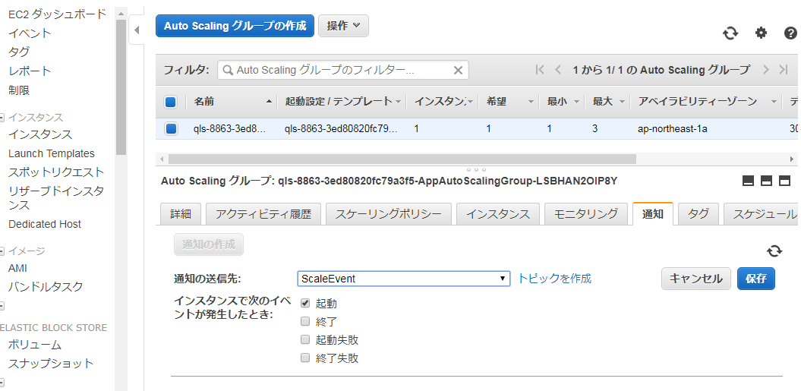
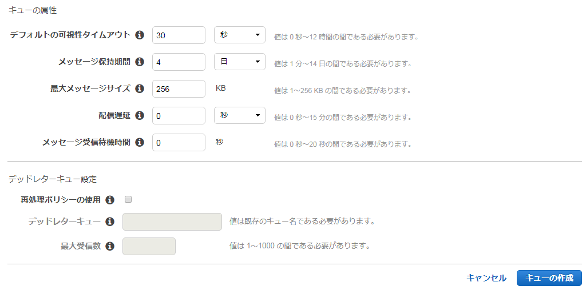

.. include:: ../module.txt

.. _section7-application-label:

Application Category
======================================================

.. _section7-1-sns-label:

Amazon Simple Notification Service(SNS)
------------------------------------------------------

.. _section7-1-1-sns-overview-label:

Overview
^^^^^^^^^^^^^^^^^^^^^^^^^^^^^^^^^^^^^^^^^^^^^^^^^^^^^^

Amazon Simple Notification ServiceはPublish/Subscribe型のメッセージ配信サービスである。
発行者(Publisher)は、複数の購読者(Subscriber：WebServer, Mail, Amazon SQS, Amazon Lambda)へ非同期メッセージ送信する。

SNSは以下のような特徴をもつ。

* 単一で複数の購読者へメッセージを送信できる。
* メッセージの順序は保証されない。
* 発行済みのメッセージは削除できない。
* メッセージ配信の失敗時は配信ポリシーによりリトライが可能。
* メッセージには最大256KBのテキストデータ(XML、JSON、テキスト)を含めることができる。

.. list-table:: AmazonSNSの操作
   :widths: 20, 80
   :header-rows: 1

   * - API
     - 概要

   * - CreateTopic
     - 通知の公開先トピック(受け口・発信元の定義)を作成する。
   * - Subscribe
     - エンドポイントに登録確認メッセージを送信して、 |br| エンドポイントを受信(Subscribe)登録する。
   * - DeleteTopic
     - トピックとその登録サブスクリプションをすべて削除する。
   * - Publish
     - トピックを受信登録しているエンドポイントにメッセージを送信する。

.. _section7-1-2-sns-overview-label:

SNS Topicの作成
^^^^^^^^^^^^^^^^^^^^^^^^^^^^^^^^^^^^^^^^^^^^^^^^^^^^^^

■AWSコンソールからSNSを選択する。

.. figure:: img/management-console-sns-create-topic-1.png

■トピックメニューを選択し、「新しくトピックを作成」をクリックする。

■トピック名を作成し、「トピックの作成」をクリックする。トピックが作成される。

.. figure:: img/management-console-sns-create-topic-3.png

.. figure:: img/management-console-sns-create-topic-4.png

ここでは、AutoScaleした際にイベント通知をSNSを行う場合の例を説明する。

■EC2サービスでAutoScaleグループメニューを選択し、「通知」タブの「通知の作成」をクリックする。

.. figure:: img/management-console-sns-create-topic-5.png

■上記で作成したトピックが選択されるので、イベントを追加し、保存を押下する。これによりAutoScaleでEC2インスタンスが起動すると、SNSトピックにメッセージが送信されるようになる。

.. _section7-2-sqs-label:

Amazon Simple Queue Service(SQS)
------------------------------------------------------

.. _section7-2-1-sqs-overview-label:

Overview
^^^^^^^^^^^^^^^^^^^^^^^^^^^^^^^^^^^^^^^^^^^^^^^^^^^^^^

Amazon Simple Queue Service(SQS)は完全マネージド分散型キュー配信方式のメッセージサービスである。
複数のサーバに複数のメッセージのコピーを保存して信頼性を確保しながら最低一度の配信を保証する。
大容量のデータを高スループットで転送可能であり、メッセージ送信の信頼性が高く、各コンポーネントを疎結合にできる。

キューは以下のようなURLフォーマット、メッセージID、受信ハンドル(ReceiptHandle)で識別される。

http://sqs.<region>.amazonaws.com/<accout-id>

キューは専用のAPIにより、以下のような操作が可能である。

.. list-table:: キューの操作
   :widths: 20, 80
   :header-rows: 1

   * - API
     - 概要

   * - CreateQueue
     - 新しいキューを作成するか、既存のキューのURLを返す
   * - SetQueueAttribute
     - キューの属性を設定する。属性値は下記表を参照。
   * - GetQueueAttribute
     - キューの属性を取得する。属性値は下記表を参照。
   * - GetQueueUrl
     - キューのURLを取得する。
   * - ListQueues
     - キューのリストを取得する。
   * - DeleteQueues
     - キューを削除する。

.. list-table:: キューの属性
   :widths: 20, 80
   :header-rows: 1

   * - 属性名
     - 概要

   * - DelaySecounds
     - メッセージの遅延配信時間
   * - MaximumMessageSize
     - メッセージに含まれる最大バイト数(デフォルト・最大値ともに256KiB)
   * - MessageRetentionPeriod
     - メッセージが保持される秒数(デフォルト４日、最大１４日)
   * - RecieveMessageWaitTimeSeconds
     - 呼び出しがメッセージ到着を待機する時間(デフォルト0秒、最大20秒)
   * - Visibility Timeout
     - 特定のアプリケーションコンポーネントからキューがメッセージを取得した後、 |br| その他からメッセージが不可視となる時間。

.. note:: SQSではメッセージの処理順序でシーケンス性が保証されないので注意。メッセージ順序を保証する場合はFIFOキュー(2018年2月現在、東京リージョンでは未対応)の利用を検討する。

.. note:: SQSには可視性タイムアウト(Visibility Timeout)機能があり、あるキューが処理中に異常処理した場合に、別のノードでキューを処理するためにキューをロックした状態で残しておくが、
   可視性タイムアウトはそのロック時間を指す。ロックをかけるのは、複数のノードが同じキューを処理することをさけるためである。
   また、デッドレターキューとして、処理できなかったキューを除外することもできる。

.. note:: SQSのサービスはS3と同じく、リージョン単位で提供されるサービスである。

また、キューには他のユーザとも共有することができ、匿名で他のAWSユーザと共有するオプション、アクセス許可を利用して特定のユーザとシェアするオプションがある。料金はメッセージの所有者になる。

.. _section7-2-1-sqs-create-queue-label:

キューの作成
^^^^^^^^^^^^^^^^^^^^^^^^^^^^^^^^^^^^^^^^^^^^^^^^^^^^^^

■コンソールからSQSを選択し、「今すぐ始める」をクリックする。

.. figure:: img/management-console-sqs-create-queue-1.png

■キューに名称、キューの属性を設定し、キューの作成を押下する。

.. figure:: img/management-console-sqs-create-queue-2.png

■キューが登録される。

.. figure:: img/management-console-sqs-create-queue-4.png

.. _section7-2-2-sqs-usage-applicaiotn-label:

SQSキューを利用するアプリケーション
^^^^^^^^^^^^^^^^^^^^^^^^^^^^^^^^^^^^^^^^^^^^^^^^^^^^^^

Spring Cloud AWSを利用してSQSキューを利用するアプリケーションを簡単に構築できる。

:ref:`section2-1-spring-cloud-aws-sqs-usage-label` を参照のこと。

作成したキューに対し、メッセージを送信する。キューを選択し、「キュー操作」からメッセージ送信を選ぶ。

.. figure:: img/management-console-sqs-push-queue-1.png

メッセージを入力し、送信ボタンを押下する。

アプリケーションを実行しているとリスナーがメッセージ処理する。

.. sourcecode:: bash

   2018-03-03 13:02:44.071  INFO 73635 --- [  restartedMain] o.d.sample.spring.cloud.aws.config.App   : Started App in 14.102 seconds (JVM running for 16.098)
   2018-03-03 13:02:44.286  INFO 73635 --- [enerContainer-2] o.d.s.s.c.a.app.listener.QueueListener   : test-1
   2018-03-03 13:05:02.628  INFO 73635 --- [enerContainer-3] o.d.s.s.c.a.app.listener.QueueListener   : テスト

.. _section7-2-3-sqs-subscribe-sns-label:

SNSトピックからの通知を購読するキューの設定
^^^^^^^^^^^^^^^^^^^^^^^^^^^^^^^^^^^^^^^^^^^^^^^^^^^^^^

SNSトピックから通知されたイベントを受け取りキューをメッセージングする設定を行う。

■作成したSQSキューを選択し、「キュー操作」>「SNSトピックへのキューサブスクライブ」を選択する。

■ 購読する対象のSNSトピックを選択する。

.. figure:: img/management-console-sqs-subscribe-sns-2.png

.. _section7-3-kinesis-stream-label:

Amazon kinesis Streams
------------------------------------------------------

Amazon Kinesisは完全マネージド型のストリーミングデータサービスで、大規模なデータレコードストリームをリアルタイムで収集・処理できる。
WebアプリケーションやIoT・モバイルデバイス等から収集したデータをストリームデータとして処理する。Kinesis Streamプラットフォームの主要なコンポーネントは以下の通りである。

.. list-table:: Kinesis Streamのコンポーネント
   :widths: 20, 80
   :header-rows: 1

   * - コンポーネント
     - 概要

   * - データレコード
     - データの最小単位で、イベント契機で発生するデータストリームの構成要素。 |br| シーケンス番号、パーティションキー、データBLOBで構成される。
   * - ストリーム
     - 順序付けされたデータレコードのシーケンス
   * - シャード
     - ストリームからパーティションキーに基づき分割したデータ群。 |br| ストリームを作成する際は、シャード数を指定する必要がある。
   * - プロデューサ
     - データを発生させるイベントアプリケーション
   * - コンシューマ
     - ストリームからデータレコードを取得し、処理を行うアプリケーション

.. _section7-3-1-kinesis-producer-detail-label:

プロデューサアプリケーション
------------------------------------------------------

プロデューサアプリケーションでは、パーティションキーとデータBLOBを持つデータレコードを発生させる。
その後、データレコードをストリームに追加すると、Kinesis Streamがシーケンス番号をデータレコードに割り当てる。
アプリケーションでは、以下２種類のAPIが利用可能である。

* Amazon Kinesis Stream API
* Amazon Kinesis Producer Library(KPL)

Stream APIでは、PutRecordリクエストを利用して、ストリームにデータを追加するAPIで、
KPLは、プロデューサとストリームの仲介より柔軟な機能を提供するライブラリである。
具体的には、レコードを複数のストリームに同期・非同期で書き込む、リトライ機能、レコードを集約し、
複数のシャードに書き込む機能、CloudWatchとの連携機能が提供される。

.. _section7-3-2-kinesis-consumer-detail-label:

コンシューマアプリケーション
------------------------------------------------------

コンシューマアプリケーションでは、シャードイテレータを使用して特定のシャードから読み取りを行う。
シャードイテレータとはコンシューマにおいてレコードの読み取りが開始されるストリームの位置を指定するもので、
読み取りオペレーションを実行すると、シャードイテレータを用いてレコードデータを取得する。
プロデューサ同様、コンシューマアプリケーションでも、以下２種類のAPIが利用可能である。

* Amazon Kinesis Stream API
* Amazon Kinesis Consumer Library(KCL)

StreamAPIでは、シャードイテレータを取得して、GetRecordリクエストからデータ取得を行う。
KCLは、KPLと同様、ストリームとの間を仲介する機能を提供する。ワーカーと呼ばれるスレッドをインスタンス化して
ストリームからデータを読み込み、チェックポイント作成、シャードの再割り当て（リシャーディング）等を行う。

.. note:: KCLでは、チェックポイントやワーカーとシャードのマッピング情報をAmazonDynamoにテーブルを作成して管理する。
          Kinesisを利用する場合は、IAMでDynamoDBやCloudWatchのアクセス権限を作成する必要がある。

.. note:: kinesisの最大送信メッセージサイズは1MBである。

.. _section7-3-3-kinesis-firehose-label:

Amazon kinesis firehose　/ Amazon kinesis Analytics
^^^^^^^^^^^^^^^^^^^^^^^^^^^^^^^^^^^^^^^^^^^^^^^^^^^^^^^^^^^

Amazon kinesis firehoseは上述のStreamの派生版で、ストリーミングデータを直接データストアや分析ツールにロードするサービスである。
ストリーミングデータをキャプチャして変換し、Amazon S3、Amazon Redshift、Amazon Elasticsearch Service、Splunkにロードできる。
同様に、派生版のサービスであるmazon kinesis Analyticsはプログラミング言語や処理フレームワークを習得することなく、
標準SQLでストリーミングデータをリアルタイムで処理できるサービスである。

.. note:: 2018年2月現在、東京リージョンでは利用はできない。

.. _section7-4-lamda-label:

Amazon Lamda
------------------------------------------------------

.. _section7-4-1-lambda-overview-label:

Overview
^^^^^^^^^^^^^^^^^^^^^^^^^^^^^^^^^^^^^^^^^^^^^^^^^^^^^^^^^^^

Amazon Lamdaはユーザのコードを実行し、同時に基盤となるコンピューティングリソースをユーザに代わって管理するコンピューティングサービス。
S3バケットに対する変更やDynamoテーブルの更新などのAWSリソースに対するイベント、
アプリケーションやデバイスによって生成されたカスタムイベントなどに応答してコードを実行可能である。

Lambdaではファンクションという単位でソースコードを作成し、以下の方法でファンクションを呼び出す。

* プッシュイベントモデル
* プルイベントモデル
* 相互呼び出し(request-response)モデル

プッシュイベントモデルでは、定義したイベントソース(AmazonS3, AmazonSNS, Amazon Cognito, Amazon Echo等)で発生したイベントを
トリガーとしてファンクションを実行する。
プルイベントモデルでは、Lambdaがイベントソースをポーリングし、イベント検出時にファンクションを呼び出す。
これらのモデルはAmazon kinesis streamやAmazon Dynamo streamなどに適用される。
request-responseモデルは、Amazon Lambdaがファンクションを同期的に実行し、即座に応答を返す方式である。

.. note:: Lambdaファンクションの所有者は関数の実行権限および関連するリソースにアクセスする権限をアクセスポリシーとして付与する必要がある。

.. note:: Lambdaでは、実行する環境のリージョンは選べるが、実行環境は完全マネージドとなる。処理のメモリやスペックは選択でき、料金はリクエスト回数、コード実行時間、ファンクションに割り当てるメモリサイズに応じて決定される。

.. note:: Lambdaでは、実行時間を指定してスケジュール実行することが可能である。スケジュール登録はAWSコンソール上から行う必要がある。

.. warning:: その他、Lambdaでは以下の制約が貸される。

   * 実行処理時間が５分
   * ネットワーク通信はTCP/IPのみサポート
   * デバッグ用のシステムコールは制限される
   * TCP25ポートはトラフィックが制限される(スパム対策)

.. _section7-4-3-lambda-deploy-label:

コードの作成・デプロイ
^^^^^^^^^^^^^^^^^^^^^^^^^^^^^^^^^^^^^^^^^^^^^^^^^^^^^^^^^^^

Lambdaファンクションを、Javaでコードを作成する場合、com.amazonaws.services.lambda.runtime.RequestHandlerを継承したクラスで、ハンドラメソッドを実装する必要がある。
AWSコンソール上から登録することでデプロイする。イベントのトリガーは、後述するAPI Gatewayからのリクエスト要求や、S3のバケットに対する変更等、同様にAWSコンソール上から設定する。
ここでは、単純な例として、S3へファイルアップロードすると、イベント通知でLambdaファンクションを実行し、結果を返すコードの実装例を記述する。

なお、コードの作成には、Spring Cloud Functionを利用する。プロジェクトの作成・ビルドの方法や実装したコードの詳細は :ref:`section1-spring-cloud-function-introduction-label` を参照すること。
Lambdaファンクションをデプロイするには、以下の３つの方法がある。

* AWSコンソール上のインラインエディタで編集
* コードと依存関係をZIPファイルへ圧縮し(Lambdaデプロイパッケージ)、アップロード
* LambdaデプロイパッケージをS3にアップロード

ここでは、MavenプロジェクトからビルドしたJARファイルをアップロードし、デプロイする。

ハンドラクラス、コンフィグクラス、ファンクションクラスはそれぞれ以下の通りである。

.. sourcecode:: java
   :caption: 1 org.debugroom.sample.spring.cloud.function.S3EventHandler.java

   package org.debugroom.sample.spring.cloud.function;

   import com.amazonaws.services.lambda.runtime.Context;
   import com.amazonaws.services.s3.event.S3EventNotification;

   import org.springframework.cloud.function.adapter.aws.SpringBootRequestHandler;

   public class S3EventHandler extends
	     SpringBootRequestHandler<S3EventNotification, String>{

	     public S3EventHandler(){
		       super();
	     }

	     public S3EventHandler(Class<?> configurationClass) {
		       super(configurationClass);
	     }

	     @Override
	     public Object handleRequest(S3EventNotification event, Context context){
		       return super.handleRequest(event, context);
	     }

    }

.. warning:: handleRequestをオーバーライドして型を指定しないと、java.util.LinkedHashMapにマップされ、java.lang.ClassCastExceptionが発生する模様。
   以降のSpring Cloud Functionのバージョンで解消されるかもしれないが、ここでは、handleメソッドを継承し、スーパークラスのメソッドを呼び出しておく。

アプリケーション起動クラス・コンフィグレーションクラスは以下の通りである。

.. sourcecode:: java
   :caption: 1 org.debugroom.sample.spring.cloud.function.config.App.java

   package org.debugroom.sample.spring.cloud.function.config;

   import org.springframework.boot.SpringApplication;
   import org.springframework.boot.autoconfigure.SpringBootApplication;

   @SpringBootApplication
   public class App {

	     public static void main(String args[]){
		       SpringApplication.run(App.class, args);
	     }

   }

.. sourcecode:: java
   :caption: 1 org.debugroom.sample.spring.cloud.function.config.ProductionConfig.java

   package org.debugroom.sample.spring.cloud.function.config;

   import java.util.function.Function;

   import org.debugroom.sample.spring.cloud.function.S3EventFunction;
   import org.springframework.cloud.function.context.FunctionScan;
   import org.springframework.context.annotation.Bean;
   import org.springframework.context.annotation.Configuration;

   import com.amazonaws.services.s3.AmazonS3;
   import com.amazonaws.services.s3.AmazonS3ClientBuilder;
   import com.amazonaws.services.s3.event.S3EventNotification;

   @FunctionScan
   @Configuration
   public class ProductionConfig {

 	     /* @FunctionScanを使用しない場合Bean登録しておく。
 	     @Bean
 	     public Function<S3EventNotification, String> s3EventFunction() {
 		       return event -> {
 			         S3EventNotification.S3EventNotificationRecord record = event.getRecords().get(0);
 			         System.out.println(record.toString());
 			         return "Complete!";
 		       };
 	     }
 	     */

 	     @Bean
 	     public AmazonS3 amazonS3Client(){
 		       return AmazonS3ClientBuilder.defaultClient();
 	     }

    }

また、実行するファンクションクラスは以下の通りである。 S3からアップされたイベント情報を表示している。

.. sourcecode:: java
   :caption: 1 org.debugroom.sample.spring.cloud.function.S3EventFunction.java

   package org.debugroom.sample.spring.cloud.function;

   import javax.inject.Inject;

   import org.springframework.stereotype.Component;

   import com.amazonaws.services.s3.AmazonS3;
   import com.amazonaws.services.s3.event.S3EventNotification;
   import com.amazonaws.services.s3.model.S3Object;

   import lombok.extern.slf4j.Slf4j;
   import reactor.core.publisher.Flux;

   @Slf4j
   @Component
   public class S3EventFunction implements
   	    java.util.function.Function<Flux<S3EventNotification>, Flux<String>>{

   	    @Inject
   	    AmazonS3 amazonS3;

   	    @Override
   	    public Flux<String> apply(Flux<S3EventNotification> event) {
   		      event.subscribe(s -> {
   			        if(0 != s.getRecords().size()){
   				          S3EventNotification.S3EventNotificationRecord record = s.getRecords().get(0);
   				          log.info(this.getClass().getName() + " : AWS Region : " + record.getAwsRegion());
   				          log.info(this.getClass().getName() + " : Event Name : " + record.getEventName());
   				          log.info(this.getClass().getName() + " : Event Source : " + record.getEventSource());
   				          log.info(this.getClass().getName() + " : Event Version : " + record.getEventVersion());
   				          log.info(this.getClass().getName() + " : Event Time : " + record.getEventTime());
   				          log.info(this.getClass().getName() + " : IPAddress : " + record.getRequestParameters().getSourceIPAddress());
   				          log.info(this.getClass().getName() + " : PrincipalId : " + record.getUserIdentity().getPrincipalId());
   				          log.info(this.getClass().getName() + " : Bucket : " + record.getS3().getBucket().getName());
   				          log.info(this.getClass().getName() + " : ARN : " + record.getS3().getBucket().getArn());
   				          log.info(this.getClass().getName() + " : OwnerIdentity : " + record.getS3().getBucket().getOwnerIdentity().getPrincipalId());
   				          log.info(this.getClass().getName() + " : ObjectKey : " + record.getS3().getObject().getKey());
   				          log.info(this.getClass().getName() + " : UrlDecodedKey : " + record.getS3().getObject().getUrlDecodedKey());
   				          log.info(this.getClass().getName() + " : Size : " + record.getS3().getObject().getSizeAsLong());
   				          log.info(this.getClass().getName() + " : Sequencer : " + record.getS3().getObject().getSequencer());
   			        }else{
   				          log.info("No event data.");
   			        }
   		      });
   		      return Flux.just("Process for S3 Notification event is complete.");
   	   }

   }

■AWSコンソールから、AWS Lambdaを選択し、「関数の作成」をクリックする。

.. figure:: img/management-console-lambda-upload-1.png

■関数の名前、実行する言語や環境、ロールを選択し、関数を作成する。

.. figure:: img/management-console-lambda-s3-1.png

.. note:: S3等にアクセスする場合は、権限を付与したロールを作成しておくこと。

   .. figure:: img/management-console-lambda-upload-3.png

■イベントのトリガーとなる要素を「トリガーの追加」リストから選択し、追加する。ここでは、S3を追加する。

.. figure:: img/management-console-lambda-s3-2.png

■S3におけるイベントの発生条件を設定する。ここでは特定のバケットに新規追加、更新するとLambdaにイベントが通知されるよう決定する。

.. figure:: img/management-console-lambda-s3-3.png

.. warning:: S3のイベント発生条件で、Lambdaファンクション処理後に再びLambdaのイベント発生条件を満たさないよう注意すること。
   例えば、S3の特定のフォルダにオブジェクトを作成することを発生条件にしていると、ファンクション内で新たにそのフォルダにオブジェクトを作成すると、永久ループすることになる。

■続いて、作成したLambdaファンクションを選択し、実行環境やハンドラ、環境変数などの設定を行う。

.. figure:: img/management-console-lambda-s3-5.png

.. figure:: img/management-console-lambda-s3-6.png

以下では最低限必要な設定要領を記述する。

* コードエントリタイプ→ZIPファイルまたはJARファイル
* ランタイム→Java8
* ハンドラ→作成したハンドラクラス(ここでは、org.debugroom.sample.spring.cloud.function.S3EventHandler::handleRequest)を指定。
* 環境変数の設定(必要に応じて設定する)

  * FUNCTION_NAME=apiGatewayEventFunction
  * CLOUD_AWS_REGION_STATIC=ap-northeast-1

* 実行ロール→Lambdaファンクションの実行に必要なロールを設定
* 基本設定

  * メモリ→Springを起動する場合最低128MB程度必要なためそれ以上の値を設定しておく。
  * 実行時間→Springのコンテナの初回起動で30[s]ほど必要なため、それを見込んだ実行時間を設定。

* ネットワーク→実行するトリガーがVPC内か否かを指定。(ここでは手元からHTTPリクエストを送るので非VPCを設定)

.. note:: 環境変数FUNCTION_NAMEは実行するファンクションを指定するため、作成したファンクションクラスのキャメルケースを設定する。CLOUD_AWS_REGION_STATICはSpring Cloud AWSを使って、S3アクセスするために設定する。

.. note:: アップロードしたコードは一意のARNをもち、バージョニングされる。また、ファンクションのエイリアスを作成できる。

.. note:: テスト実行により関数が正常実行されるか確認できる。ただし、実際のイベントのオブジェクトは空の状態で渡ってくるので注意。

   .. figure:: img/management-console-lambda-s3-7.png

■画面上部の保存を押下した後、S3へファイルアップロードすると、イベントが通知され、Lambdaファンクションが起動する。実行はCloud Watchから確認できる。

.. warning:: Spring Cloud Functionで実行するファンクションは初回起動時にDIコンテナの起動で数十秒要する。
   ２回目以降、Lambda実行環境が再利用するので、イベント通知後処理が早く実行されるが、完全マネージドのLambda環境では、
   しばらく関数が実行されないと実行環境が破棄され、再びその後のファンクション実行時にDIコンテナの起動処理が必要になる。
   API Gatewaryなどはデフォルト30[s]のリクエストタイムアウトがあるので、Spring Cloud Functionの実行は
   即時性を求められる処理について、適用するかどうか十分検討して実装すること。

.. _section7-4-3-api-gateway-label:

API gatewayorg.debugroom.sample.spring.cloud.function.Handler::handleRequest

^^^^^^^^^^^^^^^^^^^^^^^^^^^^^^^^^^^^^^^^^^^^^^^^^^^^^^^^^^^

API GatewayはAPIを作成、公開、メンテナンス、モニタリングするマネージドサービスである。サービスのRESTfulエンドポイントを作成し、Amazon Lambdaのファンクションと紐づける。

.. _section7-5-swf-label:

Amazon Simple Workflow Service(SWF)
------------------------------------------------------

Amazon Simple Workflow ServiceはEC2を前提としたマネージド型ワークフロー実行基盤である。
分散コンポーネント間でまたがって協調処理させ一元管理する。

.. _section7-5-1-swf-framework-label:

AWS Flow Framework
^^^^^^^^^^^^^^^^^^^^^^^^^^^^^^^^^^^^^^^^^^^^^^^^^^^^^^^^^^^

AWS Flow Frameworkはタスクレベルで協調処理を抽象化するフレームワークである。

.. todo:: AWS Flow Frameworkに関する概要を記述。
