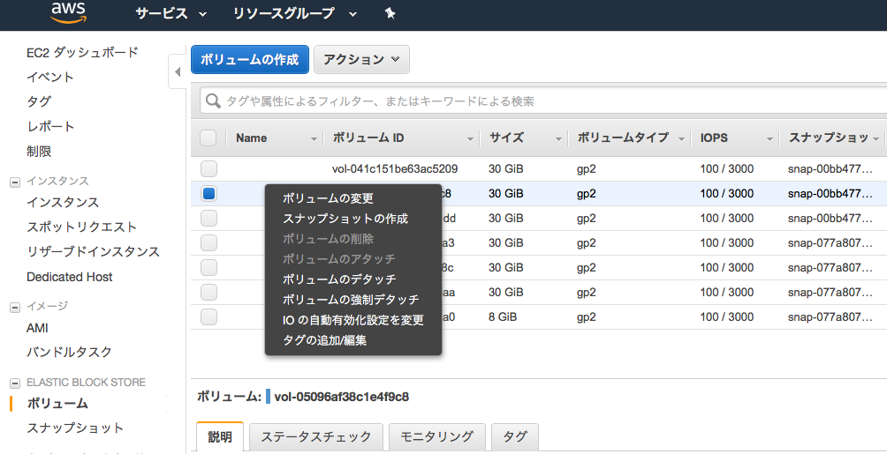

.. include:: ../module.txt

.. _section8-devops-label:

DevOps Category
======================================================

.. _section8-1-operation-label:

Operation
------------------------------------------------------

.. _section8-1-1-snapshot-label:

実行中のEC2インスタンスのバックアップ
^^^^^^^^^^^^^^^^^^^^^^^^^^^^^^^^^^^^^^^^^^^^^^^^^^^^^^

.. _section8-1-1-1-overview-label:

overview
""""""""""""""""""""""""""""""""""""""""""""""""""""""

クラウドデザインパターンでは「Snapshotパターン」と呼ばれる。
EC2インスタンスはディスクボリュームに「EBS(Elastic Block Store)」というストレージデバイスを使用しており、
EBSにはある瞬間のスナップショットとしてバックアップを作成する機能がある。作成したデータはS3に保存されるが、
特殊な形式のデータのため、直接S3から取り出すことはできない。作成したデータはEBSとして新たに作成し、
EC2インスタンスにマウントするか、AMIイメージを作成し、新たなEC2インスタンスとし起動できる。
これは次章「  :ref:`section8-1-2-stamp-label` 」にて記述する「Stampパターン」である。

.. _section8-1-1-1-operation-create-ebs-label:

EBSボリュームの作成手順
""""""""""""""""""""""""""""""""""""""""""""""""""""""

1. 対象のストレージの確認

EC2コンソールメニューから、「ボリューム」を選択し、スナップショットを作成する対象のストレージを選択する。

.. figure:: img/management-console-operation-snapshot-1.png

.. note:: /dev/xvda はXenベースのLinuxシステムにおいて、1台目のハードディスクドライブを指す。

2. スナップショットの作成

VolumeIDを右クリックし、「Create Snapshot」を選択する。

名称を入力する。

.. figure:: img/management-console-operation-snapshot-3.png

.. figure:: img/management-console-operation-snapshot-4.png

3. EBSボリュームを作成する。

作成したスナップショットを右クリックし、「Create Volume」を選択する。

.. figure:: img/management-console-operation-snapshot-5.png

「ディスクの種類」、「ディスクの容量」、「アベイラビリティゾーンを選択する。」

.. figure:: img/management-console-operation-snapshot-6.png

.. note:: EBSボリュームは同一のアベイラビリティゾーンでしか利用できないため、実行するEC2インスタンスのアベイラビリティゾーンに応じて、作成するゾーンを決定する。

実行すると、ボリュームにEBSがステータスavailabilityで作成される。

.. figure:: img/management-console-operation-snapshot-7.png

.. note:: スナップショットの選択時に、右クリック「コピー」を選択すると、別のリージョンへボリュームをコピーできる。

.. note:: EBSスナップショットは
   * 差分(増分)バックアップ
   * 圧縮された状態で保存
   * S3に３箇所複数される。
   * ディスクサイズはフルサイズ表示となるが、実態は差分バックアップのため、サイズが必ずしも実際のデータサイズと一致しているわけではない。

.. _section8-1-1-2-operation-create-ami-label:

EBSスナップショットからAMIの作成手順
""""""""""""""""""""""""""""""""""""""""""""""""""""""

スナップショットを作成したEBSがブート領域を含むのであれば(1台目のディスク)、AMIを作成できる。

1. イメージの作成

スナップショットを右クリック「イメージの作成」を選択する。

.. figure:: img/management-console-operation-stamp-1.png

AMIの名称、説明、仮想マシンの種別を入力する。

.. figure:: img/management-console-operation-stamp-2.png

.. note:: T2インスタンスを使用する場合、「ハードウェアアシストの仮想化(Hardware-assisted virtualization)」を選択すること。

実行すると、AMIにイメージがステータスavailabilityで作成される。

.. figure:: img/management-console-operation-stamp-3.png

.. _section8-1-2-stamp-label:

同じ構成のEC2インスタンスを作成する
^^^^^^^^^^^^^^^^^^^^^^^^^^^^^^^^^^^^^^^^^^^^^^^^^^^^^^

.. _section8-1-2-1-stamp-overview-label:

overview
""""""""""""""""""""""""""""""""""""""""""""""""""""""

前節「 :ref:`section8-1-1-2-operation-create-ami-label` 」にて、EBSのスナップショットからAMIイメージを作成したが、
稼働中のEC2インスタンスからAMIイメージを作成できる。AMIからEC2インスタンスを作るときは、
CPUやメモリ構成も設定でき、スペックを任意に調整できる。

.. _section8-1-2-2-operation-create-ami-label:

実行中EC2インスタンスからAMIの作成手順
""""""""""""""""""""""""""""""""""""""""""""""""""""""

1. AMIイメージの作成

.. warning:: 当オペレーションを実行すると、完全なディスクの複製を作成するために、実行中のEC2インスタンスが再起動するので注意。再起動したくない場合は、再起動しないオプションにチェックを入れて実行すること。

メニュー「インスタンス」から、右クリック「イメージの作成」を選択する。

.. figure:: img/management-console-operation-stamp-4.png

「 :ref:`section8-1-1-2-operation-create-ami-label` 」と同様、AMIの名称、説明、仮想マシンの種別を入力する。

.. figure:: img/management-console-operation-stamp-5.png

実行すると、AMIにイメージがステータスavailabilityで作成される。

.. figure:: img/management-console-operation-stamp-6.png

.. _section8-1-2-3-operation-launch-ec2-by-ami-label:

複製したAMIからEC2インスタンスを実行する手順
""""""""""""""""""""""""""""""""""""""""""""""""""""""

作成したAMIを使用して、EC2インスタンスを起動する。

1. EC2インスタンスの実行

メニュー「AMI」でイメージを選択し、右クリック「作成」を行う。

.. figure:: img/management-console-operation-stamp-7.png

「 :ref:`section3-1-2-X-ec2-create-instance-label` 」と同様に、EC2インスタンスを起動する。

.. todo:: AMIイメージの作成方法により実行可能なインスタンスタイプが制限される模様。条件を確認する。

.. _section8-1-3-scale-up-label:

CPUやメモリスペックを上昇させる
^^^^^^^^^^^^^^^^^^^^^^^^^^^^^^^^^^^^^^^^^^^^^^^^^^^^^^

.. todo:: EC2インスタンス起動中にCPUやメモリスペックを変更する手順を記載する。

.. _section8-1-4-ondemand-disk-label:

ディスク容量を増設する
^^^^^^^^^^^^^^^^^^^^^^^^^^^^^^^^^^^^^^^^^^^^^^^^^^^^^^

.. _section8-1-4-1-application-extend-volume-overview-label:

overview
""""""""""""""""""""""""""""""""""""""""""""""""""""""

起動中のEC2インスタンスの容量が足りなくなった場合、以下のようなメッセージが表示される。

.. sourcecode:: bash

   open /var/lib/docker/image/devicemapper/layerdb/tmp/layer-314207183/diff: no space left on device

dfコマンドでディスク残容量の確認は以下の通り可能であるが、ここでは、起動中のインスタンスのディスク増設する方法を記述する。

.. sourcecode:: bash

   [centos@ip-XXX-XXX-XXX-XXX ~]$ df -h
   Filesystem      Size  Used Avail Use% Mounted on
   /dev/xvda1      8.0G  8.0G   52M 100% /
   devtmpfs        7.4G     0  7.4G   0% /dev
   tmpfs           7.4G     0  7.4G   0% /dev/shm
   tmpfs           7.4G   17M  7.4G   1% /run
   tmpfs           7.4G     0  7.4G   0% /sys/fs/cgroup
   tmpfs           1.5G     0  1.5G   0% /run/user/1000

.. _section8-1-4-2-application-extend-volume-label:

EC2ボリュームサイズの拡張
""""""""""""""""""""""""""""""""""""""""""""""""""""""

■EC2コンソールメニューからボリュームを選び、拡張したいインスタンスのボリュームを選択する。アクションメニューから、「ボリュームの変更」を選択する。

.. figure:: img/management-console-ec2-modify-volume-1.png

■ボリュームサイズを変更し、「変更」ボタンを押下する。

.. figure:: img/management-console-ec2-modify-volume-2.png

.. figure:: img/management-console-ec2-modify-volume-3.png

■EC2インスタンスにSSHでログインし、拡張したボリュームサイズにルートデバイスのパーティションを拡張させる。最初に、現状のディスクの状況を確認する。

.. sourcecode:: bash

   # ルートデバイスのパーティションサイズを確認。
   [centos@ip-XXX-XXX-XXX-XXX ~]$ lsblk
   NAME                         MAJ:MIN RM  SIZE RO TYPE MOUNTPOINT
   xvda                         202:0    0   50G  0 disk
   └─xvda1                      202:1    0    8G  0 part /
   loop0                          7:0    0  100G  0 loop
   └─docker-202:1-12881694-pool 253:0    0  100G  0 dm
   loop1                          7:1    0    2G  0 loop
   └─docker-202:1-12881694-pool 253:0    0  100G  0 dm

   # パーティションの占有状況を確認。

   [centos@ip-XXX-XXX-XXX-XXX ~]$ df -TH
   Filesystem     Type      Size  Used Avail Use% Mounted on
   /dev/xvda1     xfs       8.6G  8.6G   58M 100% /
   devtmpfs       devtmpfs  8.0G     0  8.0G   0% /dev
   tmpfs          tmpfs     8.0G     0  8.0G   0% /dev/shm
   tmpfs          tmpfs     8.0G   18M  8.0G   1% /run
   tmpfs          tmpfs     8.0G     0  8.0G   0% /sys/fs/cgroup
   tmpfs          tmpfs     1.6G     0  1.6G   0% /run/user/1000

   # ファイルシステムの確認。

   [centos@ip-XXX-XXX-XXX-XXX ~]$ sudo file -s /dev/xvd*
   /dev/xvda:  x86 boot sector; partition 1: ID=0x83, active, starthead 32, startsector 2048, 16775168 sectors, code offset 0x63
   /dev/xvda1: SGI XFS filesystem data (blksz 4096, inosz 512, v2 dirs)

.. warning:: `AWSの公式ガイド <https://docs.aws.amazon.com/ja_jp/AWSEC2/latest/UserGuide/recognize-expanded-volume-linux.html>`_ では、XFSファイルシステムのディスク拡張はxfs_growfsコマンドを使用しているが、更新が行われなかったため、fdiskコマンドを使ってパーティションの再作成を行う方法で実施する。

■ fdiskコマンドを使用して、/dev/xvdaのパーティションを作成し直し、再起動する。

.. sourcecode:: bash

   [centos@ip-XXX-XXX-XXX-XXX ~]$ sudo fdisk /dev/xvda
   Welcome to fdisk (util-linux 2.23.2).

   Changes will remain in memory only, until you decide to write them.
   Be careful before using the write command.

   Command (m for help): p

   Disk /dev/xvda: 53.7 GB, 53687091200 bytes, 104857600 sectors
   Units = sectors of 1 * 512 = 512 bytes
   Sector size (logical/physical): 512 bytes / 512 bytes
   I/O size (minimum/optimal): 512 bytes / 512 bytes
   Disk label type: dos
   Disk identifier: 0x000ae09f

   Device Boot      Start         End      Blocks   Id  System
   /dev/xvda1   *        2048    16777215     8387584   83  Linux

   Command (m for help): d
   Selected partition 1
   Partition 1 is deleted

   Command (m for help): n
   Partition type:
   p   primary (0 primary, 0 extended, 4 free)
   e   extended
   Select (default p): p
   Partition number (1-4, default 1): 1
   First sector (2048-104857599, default 2048):
   Using default value 2048
   Last sector, +sectors or +size{K,M,G} (2048-104857599, default 104857599):
   Using default value 104857599
   Partition 1 of type Linux and of size 50 GiB is set

   Command (m for help): p

   Disk /dev/xvda: 53.7 GB, 53687091200 bytes, 104857600 sectors
   Units = sectors of 1 * 512 = 512 bytes
   Sector size (logical/physical): 512 bytes / 512 bytes
   I/O size (minimum/optimal): 512 bytes / 512 bytes
   Disk label type: dos
   Disk identifier: 0x000ae09f

   Device Boot      Start         End      Blocks   Id  System
   /dev/xvda1            2048   104857599    52427776   83  Linux

   Command (m for help): w
   The partition table has been altered!

   Calling ioctl() to re-read partition table.

   WARNING: Re-reading the partition table failed with error 16: Device or resource busy.
   The kernel still uses the old table. The new table will be used at
   the next reboot or after you run partprobe(8) or kpartx(8)
   Syncing disks.

   [centos@ip-XXX-XXX-XXX-XXX ~]$ reboot

   # 再起動後、パーティションのサイズ変更を確認。
   [centos@ip-XXX-XXX-XXX-XXX ~]$ df -TH
   Filesystem     Type      Size  Used Avail Use% Mounted on
   /dev/xvda1     xfs        54G  8.6G   46G  16% /
   devtmpfs       devtmpfs  8.0G     0  8.0G   0% /dev
   tmpfs          tmpfs     8.0G     0  8.0G   0% /dev/shm
   tmpfs          tmpfs     8.0G   18M  8.0G   1% /run
   tmpfs          tmpfs     8.0G     0  8.0G   0% /sys/fs/cgroup
   tmpfs          tmpfs     1.6G     0  1.6G   0% /run/user/1000

   [centos@ip-XXX-XXX-XXX-XXX ~]$ lsblk
   NAME                         MAJ:MIN RM  SIZE RO TYPE MOUNTPOINT
   xvda                         202:0    0   50G  0 disk
   └─xvda1                      202:1    0   50G  0 part /
   loop0                          7:0    0  100G  0 loop
   └─docker-202:1-12881694-pool 253:0    0  100G  0 dm
   loop1                          7:1    0    2G  0 loop
   └─docker-202:1-12881694-pool 253:0    0  100G  0 dm

.. _section8-1-5-application-update-label:

冗長化構成のアプリケーションをアップデートする
^^^^^^^^^^^^^^^^^^^^^^^^^^^^^^^^^^^^^^^^^^^^^^^^^^^^^^^^^^^^^^^^^^^^^

.. _section8-1-5-1-application-update-overview-label:

overview
""""""""""""""""""""""""""""""""""""""""""""""""""""""

ロードバランサーを使用して冗長化構成したアプリケーションをサービス停止せずにアップデートする。
片系のアプリケーションサーバをターゲットグループから除外した後、アプリケーションをアップデートし、
再度ターゲットグループに組み込む。その後もう片系のアプリケーションサーバを同様にターゲットグループから削除し、
アップデートを行い、組み戻しを行う。

.. _section8-1-5-2-exclude-target-group-label:

インスタンスのDrain
""""""""""""""""""""""""""""""""""""""""""""""""""""""

1. APサーバのインスタンスをターゲットグループから除外

コンソールのメニュー「ターゲットグループ」にて、ターゲットタブから編集ボタンを押下する。

.. figure:: img/management-console-operation-app-update-1.png

2. アップデート対象のアプリケーションインスタンスを選択し、削除ボタンを押下する。

.. figure:: img/management-console-operation-app-update-2.png

.. note:: 削除したインスタンスはロードバランサーがターゲットのリクエストルーティングを即時指定するが、deregistration_delay.timeout_secondsとして設定した時間、Connection Dranining状態として、セッションが維持される。

.. _section8-2-codebuild-label:

CodeBuild
------------------------------------------------------

.. _section8-2-1-codebuild-overview-label:

Overview
^^^^^^^^^^^^^^^^^^^^^^^^^^^^^^^^^^^^^^^^^^^^^^^^^^^^^^

AWS CodeBuildはクラウドでアプリケーションのビルドを行う従量課金型サービスで、buildspec.ymlに記述した内容に従ってビルド実行する。
ビルドの元になるソースコードはS3に保存したものに加え、AWS CodeCommit、GitHub、BitBucketなどの各Gitベースのバージョン管理システムをサポートする。
Jenkins Agentでも同様の処理を行えるものの、クラウドでマネージドな環境下で行われるため、大規模開発でのコミットやプルリクエスト後のテスト、ビルド処理をマシンリソースを気にせず実行できることがメリットである。

.. _section8-2-2-codebuild-app-build-label:

アプリケーションのビルド
^^^^^^^^^^^^^^^^^^^^^^^^^^^^^^^^^^^^^^^^^^^^^^^^^^^^^^

1. サービスメニューから「CodeBuild」を選択し、「今すぐ始める」ボタンを押下する。

.. figure:: img/management-console-codebuild-app-build-1.png

2. ビルドプロジェクトの設定を行う。ここでは、`GitHub上にコミットしたSpringBootベースのアプリケーション <https://github.com/debugroom/sample-aws-codebuild>`_ をビルドするため、以下の通り設定する。

[プロジェクトの設定]

* プロジェクト名：任意のプロジェクト名を設定(ここではsample-codebuild-build-app)

[ソース：ビルドの対象]

* ソースプロバイダ：Github(ログインするOAuth認証があるため、適宜ログイン)
* レポジトリ：パブリックレポジトリ
* レポジトリのURL：https:github.com/<user-name>/<repository-name>で指定
* Gitのクローンの深さ：1(コミットされた最新履歴からのバージョン)
* WebHook：コードがコミットされるたび、ビルド指定したければチェック
* バッジ：ビルドバッジを有効化する場合チェック

.. note:: ソースコードレポジトリに応じて、`リファレンスのソースプロバイダの表でXがついている箇所の設定 <https://docs.aws.amazon.com/ja_jp/codebuild/latest/userguide/create-project.html#create-project-console>`_ を参照すること

.. note:: ビルドバッジはビルドステータスを個別定義・明示化するオプションである。詳しくは `リファレンス <https://docs.aws.amazon.com/ja_jp/codebuild/latest/userguide/sample-build-badges.html>`_ を参照のこと。

[環境：ビルド方法]

* 環境イメージ：AWS CodeBuildによって管理されたイメージの使用
* オペレーティングシステム：Ubuntu
* ランタイム：Java
* ランタイムバージョン：aws/codebuild/java:openjdk-8
* ビルド仕様：ソースコードのルートディレクトリのbuildspec.xmlを使用
* buildspec名：buildspec.xml
* 証明書：証明書をインストールしない

.. note:: buildspecはコミットしたアプリケーションのルートディレクトリに配置しておく。内容を以下の通り記述する。

   .. sourcecode:: default

      version: 0.2

      phases:
        build:
          commands:
            - echo Build started on `date`
            - mvn test
        post_build:
          commands:
            - echo Build completed on `date`
            - mvn package
      artifacts:
        files:
          - target/sample-aws-codebuild-0.0.1-SNAPSHOT.jar

.. figure:: img/management-console-codebuild-app-build-4.png

[アーティファクト：このビルドプロジェクトからアーティファクトを配置する場所]

* タイプ：アーティファクトなし

.. note:: ビルドテストのみを実行する場合や、コンテナへプッシュする場合は指定しなくて良い。

[キャッシュ]

* タイプ：キャッシュなし

.. note:: キャッシュを使用すると、S3に再利用可能なビルド環境が保存され高速化される。

[サービスロール]

* アカウントでサービスロールを作成

[VPC]

* NoVPC

3. 設定内容を確認し、「保存してビルド」ボタンを押下する。

4. ビルドの開始ボタンを押下する。

.. figure:: img/management-console-codebuild-app-build-6.png

5. ビルド結果を確認する。

.. figure:: img/management-console-codebuild-app-build-7.png

.. figure:: img/management-console-codebuild-app-build-8.png

|br|

.. _section8-2-2-codebuild-local-label:

CodeBuild Localの利用
^^^^^^^^^^^^^^^^^^^^^^^^^^^^^^^^^^^^^^^^^^^^^^^^^^^^^^

`2018年5月に、CodeBuildをローカル環境で動かすDockerイメージが公開された <https://aws.amazon.com/jp/blogs/devops/announcing-local-build-support-for-aws-codebuild/>`_ 。このサポートにより、Dockerがインストールされたマシンでbuildspec.ymlのデバッグやテストが可能である。

.. _section8-2-2-1-codebuild-local-prepared-label:

事前準備
""""""""""""""""""""""""""""""""""""""""""""""""""""""""""

CodeBuild Localを利用するには、事前に以下を実施しておく必要がある。

#. 実際にビルド実行環境コンテナイメージ(DefaultではUbuntu)を作成
#. 環境コンテナを起動するためのエージェントコンテナイメージをプル

なお、CodeBuild Localを実行する際は2のコンテナイメージをDocker runするかたちになるが、実行スクリプトが提供されているため、このスクリプトに1のコンテナイメージ名やアーティファクトの出力先フォルダ、認証情報など情報を渡して実行することになる。

.. note:: 2のコンテナイメージを作成するためのDockerfileはAWSから公開されていない模様。

1の手順としては、`公式サイト <https://github.com/aws/aws-codebuild-docker-images>`_ の手順に習い、ターミナルなどを使って、適当なディレクトリで、ビルド実行環境のコンテナイメージがあるaws-codebuild-docker-imagesのレポジトリをGit cloneする。
ビルド用のコンテナ(starndard:2.0)イメージを構築するDockerfileがあるディレクトリへ移動し、docker buildコマンドを実行する。

.. sourcecode:: bash

   $ git clone https://github.com/aws/aws-codebuild-docker-images.git
   $ cd aws-codebuild-docker-images
   $ cd ubuntu/standard/2.0
   $ docker build -t aws/codebuild/standard:2.0 .

続いて、2.環境コンテナを起動するためのエージェントコンテナイメージをプルする。

.. sourcecode:: bash

   $ docker pull amazon/aws-codebuild-local:latest --disable-content-trust=false

.. _section8-2-2-1-codebuild-local-execution-label:

CodeBuild Localの実行
""""""""""""""""""""""""""""""""""""""""""""""""""""""""""

Git cloneしたaws-codebuild-docker-imagesの中にlocal_builds/codebuild_build.shがあるので、buildspec.ymlがあるディレクトリへコピーする。
今回、buildspec.ymlとしては、マルチプロジェクト構成のMavenプロジェクトで、プロジェクトルート配下のcommonプロジェクトに対し、mvn packageコマンドを実行し、Sonarqubeへscan結果を送信するものを用いる。
なお、buildspec.ymlから環境変数として、SonarqubeServerのURL(SONAR_HOST_URL)とトークン(SONAR_LOGIN_COMMON)をAWS Systems Managerから取得する。なお、パラメータストアの設定は :ref:`section9-9-6-2-systems-manager-parameter-store-create-parameter-label` を参照のこと。

.. note:: AWS Systems Managerパラメータストアを利用して環境変数を取得する場合、認証情報のユーザに権限を付与しておくこと。

.. sourcecode:: bash

   version: 0.2
   env:
     parameter-store:
       SONAR_HOST_URL: "SONAR_HOST_URL"
       SONAR_LOGIN: "SONAR_LOGIN_COMMON"
   phases:
     install:
       runtime-versions:
         docker: 18
     build:
       commands:
         - mvn -f common/pom.xml package sonar:sonar -Dsonar.host.url=${SONAR_HOST_URL} -Dsonar.login=${SONAR_LOGIN}
   artifacts:
     files:
       - common/target/mynavi-sample-continuous-integration-common-0.0.1-SNAPSHOT.jar

buildspec.ymlおよびcodebuild_build.shはcommonプロジェクト配下にあるが、CodeBuildによってGitHubからクローンされるビルド対象のアプリケーションソースコードのルートディレクトリ(ビルドコマンドを実行するディレクトリ)を起点として、コピーしたcodebuild_build.shにオプションパラメータを与えて実行する。

.. sourcecode:: bash

   $ common/codebuild_build.sh -i aws/codebuild/standard:2.0 -a common/target/ -c -b common/buildspec.yml

なお、上記で実行したスクリプトの各オプションの説明は以下の通り。

.. list-table:: codebuild_build.shのオプション
   :widths: 2, 8

   * - オプション
     - 説明

   * - iオプション(必須)
     - 事前準備で作成したCodeBuildでビルドするコンテナイメージを指定する。

   * - aオプション(必須)
     - アーティファクトを出力するディレクトリを指定する。

   * - cオプション
     - AWS認証情報を指定する(デフォルトでは~/.aws/credentialsの認証情報が使用される)

   * - bオプション
     - buildspec.ymlを指定する。

スクリプトを実行すると、以下の通り、CodeBuildがローカルのDocker環境で実行されるようになる。

.. sourcecode:: bash

   Build Command:

   docker run -it -v /var/run/docker.sock:/var/run/docker.sock -e "IMAGE_NAME=aws/codebuild/standard:2.0" -e "ARTIFACTS=/Users/kawabatakouhei/Documents/repos/git/debugroom/mynavi-sample-continuous-integration/common/target/" -e "SOURCE=/Users/kawabatakouhei/Documents/repos/git/debugroom/mynavi-sample-continuous-integration" -e "BUILDSPEC=/Users/kawabatakouhei/Documents/repos/git/debugroom/mynavi-sample-continuous-integration/common/buildspec.yml" -e "AWS_CONFIGURATION=/Users/kawabatakouhei/.aws" -e "INITIATOR=kawabatakouhei" amazon/aws-codebuild-local:latest

   Removing agent-resources_build_1 ... done
   Removing agent-resources_agent_1 ... done
   Removing network agent-resources_default
   Removing volume agent-resources_source_volume
   Removing volume agent-resources_user_volume
   Creating network "agent-resources_default" with the default driver
   Creating volume "agent-resources_source_volume" with local driver
   Creating volume "agent-resources_user_volume" with local driver
   Creating agent-resources_agent_1 ... done
   Creating agent-resources_build_1 ... done
   Attaching to agent-resources_agent_1, agent-resources_build_1
   agent_1  | [Container] 2019/06/27 19:25:01 Waiting for agent ping

   // omit

   agent_1  | [INFO] ------------------------------------------------------------------------
   agent_1  | [INFO] BUILD SUCCESS
   agent_1  | [INFO] ------------------------------------------------------------------------
   agent_1  | [INFO] Total time:  03:09 min
   agent_1  | [INFO] Finished at: 2019-06-27T19:29:04Z
   agent_1  | [INFO] ------------------------------------------------------------------------
   agent_1  |
   agent_1  | [Container] 2019/06/27 19:29:04 Phase complete: BUILD State: SUCCEEDED
   agent_1  | [Container] 2019/06/27 19:29:04 Phase context status code:  Message:
   agent_1  | [Container] 2019/06/27 19:29:04 Entering phase POST_BUILD
   agent_1  | [Container] 2019/06/27 19:29:04 Phase complete: POST_BUILD State: SUCCEEDED
   agent_1  | [Container] 2019/06/27 19:29:04 Phase context status code:  Message:
   agent_1  | [Container] 2019/06/27 19:29:04 Expanding base directory path: .
   agent_1  | [Container] 2019/06/27 19:29:04 Assembling file list
   agent_1  | [Container] 2019/06/27 19:29:04 Expanding .
   agent_1  | [Container] 2019/06/27 19:29:04 Expanding artifact file paths for base directory .
   agent_1  | [Container] 2019/06/27 19:29:04 Assembling file list
   agent_1  | [Container] 2019/06/27 19:29:04 Expanding common/target/mynavi-sample-continuous-integration-common-0.0.1-SNAPSHOT.jar
   agent_1  | [Container] 2019/06/27 19:29:04 Found 1 file(s)
   agent_1  | [Container] 2019/06/27 19:29:04 Preparing to copy secondary artifacts
   agent_1  | [Container] 2019/06/27 19:29:04 No secondary artifacts defined in buildspec
   agent_1  | [Container] 2019/06/27 19:29:04 Phase complete: UPLOAD_ARTIFACTS State: SUCCEEDED
   agent_1  | [Container] 2019/06/27 19:29:04 Phase context status code:  Message:

.. _section8-3-codepipeline-label:

CodePipeline
------------------------------------------------------

.. _section8-3-1-codepipeline-overview-label:

Overview
^^^^^^^^^^^^^^^^^^^^^^^^^^^^^^^^^^^^^^^^^^^^^^^^^^^^^^

CodePipelineはアプリケーションのソースコードコミット→テスト→ビルド→ステージングデプロイ→プロダクションデプロイといった一連のソフトウェアリリースプロセスを自動化し、継続的インテグレーション・デリバリを実現するツールである。
CodeCommitやS3、CodeBuild、CodeDeployといったAWSリソースはもちろんのこと、GitHubやJenkins、DockerHubとも連携し、アプリケーションの構築にかかる一連の流れを自動化できる。

.. _section8-3-2-codepipeline-staging-release-label:

ECSアプリケーションのステージングリリースの自動化
^^^^^^^^^^^^^^^^^^^^^^^^^^^^^^^^^^^^^^^^^^^^^^^^^^^^^^^^^^^^^^^^^^^^^^^^^^^^^^^

ここでは、CodePipeLineを使って、SpringBootベースのアプリケーションをGitHub上にソースコードコミットし、Dockerコンテナを用いてテスト・ビルドを行い、構築したアプリケーションコンテナを、DockerHub上にプッシュした後、EC2起動型のECSステージング環境へのデプロイする作業を自動化する設定例を記述する。
なお、Dockerコンテナを使用したテスト・ビルドについては前章「 :ref:`section8-2-codebuild-label` 」で実行した通り、AWS CodeBuildを利用する。

.. _section8-3-2-1-codepipeline-staging-release-prepared-label:

事前準備
""""""""""""""""""""""""""""""""""""""""""""""""""""""""""

CodePipeLineでステージング環境へのリリースを自動化する設定を行う前に、以下を準備しておく。

#. リリースするSpringBootアプリケーション及びCodeBuild設定
#. ステージング環境とするEC2起動型のECSコンテナ環境の構築
#. ロードバランサーの設定

上記のポイントについて順次記載する。

1. リリースするSpringBootアプリケーション及びCodeBuildの設定

最終的なソースコードは `GitHub <https://github.com/debugroom/sample-aws-codepipeline>`_ 上にコミットしているが、
ルートディレクトリの配下にCodeBuildで使用するbuildspec.ymlと、buildspec.yml内でDockerコマンドで実行されるビルド用のDockerfileを作成しておく。
なお、各環境変数のパラメータはCodePipelineの設定時に指定する。

.. sourcecode:: default

   version: 0.2

   phases:
     pre_build:
       commands:
   #      - echo Logging in to Amazon ECR...
   #      - $(aws ecr get-login --no-include-email --region $AWS_DEFAULT_REGION)
         - echo Logging in to Docker Hub...
         - docker login -u $USER -p $PASSWORD $DOCKER_REPO
     build:
       commands:
         - echo Build started on `date`
         - echo Building the Docker image...
         - docker build -t $IMAGE_REPO_NAME:$IMAGE_TAG .
   #    - docker tag $IMAGE_REPO_NAME:$IMAGE_TAG $AWS_ACCOUNT_ID.dkr.ecr.$AWS_DEFAULT_REGION.amazonaws.com/$IMAGE_REPO_NAME:$IMAGE_TAG
         - docker tag $IMAGE_REPO_NAME:$IMAGE_TAG $IMAGE_REPO_NAME:$IMAGE_TAG
     post_build:
       commands:
         - echo Build completed on `date`
         - echo Pushing the Docker image...
   #      - docker push $AWS_ACCOUNT_ID.dkr.ecr.$AWS_DEFAULT_REGION.amazonaws.com/$IMAGE_REPO_NAME:$IMAGE_TAG
         - docker push $IMAGE_REPO_NAME:$IMAGE_TAG
         - printf '[{"name":"sample-aws-codepipeline","imageUri":"%s"}]' $IMAGE_REPO_NAME:$IMAGE_TAG > imagedefinitions.json
   artifacts:
     files:
       - imagedefinitions.json

.. note:: buildspec.yml内では、コンテナをDockerHubへプッシュした後に、ECSコンテナの構築でコンテナイメージをPullするために必要な「imagedefinitions.json」を出力している。
          タスク定義で指定するコンテナ名とURLをJSON形式で表現したファイルである。

.. warning:: 「imagedefinitions.json」で"name"指定する値は、ECSタスク定義名ではなく、タスク定義で定義したコンテナ名を設定する必要がある。

Dockerfileは最終的にECSコンテナのイメージとなる。CentOS7をベースとして、JDKとMavenをインストールし、対象のソースコードをクローンしてビルドした後、タイムゾーンとロケールを変更してアプリケーションを実行する。

.. sourcecode:: default

   # Dockerfile for sample service using embedded tomcat server

   FROM centos:centos7
   MAINTAINER debugroom

   RUN yum install -y \
       java-1.8.0-openjdk \
       java-1.8.0-openjdk-devel \
       wget tar iproute git

   RUN wget http://repos.fedorapeople.org/repos/dchen/apache-maven/epel-apache-maven.repo -O /etc/yum.repos.d/epel-apache-maven.repo
   RUN sed -i s/\$releasever/6/g /etc/yum.repos.d/epel-apache-maven.repo
   RUN yum install -y apache-maven
   ENV JAVA_HOME /etc/alternatives/jre
   RUN git clone https://github.com/debugroom/sample-aws-codepipeline.git /var/local/sample-aws-codepipeline
   RUN mvn install -f /var/local/sample-aws-codepipeline/pom.xml

   RUN rm -f /etc/rpm/macros.image-language-conf && \
       sed -i '/^override_install_langs=/d' /etc/yum.conf && \
       yum -y reinstall glibc-common && \
       yum clean all

   ENV LANG="ja_JP.UTF-8" \
       LANGUAGE="ja_JP:ja" \
       LC_ALL="ja_JP.UTF-8"

   RUN cp /etc/localtime /etc/localtime.org
   RUN ln -sf  /usr/share/zoneinfo/Asia/Tokyo /etc/localtime

   EXPOSE 8080

   CMD java -jar -Dspring.profiles.active=production /var/local/sample-aws-codepipeline/target/sample-aws-codepipeline-0.0.1-SNAPSHOT.jar

.. note:: 説明は割愛するが、アプリケーションは、http://<loadbalancerのURL>/aws-code-pipeline/api/v1/usersでユーザの一覧を返すAPIを持つアプリケーションで、テストコードを含めコミットしている。

2. ステージング環境とするEC2起動型のECSコンテナ環境の構築

「 :ref:`section3-2-ecs-label` 」で構築したECSクラスタ、ロードバランサを利用する。ECSタスク定義・サービス定義は、アプリケーションを一度CodePipelineでビルド設定した後に行うため、ECSクラスタ・ロードバランサはそのまま利用し、アプリケーションの振り分け先であるターゲットグループのみ新規作成しておく。

EC2のサービスメニュー > ターゲットグループを選択し、「ターゲットグループの作成」を押下して、以下のように入力してターゲットグループを作成する。

* ターゲットグループ名：任意
* プロトコル：HTTP
* ポート：80
* VPC：任意(あらかじめ作ったもの)

[ヘルスチェックの設定]

* プロトコル：HTTP
* パス：http://<loadbalancerのURL>/aws-code-pipeline/api/v1/users(アプリケーションの正常応答するURL)

.. warning: ヘルスチェックの正常応答間隔が不必要に短すぎるとコンテナが不必要に再起動するケースが多くなるので、比較的長めに設定しておいた方が無難。

3. ロードバランサの設定

作成したアプリケーションのURLのパスが来た場合に、上記で作成したターゲットグループへ振り分けられるよう設定を行う。

EC2サービスメニュー > ロードバランサーを選択し、指定するロードバランサーを選んで、リスナータブで「ルールの表示/編集」を選択する。

.. figure:: img/management-console-ec2-setting-loadbalancer-for-codepipeline-1.png

プラスボタンを押下してルールを追加する。

.. figure:: img/management-console-ec2-setting-loadbalancer-for-codepipeline-2.png

作成したアプリケーションのパスルールに一致したら、上記で作成したターゲットグループに向くよう設定しておく。

.. figure:: img/management-console-ec2-setting-loadbalancer-for-codepipeline-3.png

.. _section8-3-2-2-codepipeline-staging-release-setting-label:

CodePipeLineの設定(ソース・ビルド)
""""""""""""""""""""""""""""""""""""""""""""""""""""""""""

ステージング環境へのリリースまで設定するためには一度、ECSのタスク定義と、サービス設定をおこなっていく必要があるため、
まずCodePipeLineでGitHubからソースコードコミットし、Dockerコンテナでテスト・ビルド後、DockerHubへプッシュするところまでを設定し、起動する。

■サービス「CodePipeline」を選択し、「今すぐ始める」ボタンを押下する。

■パイプライン名を任意に設定し、「次のステップへ」ボタンを押下する。

■ソースプロバイダをGitHubに設定し、GitHubに接続した後、レポジトリ及びブランチを指定する。

.. figure:: img/management-console-codepipeline-3.png

.. note:: 上記のサンプルでは、masterブランチを指定しているが、実際の環境ではmasterブランチをproductionに、developブランチをstagingなどに設定することを推奨する。

■ビルドプロバイダに「AWS CodeBuild」を選択し、以下の通り、設定する。

.. figure:: img/management-console-codepipeline-4.png

[プロジェクトの設定]

* 新しいビルドプロジェクトを選択
* プロジェクト名：任意のプロジェクト名を設定

[環境の設定]

* 環境イメージ：AWS CodeBuildマネージド型イメージの使用
* OS：Ubuntu
* ランタイム：DOCKER
* バージョン：aws/codebuild/docker:YY.MM.X
* ビルド仕様：ソースコードのルートディレクトリのbuildspec.ymlを使用

.. note:: ここで指定しているDocker環境はECSコンテナをビルドするための設定のため、Ubuntuを使用する設定で問題ない。

.. figure:: img/management-console-codepipeline-5.png

[キャッシュ]

* タイプ：キャッシュ指定なし

[コンテナサービスロール]

* アカウントで新しいロールを作成します。
* ロール名：任意の名前を設定

[VPC]

* VPC ID：非VPC

[アドバンスト]

* ビルドタイムアウト：1時間
* コンピューティング：build.standard.small

.. note:: コンテナのローリングアップデートに時間を要する場合があるので、ある程度タイムアウトの時間を確保しておく

[環境変数] 「 :ref:`section8-3-2-1-codepipeline-staging-release-prepared-label` 」で作成したDockerfileの実行に必要な環境変数を設定。

* USER：DockerHubにログインするユーザ名
* PASSWORD：DockerHubにログインするユーザのパスワード
* DOCKER_REPO：DockerHubのURL
* IMAGE_REPO_NAME：Dockerイメージ名
* IMAGE_TAG：イメージタグ(バージョン)

.. note:: DockerHubのURLは、省略しても良いがデフォルトは https://index.docker.io/v1/ である。

■デプロイプロバイダには「デプロイなし」を指定し、「次のステップ」ボタンを押下する。

.. figure:: img/management-console-codepipeline-7.png

.. note::　本来であればデプロイプロバイダに「ECS」を指定するが、一度コンテナイメージを作成し、ECSタスク定義とサービス定義を実行した後、再度デプロイプロバイダの設定を行う。

■任意のロール名を入力し、「ロールの作成」ボタンを押下して、サービスロールを作成し、「次のステップ」を押下する。

.. figure:: img/management-console-codepipeline-8.png

.. note:: 適切な権限を持つロールを設定しないとエラーになるので注意

   .. figure:: img/management-console-codepipeline-9.png

■設定内容を確認し、「パイプラインの作成」を押下する。

.. figure:: img/management-console-codepipeline-10.png

■ソースコードがチェックアウトされ、コンテナのビルドが実行される。正常終了すると、DockerHubにコンテナイメージがプッシュされる。

.. _section8-3-2-3-codepipeline-staging-release-ecs-task-setting-label:

ECSタスク定義
""""""""""""""""""""""""""""""""""""""""""""""""""""""""""

プッシュしたコンテナイメージの設定情報からECSのタスク定義を行う。CodepipeLineが実行されるたび、ECSタスクのリビジョンがアップデートされる形となる。

■ECSサービスメニューから、タスク定義を選択し、「新しいタスク定義の作成」ボタンを押下する。

.. figure:: img/management-console-ecs-create-task-for-codepipeline-1.png

■起動モードはEC2を選択する。

■タスクとコンテナの定義について以下の通り、設定を行う。

.. figure:: img/management-console-ecs-create-task-for-codepipeline-3.png

[タスクとコンテナの定義の設定]

* タスク定義名：任意
* タスクロール：任意(ECSアプリケーションが必要な権限を設定)
* ネットワークモード：デフォルト

.. figure:: img/management-console-ecs-create-task-for-codepipeline-4.png

[タスクの実行のIAMロール]

* タスク実行ロール： :ref:`section3-2-3-ecs-create-task-label` で作成したECS Task用のIAM ロールを設定。

[タスクサイズ]

* タスクメモリ：1024MiB
* タスクCPU：256

.. warning:: Spring Boot Applicationで構成する場合は1GB以上のメモリを割り当てておくこと。512MB程度で起動すると、アプリケーションの規模が多くなったときに、起動に時間がかかり、ヘルスチェックでエラー検出し、コンテナの無限ループ起動を誘発してしまうため。

■ コンテナ定義を以下の通り設定する。

.. figure:: img/management-console-ecs-create-task-for-codepipeline-5.png

[スタンダード]

* コンテナ名：任意
* イメージ：前章で作成したコンテナイメージのURL・タグ名を指定
* メモリ制限：1024MiB
* ポートマッピング

  * ホストポート：0
  * コンテナポート：8080

.. warning:: コンテナ名は :ref:`section8-3-2-1-codepipeline-staging-release-prepared-label` のbuildspec.ymlで指定した、imagedefinitions.jsonのname属性の値と同じにしておく必要がある。

.. figure:: img/management-console-ecs-create-task-for-codepipeline-6.png

[詳細コンテナの設定]

* 特にここでは設定しない

.. figure:: img/management-console-ecs-create-task-for-codepipeline-7.png

[ネットワークの設定]

* 特にここでは設定しない

[ストレージとログ]

* 特にここでは設定しない

[セキュリティ]

* 特にここでは設定しない

.. figure:: img/management-console-ecs-create-task-for-codepipeline-9.png

[リソースの制限]

* 特にここでは設定しない

[DOCKERラベル]

* 特にここでは設定しない

■制約等は特に設定せず、「作成」ボタンを押下する。

.. _section8-3-2-4-codepipeline-staging-release-ecs-service-setting-label:

ECSサービス設定
""""""""""""""""""""""""""""""""""""""""""""""""""""""""""

前章  :ref:`section8-3-2-3-codepipeline-staging-release-ecs-task-setting-label` を元にECSサービスを設定し、ECSコンテナを起動させておく。CodePipeLineが実行されると最新のリビジョンにアップデートされたコンテナイメージがローリングアップデートされることになる。

■ECSサービスメニューから「クラスター」を選び、作成してあるECSクラスタ「sample-cluster」を選択する。

.. figure:: img/management-console-ecs-create-service-for-codepipeline-1.png

■サービスタブから、「作成」ボタンを押下し、サービスを新規作成する。

.. figure:: img/management-console-ecs-create-service-for-codepipeline-2.png

■以下の通り、サービスの新規設定を行う。

.. figure:: img/management-console-ecs-create-service-for-codepipeline-3.png

[サービスの設定]

* 起動タイプ：EC2
* タスク定義：前章「 :ref:`section8-3-2-3-codepipeline-staging-release-ecs-task-setting-label` 」で作成したタスクを指定
* クラスター：選択したクラスタを指定
* サービス名：任意
* サービスタイプ：REPLICA
* タスクの数：2
* 最小ヘルス率：50
* 最大率：200

[タスクの配置]

* 配置テンプレート：AZバランススプレッド

.. note:: 設定オプションについては、:ref:`section3-2-5-ecs-create-service-label`　も参照のこと。

.. figure:: img/management-console-ecs-create-service-for-codepipeline-4.png

[ヘルスチェックの猶予期間]

* ヘルスチェックの猶予期間：100

.. note:: SpringBootアプリケーションだと設定したメモリ・CPU、アプリの規模によっては時間がかかるため、適宜猶予期間を設定しておくこと。

[Elastic Load Balancing(オプション)]

* ELBタイプ：ApplicationLoadBalancer
* サービス用のIAMロールの選択： :ref:`section3-2-3-ecs-create-task-label` で作成したECS Task用のIAM ロールを設定。
* ELB名： :ref:`section3-2-4-ecs-create-alb-label` で設定したALBを選択

■ :ref:`section8-3-2-1-codepipeline-staging-release-prepared-label` で作成したロードバランサを指定し、「次のステップ」ボタンを押下する。
　

■ AutoScalingオプションは、「サービスの必要数を直接調整しない」を設定し、「次のステップ」を押下する。

.. figure:: img/management-console-ecs-create-service-for-codepipeline-6.png

■設定値を確認し、「サービスの作成」ボタンを押下する。

.. figure:: img/management-console-ecs-create-service-for-codepipeline-7.png

.. _section8-3-2-5-codepipeline-staging-release-setting-2-label:

CodePipeLineの設定(ECSデプロイ)
""""""""""""""""""""""""""""""""""""""""""""""""""""""""""

作成したECSタスク定義・サービス定義の内容に従い、ステージング環境へECSコンテナをデプロイする設定を行う。

■  :ref:`section8-3-2-2-codepipeline-staging-release-setting-label` で作成したCodePipeline定義を開き、「編集」ボタンを押下する。

■ ビルドの後にステージングデプロイ用のアクションを追加し、「アクションの追加」ボタンを押下する。

.. figure:: img/management-console-codepipeline-12.png

詳細なオプションは、以下の設定通り行う。

* アクションカテゴリ：デプロイ

[デプロイアクション]

* デプロイアクション：任意の名前
* デプロイプロバイダ：AmazonECS

[AmazonECS]

* クラスタ名：選択したクラスタを指定
* サービス名：前章「 :ref:`section8-3-2-4-codepipeline-staging-release-ecs-service-setting-label` 」で作成したサービスを指定
* イメージファイル名： 「 :ref:`section8-3-2-1-codepipeline-staging-release-prepared-label` 」で作成した、「imagedefinitions.json」を指定
* 入力アーティファクト：直前のアクション「Build」の出力アーティファクトと同名にしておく

.. _section8-4-aws-cli-label:

AWS CLI
------------------------------------------------------

.. _section8-4-1-aws-cli-overview-label:

Overview
^^^^^^^^^^^^^^^^^^^^^^^^^^^^^^^^^^^^^^^^^^^^^^^^^^^^^^

AWS CLIはAWSが提供するコマンドラインインターフェイスである。

.. _section8-4-2-aws-cli-install-label:

AWS CLIのインストール
^^^^^^^^^^^^^^^^^^^^^^^^^^^^^^^^^^^^^^^^^^^^^^^^^^^^^^

ここでは、手元にあるローカルマシンとしてMacOSにCLIをインストールする。`公式サイト AWS CLIのインストール <https://docs.aws.amazon.com/ja_jp/cli/latest/userguide/cli-chap-install.html>`_ では、CLIのインストールはpipコマンドを用いてインストールを行なっているため、事前にpythonを実行できる環境を構築しておくこと。

.. note::

   MacOS Sierra以降はHomebrewからpythonをインストールする。以下のコマンドにより、標準インストールされているpython(/usr/bin/python)ではなく、/usr/local/bin/pythonが使用されるようになる。

   .. sourcecode:: bash
      :linenos:

      brew update
      brew install python

pipを利用してCLIをインストールする。

.. sourcecode:: bash
   :linenos:

   pip3 install awscli --upgrade --user

インストール後に.bash_profileにパスを通しておく。

.. sourcecode:: bash
   :linenos:

   export PATH="/Users/XXXXXXXX/Library/Python/3.6/bin/:$PATH"

コマンドが正常実行できることを確認する。

.. sourcecode:: bash
   :linenos:

   aws --version
   aws-cli/1.16.241 Python/3.6.5 Darwin/18.7.0 botocore/1.12.231

なお、認証情報を~/.aws/configおよび、~/.aws/credentialsに保存しておくこと。

.. _section8-5-cloud-formation-label:

CloudFormation
------------------------------------------------------

.. _section8-5-1-aws-cloudformation-overview-label:

Overview
^^^^^^^^^^^^^^^^^^^^^^^^^^^^^^^^^^^^^^^^^^^^^^^^^^^^^^

CloudFormationは、JSONとYAML形式のテンプレートを使用して、AWSリソースの起動、設定、接続を行うサービスである。
CloudFormationは以下のフォーマットで記述される。

.. sourcecode:: bash

   AWSTemplateFormatVersion: "version date"
   Description: String
   Metadata: template metadata
   Parameters: set of parameters
   Mappings: set of mappings
   Conditions: set of conditions
   Transform: set of transforms
   Resources: set of resources
   Outputs: set of outputs

.. note:: intelliJ IDEAにCloudFormationのプラグインがあり、バリデーション機能などを有している。当プラグインでは、簡単な構文チェックなどは行えるが、必須・任意パラメータの有無などの検証はできないため、cfn-python-lintというAWSから提供されているプラグインも合わせて導入する。

   pipコマンドにて、cfn-lintをインストールする。

   .. sourcecode:: bash

      > pip intall cfn-lint

   IntelliJ IDEAに各プラグインを導入する。

   .. figure:: img/intellij-install-cloudformation-plugin-1.png

   .. figure:: img/intellij-install-cloudformation-plugin-2.png

   .. figure:: img/intellij-install-cfn-lint-plugin-1.png

   cfn-lintプラグインの設定で実行コマンドも設定しておく。

   .. figure:: img/intellij-install-cfn-lint-plugin-2.png

.. warning:: IntelliJ IDEAのバージョンとcfn-lintのバージョンには注意する。2019.9時点で最新版のIDEAとcfn-lintの最新版は互換性がない状態。IntelliJのバージョンを2019.1にする必要がある。

|br|

.. _section8-5-2-aws-cloudformation-create-stack-label:

Stackの作成
^^^^^^^^^^^^^^^^^^^^^^^^^^^^^^^^^^^^^^^^^^^^^^^^^^^^^^

CloudFormationでテンプレートを作成し、Stackを作成する。Stackの作成はAWS CLIを通じて実行する。事前に :ref:`section8-4-2-aws-cli-install-label` に従って、 AWS CLIをインストールしておくこと。
またCLIを実行するユーザには、CloudFormationのアクセス権限を付与しておく必要がある。IAMサービスから、CLIで実行するユーザにCloudFormationのアクセス権限を付与しておくこと。

.. figure:: img/management-console-iam-attach-policy-for-cloudformation-1.png

|br|

.. note:: ECSクラスタを作成するStackを実行する場合は、ECSのアクセス権限を付与しておく必要がある。IAMロールを作成する場合も同様。

   .. figure:: img/management-console-iam-attach-policy-for-ecs-1.png

   .. figure:: img/management-console-iam-attach-policy-for-iam-1.png

|br|

.. _section8-5-2-1-cloudformation-create-vpc-stack-label:

VPCStackの作成
""""""""""""""""""""""""""""""""""""""""""""""""""""""""""

VPCおよびパブリック、プライベートを２つずつ持ち、インターネットGWをアタッチしたStackを作成する。テンプレートは以下の通り。

.. sourcecode:: none

   AWSTemplateFormatVersion: '2010-09-09'

   Description: Sample CloudFormation template with YAML - VPC

   Resources:
     SampleCloudFormationVPC:
       Type: AWS::EC2::VPC
       Properties:
         CidrBlock: 172.100.0.0/16
         InstanceTenancy: default
         EnableDnsSupport: true
         EnableDnsHostnames: true
         Tags:
           - Key: Name
             Value: SampleCloudFormationVPC

     PublicSubnet1:
       Type: AWS::EC2::Subnet
       Properties:
         CidrBlock: 172.100.1.0/24
         VpcId: !Ref SampleCloudFormationVPC
         AvailabilityZone: !Select [ 0, !GetAZs '' ]
         Tags:
           - Key: Name
             Value: PublicSubnet1

     PublicSubnet2:
       Type: AWS::EC2::Subnet
       Properties:
         CidrBlock: 172.100.2.0/24
         VpcId: !Ref SampleCloudFormationVPC
         AvailabilityZone: !Select [ 1, !GetAZs '' ]
         Tags:
           - Key: Name
             Value: PublicSubnet2

     PrivateSubnet1:
       Type: AWS::EC2::Subnet
       Properties:
         CidrBlock: 172.100.3.0/24
         VpcId: !Ref SampleCloudFormationVPC
         AvailabilityZone: !Select [ 0, !GetAZs '' ]
         Tags:
           - Key: Name
             Value: PrivateSubnet1

     PrivateSubnet2:
       Type: AWS::EC2::Subnet
       Properties:
         CidrBlock: 172.100.4.0/24
         VpcId: !Ref SampleCloudFormationVPC
         AvailabilityZone: !Select [ 1, !GetAZs '' ]
         Tags:
           - Key: Name
             Value: PrivateSubnet2

     SampleCloudFormationIGW:
       Type: AWS::EC2::InternetGateway
       Properties:
         Tags:
           - Key: Name
             Value: SampleCloudFormationIGW

     SampleCloudFormationIGWAttach:
       Type: AWS::EC2::VPCGatewayAttachment
       Properties:
         InternetGatewayId: !Ref SampleCloudFormationIGW
         VpcId: !Ref SampleCloudFormationVPC

     PublicRouteTable:
       Type: AWS::EC2::RouteTable
       Properties:
         VpcId: !Ref SampleCloudFormationVPC
         Tags:
           - Key: Name
             Value: Public Route

     PublicRoute:
       Type: AWS::EC2::Route
       DependsOn: SampleCloudFormationIGW
       Properties:
         RouteTableId: !Ref PublicRouteTable
         DestinationCidrBlock: 0.0.0.0/0
         GatewayId: !Ref SampleCloudFormationIGW

     PublicSubnet1Association:
       Type: AWS::EC2::SubnetRouteTableAssociation
       Properties:
         SubnetId: !Ref PublicSubnet1
         RouteTableId: !Ref PublicRouteTable

     PublicSubnet2Association:
       Type: AWS::EC2::SubnetRouteTableAssociation
       Properties:
         SubnetId: !Ref PublicSubnet2
         RouteTableId: !Ref PublicRouteTable

   Outputs:
     VPCID:
       Description: VPC ID
       Value: !Ref SampleCloudFormationVPC
       Export:
         Name: !Sub ${AWS::StackName}-VPCID

     PublicSubnet1:
       Description: PublicSubnet1
       Value: !Ref PublicSubnet1
       Export:
         Name: !Sub ${AWS::StackName}-PublicSubnet1

     PublicSubnet2:
       Description: PublicSubnet2
       Value: !Ref PublicSubnet2
       Export:
         Name: !Sub ${AWS::StackName}-PublicSubnet2

     PrivateSubnet1:
       Description: PrivateSubnet1
       Value: !Ref PrivateSubnet1
       Export:
         Name: !Sub ${AWS::StackName}-PrivateSubnet1

     PrivateSubnet2:
       Description: PrivateSubnet2
       Value: !Ref PrivateSubnet2
       Export:
         Name: !Sub ${AWS::StackName}-PrivateSubnet2

作成したテンプレートを使ってAWS CLI経由でStack作成コマンドを実行する。コマンドが長くなりがちなため、シェルスクリプトを作成し実行する。

.. sourcecode:: bash

   #!/usr/bin/env bash

   stack_name="sample-cloudformation-vpc-1"
   template_path="sample-vpc-cfn.yml"

   if [ "$stack_name" == "" -a "$template_path" == "" ]; then
     echo "$0 stack-name template-path"
     exit 1
   fi

   aws cloudformation create-stack --stack-name ${stack_name} --template-body file://${template_path}

コマンドを実行すると、マネジメントコンソール上にStackがステータス"CREATE_IN_PROGRESS"で表示される。問題なく作成が完了すると、"CREATE_COMPLETE" となる。

|br|

.. figure:: img/management-console-cloudformation-create-stack-2.png

|br|

VPCメニューからも作成したリソースを確認できる。

|br|

|br|

|br|

.. figure:: img/management-console-vpc-confirm-routetable-by-cloudformation-1.png

|br|

|br|

.. figure:: img/management-console-vpc-confirm-igw-by-cloudformation-1.png

|br|

.. _section8-5-2-2-cloudformation-create-ngw-label:

NatGatewayStackの作成
""""""""""""""""""""""""""""""""""""""""""""""""""""""""""

前節で作成した、VPCのプライベートサブネットにアタッチするNAT Gatewayを設定するStackを作成する。テンプレートは以下の通り。

.. sourcecode:: none

   AWSTemplateFormatVersion: '2010-09-09'

   Description: Sample CloudFormation template with YAML - NatGateway

   Parameters:
     StackName:
       Description: Target VPC Stack Name
       Type: String
       MinLength: 1
       MaxLength: 255
       AllowedPattern: ^[a-zA-Z][-a-zA-Z0-9]*$
       Default: sample-cloudformation-vpc-1

   Resources:
     SampleCloudFormationNatGWEIP:
       Type: AWS::EC2::EIP
       Properties:
         Domain:
           Fn::ImportValue: !Sub ${StackName}-VPCID

     SampleCloudFormationNatGW:
       Type: AWS::EC2::NatGateway
       Properties:
         AllocationId: !GetAtt SampleCloudFormationNatGWEIP.AllocationId
         SubnetId:
           Fn::ImportValue: !Sub ${StackName}-PublicSubnet1
         Tags:
           - Key: Name
             Value: SampleCloudFormationNatGW

     MainRouteTable:
       Type: AWS::EC2::RouteTable
       Properties:
         VpcId:
           Fn::ImportValue: !Sub ${StackName}-VPCID
       Tags:
         - Key: Name
           Value: Private Route

     MainRoute:
       Type: AWS::EC2::Route
       Properties:
         RouteTableId: !Ref MainRouteTable
         DestinationCidrBlock: 0.0.0.0/0
         NatGatewayId: !Ref SampleCloudFormationNatGW

     PrivateSubnet1Association:
       Type: AWS::EC2::SubnetRouteTableAssociation
       Properties:
         SubnetId:
           Fn::ImportValue: !Sub ${StackName}-PrivateSubnet1
         RouteTableId: !Ref MainRouteTable

     PrivateSubnet2Association:
       Type: AWS::EC2::SubnetRouteTableAssociation
       Properties:
         SubnetId:
         Fn::ImportValue: !Sub ${StackName}-PrivateSubnet2
         RouteTableId: !Ref MainRouteTable

|br|

.. note:: CloudFormationはデフォルトで作成されるルートテーブルの操作はできないため、プライベートサブネットへの関連付けは別途ルートテーブルを作成し、明示的にNATGatewayへの関連付けを行う。

.. _section8-5-2-3-cloudformation-create-sg-label:

SecurityGroupStackの作成
""""""""""""""""""""""""""""""""""""""""""""""""""""""""""

次節以降、作成するALBやECSクラスター向けのセキュリティグループを作成するStackを構築する。テンプレートは以下の通り。

.. sourcecode:: none

   AWSTemplateFormatVersion: '2010-09-09'

   Description: Sample CloudFormation template with YAML - SecurityGroup

   Parameters:
     StackName:
       Description: Target VPC Stack Name
       Type: String
       MinLength: 1
       MaxLength: 255
       AllowedPattern: ^[a-zA-Z][-a-zA-Z0-9]*$
       Default: sample-cloudformation-vpc-1

   Resources:
     SampleCloudFormationSecurityGroupPublicALB:
       Type: AWS::EC2::SecurityGroup
       Properties:
         GroupName: SampleCloudFormationSecurityGroupPublicALB
         GroupDescription: http access
         VpcId:
           Fn::ImportValue: !Sub ${StackName}-VPCID
         Tags:
           - Key : Name
             Value: SampleCloudFormationSecurityGroupPublicALB

     SampleCloudFormationSecurityGroupInggressPublicALB:
       Type: AWS::EC2::SecurityGroupIngress
       Properties:
         GroupId: !Ref SampleCloudFormationSecurityGroupPublicALB
         IpProtocol: tcp
         FromPort: 80
         ToPort: 80
         CidrIp: 0.0.0.0/0

     SampleCloudFormationSecurityGroupPrivateALB:
       Type: AWS::EC2::SecurityGroup
       Properties:
         GroupName: SampleCloudFormationSecurityGroupPrivateALB
         GroupDescription: http access
         VpcId:
           Fn::ImportValue: !Sub ${StackName}-VPCID
         Tags:
           - Key : Name
             Value: SampleCloudFormationSecurityGroupPrivateALB

     SampleCloudFormationSecurityGroupIngressPrivateALB:
       Type: AWS::EC2::SecurityGroupIngress
       Properties:
         GroupId: !Ref SampleCloudFormationSecurityGroupPrivateALB
         IpProtocol: tcp
         FromPort: 80
         ToPort: 80
         CidrIp: 172.100.0.0/16

     SampleCloudFormationSecurityGroupFrontendEcsCluster:
       Type: AWS::EC2::SecurityGroup
       Properties:
         GroupName: SampleCloudFormationSecurityGroupFrontendEcsCluster
         GroupDescription: http access only alb
         VpcId:
           Fn::ImportValue: !Sub ${StackName}-VPCID
         Tags:
           - Key : Name
             Value: SampleCloudFormationSecurityGroupFrontendEcsCluster

     SampleCloudFormationSecurityGroupIngressFrontendEcsCluster:
       Type: AWS::EC2::SecurityGroupIngress
       Properties:
         GroupId: !Ref SampleCloudFormationSecurityGroupFrontendEcsCluster
         IpProtocol: tcp
         FromPort: 32768
         ToPort: 61000
         SourceSecurityGroupId: !Ref SampleCloudFormationSecurityGroupPublicALB

     SampleCloudFormationSecurityGroupIngressForSSHFrontendEcsCluster:
       Type: AWS::EC2::SecurityGroupIngress
       Properties:
         GroupId: !Ref SampleCloudFormationSecurityGroupFrontendEcsCluster
         IpProtocol: ssh
         FromPort: 22
         ToPort: 22
         CidrIp: 0.0.0.0/0

     SampleCloudFormationSecurityGroupBackendEcsCluster:
       Type: AWS::EC2::SecurityGroup
       Properties:
         GroupName: SampleCloudFormationSecurityGroupBackendEcsCluster
         GroupDescription: http access only alb
         VpcId:
           Fn::ImportValue: !Sub ${StackName}-VPCID
         Tags:
           - Key : Name
             Value: SampleCloudFormationSecurityGroupBackendEcsCluster

     SampleCloudFormationSecurityGroupIngressBackendEcsCluster:
       Type: AWS::EC2::SecurityGroupIngress
       Properties:
         GroupId: !Ref SampleCloudFormationSecurityGroupBackendEcsCluster
         IpProtocol: tcp
         FromPort: 32768
         ToPort: 61000
         SourceSecurityGroupId: !Ref SampleCloudFormationSecurityGroupPrivateALB

   Outputs:
     SampleCloudFormationSecurityGroupPublicALB:
       Description: Security Group for Public ALB
       Value: !Ref SampleCloudFormationSecurityGroupPublicALB
       Export:
         Name: !Sub ${StackName}-SecurityGroupPublicALB

     SampleCloudFormationSecurityGroupPrivateALB:
       Description: Security Group for Private ALB
       Value: !Ref SampleCloudFormationSecurityGroupPrivateALB
       Export:
         Name: !Sub ${StackName}-SecurityGroupPrivateALB

     SampleCloudFormationSecurityGroupFrontendEcsCluster:
       Description: Security Group for Frontend ECS Cluster
       Value: !Ref SampleCloudFormationSecurityGroupFrontendEcsCluster
       Export:
         Name: !Sub ${StackName}-SecurityGroupFrontendEcsCluster

     SampleCloudFormationSecurityGroupBackendEcsCluster:
       Description: Security Group for Backend ECS Cluster
       Value: !Ref SampleCloudFormationSecurityGroupBackendEcsCluster
       Export:
         Name: !Sub ${StackName}-SecurityGroupBackendEcsCluster

.. _section8-5-2-4-cloudformation-create-alb-label:

ApplicationLoadBalancerStackの作成
""""""""""""""""""""""""""""""""""""""""""""""""""""""""""

パブリック・プライベートサブネットに各々配置するECSクラスタ向けのALBを作成するスタックを構築する。テンプレートは以下の通り。

.. sourcecode:: none

   AWSTemplateFormatVersion: '2010-09-09'

   Description: Sample CloudFormation template with YAML - ApplicationLoadBalancer

   Parameters:
     StackName:
       Description: Target VPC Stack Name
       Type: String
       MinLength: 1
       MaxLength: 255
       AllowedPattern: ^[a-zA-Z][-a-zA-Z0-9]*$
       Default: sample-cloudformation-vpc-1

   Resources:
     SampleCloudFormationFrontendALB:
       Type: AWS::ElasticLoadBalancingV2::LoadBalancer
       Properties:
         Name: FrontendALB
         Subnets:
           - Fn::ImportValue: !Sub ${StackName}-PublicSubnet1
           - Fn::ImportValue: !Sub ${StackName}-PublicSubnet2
         SecurityGroups:
           - Fn::ImportValue: !Sub ${StackName}-SecurityGroupPublicALB

     SampleCloudFormationPublicALBTargetGroup:
       Type: AWS::ElasticLoadBalancingV2::TargetGroup
       Properties:
         Name: sample-cfn-public-tg-default
         VpcId:
           Fn::ImportValue: !Sub ${StackName}-VPCID
         Port: 80
         Protocol: HTTP
         HealthCheckPath: /index.html
         HealthyThresholdCount: 2
         TargetGroupAttributes:
           - Key: deregistration_delay.timeout_seconds
             Value: '20'

     SampleCloudFormationPublicALBListener:
       Type: AWS::ElasticLoadBalancingV2::Listener
       Properties:
         LoadBalancerArn: !Ref SampleCloudFormationFrontendALB
         Port: 80
         Protocol: HTTP
         DefaultActions:
           - Type: forward
             TargetGroupArn: !Ref SampleCloudFormationPublicALBTargetGroup

     SampleCloudFormationBackendALB:
       Type: AWS::ElasticLoadBalancingV2::LoadBalancer
       Properties:
         Name: BackendALB
         Subnets:
           - Fn::ImportValue: !Sub ${StackName}-PrivateSubnet1
           - Fn::ImportValue: !Sub ${StackName}-PrivateSubnet2
         SecurityGroups:
           - Fn::ImportValue: !Sub ${StackName}-SecurityGroupPrivateALB

     SampleCloudFormationPrivateALBTargetGroupDefault:
       Type: AWS::ElasticLoadBalancingV2::TargetGroup
       Properties:
         Name: sample-cfn-private-tg-default
         VpcId:
           Fn::ImportValue: !Sub ${StackName}-VPCID
         Port: 80
         Protocol: HTTP
         HealthCheckPath: /index.html
         HealthyThresholdCount: 2
         TargetGroupAttributes:
           - Key: deregistration_delay.timeout_seconds
             Value: '20'

     SampleCloudFormationPrivateALBTargetGroupServiceA:
       Type: AWS::ElasticLoadBalancingV2::TargetGroup
       Properties:
         Name: sample-cfn-private-tg-serviceA
         VpcId:
           Fn::ImportValue: !Sub ${StackName}-VPCID
         Port: 80
         Protocol: HTTP
         HealthCheckPath: /index.html
         HealthyThresholdCount: 2
         TargetGroupAttributes:
           - Key: deregistration_delay.timeout_seconds
             Value: '20'

     SampleCloudFormationPrivateALBTargetGroupServiceB:
       Type: AWS::ElasticLoadBalancingV2::TargetGroup
       Properties:
         Name: sample-cfn-private-tg-serviceB
         VpcId:
           Fn::ImportValue: !Sub ${StackName}-VPCID
         Port: 80
         Protocol: HTTP
         HealthCheckPath: /index.html
         HealthyThresholdCount: 2
         TargetGroupAttributes:
           - Key: deregistration_delay.timeout_seconds
             Value: '20'

     SampleCloudFormationPrivateALBListener:
       Type: AWS::ElasticLoadBalancingV2::Listener
       Properties:
         LoadBalancerArn: !Ref SampleCloudFormationBackendALB
         Port: 80
         Protocol: HTTP
         DefaultActions:
           - Type: forward
             TargetGroupArn: !Ref SampleCloudFormationPrivateALBTargetGroupDefault

     SampleCloudFormationPrivateALBListenerRuleServiceA:
       Type: AWS::ElasticLoadBalancingV2::ListenerRule
       Properties:
         Actions:
           - Type: forward
             TargetGroupArn: !Ref SampleCloudFormationPrivateALBTargetGroupServiceA
         Conditions:
           - Field: path-pattern
             PathPatternConfig:
               Values:
                 - /serviceA/*
         ListenerArn: !Ref SampleCloudFormationPrivateALBListener
         Priority: 1

     SampleCloudFormationPrivateALBListenerRuleServiceB:
       Type: AWS::ElasticLoadBalancingV2::ListenerRule
       Properties:
         Actions:
           - Type: forward
             TargetGroupArn: !Ref SampleCloudFormationPrivateALBTargetGroupServiceB
         Conditions:
           - Field: path-pattern
             PathPatternConfig:
               Values:
                 - /serviceB/*
         ListenerArn: !Ref SampleCloudFormationPrivateALBListener
         Priority: 2

     Outputs:
       SampleCloudFormationPublicALBDNS:
         Description: Public DNS Name
         Value: !GetAtt SampleCloudFormationFrontendALB.DNSName
         Export:
           Name: !Sub ${StackName}-PublicALBDNS

       SampleCloudFormationPrivateALBDNS:
         Description: Private DNS Name
         Value: !GetAtt SampleCloudFormationBackendALB.DNSName
         Export:
           Name: !Sub ${StackName}-PrivateALBDNS

.. _section8-5-2-5-cloudformation-create-ecs-cluster-label:

ECSClusterStackの作成
""""""""""""""""""""""""""""""""""""""""""""""""""""""""""

パブリック・プライベートサブネットに各々配置するECSクラスタを作成するスタックを構築する。テンプレートは以下の通り。

.. sourcecode:: none

   AWSTemplateFormatVersion: '2010-09-09'

   Description: Sample CloudFormation template with YAML - ECS Cluster

   Parameters:
     StackName:
       Description: Target VPC Stack Name
       Type: String
       MinLength: 1
       MaxLength: 255
       AllowedPattern: ^[a-zA-Z][-a-zA-Z0-9]*$
       Default: sample-cloudformation-vpc-1
     ECSAMI:
       Description: AMI ID
       Type: AWS::SSM::Parameter::Value<AWS::EC2::Image::Id>
       Default: /aws/service/ecs/optimized-ami/amazon-linux-2/recommended/image_id
     InstanceType:
       Description: EC2 instance type
       Type: String
       Default: r4.large
     DesiredCapacity:
       Type: Number
       Default: '1'
       Description: Number of EC2 instances to launch in your ECS cluster.
     EC2InstanceMaxSizeOfECS:
       Type: Number
       Default: '3'
       Description: Maximum number of EC2 instances that can be launched in your ECS cluster.
     KeyPairName:
       Type: AWS::EC2::KeyPair::KeyName
       Default: test
       Description: Key pair setting to ECS Cluster

   Resources:
     SampleCloudFormationECSRole:
       Type: AWS::IAM::Role
       Properties:
         Path: /
         AssumeRolePolicyDocument:
           Statement:
             - Action: sts:AssumeRole
               Effect: Allow
               Principal:
                 Service: ec2.amazonaws.com
         ManagedPolicyArns:
           - arn:aws:iam::aws:policy/service-role/AmazonEC2ContainerServiceforEC2Role

     SampleCloudFormationECSInstanceProfile:
       Type: AWS::IAM::InstanceProfile
       Properties:
         Path: /
         Roles:
           - !Ref SampleCloudFormationECSRole

     SampleCloudFormationFrontendECSCluster:
       Type: AWS::ECS::Cluster
       Properties:
         ClusterName: sample-frontend-cluster
         Tags:
           - Key: Name
             Value: SampleCloudFormationFrontendECSCluster

     SampleCloudFormationBackendECSCluster:
       Type: AWS::ECS::Cluster
       Properties:
         ClusterName: sample-backend-cluster

     SampleCloudFormationFrontendECSAutoScalingGroup:
       Type: AWS::AutoScaling::AutoScalingGroup
       Properties:
         VPCZoneIdentifier:
           - Fn::ImportValue: !Sub ${StackName}-PublicSubnet1
           - Fn::ImportValue: !Sub ${StackName}-PublicSubnet2
         LaunchConfigurationName: !Ref SampleCloudFormationFrontendECSLaunchConfiguration
         MinSize: '0'
         MaxSize: !Ref EC2InstanceMaxSizeOfECS
         DesiredCapacity: !Ref DesiredCapacity
         Tags:
           - Key: Name
             Value: SampleCloudFormationFrontendECSCluster
             PropagateAtLaunch: true
       CreationPolicy:
         ResourceSignal:
           Timeout: PT5M
       UpdatePolicy:
         AutoScalingReplacingUpdate:
           WillReplace: true

     SampleCloudFormationFrontendECSLaunchConfiguration:
       Type: AWS::AutoScaling::LaunchConfiguration
       Properties:
         ImageId: !Ref ECSAMI
         InstanceType: !Ref InstanceType
         IamInstanceProfile: !Ref SampleCloudFormationECSInstanceProfile
         KeyName: !Ref KeyPairName
         SecurityGroups:
           - Fn::ImportValue: !Sub ${StackName}-SecurityGroupFrontendEcsCluster
         AssociatePublicIpAddress: true
         UserData:
           Fn::Base64: !Sub |
             #!/bin/bash -xe
             echo ECS_CLUSTER=${SampleCloudFormationFrontendECSCluster} >> /etc/ecs/ecs.config
             yum install -y aws-cfn-bootstrap
             /opt/aws/bin/cfn-signal -e $? --stack ${AWS::StackName} --resource SampleCloudFormationFrontendECSAutoScalingGroup --region ${AWS::Region}

     SampleCloudFormationBackendECSAutoScalingGroup:
       Type: AWS::AutoScaling::AutoScalingGroup
       Properties:
         VPCZoneIdentifier:
           - Fn::ImportValue: !Sub ${StackName}-PrivateSubnet1
           - Fn::ImportValue: !Sub ${StackName}-PrivateSubnet2
         LaunchConfigurationName: !Ref SampleCloudFormationBackendECSLaunchConfiguration
         MinSize: '0'
         MaxSize: !Ref EC2InstanceMaxSizeOfECS
         DesiredCapacity: !Ref DesiredCapacity
         Tags:
           - Key: Name
             Value: SampleCloudFormationBackendECSCluster
             PropagateAtLaunch: true
       CreationPolicy:
         ResourceSignal:
           Timeout: PT5M
       UpdatePolicy:
         AutoScalingReplacingUpdate:
           WillReplace: true

     SampleCloudFormationBackendECSLaunchConfiguration:
       Type: AWS::AutoScaling::LaunchConfiguration
       Properties:
         ImageId: !Ref ECSAMI
         InstanceType: !Ref InstanceType
         IamInstanceProfile: !Ref SampleCloudFormationECSInstanceProfile
         KeyName: !Ref KeyPairName
         SecurityGroups:
           - Fn::ImportValue: !Sub ${StackName}-SecurityGroupBackendEcsCluster
         AssociatePublicIpAddress: false
         UserData:
           Fn::Base64: !Sub |
             #!/bin/bash -xe
             echo ECS_CLUSTER=${SampleCloudFormationBackendECSCluster} >> /etc/ecs/ecs.config
             yum install -y aws-cfn-bootstrap
             /opt/aws/bin/cfn-signal -e $? --stack ${AWS::StackName} --resource SampleCloudFormationBackendECSAutoScalingGroup --region ${AWS::Region}

   Outputs:
     SampleCloudFormationFrontendECSCluster:
       Description: Frontend ECS Cluster
       Value: !Ref SampleCloudFormationFrontendECSCluster
       Export:
         Name: !Sub ${StackName}-FrontendEcsCluster

     SampleCloudFormationBackendECSCluster:
       Description: Backend ECS Cluster
       Value: !Ref SampleCloudFormationBackendECSCluster
       Export:
         Name: !Sub ${StackName}-BackendEcsCluster

.. note:: ECSクラスタは起動構成(LaunchConfiguration)・オートスケーリンググループにより実行する。

.. note:: LaunchConfiguration.UserDataプロパティに指定しているのはクラスタとなるEC2インスタンスを起動する際の初期実行スクリプトである。ここでは、初期スクリプト内で、cfn-signalスクリプトを実行し、CloudFormationに起動完了シグナルを送信している。詳細は、 `公式ページ cfn-signal <https://docs.aws.amazon.com/ja_jp/AWSCloudFormation/latest/UserGuide/cfn-signal.html>`_ を参照のこと。

.. note:: CreationPolicy.ResourceSignal.Timeoutプロパティ属性で設定した時間内にクラスタとなるインスタンスが起動できないと 「Failed to receive X resource signal(s) within the specified duration」が発生し、スタック実行がロールバックされる。
   ECSクラスタ起動時にCloudFormationがシグナルを受信しなかったため生じる汎用的なメッセージであり、時間内に起動できない理由は別に存在するため、適宜、パブリックアドレスの割り当てオプション、セキュリティグループの設定やVPCのルーティングなど見直すこと。詳細は、 `公式ページ <https://aws.amazon.com/jp/premiumsupport/knowledge-center/cloudformation-failed-signal/?nc1=h_ls>`_ も参照のこと。

.. _section8-5-2-6-cloudformation-create-ecs-task-label:

ECSTaskStackの作成
""""""""""""""""""""""""""""""""""""""""""""""""""""""""""

パブリック・プライベートサブネットに各々配置するECSタスクを作成するスタックを構築する。テンプレートは以下の通り。

.. sourcecode:: none

   AWSTemplateFormatVersion: '2010-09-09'

   Description: Sample CloudFormation template with YAML - ECS Task Definition

   Parameters:
     StackName:
       Description: Target VPC Stack Name
       Type: String
       MinLength: 1
       MaxLength: 255
       AllowedPattern: ^[a-zA-Z][-a-zA-Z0-9]*$
       Default: sample-cloudformation-vpc-1

   Resources:
     SampleCloudFormationECSTaskExecutionRole:
       Type: AWS::IAM::Role
       Properties:
         Path: /
         AssumeRolePolicyDocument:
           Statement:
             - Action: sts:AssumeRole
               Effect: Allow
               Principal:
                 Service: ecs-tasks.amazonaws.com
       ManagedPolicyArns:
         - arn:aws:iam::aws:policy/service-role/AmazonECSTaskExecutionRolePolicy

     SampleCloudFormationBackendECSTaskDefinition:
       Type: AWS::ECS::TaskDefinition
         Properties:
           Family: sample-cloudformation-task-backend
           RequiresCompatibilities:
             - EC2
           Memory: '1024'
           Cpu: '512'
           NetworkMode: bridge
           ExecutionRoleArn: !Ref SampleCloudFormationECSTaskExecutionRole
           ContainerDefinitions:
             - Name: sample-ecs-backend
               Image: debugroom/sample-aws-ecs-backend:1.0-SNAPSHOT
               PortMappings:
                 - ContainerPort: 8081
                   HostPort: 0
               Memory: 1024

     SampleCloudFormationFrontendECSTaskDefinition:
       Type: AWS::ECS::TaskDefinition
       Properties:
         Family: sample-cloudformation-task-frontend
         RequiresCompatibilities:
           - EC2
         Memory: '1024'
         Cpu: '512'
         NetworkMode: bridge
         ExecutionRoleArn: !Ref SampleCloudFormationECSTaskExecutionRole
         ContainerDefinitions:
            - Name: sample-ecs-frontend
              Image: debugroom/sample-aws-ecs-frontend:1.0-SNAPSHOT
              PortMappings:
                - ContainerPort: 8080
                  HostPort: 0
              Environment:
                - Name: SERVICE_DNS
                  Value:
                  Fn::ImportValue: !Sub ${StackName}-PrivateALBDNS
              Memory: 1024

   Outputs:
     SampleCloudFormationFrontendECSTaskDefinition:
       Description: Frontend ECS Task Definition
       Value: !Ref SampleCloudFormationFrontendECSTaskDefinition
       Export:
         Name: !Sub ${StackName}-FrontendEcsTaskDefinition

     SampleCloudFormationBackendECSTaskDefinition:
       Description: Backend ECS Task Definition
       Value: !Ref SampleCloudFormationBackendECSTaskDefinition
       Export:
         Name: !Sub ${StackName}-BackendEcsTaskDefinition

.. _section8-5-2-7-cloudformation-create-ecs-service-label:

ECSServiceStackの作成
""""""""""""""""""""""""""""""""""""""""""""""""""""""""""

パブリック・プライベートサブネットに各々配置するECSのサービスを作成するスタックを構築する。テンプレートは以下の通り。

.. sourcecode:: none

   AWSTemplateFormatVersion: '2010-09-09'

   Description: Sample CloudFormation template with YAML - ECS Service Launch

   Parameters:
     StackName:
       Description: Target VPC Stack Name
       Type: String
       MinLength: 1
       MaxLength: 255
       AllowedPattern: ^[a-zA-Z][-a-zA-Z0-9]*$
       Default: sample-cloudformation-vpc-1
     DesiredCount:
       Description: Number of container service to launch in ECS cluster
       Type: Number
       Default: '1'

   Resources:
     SampleCloudFormationFrontendECSService:
       Type: AWS::ECS::Service
       Properties:
       Cluster:
         Fn::ImportValue: !Sub ${StackName}-FrontendEcsCluster
       DesiredCount: !Ref DesiredCount
       TaskDefinition:
         Fn::ImportValue: !Sub ${StackName}-FrontendEcsTaskDefinition
       LaunchType: EC2
       LoadBalancers:
         - ContainerName: sample-ecs-frontend
           ContainerPort: 8080
           TargetGroupArn:
             Fn::ImportValue: !Sub ${StackName}-PublicALBTargetGroup

     SampleCloudFormationBackendECSService:
       Type: AWS::ECS::Service
       Properties:
       Cluster:
         Fn::ImportValue: !Sub ${StackName}-BackendEcsCluster
       DesiredCount: !Ref DesiredCount
       TaskDefinition:
         Fn::ImportValue: !Sub ${StackName}-BackendEcsTaskDefinition
       LaunchType: EC2
       LoadBalancers:
         - ContainerName: sample-ecs-backend
           ContainerPort: 8081
           TargetGroupArn:
             Fn::ImportValue: !Sub ${StackName}-PrivateALBTargetGroupDefault

   Outputs:
     SampleCloudFormationFrontendECSService:
       Description: Frontend ECS Service
       Value: !Ref SampleCloudFormationFrontendECSService
       Export:
         Name: !Sub ${StackName}-FrontendEcsService
     SampleCloudFormationBackendECSService:
       Description: Backend ECS Service
       Value: !Ref SampleCloudFormationBackendECSService
       Export:
         Name: !Sub ${StackName}-BackendEcsService

.. _section8-5-2-8-cloudformation-create-rds-label:

RDSStackの作成
""""""""""""""""""""""""""""""""""""""""""""""""""""""""""

プライベートサブネットに配置されたECSクラスタからアクセスされるRDSを作成するスタックを構築する。テンプレートは以下の通り。

.. sourcecode:: none

   AWSTemplateFormatVersion: '2010-09-09'

   Description: Sample CloudFormation template with YAML - RDS Definition

   Parameters:
     StackName:
       Description: Target VPC Stack Name
       Type: String
       MinLength: 1
       MaxLength: 255
       AllowedPattern: ^[a-zA-Z][-a-zA-Z0-9]*$
       Default: sample-cloudformation-vpc-1

     RdsUser:
       Description: Database Master User Name
       Type: String
       Default: postgresql

     RdsPassword:
       Description: Database Master User Password
       Type: String
       Default: postgresql

   Resources:
     SampleCloudFormationRDSInstance:
       Type: AWS::RDS::DBInstance
       DeletionPolicy: Snapshot
       Properties:
       DBInstanceIdentifier: sample-cloudformation-postgresql
       DBName: SampleCloudFormationPostgreSQL
       Engine: postgres
       MultiAZ: false
       MasterUsername: !Ref RdsUser
       MasterUserPassword: !Ref RdsPassword
       DBInstanceClass: db.t2.micro
       AllocatedStorage: '20'
       DBSubnetGroupName: !Ref SampleCloudFormationDBSubnetGroup
       MonitoringInterval: 10
       MonitoringRoleArn: !GetAtt SampleCloudFormationDBMonitorRole.Arn
       VPCSecurityGroups:
         - Fn::ImportValue: !Sub ${StackName}-SecurityGroupRdsPostgres

     SampleCloudFormationDBSubnetGroup:
       Type: AWS::RDS::DBSubnetGroup
       Properties:
         DBSubnetGroupDescription: DB Subnet Group for Private Subnet
         SubnetIds:
           - Fn::ImportValue: !Sub ${StackName}-PrivateSubnet1
           - Fn::ImportValue: !Sub ${StackName}-PrivateSubnet2

     SampleCloudFormationDBMonitorRole:
       Type: AWS::IAM::Role
       Properties:
         Path: "/"
         ManagedPolicyArns:
           - arn:aws:iam::aws:policy/service-role/AmazonRDSEnhancedMonitoringRole
         AssumeRolePolicyDocument:
           Version: 2012-10-17
           Statement:
             - Effect: Allow
               Principal:
                 Service:
                   - monitoring.rds.amazonaws.com
               Action:
                 - sts:AssumeRole

   Outputs:
     SampleCloudFormationRDSInstance:
       Description: RDS
       Value: !Ref SampleCloudFormationRDSInstance
       Export:
         Name: !Sub ${StackName}-RDS

.. _section8-5-2-9-cloudformation-create-dynamodb-label:

DynamoDBStackの作成
""""""""""""""""""""""""""""""""""""""""""""""""""""""""""

.. note:: 事前に認証情報をもつユーザにDyanamoDBのアクセス権限を付与しておく。

ECSクラスタからアクセスされるDynamoDBを作成するスタックを構築する。テンプレートは以下の通り。

.. sourcecode:: none

   AWSTemplateFormatVersion: '2010-09-09'

   Description: Sample CloudFormation template with YAML - DynamoDB Definition

   Parameters:
     StackName:
       Description: Target VPC Stack Name
       Type: String
       MinLength: 1
       MaxLength: 255
       AllowedPattern: ^[a-zA-Z][-a-zA-Z0-9]*$
       Default: sample-cloudformation-vpc-1

   Resources:
     SampleCloudFormationDynamoDBSampleTable:
       Type: AWS::DynamoDB::Table
       Properties:
         TableName: SampleCloudFormationSampleTable
         BillingMode: PROVISIONED
         AttributeDefinitions:
           - AttributeName: samplePartitionKey
             AttributeType: S
           - AttributeName: sampleSortKey
             AttributeType: S
         KeySchema:
           - AttributeName: samplePartitionKey
             KeyType: HASH
           - AttributeName: sampleSortKey
             KeyType: RANGE
         ProvisionedThroughput:
           ReadCapacityUnits: 5
           WriteCapacityUnits: 5

   Outputs:
     SampleCloudFormationDynamoDB:
       Description: DynamoDB SampleTable
       Value: !Ref SampleCloudFormationDynamoDBSampleTable
       Export:
         Name: !Sub ${StackName}-DynamoDBSampleTable

.. warning:: AttributeDefinitionsとKeySchemaの属性は一致させること(AttributeにはHASHキーとRANGEキー以外は指定しないこと)。DynamoDBはスキーマレスの構成なのでキー以外の属性定義はエラーとなる。

.. _section8-5-2-10-cloudformation-create-elasticache-label:

ElastiCacheStackの作成
""""""""""""""""""""""""""""""""""""""""""""""""""""""""""

.. note:: 事前に認証情報をもつユーザにDyanamoDBのアクセス権限を付与しておく。

パブリックサブネットにあるECSクラスタからアクセスされるElastiCacheを作成するスタックを構築する。テンプレートは以下の通り。

.. sourcecode:: none

   AWSTemplateFormatVersion: '2010-09-09'

   Description: Sample CloudFormation template with YAML - ElastiCache Definition

   Parameters:
     StackName:
       Description: Target VPC Stack Name
       Type: String
       MinLength: 1
       MaxLength: 255
       AllowedPattern: ^[a-zA-Z][-a-zA-Z0-9]*$
       Default: sample-cloudformation-vpc-1
     CacheInstanceType:
       Description: Cache instance type
       Type: String
       Default: cache.t2.micro

   Resources:
     SampleCloudFormationElastiCacheSubnetGroup:
       Type: AWS::ElastiCache::SubnetGroup
       Properties:
         CacheSubnetGroupName: SampleCloudFormationElastiCacheSubnetGroup
         Description: SampleCloudFormation ElastiCacheSubnetGroup
         SubnetIds:
           - Fn::ImportValue: !Sub ${StackName}-PublicSubnet1
           - Fn::ImportValue: !Sub ${StackName}-PublicSubnet2

     SampleCloudFormationElastiCacheParameterGroup:
       Type: AWS::ElastiCache::ParameterGroup
       Properties:
         CacheParameterGroupFamily: redis5.0
         Description: SampleCloudFormation ElastiCacheParameterGroup
         Properties:
           cluster-enabled: "no"

     SampleCloudFormationElastiCacheRedis:
       Type: AWS::ElastiCache::ReplicationGroup
       Properties:
         ReplicationGroupId: samplecloudformation-1
         Engine: redis
         ReplicationGroupDescription: SampleCloudFormation RedisCluster
         EngineVersion: 5.0.3
         Port: 6379
         CacheParameterGroupName: !Ref SampleCloudFormationElastiCacheParameterGroup
         CacheNodeType: !Ref CacheInstanceType
         ReplicasPerNodeGroup: 2
         AutomaticFailoverEnabled: true
         CacheSubnetGroupName: !Ref SampleCloudFormationElastiCacheSubnetGroup
         SecurityGroupIds:
           - Fn::ImportValue: !Sub ${StackName}-SecurityGroupElastiCacheRedis

   Outputs:
     SampleCloudFormationElastiCacheRedis:
       Description: ElastiCache Redis
       Value: !Ref SampleCloudFormationElastiCacheRedis
       Export:
         Name: !Sub ${StackName}-ElastiCacheRedis

     SampleCloudFormationElastiCacheRedisEndPoint:
       Description: ElastiCache Redis EndPoint
       Value: !GetAtt SampleCloudFormationElastiCacheRedis.PrimaryEndPoint.Address
       Export:
         Name: !Sub ${StackName}-ElastiCacheRedisEndPoint

.. _section8-5-2-11-cloudformation-create-s3-label:

S3BucketStackの作成
""""""""""""""""""""""""""""""""""""""""""""""""""""""""""

.. note:: 事前に認証情報をもつユーザにS3のアクセス権限を付与しておく。

S3上にバケットを作成するスタックを構築する。テンプレートは以下の通り。

.. sourcecode:: none

   AWSTemplateFormatVersion: '2010-09-09'

   Description: Sample CloudFormation template with YAML - S3 Bucket Definition

   Parameters:
     S3BucketName:
       Description: Type of this BacketName.
       Type: String
       Default: debugroom-sample-cloudformation-bucket

   Resources:
     SampleCloudFormationS3Bucket:
       Type: AWS::S3::Bucket
       Properties:
         BucketName: !Sub ${S3BucketName}
         AccessControl: Private
         PublicAccessBlockConfiguration:
           BlockPublicAcls: True
           BlockPublicPolicy: True
           IgnorePublicAcls: True
           RestrictPublicBuckets: True

   Outputs:
     SampleCloudFormationS3Bucket:
       Value: !Ref SampleCloudFormationS3Bucket

.. _section8-5-2-11-cloudformation-create-sqs-label:

SQSStackの作成
""""""""""""""""""""""""""""""""""""""""""""""""""""""""""

.. note:: 事前に認証情報をもつユーザにSQSのアクセス権限を付与しておく。

SQSのキューを作成するスタックを構築する。テンプレートは以下の通り。

.. sourcecode:: none

   AWSTemplateFormatVersion: '2010-09-09'

   Description: Sample CloudFormation template with YAML - SQS Definition

   Parameters:
     StackName:
       Description: Target VPC Stack Name
       Type: String
       MinLength: 1
       MaxLength: 255
       AllowedPattern: ^[a-zA-Z][-a-zA-Z0-9]*$
       Default: sample-cloudformation-vpc-1

   Resources:
     SampleCloudFormationSQSSampleQueue:
       Type: AWS::SQS::Queue
       Properties:
         QueueName: SampleCloudFormationSampleQueue
         VisibilityTimeout: 30
   #       FifoQueue: false
         DelaySeconds: 5
         MaximumMessageSize: 26144
         MessageRetentionPeriod: 345600
         ReceiveMessageWaitTimeSeconds: 0

   Outputs:
     SampleCloudFormationSQSSampleQueue:
       Description: SQS Sample Queue.
       Value: !Ref SampleCloudFormationSQSSampleQueue
       Export:
         Name: !Sub ${StackName}-SQSSampleQueue

.. _section8-5-2-11-cloudformation-create-codebuild-label:

CodeBuildStackの作成
""""""""""""""""""""""""""""""""""""""""""""""""""""""""""

.. note:: 事前に認証情報をもつユーザにCodeBuildのアクセス権限を付与しておく。

.. warning:: CodeBuildの実行時にはNATGatewayが設定されたプライベートサブネットを設定しておくこと。

CodeBuildプロジェクトを作成するスタックを構築する。テンプレートは以下の通り。

.. sourcecode:: none

   AWSTemplateFormatVersion: '2010-09-09'

   Description: Sample CloudFormation template with YAML - CodeBuild

   Parameters:
     StackName:
       Description: Target VPC Stack Name
       Type: String
       MinLength: 1
       MaxLength: 255
       AllowedPattern: ^[a-zA-Z][-a-zA-Z0-9]*$
       Default: sample-cloudformation-vpc-1
     CodeBuildCIBFFProjectName:
       Description: CI CodeBuild Project Name
       Type: String
       MinLength: 1
       MaxLength: 255
       AllowedPattern: ^[a-zA-Z][-a-zA-Z0-9]*$
       Default: SampleCloudFormationCodeBuildCIBFF
     CodeBuildCIBackendProjectName:
       Description: CI CodeBuild Project Name
       Type: String
       MinLength: 1
       MaxLength: 255
       AllowedPattern: ^[a-zA-Z][-a-zA-Z0-9]*$
       Default: SampleCloudFormationCodeBuildCIBackend

   Resources:
     SampleCloudFormationCodeBuildBFF:
       Type: AWS::CodeBuild::Project
       Properties:
         Name: !Ref CodeBuildCIBFFProjectName
         Source:
           Type: GITHUB
           Location: https://github.com/debugroom/sample-aws-cloudformation.git
           GitCloneDepth: 1
           BuildSpec: bff-app/src/main/codebuild/dev/buildspec.yml
         Triggers:
           Webhook: true
           FilterGroups:
             - - Type: EVENT
                 Pattern: PUSH
               - Type: HEAD_REF
   #              Pattern: ^refs/heads/feature/.*
                 Pattern: ^refs/heads/master
         Environment:
           Type: LINUX_CONTAINER
           Image: aws/codebuild/standard:2.0
           ComputeType: BUILD_GENERAL1_SMALL
         ServiceRole: !Ref SampleCloudFormationCodeBuildBFFServiceRole
         VpcConfig:
           VpcId:
             Fn::ImportValue: !Sub ${StackName}-VPCID
           Subnets:
             - Fn::ImportValue: !Sub ${StackName}-PrivateSubnet1
             - Fn::ImportValue: !Sub ${StackName}-PrivateSubnet2
           SecurityGroupIds:
             - Fn::ImportValue: !Sub ${StackName}-SecurityGroupCodeBuild
         Artifacts:
           Type: NO_ARTIFACTS
         LogsConfig:
           CloudWatchLogs:
             Status: ENABLED
             GroupName: !Sub ${CodeBuildCIBFFProjectName}-CloudWatchLogs-BuildLogGroup-Name

     SampleCloudFormationCodeBuildBackend:
       Type: AWS::CodeBuild::Project
       Properties:
         Name: !Ref CodeBuildCIBackendProjectName
         Source:
           Type: GITHUB
           Location: https://github.com/debugroom/sample-aws-cloudformation.git
           GitCloneDepth: 1
           BuildSpec: backend-app/src/main/codebuild/dev/buildspec.yml
         Triggers:
           Webhook: true
           FilterGroups:
             - - Type: EVENT
                 Pattern: PUSH
               - Type: HEAD_REF
   #              Pattern: ^refs/heads/feature/.*
                 Pattern: ^refs/heads/master
         Environment:
           Type: LINUX_CONTAINER
           Image: aws/codebuild/standard:2.0
           ComputeType: BUILD_GENERAL1_SMALL
         ServiceRole: !Ref SampleCloudFormationCodeBuildBackendServiceRole
         VpcConfig:
           VpcId:
             Fn::ImportValue: !Sub ${StackName}-VPCID
           Subnets:
             - Fn::ImportValue: !Sub ${StackName}-PrivateSubnet1
             - Fn::ImportValue: !Sub ${StackName}-PrivateSubnet2
           SecurityGroupIds:
             - Fn::ImportValue: !Sub ${StackName}-SecurityGroupCodeBuild
         Artifacts:
           Type: NO_ARTIFACTS
         LogsConfig:
           CloudWatchLogs:
             Status: ENABLED
             GroupName: !Sub ${CodeBuildCIBackendProjectName}-CloudWatchLogs-BuildLogGroup-Name

     SampleCloudFormationCodeBuildBFFServiceRole:
       Type: AWS::IAM::Role
       Properties:
         Path: /
         AssumeRolePolicyDocument:
           Statement:
             - Effect: Allow
               Principal:
                 Service:
                   - codebuild.amazonaws.com
               Action:
                 - sts:AssumeRole
         Policies:
           - PolicyName: !Sub ${CodeBuildCIBFFProjectName}-codebuild-base-policy
             PolicyDocument:
               Version: 2012-10-17
               Statement:
                 - Effect: Allow
                   Resource:
                     - !Sub arn:aws:logs:${AWS::Region}:${AWS::AccountId}:log-group:${CodeBuildCIBFFProjectName}-CloudWatchLogs-BuildLogGroup-Name
                     - !Sub arn:aws:logs:${AWS::Region}:${AWS::AccountId}:log-group:${CodeBuildCIBFFProjectName}-CloudWatchLogs-BuildLogGroup-Name:*
                   Action:
                     - logs:CreateLogGroup
                     - logs:CreateLogStream
                     - logs:PutLogEvents
                 - Effect: Allow
                   Resource:
                     - !Sub arn:aws:s3:::codepipeline-${AWS::Region}-*
                   Action:
                     - s3:PutObject
                     - s3:GetObject
                     - s3:GetObjectVersion
                     - s3:GetBucketAcl
                     - s3:GetBucketLocation
           - PolicyName: !Sub ${CodeBuildCIBFFProjectName}-codebuild-vpc-policy
             PolicyDocument:
               Version: 2012-10-17
               Statement:
                 - Effect: Allow
                   Resource:
                     - "*"
                   Action:
                     - ec2:CreateNetworkInterface
                     - ec2:DescribeDhcpOptions
                     - ec2:DescribeNetworkInterfaces
                     - ec2:DeleteNetworkInterface
                     - ec2:DescribeSubnets
                     - ec2:DescribeSecurityGroups
                     - ec2:DescribeVpcs
                 - Effect: Allow
                   Resource:
                     - !Sub arn:aws:ec2:${AWS::Region}:${AWS::AccountId}:network-interface/*
                   Action:
                     - ec2:CreateNetworkInterfacePermission
                   Condition:
                     StringEquals:
                       ec2:Subnet:
                         - Fn::ImportValue: !Sub ${StackName}-PrivateSubnet1Arn
                         - Fn::ImportValue: !Sub ${StackName}-PrivateSubnet2Arn
                       ec2:AuthorizedService: codebuild.amazonaws.com
           - PolicyName: !Sub ${CodeBuildCIBFFProjectName}-ssm-parameterstore-policy
             PolicyDocument:
               Version: 2012-10-17
               Statement:
                 - Effect: Allow
                   Resource:
                     - "*"
                   Action:
                     - ssm:DescribeParameters
                 - Effect: Allow
                   Resource:
                     - !Sub arn:aws:ssm:${AWS::Region}:${AWS::AccountId}:parameter/*
                   Action:
                     - ssm:GetParameters

     SampleCloudFormationCodeBuildBackendServiceRole:
       Type: AWS::IAM::Role
       Properties:
         Path: /
         AssumeRolePolicyDocument:
           Statement:
             - Effect: Allow
               Principal:
                 Service:
                   - codebuild.amazonaws.com
               Action:
                 - sts:AssumeRole
         Policies:
           - PolicyName: !Sub ${CodeBuildCIBackendProjectName}-codebuild-base-policy
             PolicyDocument:
               Version: 2012-10-17
               Statement:
                 - Effect: Allow
                   Resource:
                     - !Sub arn:aws:logs:${AWS::Region}:${AWS::AccountId}:log-group:${CodeBuildCIBackendProjectName}-CloudWatchLogs-BuildLogGroup-Name
                     - !Sub arn:aws:logs:${AWS::Region}:${AWS::AccountId}:log-group:${CodeBuildCIBackendProjectName}-CloudWatchLogs-BuildLogGroup-Name:*
                   Action:
                     - logs:CreateLogGroup
                     - logs:CreateLogStream
                     - logs:PutLogEvents
                 - Effect: Allow
                   Resource:
                     - !Sub arn:aws:s3:::codepipeline-${AWS::Region}-*
                   Action:
                     - s3:PutObject
                     - s3:GetObject
                     - s3:GetObjectVersion
                     - s3:GetBucketAcl
                     - s3:GetBucketLocation
           - PolicyName: !Sub ${CodeBuildCIBackendProjectName}-codebuild-vpc-policy
             PolicyDocument:
               Version: 2012-10-17
               Statement:
                 - Effect: Allow
                   Resource:
                     - "*"
                   Action:
                     - ec2:CreateNetworkInterface
                     - ec2:DescribeDhcpOptions
                     - ec2:DescribeNetworkInterfaces
                     - ec2:DeleteNetworkInterface
                     - ec2:DescribeSubnets
                     - ec2:DescribeSecurityGroups
                     - ec2:DescribeVpcs
                 - Effect: Allow
                   Resource:
                     - !Sub arn:aws:ec2:${AWS::Region}:${AWS::AccountId}:network-interface/*
                   Action:
                     - ec2:CreateNetworkInterfacePermission
                   Condition:
                     StringEquals:
                       ec2:Subnet:
                         - Fn::ImportValue: !Sub ${StackName}-PrivateSubnet1Arn
                         - Fn::ImportValue: !Sub ${StackName}-PrivateSubnet2Arn
                       ec2:AuthorizedService: codebuild.amazonaws.com
           - PolicyName: !Sub ${CodeBuildCIBackendProjectName}-ssm-parameterstore-policy
               PolicyDocument:
                 Version: 2012-10-17
                 Statement:
                   - Effect: Allow
                     Resource:
                       - "*"
                     Action:
                       - ssm:DescribeParameters
                   - Effect: Allow
                     Resource:
                       - !Sub arn:aws:ssm:${AWS::Region}:${AWS::AccountId}:parameter/*
                     Action:
                       - ssm:GetParameters

   Outputs:
     SampleCloudFormationCodeBuildBFF:
       Description: CI CodeBuild Project for BFF
       Value: !Ref SampleCloudFormationCodeBuildBFF
       Export:
         Name: !Sub ${StackName}-CodeBuildBFF

     SampleCloudFormationCodeBuildBackend:
       Description: CI CodeBuild Project for Backend
       Value: !Ref SampleCloudFormationCodeBuildBackend
       Export:
         Name: !Sub ${StackName}-CodeBuildBackend

.. _section8-5-2-12-cloudformation-create-codepipeline-label:

CodePipelineの作成
""""""""""""""""""""""""""""""""""""""""""""""""""""""""""

.. note:: 事前に認証情報をもつユーザにCodePipelineのアクセス権限(GetPipelineなど)を付与しておく。

.. note:: 事前に対象となるGitHubレポジトリへのオーナー権限をもつユーザのパーソナルアクセストークンを払い出しておく。トークンに付与する権限(Select scopes)はRepoおよび、admin:repo_hookの２つを付与する。

.. warning:: パイプライン中に実行されるCodeBuildの実行時にはNATGatewayが設定されたプライベートサブネットを設定しておくこと。

.. sourcecode:: none

   AWSTemplateFormatVersion: '2010-09-09'

   Description: Sample CloudFormation template with YAML - CodePipeline

   Parameters:
     StackName:
       Description: Target VPC Stack Name
       Type: String
       MinLength: 1
       MaxLength: 255
       AllowedPattern: ^[a-zA-Z][-a-zA-Z0-9]*$
       Default: sample-cloudformation-vpc-1
     CodePipelineProjectName:
       Description: CodePipeline CD Project Name
       Type: String
       MinLength: 1
       MaxLength: 255
       AllowedPattern: ^[a-zA-Z][-a-zA-Z0-9]*$
       Default: SampleCloudFormationCodePipeline
     CodeBuildBFFStagingContaierBuildProjectName:
       Description: CI CodeBuild Project Name
       Type: String
       MinLength: 1
       MaxLength: 255
       AllowedPattern: ^[a-zA-Z][-a-zA-Z0-9]*$
       Default: SampleCloudFormationCodeBuildCDBFF
     CodeBuildBackendStagingContainerBuildProjectName:
       Description: CI CodeBuild Project Name
       Type: String
       MinLength: 1
       MaxLength: 255
       AllowedPattern: ^[a-zA-Z][-a-zA-Z0-9]*$
       Default: SampleCloudFormationCodeBuildCDBackend
     S3BucketName:
       Description: Type of this BacketName.
       Type: String
       Default: debugroom-sample-cloudformation-codepipeline

   Resources:
     SampleCloudFormationCodePipelineProject:
       Type: AWS::CodePipeline::Pipeline
       DependsOn: SampleCloudFormationS3BucketForCodePipeline
       Properties:
         Name: SampleCloudFormationCodePipeline
         RoleArn: !GetAtt SampleCloudFormationCodePipelineServiceRole.Arn
         Stages:
           - Name: SourceStage
             Actions:
               - Name: SourceAction
                 ActionTypeId:
                   Category: Source
                   Owner: ThirdParty
                   Provider: GitHub
                   Version: "1"
                 OutputArtifacts:
                   - Name: SourceOutput
                 Configuration:
                   Owner: "{{resolve:ssm:GitHubRepositoryOwnerName:1}}"
                   Repo: sample-aws-cloudformation
                   Branch: master
                   OAuthToken: "{{resolve:ssm:GitHubOAuthToken:1}}"
                 RunOrder: 1
           - Name: BackendStagingBuildStage
             Actions:
               - Name: BackendStagingBuildAction
                 InputArtifacts:
                   - Name: SourceOutput
                 ActionTypeId:
                   Category: Build
                   Owner: AWS
                   Provider: CodeBuild
                   Version: "1"
                 OutputArtifacts:
                   - Name: BuildBackendStagingArtifact
                 Configuration:
                   ProjectName: !Ref SampleCloudFormationCodeBuildBackendStagingBuildContainer
         ArtifactStore:
           Location: !Ref S3BucketName
           Type: S3

     SampleCloudFormationCodePipelineServiceRole:
       Type: AWS::IAM::Role
       Properties:
         Path: /
         AssumeRolePolicyDocument:
           Version: 2012-10-17
           Statement:
             - Effect: Allow
               Principal:
                 Service:
                   - codepipeline.amazonaws.com
               Action:
                 - sts:AssumeRole
         Policies:
           - PolicyName: !Sub ${CodePipelineProjectName}-codepipeline-base-policy
             PolicyDocument:
               Version: 2012-10-17
               Statement:
                 - Action:
                     - elasticbeanstalk:*
                     - ec2:*
                     - elasticloadbalancing:*
                     - autoscaling:*
                     - cloudwatch:*
                     - s3:*
                     - sns:*
                     - cloudformation:*
                     - rds:*
                     - sqs:*
                     - ecs:*
                   Resource: "*"
                   Effect: Allow
                 - Action:
                     - codecommit:GetBranch
                     - codecommit:GetCommit
                     - codecommit:GetUploadArchiveStatus
                     - codecommit:UploadArchive
                     - codecommit:CancelUploadArchive
                   Resource: "*"
                   Effect: Allow
                 - Action:
                     - codedeploy:CreateDeployment
                     - codedeploy:GetApplicationRevision
                     - codedeploy:GetDeployment
                     - codedeploy:GetDeploymentConfig
                     - codedeploy:RegisterApplicationRevision
                   Resource: "*"
                   Effect: Allow
                 - Action:
                     - codebuild:BatchGetBuilds
                     - codebuild:StartBuild
                   Resource: "*"
                   Effect: Allow
                 - Action:
                     - iam:PassRole
                   Resource: "*"
                   Effect: Allow
                   Condition:
                     StringEqualsIfExists:
                       iam:PassedToService:
                         - cloudformation.amazonaws.com
                         - elasticbeanstalk.amazonaws.com
                         - ec2.amazonaws.com
                         - ecs-tasks.amazonaws.com
                 - Action:
                     - lambda:InvokeFunction
                     - lambda:ListFunctions
                   Resource: "*"
                   Effect: Allow
                 - Action:
                     - opsworks:CreateDeployment
                     - opsworks:DescribeApps
                     - opsworks:DescribeCommands
                     - opsworks:DescribeDeployments
                     - opsworks:DescribeInstances
                     - opsworks:DescribeStacks
                     - opsworks:UpdateApp
                     - opsworks:UpdateStack
                   Resource: "*"
                   Effect: Allow
                 - Action:
                     - devicefarm:ListProjects
                     - devicefarm:ListDevicePools
                     - devicefarm:GetRun
                     - devicefarm:GetUpload
                     - devicefarm:CreateUpload
                     - devicefarm:ScheduleRun
                   Resource: "*"
                   Effect: Allow
                 - Action:
                     - servicecatalog:ListProvisioningArtifacts
                     - servicecatalog:CreateProvisioningArtifacts
                     - servicecatalog:DescribeProvisioningArtifacts
                     - servicecatalog:DeleteProvisioningArtifacts
                     - servicecatalog:UpdateProduct
                   Resource: "*"
                   Effect: Allow
                 - Action:
                     - ecr:DescribeImages
                   Resource: "*"
                   Effect: Allow
           - PolicyName: !Sub ${CodePipelineProjectName}-ssm-parameterstore-policy
             PolicyDocument:
               Version: 2012-10-17
               Statement:
                 - Effect: Allow
                   Resource:
                     - "*"
                   Action:
                     - ssm:DescribeParameters
                 - Effect: Allow
                   Resource:
                     - !Sub arn:aws:ssm:${AWS::Region}:${AWS::AccountId}:parameter/*
                   Action:
                     - ssm:GetParameters

     SampleCloudFormationCodePipelineWebhook:
       Type: AWS::CodePipeline::Webhook
       Properties:
         Name: SampleCloudFormationGitHubWebHook
         Authentication: GITHUB_HMAC
         AuthenticationConfiguration:
           SecretToken: "{{resolve:ssm:GitHubSecret:1}}"
         Filters:
           - JsonPath: "$.ref"
             MatchEquals: refs/heads/{Branch}
         TargetPipeline: !Ref SampleCloudFormationCodePipelineProject
         TargetAction: SourceAction
         TargetPipelineVersion: !GetAtt SampleCloudFormationCodePipelineProject.Version
         RegisterWithThirdParty: True

     SampleCloudFormationCodeBuildBackendStagingBuildContainer:
       Type: AWS::CodeBuild::Project
       Properties:
         Name: !Ref CodeBuildBackendStagingContainerBuildProjectName
         Source:
           Type: CODEPIPELINE
           GitCloneDepth: 1
           BuildSpec: backend-app/src/main/codebuild/staging/buildspec.yml
         Environment:
           PrivilegedMode: True
           Type: LINUX_CONTAINER
           Image: aws/codebuild/standard:2.0
           ComputeType: BUILD_GENERAL1_SMALL
         ServiceRole: !Ref SampleCloudFormationCodeBuildBackendStagingServiceRole
         VpcConfig:
           VpcId:
             Fn::ImportValue: !Sub ${StackName}-VPCID
           Subnets:
             - Fn::ImportValue: !Sub ${StackName}-PrivateSubnet1
             - Fn::ImportValue: !Sub ${StackName}-PrivateSubnet2
           SecurityGroupIds:
             - Fn::ImportValue: !Sub ${StackName}-SecurityGroupCodeBuild
         Artifacts:
           Type: CODEPIPELINE
         LogsConfig:
           CloudWatchLogs:
             Status: ENABLED
             GroupName: !Sub ${CodeBuildBackendStagingContainerBuildProjectName}-CloudWatchLogs-BuildLogGroup-Name

     SampleCloudFormationCodeBuildBackendStagingServiceRole:
       Type: AWS::IAM::Role
       Properties:
         Path: /
         AssumeRolePolicyDocument:
           Statement:
             - Effect: Allow
               Principal:
                 Service:
                   - codebuild.amazonaws.com
               Action:
                 - sts:AssumeRole
         Policies:
           - PolicyName: !Sub ${CodeBuildBackendStagingContainerBuildProjectName}-codebuild-base-policy
             PolicyDocument:
               Version: 2012-10-17
               Statement:
                 - Effect: Allow
                   Resource:
                     - !Sub arn:aws:logs:${AWS::Region}:${AWS::AccountId}:log-group:${CodeBuildBackendStagingContainerBuildProjectName}-CloudWatchLogs-BuildLogGroup-Name
                     - !Sub arn:aws:logs:${AWS::Region}:${AWS::AccountId}:log-group:${CodeBuildBackendStagingContainerBuildProjectName}-CloudWatchLogs-BuildLogGroup-Name:*
                   Action:
                     - logs:CreateLogGroup
                     - logs:CreateLogStream
                     - logs:PutLogEvents
                 - Effect: Allow
                   Resource:
                     - !Sub arn:aws:s3:::${S3BucketName}/*
                   Action:
                     - s3:PutObject
                     - s3:GetObject
                     - s3:GetObjectVersion
                     - s3:GetBucketAcl
                     - s3:GetBucketLocation
           - PolicyName: !Sub ${CodeBuildBackendStagingContainerBuildProjectName}-codebuild-vpc-policy
             PolicyDocument:
               Version: 2012-10-17
               Statement:
                 - Effect: Allow
                   Resource:
                     - "*"
                   Action:
                     - ec2:CreateNetworkInterface
                     - ec2:DescribeDhcpOptions
                     - ec2:DescribeNetworkInterfaces
                     - ec2:DeleteNetworkInterface
                     - ec2:DescribeSubnets
                     - ec2:DescribeSecurityGroups
                     - ec2:DescribeVpcs
                 - Effect: Allow
                   Resource:
                     - !Sub arn:aws:ec2:${AWS::Region}:${AWS::AccountId}:network-interface/*
                   Action:
                     - ec2:CreateNetworkInterfacePermission
                   Condition:
                     StringEquals:
                       ec2:Subnet:
                         - Fn::ImportValue: !Sub ${StackName}-PrivateSubnet1Arn
                         - Fn::ImportValue: !Sub ${StackName}-PrivateSubnet2Arn
                       ec2:AuthorizedService: codebuild.amazonaws.com
           - PolicyName: !Sub ${CodeBuildBackendStagingContainerBuildProjectName}-ssm-parameterstore-policy
             PolicyDocument:
               Version: 2012-10-17
               Statement:
                 - Effect: Allow
                   Resource:
                     - "*"
                   Action:
                     - ssm:DescribeParameters
                 - Effect: Allow
                   Resource:
                     - !Sub arn:aws:ssm:${AWS::Region}:${AWS::AccountId}:parameter/*
                   Action:
                     - ssm:GetParameters

     SampleCloudFormationS3BucketForCodePipeline:
       Type: AWS::S3::Bucket
       Properties:
         BucketName: !Sub ${S3BucketName}
         AccessControl: Private
         PublicAccessBlockConfiguration:
           BlockPublicAcls: True
           BlockPublicPolicy: True
           IgnorePublicAcls: True
           RestrictPublicBuckets: True

.. _section8-5-3-aws-cloudformation-delete-stack-label:

Stackの削除
^^^^^^^^^^^^^^^^^^^^^^^^^^^^^^^^^^^^^^^^^^^^^^^^^^^^^^

Stackを削除することで、構築していたAWSリソースごと削除が可能である。

.. sourcecode:: bash

   #!/usr/bin/env bash

   stack_name="sample-cloudformation-vpc-1"

   aws cloudformation delete-stack --stack-name ${stack_name}

.. _section8-5-4-aws-cloudformation-taskcat-label:

taskcatを用いたCloudFormationテンプレートのテスト
^^^^^^^^^^^^^^^^^^^^^^^^^^^^^^^^^^^^^^^^^^^^^^^^^^^^^^^^^^^^^^^^^^^^^^^^^^^

AWS Quickstartはtaskcatという、CLoudformationのテストを自動化するためのツールをオープンソースで公開している。
taskcatは複数のAWSリージョンで任意に実行が可能で、各リージョンごとにテストが正常に終了したかどうかのレポートの出力が可能である。
テンプレートに渡すパラメータも細かく制御可能であり、テスト実行後は自動的にスタックが削除される。

.. _section8-5-4-1-cloudformation-taskcat-install-label:

taskcatのインストール
""""""""""""""""""""""""""""""""""""""""""""""""""""""""""

taskcatはpythonおよびpipを使ったインストールのみをサポートしている。事前にHomebrewなどでpython3およびpip3の環境構築などを行っておくこと。

.. note:: dockerを用いたインストール手順も準備中の模様。

.. warning:: taskcatはWindowsはサポートしていない。`Windows Subsystem for Linux (WSL) <https://docs.microsoft.com/en-us/windows/wsl/about>`_ などを使ってWindow10でLinuxを使用した環境などを準備すること。

pip3を使ってtaskcatをインストールする。

.. sourcecode:: bash

   # pip3 install taskcat --user

   Collecting taskcat
   Downloading https://files.pythonhosted.org/packages/fe/a7/cc58c276c77b0e15529fcf5d67d2f3004deed8003667b6dec50e76d6138f/taskcat-0.9.8-py3-none-any.whl (73kB)
     100% |████████████████████████████████| 81kB 2.4MB/s

   // omit

   Successfully installed backports.shutil-get-terminal-size-1.0.0 dataclasses-0.7 dataclasses-jsonschema-2.12.0 docker-3.7.3 dulwich-0.19.14 mock-2.0.0 mypy-extensions-0.4.3 pbr-5.4.4 reprint-0.5.2 requests-2.22.0 tabulate-0.8.6 taskcat-0.9.8 typing-extensions-3.7.4.1

   # taskcat --version
    _            _             _
   | |_ __ _ ___| | _____ __ _| |_
   | __/ _` / __| |/ / __/ _` | __|
   | || (_| \__ \   < (_| (_| | |_
    \__\__,_|___/_|\_\___\__,_|\__|

   version 0.9.8
   0.9.8

.. note:: --userオプションをつけない場合、パッケージのインストールに失敗する場合がある。下記のメッセージが出力された場合は、--userオプションを付与しておくこと。

   Consider using the `--user` option or check the permissions.

.. note:: taskcatは2020年1月時点で最新バージョンが0.9.8であるが、0.8系以前のバージョンとCLIのインターフェースが異なる。v0.8.xではtaskcat -c xxxx/taskcat.ymlというコマンドが、0.9ではtaskcat test runなど。その他設定ファイルの書き方なども変更されているので、正しいパラメータは `公式のページ <https://github.com/aws-quickstart/taskcat#config-files>`_ を確認すること。

.. _section8-5-4-2-cloudformation-taskcat-execution-label:

taskcatを使ったテストの実行
""""""""""""""""""""""""""""""""""""""""""""""""""""""""""

作成したCloudformationテンプレートがあるプロジェクト配下に.taskcat.ymlというファイルを作成する。
ここでは例として、 :ref:`section8-5-2-1-cloudformation-create-vpc-stack-label` で作成した、VPC作成テンプレートを北カリフォルニア(us-west-1)リージョンでテストする前提で作成する。

.. sourcecode:: none

   project:
     name: sample-aws-cloudformation
     regions:
       - us-west-1
   tests:
     vpc-test:
       template: ./sample-vpc-cfn.yaml

設定ファイルを作成したら、taskcat test runコマンドを実行する。ここでは、同じプロジェクト配下にtest.shスクリプトを作成し、コマンド実行する。

.. sourcecode:: bash

   #!/usr/bin/env bash

   taskcat test run

実行後は以下のように結果が出力される。

.. sourcecode:: none

    _            _             _
   | |_ __ _ ___| | _____ __ _| |_
   | __/ _` / __| |/ / __/ _` | __|
   | || (_| \__ \   < (_| (_| | |_
    \__\__,_|___/_|\_\___\__,_|\__|

   version 0.9.8
   [INFO   ] : Lint passed for test vpc-test on template /Users/xxxxxxx/sample-aws-cloudformation/sample-vpc-cfn.yaml
   [S3: -> ] s3://tcat-sample-aws-cloudformation-2qe824bz/sample-aws-cloudformation/sample-codebuild-cfn.yml

   [INFO   ] : ┏ stack Ⓜ tCaT-sample-aws-cloudformation-vpc-test-8e49ba5f18e440f8ac91455e5ea935af
   [INFO   ] : ┣ region: us-west-1
   [INFO   ] : ┗ status: CREATE_COMPLETE
   [INFO   ] : Collecting CloudFormation Logs
   [INFO   ] : Collecting logs for tCaT-sample-aws-cloudformation-vpc-test-8e49ba5f18e440f8ac91455e5ea935af
   [INFO   ] : 	 |StackName: tCaT-sample-aws-cloudformation-vpc-test-8e49ba5f18e440f8ac91455e5ea935af
   [INFO   ] : 	 |Region: us-west-1
   [INFO   ] : 	 |Logging to: /Users/xxxxx/sample-aws-cloudformation/taskcat_outputs/tCaT-sample-aws-cloudformation-vpc-test-8e49ba5f18e440f8ac91455e5ea935af-us-west-1-cfnlogs.txt
   [INFO   ] : 	 |Tested on: Tuesday, 07. January 2020 04:15AM
   [INFO   ] : ------------------------------------------------------------------------------------------
   [INFO   ] : ResourceStatusReason:
   [INFO   ] : Stack launch was successful
   [INFO   ] : ==========================================================================================
   [INFO   ] : Reporting on arn:aws:cloudformation:us-west-1:576249913131:stack/tCaT-sample-aws-cloudformation-vpc-test-8e49ba5f18e440f8ac91455e5ea935af/b904d9c0-30b8-11ea-b55a-02e70048949f
   [INFO   ] : Deleting stack: arn:aws:cloudformation:us-west-1:576249913131:stack/tCaT-sample-aws-cloudformation-vpc-test-8e49ba5f18e440f8ac91455e5ea935af/b904d9c0-30b8-11ea-b55a-02e70048949f
   [INFO   ] : ┏ stack Ⓜ tCaT-sample-aws-cloudformation-vpc-test-8e49ba5f18e440f8ac91455e5ea935af
   [INFO   ] : ┣ region: us-west-1
   [INFO   ] : ┗ status: DELETE_COMPLETE
    Not in terminal, reprint now using normal build-in print function.

     ┏ stack Ⓜ tCaT-sample-aws-cloudformation-vpc-test-8e49ba5f18e440f8ac91455e5ea935af
     ┣ region: us-west-1
     ┗ status: DELETE_IN_PROGRESS
     // omit

    Process finished with exit code 0

実行が完了すると、プロジェクトは以下にtaskcat_outputsディレクトリが作成され、結果を出力したレポートが出力される。

.. note:: taskcatではパラメータを指定できるが、トークンパラメータも用意されている。詳細は `こちらのガイド <https://aws-quickstart.github.io/input-files.html>`_ を参考のこと。

.. todo:: taskcatをCI/CDパイプラインに組み込んで、Cloudformationテンプレート資材の自動テストを行う方法を記載する。参考URLは `こちらのサイト <https://stelligent.com/2019/11/27/run-aws-cloudformation-tests-from-codepipeline-using-taskcat/>`_ や `AWSのブログ <https://aws.amazon.com/jp/blogs/infrastructure-and-automation/a-deep-dive-into-testing-with-taskcat/>`_

.. _section8-6-elastic-beanstalk-label:

Elastic Beanstalk
------------------------------------------------------

Elastic Beanstalkは、Webアプリケーションを自動デプロイ、スケーリングするサービスである。

.. todo:: Elastic Beanstalkについて詳述。

.. _section8-7-opsworks-label:

OpsWorks
------------------------------------------------------

AWS OpsWorksはChefを利用して、アプリケーションの設定と管理を行う構成管理サービス

.. todo:: OpsWorksについて詳細を記述

.. _section8-8-cloud-development-kit-label:

AWS CDK(AWS Cloud Development Kit)
------------------------------------------------------

AWS CDKはインフラをPython、TypeScriptなどの言語で記述する言語である。

.. note:: 2019.9時点でGA中のサービス。
