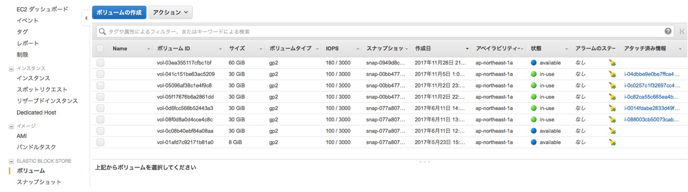
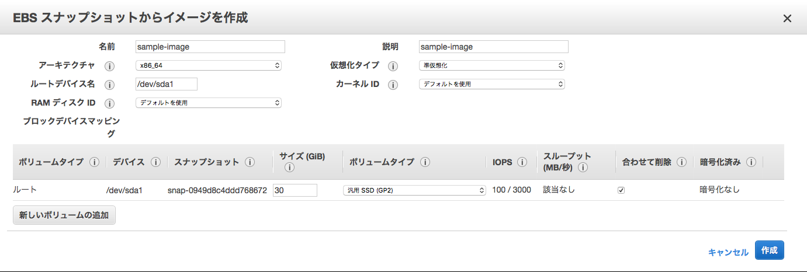
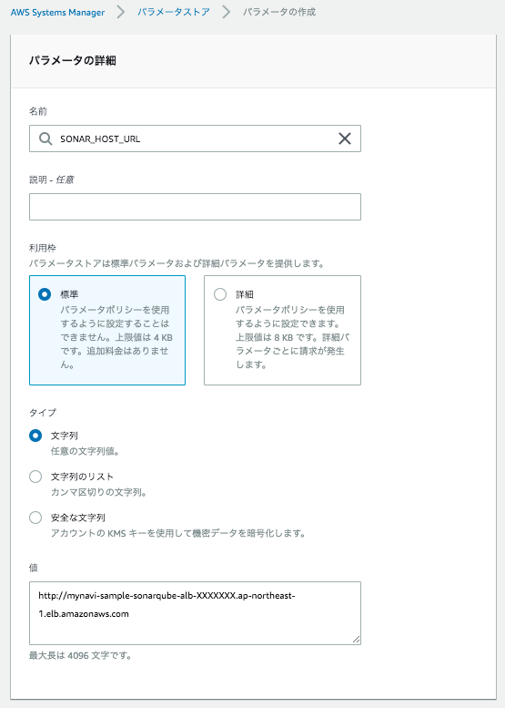

.. include:: ../module.txt

.. _section8-devops-label:

DevOps Category
======================================================

.. _section8-1-operation-label:

Operation
------------------------------------------------------

.. _section8-1-1-snapshot-label:

実行中のEC2インスタンスのバックアップ
^^^^^^^^^^^^^^^^^^^^^^^^^^^^^^^^^^^^^^^^^^^^^^^^^^^^^^

.. _section8-1-1-1-overview-label:

overview
""""""""""""""""""""""""""""""""""""""""""""""""""""""

クラウドデザインパターンでは「Snapshotパターン」と呼ばれる。
EC2インスタンスはディスクボリュームに「EBS(Elastic Block Store)」というストレージデバイスを使用しており、
EBSにはある瞬間のスナップショットとしてバックアップを作成する機能がある。作成したデータはS3に保存されるが、
特殊な形式のデータのため、直接S3から取り出すことはできない。作成したデータはEBSとして新たに作成し、
EC2インスタンスにマウントするか、AMIイメージを作成し、新たなEC2インスタンスとし起動できる。
これは次章「  :ref:`section8-1-2-stamp-label` 」にて記述する「Stampパターン」である。

.. _section8-1-1-1-operation-create-ebs-label:

EBSボリュームの作成手順
""""""""""""""""""""""""""""""""""""""""""""""""""""""

1. 対象のストレージの確認

EC2コンソールメニューから、「ボリューム」を選択し、スナップショットを作成する対象のストレージを選択する。

.. figure:: img/management-console-operation-snapshot-1.png
   :scale: 100%

.. note:: /dev/xvda はXenベースのLinuxシステムにおいて、1台目のハードディスクドライブを指す。

2. スナップショットの作成

VolumeIDを右クリックし、「Create Snapshot」を選択する。

.. figure:: img/management-console-operation-snapshot-2.png
   :scale: 100%

名称を入力する。

.. figure:: img/management-console-operation-snapshot-3.png
   :scale: 100%

.. figure:: img/management-console-operation-snapshot-4.png
   :scale: 100%

3. EBSボリュームを作成する。

作成したスナップショットを右クリックし、「Create Volume」を選択する。

.. figure:: img/management-console-operation-snapshot-5.png
   :scale: 100%

「ディスクの種類」、「ディスクの容量」、「アベイラビリティゾーンを選択する。」

.. figure:: img/management-console-operation-snapshot-6.png
   :scale: 100%

.. note:: EBSボリュームは同一のアベイラビリティゾーンでしか利用できないため、実行するEC2インスタンスのアベイラビリティゾーンに応じて、作成するゾーンを決定する。

実行すると、ボリュームにEBSがステータスavailabilityで作成される。

.. note:: スナップショットの選択時に、右クリック「コピー」を選択すると、別のリージョンへボリュームをコピーできる。

.. note:: EBSスナップショットは
   * 差分(増分)バックアップ
   * 圧縮された状態で保存
   * S3に３箇所複数される。
   * ディスクサイズはフルサイズ表示となるが、実態は差分バックアップのため、サイズが必ずしも実際のデータサイズと一致しているわけではない。

.. _section8-1-1-2-operation-create-ami-label:

EBSスナップショットからAMIの作成手順
""""""""""""""""""""""""""""""""""""""""""""""""""""""

スナップショットを作成したEBSがブート領域を含むのであれば(1台目のディスク)、AMIを作成できる。

1. イメージの作成

スナップショットを右クリック「イメージの作成」を選択する。

.. figure:: img/management-console-operation-stamp-1.png
   :scale: 100%

AMIの名称、説明、仮想マシンの種別を入力する。

.. note:: T2インスタンスを使用する場合、「ハードウェアアシストの仮想化(Hardware-assisted virtualization)」を選択すること。

実行すると、AMIにイメージがステータスavailabilityで作成される。

.. figure:: img/management-console-operation-stamp-3.png
   :scale: 100%

.. _section8-1-2-stamp-label:

同じ構成のEC2インスタンスを作成する
^^^^^^^^^^^^^^^^^^^^^^^^^^^^^^^^^^^^^^^^^^^^^^^^^^^^^^

.. _section8-1-2-1-stamp-overview-label:

overview
""""""""""""""""""""""""""""""""""""""""""""""""""""""

前節「 :ref:`section8-1-1-2-operation-create-ami-label` 」にて、EBSのスナップショットからAMIイメージを作成したが、
稼働中のEC2インスタンスからAMIイメージを作成できる。AMIからEC2インスタンスを作るときは、
CPUやメモリ構成も設定でき、スペックを任意に調整できる。

.. _section8-1-2-2-operation-create-ami-label:

実行中EC2インスタンスからAMIの作成手順
""""""""""""""""""""""""""""""""""""""""""""""""""""""

1. AMIイメージの作成

.. warning:: 当オペレーションを実行すると、完全なディスクの複製を作成するために、実行中のEC2インスタンスが再起動するので注意。再起動したくない場合は、再起動しないオプションにチェックを入れて実行すること。

メニュー「インスタンス」から、右クリック「イメージの作成」を選択する。

.. figure:: img/management-console-operation-stamp-4.png
   :scale: 100%

「 :ref:`section8-1-1-2-operation-create-ami-label` 」と同様、AMIの名称、説明、仮想マシンの種別を入力する。

.. figure:: img/management-console-operation-stamp-5.png
   :scale: 100%

実行すると、AMIにイメージがステータスavailabilityで作成される。

.. figure:: img/management-console-operation-stamp-6.png
   :scale: 100%

.. _section8-1-2-3-operation-launch-ec2-by-ami-label:

複製したAMIからEC2インスタンスを実行する手順
""""""""""""""""""""""""""""""""""""""""""""""""""""""

作成したAMIを使用して、EC2インスタンスを起動する。

1. EC2インスタンスの実行

メニュー「AMI」でイメージを選択し、右クリック「作成」を行う。

.. figure:: img/management-console-operation-stamp-7.png
   :scale: 100%

「 :ref:`section3-1-2-X-ec2-create-instance-label` 」と同様に、EC2インスタンスを起動する。

.. todo:: AMIイメージの作成方法により実行可能なインスタンスタイプが制限される模様。条件を確認する。

.. _section8-1-3-scale-up-label:

CPUやメモリスペックを上昇させる
^^^^^^^^^^^^^^^^^^^^^^^^^^^^^^^^^^^^^^^^^^^^^^^^^^^^^^

.. todo:: EC2インスタンス起動中にCPUやメモリスペックを変更する手順を記載する。

.. _section8-1-4-ondemand-disk-label:

ディスク容量を増設する
^^^^^^^^^^^^^^^^^^^^^^^^^^^^^^^^^^^^^^^^^^^^^^^^^^^^^^

.. _section8-1-4-1-application-extend-volume-overview-label:

overview
""""""""""""""""""""""""""""""""""""""""""""""""""""""

起動中のEC2インスタンスの容量が足りなくなった場合、以下のようなメッセージが表示される。

.. sourcecode:: bash

   open /var/lib/docker/image/devicemapper/layerdb/tmp/layer-314207183/diff: no space left on device

dfコマンドでディスク残容量の確認は以下の通り可能であるが、ここでは、起動中のインスタンスのディスク増設する方法を記述する。

.. sourcecode:: bash

   [centos@ip-XXX-XXX-XXX-XXX ~]$ df -h
   Filesystem      Size  Used Avail Use% Mounted on
   /dev/xvda1      8.0G  8.0G   52M 100% /
   devtmpfs        7.4G     0  7.4G   0% /dev
   tmpfs           7.4G     0  7.4G   0% /dev/shm
   tmpfs           7.4G   17M  7.4G   1% /run
   tmpfs           7.4G     0  7.4G   0% /sys/fs/cgroup
   tmpfs           1.5G     0  1.5G   0% /run/user/1000

.. _section8-1-4-2-application-extend-volume-label:

EC2ボリュームサイズの拡張
""""""""""""""""""""""""""""""""""""""""""""""""""""""

■EC2コンソールメニューからボリュームを選び、拡張したいインスタンスのボリュームを選択する。アクションメニューから、「ボリュームの変更」を選択する。

.. figure:: img/management-console-ec2-modify-volume-1.png
   :scale: 100%

■ボリュームサイズを変更し、「変更」ボタンを押下する。

.. figure:: img/management-console-ec2-modify-volume-2.png
   :scale: 100%

■EC2インスタンスにSSHでログインし、拡張したボリュームサイズにルートデバイスのパーティションを拡張させる。最初に、現状のディスクの状況を確認する。

.. sourcecode:: bash

   # ルートデバイスのパーティションサイズを確認。
   [centos@ip-XXX-XXX-XXX-XXX ~]$ lsblk
   NAME                         MAJ:MIN RM  SIZE RO TYPE MOUNTPOINT
   xvda                         202:0    0   50G  0 disk
   └─xvda1                      202:1    0    8G  0 part /
   loop0                          7:0    0  100G  0 loop
   └─docker-202:1-12881694-pool 253:0    0  100G  0 dm
   loop1                          7:1    0    2G  0 loop
   └─docker-202:1-12881694-pool 253:0    0  100G  0 dm

   # パーティションの占有状況を確認。

   [centos@ip-XXX-XXX-XXX-XXX ~]$ df -TH
   Filesystem     Type      Size  Used Avail Use% Mounted on
   /dev/xvda1     xfs       8.6G  8.6G   58M 100% /
   devtmpfs       devtmpfs  8.0G     0  8.0G   0% /dev
   tmpfs          tmpfs     8.0G     0  8.0G   0% /dev/shm
   tmpfs          tmpfs     8.0G   18M  8.0G   1% /run
   tmpfs          tmpfs     8.0G     0  8.0G   0% /sys/fs/cgroup
   tmpfs          tmpfs     1.6G     0  1.6G   0% /run/user/1000

   # ファイルシステムの確認。

   [centos@ip-XXX-XXX-XXX-XXX ~]$ sudo file -s /dev/xvd*
   /dev/xvda:  x86 boot sector; partition 1: ID=0x83, active, starthead 32, startsector 2048, 16775168 sectors, code offset 0x63
   /dev/xvda1: SGI XFS filesystem data (blksz 4096, inosz 512, v2 dirs)

.. warning:: `AWSの公式ガイド <https://docs.aws.amazon.com/ja_jp/AWSEC2/latest/UserGuide/recognize-expanded-volume-linux.html>`_ では、XFSファイルシステムのディスク拡張はxfs_growfsコマンドを使用しているが、更新が行われなかったため、fdiskコマンドを使ってパーティションの再作成を行う方法で実施する。

■ fdiskコマンドを使用して、/dev/xvdaのパーティションを作成し直し、再起動する。

.. sourcecode:: bash

   [centos@ip-XXX-XXX-XXX-XXX ~]$ sudo fdisk /dev/xvda
   Welcome to fdisk (util-linux 2.23.2).

   Changes will remain in memory only, until you decide to write them.
   Be careful before using the write command.

   Command (m for help): p

   Disk /dev/xvda: 53.7 GB, 53687091200 bytes, 104857600 sectors
   Units = sectors of 1 * 512 = 512 bytes
   Sector size (logical/physical): 512 bytes / 512 bytes
   I/O size (minimum/optimal): 512 bytes / 512 bytes
   Disk label type: dos
   Disk identifier: 0x000ae09f

   Device Boot      Start         End      Blocks   Id  System
   /dev/xvda1   *        2048    16777215     8387584   83  Linux

   Command (m for help): d
   Selected partition 1
   Partition 1 is deleted

   Command (m for help): n
   Partition type:
   p   primary (0 primary, 0 extended, 4 free)
   e   extended
   Select (default p): p
   Partition number (1-4, default 1): 1
   First sector (2048-104857599, default 2048):
   Using default value 2048
   Last sector, +sectors or +size{K,M,G} (2048-104857599, default 104857599):
   Using default value 104857599
   Partition 1 of type Linux and of size 50 GiB is set

   Command (m for help): p

   Disk /dev/xvda: 53.7 GB, 53687091200 bytes, 104857600 sectors
   Units = sectors of 1 * 512 = 512 bytes
   Sector size (logical/physical): 512 bytes / 512 bytes
   I/O size (minimum/optimal): 512 bytes / 512 bytes
   Disk label type: dos
   Disk identifier: 0x000ae09f

   Device Boot      Start         End      Blocks   Id  System
   /dev/xvda1            2048   104857599    52427776   83  Linux

   Command (m for help): w
   The partition table has been altered!

   Calling ioctl() to re-read partition table.

   WARNING: Re-reading the partition table failed with error 16: Device or resource busy.
   The kernel still uses the old table. The new table will be used at
   the next reboot or after you run partprobe(8) or kpartx(8)
   Syncing disks.

   [centos@ip-XXX-XXX-XXX-XXX ~]$ reboot

   # 再起動後、パーティションのサイズ変更を確認。
   [centos@ip-XXX-XXX-XXX-XXX ~]$ df -TH
   Filesystem     Type      Size  Used Avail Use% Mounted on
   /dev/xvda1     xfs        54G  8.6G   46G  16% /
   devtmpfs       devtmpfs  8.0G     0  8.0G   0% /dev
   tmpfs          tmpfs     8.0G     0  8.0G   0% /dev/shm
   tmpfs          tmpfs     8.0G   18M  8.0G   1% /run
   tmpfs          tmpfs     8.0G     0  8.0G   0% /sys/fs/cgroup
   tmpfs          tmpfs     1.6G     0  1.6G   0% /run/user/1000

   [centos@ip-XXX-XXX-XXX-XXX ~]$ lsblk
   NAME                         MAJ:MIN RM  SIZE RO TYPE MOUNTPOINT
   xvda                         202:0    0   50G  0 disk
   └─xvda1                      202:1    0   50G  0 part /
   loop0                          7:0    0  100G  0 loop
   └─docker-202:1-12881694-pool 253:0    0  100G  0 dm
   loop1                          7:1    0    2G  0 loop
   └─docker-202:1-12881694-pool 253:0    0  100G  0 dm

.. _section8-1-5-application-update-label:

冗長化構成のアプリケーションをアップデートする
^^^^^^^^^^^^^^^^^^^^^^^^^^^^^^^^^^^^^^^^^^^^^^^^^^^^^^^^^^^^^^^^^^^^^

.. _section8-1-5-1-application-update-overview-label:

overview
""""""""""""""""""""""""""""""""""""""""""""""""""""""

ロードバランサーを使用して冗長化構成したアプリケーションをサービス停止せずにアップデートする。
片系のアプリケーションサーバをターゲットグループから除外した後、アプリケーションをアップデートし、
再度ターゲットグループに組み込む。その後もう片系のアプリケーションサーバを同様にターゲットグループから削除し、
アップデートを行い、組み戻しを行う。

.. _section8-5-2-exclude-target-group-label:

インスタンスのDrain
""""""""""""""""""""""""""""""""""""""""""""""""""""""

1. APサーバのインスタンスをターゲットグループから除外

コンソールのメニュー「ターゲットグループ」にて、ターゲットタブから編集ボタンを押下する。

.. figure:: img/management-console-operation-app-update-1.png
   :scale: 100%

2. アップデート対象のアプリケーションインスタンスを選択し、削除ボタンを押下する。

.. figure:: img/management-console-operation-app-update-2.png
   :scale: 100%

.. note:: 削除したインスタンスはロードバランサーがターゲットのリクエストルーティングを即時指定するが、deregistration_delay.timeout_secondsとして設定した時間、Connection Dranining状態として、セッションが維持される。

.. _section8-2-codebuild-label:

CodeBuild
------------------------------------------------------

.. _section8-2-1-codebuild-overview-label:

Overview
^^^^^^^^^^^^^^^^^^^^^^^^^^^^^^^^^^^^^^^^^^^^^^^^^^^^^^

AWS CodeBuildはクラウドでアプリケーションのビルドを行う従量課金型サービスで、buildspec.ymlに記述した内容に従ってビルド実行する。
ビルドの元になるソースコードはS3に保存したものに加え、AWS CodeCommit、GitHub、BitBucketなどの各Gitベースのバージョン管理システムをサポートする。
Jenkins Agentでも同様の処理を行えるものの、クラウドでマネージドな環境下で行われるため、大規模開発でのコミットやプルリクエスト後のテスト、ビルド処理をマシンリソースを気にせず実行できることがメリットである。

.. _section8-2-2-codebuild-app-build-label:

アプリケーションのビルド
^^^^^^^^^^^^^^^^^^^^^^^^^^^^^^^^^^^^^^^^^^^^^^^^^^^^^^

1. サービスメニューから「CodeBuild」を選択し、「今すぐ始める」ボタンを押下する。

.. figure:: img/management-console-codebuild-app-build-1.png
   :scale: 100%

2. ビルドプロジェクトの設定を行う。ここでは、`GitHub上にコミットしたSpringBootベースのアプリケーション <https://github.com/debugroom/sample-aws-codebuild>`_ をビルドするため、以下の通り設定する。

.. figure:: img/management-console-codebuild-app-build-2.png
   :scale: 100%

[プロジェクトの設定]

* プロジェクト名：任意のプロジェクト名を設定(ここではsample-codebuild-build-app)

[ソース：ビルドの対象]

* ソースプロバイダ：Github(ログインするOAuth認証があるため、適宜ログイン)
* レポジトリ：パブリックレポジトリ
* レポジトリのURL：https:github.com/<user-name>/<repository-name>で指定
* Gitのクローンの深さ：1(コミットされた最新履歴からのバージョン)
* WebHook：コードがコミットされるたび、ビルド指定したければチェック
* バッジ：ビルドバッジを有効化する場合チェック

.. note:: ソースコードレポジトリに応じて、`リファレンスのソースプロバイダの表でXがついている箇所の設定 <https://docs.aws.amazon.com/ja_jp/codebuild/latest/userguide/create-project.html#create-project-console>`_ を参照すること

.. note:: ビルドバッジはビルドステータスを個別定義・明示化するオプションである。詳しくは `リファレンス <https://docs.aws.amazon.com/ja_jp/codebuild/latest/userguide/sample-build-badges.html>`_ を参照のこと。

.. figure:: img/management-console-codebuild-app-build-3.png
   :scale: 100%

[環境：ビルド方法]

* 環境イメージ：AWS CodeBuildによって管理されたイメージの使用
* オペレーティングシステム：Ubuntu
* ランタイム：Java
* ランタイムバージョン：aws/codebuild/java:openjdk-8
* ビルド仕様：ソースコードのルートディレクトリのbuildspec.xmlを使用
* buildspec名：buildspec.xml
* 証明書：証明書をインストールしない

.. note:: buildspecはコミットしたアプリケーションのルートディレクトリに配置しておく。内容を以下の通り記述する。

   .. sourcecode:: default

      version: 0.2

      phases:
        build:
          commands:
            - echo Build started on `date`
            - mvn test
        post_build:
          commands:
            - echo Build completed on `date`
            - mvn package
      artifacts:
        files:
          - target/sample-aws-codebuild-0.0.1-SNAPSHOT.jar

.. figure:: img/management-console-codebuild-app-build-4.png
   :scale: 100%

[アーティファクト：このビルドプロジェクトからアーティファクトを配置する場所]

* タイプ：アーティファクトなし

.. note:: ビルドテストのみを実行する場合や、コンテナへプッシュする場合は指定しなくて良い。

[キャッシュ]

* タイプ：キャッシュなし

.. note:: キャッシュを使用すると、S3に再利用可能なビルド環境が保存され高速化される。

[サービスロール]

* アカウントでサービスロールを作成

[VPC]

* NoVPC

3. 設定内容を確認し、「保存してビルド」ボタンを押下する。

.. figure:: img/management-console-codebuild-app-build-5.png
   :scale: 100%

4. ビルドの開始ボタンを押下する。

.. figure:: img/management-console-codebuild-app-build-6.png
   :scale: 100%

5. ビルド結果を確認する。

.. figure:: img/management-console-codebuild-app-build-7.png
   :scale: 100%

.. figure:: img/management-console-codebuild-app-build-8.png
   :scale: 100%

|br|

.. _section8-2-2-codebuild-local-label:

CodeBuild Localの利用
^^^^^^^^^^^^^^^^^^^^^^^^^^^^^^^^^^^^^^^^^^^^^^^^^^^^^^

`2018年5月に、CodeBuildをローカル環境で動かすDockerイメージが公開された <https://aws.amazon.com/jp/blogs/devops/announcing-local-build-support-for-aws-codebuild/>`_ 。このサポートにより、Dockerがインストールされたマシンでbuildspec.ymlのデバッグやテストが可能である。

.. _section8-2-2-1-codebuild-local-prepared-label:

事前準備
""""""""""""""""""""""""""""""""""""""""""""""""""""""""""

CodeBuild Localを利用するには、事前に以下を実施しておく必要がある。

#. 実際にビルド実行環境コンテナイメージ(DefaultではUbuntu)を作成
#. 環境コンテナを起動するためのエージェントコンテナイメージをプル

なお、CodeBuild Localを実行する際は2のコンテナイメージをDocker runするかたちになるが、実行スクリプトが提供されているため、このスクリプトに1のコンテナイメージ名やアーティファクトの出力先フォルダ、認証情報など情報を渡して実行することになる。

.. note:: 2のコンテナイメージを作成するためのDockerfileはAWSから公開されていない模様。

1の手順としては、`公式サイト <https://github.com/aws/aws-codebuild-docker-images>`_ の手順に習い、ターミナルなどを使って、適当なディレクトリで、ビルド実行環境のコンテナイメージがあるaws-codebuild-docker-imagesのレポジトリをGit cloneする。
ビルド用のコンテナ(starndard:2.0)イメージを構築するDockerfileがあるディレクトリへ移動し、docker buildコマンドを実行する。

.. sourcecode:: bash

   $ git clone https://github.com/aws/aws-codebuild-docker-images.git
   $ cd aws-codebuild-docker-images
   $ cd ubuntu/standard/2.0
   $ docker build -t aws/codebuild/standard:2.0 .

続いて、環境コンテナを起動するためのエージェントコンテナイメージをプルする。

.. sourcecode:: bash

   $ docker pull amazon/aws-codebuild-local:latest --disable-content-trust=false

.. _section8-2-2-1-codebuild-local-execution-label:

CodeBuild Localの実行
""""""""""""""""""""""""""""""""""""""""""""""""""""""""""

Git cloneしたaws-codebuild-docker-imagesの中にlocal_builds/codebuild_build.shがあるので、buildspec.ymlがあるディレクトリへコピーする。
今回、buildspec.ymlとしては、マルチプロジェクト構成のMavenプロジェクトで、プロジェクトルート配下のcommonプロジェクトに対し、mvn packageコマンドを実行し、Sonarqubeへscan結果を送信するものを用いる。
なお、buildspec.ymlから環境変数として、SonarqubeServerのURL(SONAR_HOST_URL)とトークン(SONAR_LOGIN_COMMON)をAWS Systems Managerから取得する。なお、パラメータストアの設定は :ref:`section8-7-6-2-systems-manager-parameter-store-create-parameter-label` を参照のこと。

.. sourcecode:: bash

   version: 0.2
   env:
     parameter-store:
       SONAR_HOST_URL: "SONAR_HOST_URL"
       SONAR_LOGIN: "SONAR_LOGIN_COMMON"
   phases:
     install:
       runtime-versions:
         docker: 18
     build:
       commands:
         - mvn -f common/pom.xml package sonar:sonar -Dsonar.host.url=${SONAR_HOST_URL} -Dsonar.login=${SONAR_LOGIN}
   artifacts:
     files:
       - common/target/mynavi-sample-continuous-integration-common-0.0.1-SNAPSHOT.jar

buildspec.ymlおよびcodebuild_build.shはcommonプロジェクト配下にあるが、CodeBuildによってGitHubからクローンされるビルド対象のアプリケーションソースコードのルートディレクトリ(ビルドコマンドを実行するディレクトリ)を起点として、コピーしたcodebuild_build.shにオプションパラメータを与えて実行する。

.. sourcecode:: bash

   $ common/codebuild_build.sh -i aws/codebuild/standard:2.0 -a common/target/ -c -b common/buildspec.yml

なお、上記で実行したスクリプトの各オプションの説明は以下の通り。

.. list-table:: codebuild_build.shのオプション
   :widths: 2, 8

   * - オプション
     - 説明

   * - iオプション(必須)
     - 事前準備で作成したCodeBuildでビルドするコンテナイメージを指定する。

   * - aオプション(必須)
     - アーティファクトを出力するディレクトリを指定する。

   * - cオプション
     - AWS認証情報を指定する(デフォルトでは~/.aws/credentialsの認証情報が使用される)

   * - bオプション
     - buildspec.ymlを指定する。

スクリプトを実行すると、以下の通り、CodeBuildがローカルのDocker環境で実行されるようになる。

.. sourcecode:: bash

   Build Command:

   docker run -it -v /var/run/docker.sock:/var/run/docker.sock -e "IMAGE_NAME=aws/codebuild/standard:2.0" -e "ARTIFACTS=/Users/kawabatakouhei/Documents/repos/git/debugroom/mynavi-sample-continuous-integration/common/target/" -e "SOURCE=/Users/kawabatakouhei/Documents/repos/git/debugroom/mynavi-sample-continuous-integration" -e "BUILDSPEC=/Users/kawabatakouhei/Documents/repos/git/debugroom/mynavi-sample-continuous-integration/common/buildspec.yml" -e "AWS_CONFIGURATION=/Users/kawabatakouhei/.aws" -e "INITIATOR=kawabatakouhei" amazon/aws-codebuild-local:latest

   Removing agent-resources_build_1 ... done
   Removing agent-resources_agent_1 ... done
   Removing network agent-resources_default
   Removing volume agent-resources_source_volume
   Removing volume agent-resources_user_volume
   Creating network "agent-resources_default" with the default driver
   Creating volume "agent-resources_source_volume" with local driver
   Creating volume "agent-resources_user_volume" with local driver
   Creating agent-resources_agent_1 ... done
   Creating agent-resources_build_1 ... done
   Attaching to agent-resources_agent_1, agent-resources_build_1
   agent_1  | [Container] 2019/06/27 19:25:01 Waiting for agent ping

   // omit

   agent_1  | [INFO] ------------------------------------------------------------------------
   agent_1  | [INFO] BUILD SUCCESS
   agent_1  | [INFO] ------------------------------------------------------------------------
   agent_1  | [INFO] Total time:  03:09 min
   agent_1  | [INFO] Finished at: 2019-06-27T19:29:04Z
   agent_1  | [INFO] ------------------------------------------------------------------------
   agent_1  |
   agent_1  | [Container] 2019/06/27 19:29:04 Phase complete: BUILD State: SUCCEEDED
   agent_1  | [Container] 2019/06/27 19:29:04 Phase context status code:  Message:
   agent_1  | [Container] 2019/06/27 19:29:04 Entering phase POST_BUILD
   agent_1  | [Container] 2019/06/27 19:29:04 Phase complete: POST_BUILD State: SUCCEEDED
   agent_1  | [Container] 2019/06/27 19:29:04 Phase context status code:  Message:
   agent_1  | [Container] 2019/06/27 19:29:04 Expanding base directory path: .
   agent_1  | [Container] 2019/06/27 19:29:04 Assembling file list
   agent_1  | [Container] 2019/06/27 19:29:04 Expanding .
   agent_1  | [Container] 2019/06/27 19:29:04 Expanding artifact file paths for base directory .
   agent_1  | [Container] 2019/06/27 19:29:04 Assembling file list
   agent_1  | [Container] 2019/06/27 19:29:04 Expanding common/target/mynavi-sample-continuous-integration-common-0.0.1-SNAPSHOT.jar
   agent_1  | [Container] 2019/06/27 19:29:04 Found 1 file(s)
   agent_1  | [Container] 2019/06/27 19:29:04 Preparing to copy secondary artifacts
   agent_1  | [Container] 2019/06/27 19:29:04 No secondary artifacts defined in buildspec
   agent_1  | [Container] 2019/06/27 19:29:04 Phase complete: UPLOAD_ARTIFACTS State: SUCCEEDED
   agent_1  | [Container] 2019/06/27 19:29:04 Phase context status code:  Message:
   

.. _section8-3-codepipeline-label:

CodePipeline
------------------------------------------------------

.. _section8-3-1-codepipeline-overview-label:

Overview
^^^^^^^^^^^^^^^^^^^^^^^^^^^^^^^^^^^^^^^^^^^^^^^^^^^^^^

CodePipelineはアプリケーションのソースコードコミット→テスト→ビルド→ステージングデプロイ→プロダクションデプロイといった一連のソフトウェアリリースプロセスを自動化し、継続的インテグレーション・デリバリを実現するツールである。
CodeCommitやS3、CodeBuild、CodeDeployといったAWSリソースはもちろんのこと、GitHubやJenkins、DockerHubとも連携し、アプリケーションの構築にかかる一連の流れを自動化できる。

.. _section8-3-2-codepipeline-staging-release-label:

ECSアプリケーションのステージングリリースの自動化
^^^^^^^^^^^^^^^^^^^^^^^^^^^^^^^^^^^^^^^^^^^^^^^^^^^^^^^^^^^^^^^^^^^^^^^^^^^^^^^

ここでは、CodePipeLineを使って、SpringBootベースのアプリケーションをGitHub上にソースコードコミットし、Dockerコンテナを用いてテスト・ビルドを行い、構築したアプリケーションコンテナを、DockerHub上にプッシュした後、EC2起動型のECSステージング環境へのデプロイする作業を自動化する設定例を記述する。
なお、Dockerコンテナを使用したテスト・ビルドについては前章「 :ref:`section8-2-codebuild-label` 」で実行した通り、AWS CodeBuildを利用する。

.. _section8-3-2-1-codepipeline-staging-release-prepared-label:

事前準備
""""""""""""""""""""""""""""""""""""""""""""""""""""""""""

CodePipeLineでステージング環境へのリリースを自動化する設定を行う前に、以下を準備しておく。

#. リリースするSpringBootアプリケーション及びCodeBuild設定
#. ステージング環境とするEC2起動型のECSコンテナ環境の構築
#. ロードバランサーの設定

上記のポイントについて順次記載する。

1. リリースするSpringBootアプリケーション及びCodeBuildの設定

最終的なソースコードは `GitHub <https://github.com/debugroom/sample-aws-codepipeline>`_ 上にコミットしているが、
ルートディレクトリの配下にCodeBuildで使用するbuildspec.ymlと、buildspec.yml内でDockerコマンドで実行されるビルド用のDockerfileを作成しておく。
なお、各環境変数のパラメータはCodePipelineの設定時に指定する。

.. sourcecode:: default

   version: 0.2

   phases:
     pre_build:
       commands:
   #      - echo Logging in to Amazon ECR...
   #      - $(aws ecr get-login --no-include-email --region $AWS_DEFAULT_REGION)
         - echo Logging in to Docker Hub...
         - docker login -u $USER -p $PASSWORD $DOCKER_REPO
   build:
     commands:
       - echo Build started on `date`
       - echo Building the Docker image...
       - docker build -t $IMAGE_REPO_NAME:$IMAGE_TAG .
   #    - docker tag $IMAGE_REPO_NAME:$IMAGE_TAG $AWS_ACCOUNT_ID.dkr.ecr.$AWS_DEFAULT_REGION.amazonaws.com/$IMAGE_REPO_NAME:$IMAGE_TAG
       - docker tag $IMAGE_REPO_NAME:$IMAGE_TAG $IMAGE_REPO_NAME:$IMAGE_TAG
   post_build:
     commands:
       - echo Build completed on `date`
       - echo Pushing the Docker image...
   #      - docker push $AWS_ACCOUNT_ID.dkr.ecr.$AWS_DEFAULT_REGION.amazonaws.com/$IMAGE_REPO_NAME:$IMAGE_TAG
          - docker push $IMAGE_REPO_NAME:$IMAGE_TAG
          - printf '[{"name":"sample-aws-codepipeline","imageUri":"%s"}]' $IMAGE_REPO_NAME:$IMAGE_TAG > imagedefinitions.json
   artifacts:
     files: imagedefinitions.json

.. note:: buildspec.yml内では、コンテナをDockerHubへプッシュした後に、ECSコンテナの構築でコンテナイメージをPullするために必要な「imagedefinitions.json」を出力している。
          タスク定義で指定するコンテナ名とURLをJSON形式で表現したファイルである。

.. warning:: 「imagedefinitions.json」で"name"指定する値は、ECSタスク定義名ではなく、タスク定義で定義したコンテナ名を設定する必要がある。

Dockerfileは最終的にECSコンテナのイメージとなる。CentOS7をベースとして、JDKとMavenをインストールし、対象のソースコードをクローンしてビルドした後、タイムゾーンとロケールを変更してアプリケーションを実行する。

.. sourcecode:: default

   # Dockerfile for sample service using embedded tomcat server

   FROM centos:centos7
   MAINTAINER debugroom

   RUN yum install -y \
       java-1.8.0-openjdk \
       java-1.8.0-openjdk-devel \
       wget tar iproute git

   RUN wget http://repos.fedorapeople.org/repos/dchen/apache-maven/epel-apache-maven.repo -O /etc/yum.repos.d/epel-apache-maven.repo
   RUN sed -i s/\$releasever/6/g /etc/yum.repos.d/epel-apache-maven.repo
   RUN yum install -y apache-maven
   ENV JAVA_HOME /etc/alternatives/jre
   RUN git clone https://github.com/debugroom/sample-aws-codepipeline.git /var/local/sample-aws-codepipeline
   RUN mvn install -f /var/local/sample-aws-codepipeline/pom.xml

   RUN rm -f /etc/rpm/macros.image-language-conf && \
       sed -i '/^override_install_langs=/d' /etc/yum.conf && \
       yum -y reinstall glibc-common && \
       yum clean all

   ENV LANG="ja_JP.UTF-8" \
       LANGUAGE="ja_JP:ja" \
       LC_ALL="ja_JP.UTF-8"

   RUN cp /etc/localtime /etc/localtime.org
   RUN ln -sf  /usr/share/zoneinfo/Asia/Tokyo /etc/localtime

   EXPOSE 8080

   CMD java -jar -Dspring.profiles.active=production /var/local/sample-aws-codepipeline/target/sample-aws-codepipeline-0.0.1-SNAPSHOT.jar

.. note:: 説明は割愛するが、アプリケーションは、http://<loadbalancerのURL>/aws-code-pipeline/api/v1/usersでユーザの一覧を返すAPIを持つアプリケーションで、テストコードを含めコミットしている。

2. ステージング環境とするEC2起動型のECSコンテナ環境の構築

「 :ref:`section3-2-ecs-label` 」で構築したECSクラスタ、ロードバランサを利用する。ECSタスク定義・サービス定義は、アプリケーションを一度CodePipelineでビルド設定した後に行うため、ECSクラスタ・ロードバランサはそのまま利用し、アプリケーションの振り分け先であるターゲットグループのみ新規作成しておく。

EC2のサービスメニュー > ターゲットグループを選択し、「ターゲットグループの作成」を押下して、以下のように入力してターゲットグループを作成する。

.. figure:: img/management-console-ec2-create-target-group-for-codepipeline-1.png
   :scale: 100%

* ターゲットグループ名：任意
* プロトコル：HTTP
* ポート：80
* VPC：任意(あらかじめ作ったもの)

[ヘルスチェックの設定]

* プロトコル：HTTP
* パス：http://<loadbalancerのURL>/aws-code-pipeline/api/v1/users(アプリケーションの正常応答するURL)

.. warning: ヘルスチェックの正常応答間隔が不必要に短すぎるとコンテナが不必要に再起動するケースが多くなるので、比較的長めに設定しておいた方が無難。

3. ロードバランサの設定

作成したアプリケーションのURLのパスが来た場合に、上記で作成したターゲットグループへ振り分けられるよう設定を行う。

EC2サービスメニュー > ロードバランサーを選択し、指定するロードバランサーを選んで、リスナータブで「ルールの表示/編集」を選択する。

.. figure:: img/management-console-ec2-setting-loadbalancer-for-codepipeline-1.png
   :scale: 100%

プラスボタンを押下してルールを追加する。

.. figure:: img/management-console-ec2-setting-loadbalancer-for-codepipeline-2.png
   :scale: 100%

作成したアプリケーションのパスルールに一致したら、上記で作成したターゲットグループに向くよう設定しておく。

.. figure:: img/management-console-ec2-setting-loadbalancer-for-codepipeline-3.png
   :scale: 100%

.. _section8-3-2-2-codepipeline-staging-release-setting-label:

CodePipeLineの設定(ソース・ビルド)
""""""""""""""""""""""""""""""""""""""""""""""""""""""""""

ステージング環境へのリリースまで設定するためには一度、ECSのタスク定義と、サービス設定をおこなっていく必要があるため、
まずCodePipeLineでGitHubからソースコードコミットし、Dockerコンテナでテスト・ビルド後、DockerHubへプッシュするところまでを設定し、起動する。

■サービス「CodePipeline」を選択し、「今すぐ始める」ボタンを押下する。

.. figure:: img/management-console-codepipeline-1.png
   :scale: 100%

■パイプライン名を任意に設定し、「次のステップへ」ボタンを押下する。

.. figure:: img/management-console-codepipeline-2.png
   :scale: 100%

■ソースプロバイダをGitHubに設定し、GitHubに接続した後、レポジトリ及びブランチを指定する。

.. note:: 上記のサンプルでは、masterブランチを指定しているが、実際の環境ではmasterブランチをproductionに、developブランチをstagingなどに設定することを推奨する。

■ビルドプロバイダに「AWS CodeBuild」を選択し、以下の通り、設定する。

.. figure:: img/management-console-codepipeline-4.png
   :scale: 100%

[プロジェクトの設定]

* 新しいビルドプロジェクトを選択
* プロジェクト名：任意のプロジェクト名を設定

[環境の設定]

* 環境イメージ：AWS CodeBuildマネージド型イメージの使用
* OS：Ubuntu
* ランタイム：DOCKER
* バージョン：aws/codebuild/docker:YY.MM.X
* ビルド仕様：ソースコードのルートディレクトリのbuildspec.ymlを使用

.. note:: ここで指定しているDocker環境はECSコンテナをビルドするための設定のため、Ubuntuを使用する設定で問題ない。

.. figure:: img/management-console-codepipeline-5.png
   :scale: 100%

[キャッシュ]

* タイプ：キャッシュ指定なし

[コンテナサービスロール]

* アカウントで新しいロールを作成します。
* ロール名：任意の名前を設定

[VPC]

* VPC ID：非VPC

.. figure:: img/management-console-codepipeline-6.png
   :scale: 100%

[アドバンスト]

* ビルドタイムアウト：1時間
* コンピューティング：build.standard.small

.. note:: コンテナのローリングアップデートに時間を要する場合があるので、ある程度タイムアウトの時間を確保しておく

[環境変数] 「 :ref:`section8-3-2-1-codepipeline-staging-release-prepared-label` 」で作成したDockerfileの実行に必要な環境変数を設定。

* USER：DockerHubにログインするユーザ名
* PASSWORD：DockerHubにログインするユーザのパスワード
* DOCKER_REPO：DockerHubのURL
* IMAGE_REPO_NAME：Dockerイメージ名
* IMAGE_TAG：イメージタグ(バージョン)

.. note:: DockerHubのURLは、省略しても良いがデフォルトは https://index.docker.io/v1/ である。

■デプロイプロバイダには「デプロイなし」を指定し、「次のステップ」ボタンを押下する。

.. note::　本来であればデプロイプロバイダに「ECS」を指定するが、一度コンテナイメージを作成し、ECSタスク定義とサービス定義を実行した後、再度デプロイプロバイダの設定を行う。

■任意のロール名を入力し、「ロールの作成」ボタンを押下して、サービスロールを作成し、「次のステップ」を押下する。

.. figure:: img/management-console-codepipeline-8.png
   :scale: 100%

.. note:: 適切な権限を持つロールを設定しないとエラーになるので注意

   .. figure:: img/management-console-codepipeline-9.png
      :scale: 100%

■設定内容を確認し、「パイプラインの作成」を押下する。

.. figure:: img/management-console-codepipeline-10.png
   :scale: 100%

■ソースコードがチェックアウトされ、コンテナのビルドが実行される。正常終了すると、DockerHubにコンテナイメージがプッシュされる。

.. figure:: img/management-console-codepipeline-11.png
   :scale: 100%

.. _section8-3-2-3-codepipeline-staging-release-ecs-task-setting-label:

ECSタスク定義
""""""""""""""""""""""""""""""""""""""""""""""""""""""""""

プッシュしたコンテナイメージの設定情報からECSのタスク定義を行う。CodepipeLineが実行されるたび、ECSタスクのリビジョンがアップデートされる形となる。

■ECSサービスメニューから、タスク定義を選択し、「新しいタスク定義の作成」ボタンを押下する。

.. figure:: img/management-console-ecs-create-task-for-codepipeline-1.png
   :scale: 100%

■起動モードはEC2を選択する。

.. figure:: img/management-console-ecs-create-task-for-codepipeline-2.png
   :scale: 100%

■タスクとコンテナの定義について以下の通り、設定を行う。

.. figure:: img/management-console-ecs-create-task-for-codepipeline-3.png
   :scale: 100%

[タスクとコンテナの定義の設定]

* タスク定義名：任意
* タスクロール：任意(ECSアプリケーションが必要な権限を設定)
* ネットワークモード：デフォルト

[タスクの実行のIAMロール]

* タスク実行ロール： :ref:`section3-2-3-ecs-create-task-label` で作成したECS Task用のIAM ロールを設定。

[タスクサイズ]

* タスクメモリ：1024MiB
* タスクCPU：256

.. warning:: Spring Boot Applicationで構成する場合は1GB以上のメモリを割り当てておくこと。512MB程度で起動すると、アプリケーションの規模が多くなったときに、起動に時間がかかり、ヘルスチェックでエラー検出し、コンテナの無限ループ起動を誘発してしまうため。

■ コンテナ定義を以下の通り設定する。

.. figure:: img/management-console-ecs-create-task-for-codepipeline-5.png
   :scale: 100%

[スタンダード]

* コンテナ名：任意
* イメージ：前章で作成したコンテナイメージのURL・タグ名を指定
* メモリ制限：1024MiB
* ポートマッピング

  * ホストポート：0
  * コンテナポート：8080

.. warning:: コンテナ名は :ref:`section8-3-2-1-codepipeline-staging-release-prepared-label` のbuildspec.ymlで指定した、imagedefinitions.jsonのname属性の値と同じにしておく必要がある。

.. figure:: img/management-console-ecs-create-task-for-codepipeline-6.png
   :scale: 100%

[詳細コンテナの設定]

* 特にここでは設定しない

.. figure:: img/management-console-ecs-create-task-for-codepipeline-7.png
   :scale: 100%

[ネットワークの設定]

* 特にここでは設定しない

.. figure:: img/management-console-ecs-create-task-for-codepipeline-8.png
   :scale: 100%

[ストレージとログ]

* 特にここでは設定しない

[セキュリティ]

* 特にここでは設定しない

.. figure:: img/management-console-ecs-create-task-for-codepipeline-9.png
   :scale: 100%

[リソースの制限]

* 特にここでは設定しない

[DOCKERラベル]

* 特にここでは設定しない

■制約等は特に設定せず、「作成」ボタンを押下する。

.. figure:: img/management-console-ecs-create-task-for-codepipeline-10.png
   :scale: 100%

.. _section8-3-2-4-codepipeline-staging-release-ecs-service-setting-label:

ECSサービス設定
""""""""""""""""""""""""""""""""""""""""""""""""""""""""""

前章  :ref:`section8-3-2-3-codepipeline-staging-release-ecs-task-setting-label` を元にECSサービスを設定し、ECSコンテナを起動させておく。CodePipeLineが実行されると最新のリビジョンにアップデートされたコンテナイメージがローリングアップデートされることになる。

■ECSサービスメニューから「クラスター」を選び、作成してあるECSクラスタ「sample-cluster」を選択する。

■サービスタブから、「作成」ボタンを押下し、サービスを新規作成する。

.. figure:: img/management-console-ecs-create-service-for-codepipeline-2.png
   :scale: 100%

■以下の通り、サービスの新規設定を行う。

.. figure:: img/management-console-ecs-create-service-for-codepipeline-3.png
   :scale: 100%

[サービスの設定]

* 起動タイプ：EC2
* タスク定義：前章「 :ref:`section8-3-2-3-codepipeline-staging-release-ecs-task-setting-label` 」で作成したタスクを指定
* クラスター：選択したクラスタを指定
* サービス名：任意
* サービスタイプ：REPLICA
* タスクの数：2
* 最小ヘルス率：50
* 最大率：200

[タスクの配置]

* 配置テンプレート：AZバランススプレッド

.. note:: 設定オプションについては、:ref:`section3-2-5-ecs-create-service-label`　も参照のこと。

.. figure:: img/management-console-ecs-create-service-for-codepipeline-4.png
   :scale: 100%

[ヘルスチェックの猶予期間]

* ヘルスチェックの猶予期間：100

.. note:: SpringBootアプリケーションだと設定したメモリ・CPU、アプリの規模によっては時間がかかるため、適宜猶予期間を設定しておくこと。

[Elastic Load Balancing(オプション)]

* ELBタイプ：ApplicationLoadBalancer
* サービス用のIAMロールの選択： :ref:`section3-2-3-ecs-create-task-label` で作成したECS Task用のIAM ロールを設定。
* ELB名： :ref:`section3-2-4-ecs-create-alb-label` で設定したALBを選択

■ :ref:`section8-3-2-1-codepipeline-staging-release-prepared-label` で作成したロードバランサを指定し、「次のステップ」ボタンを押下する。
　
.. figure:: img/management-console-ecs-create-service-for-codepipeline-5.png
   :scale: 100%

■ AutoScalingオプションは、「サービスの必要数を直接調整しない」を設定し、「次のステップ」を押下する。

.. figure:: img/management-console-ecs-create-service-for-codepipeline-6.png
   :scale: 100%

■設定値を確認し、「サービスの作成」ボタンを押下する。

.. figure:: img/management-console-ecs-create-service-for-codepipeline-7.png
   :scale: 100%

.. _section8-3-2-5-codepipeline-staging-release-setting-2-label:

CodePipeLineの設定(ECSデプロイ)
""""""""""""""""""""""""""""""""""""""""""""""""""""""""""

作成したECSタスク定義・サービス定義の内容に従い、ステージング環境へECSコンテナをデプロイする設定を行う。

■  :ref:`section8-3-2-2-codepipeline-staging-release-setting-label` で作成したCodePipeline定義を開き、「編集」ボタンを押下する。

.. figure:: img/management-console-codepipeline-11.png
   :scale: 100%

■ ビルドの後にステージングデプロイ用のアクションを追加し、「アクションの追加」ボタンを押下する。

.. figure:: img/management-console-codepipeline-12.png
   :scale: 100%

詳細なオプションは、以下の設定通り行う。

* アクションカテゴリ：デプロイ

[デプロイアクション]

* デプロイアクション：任意の名前
* デプロイプロバイダ：AmazonECS

[AmazonECS]

* クラスタ名：選択したクラスタを指定
* サービス名：前章「 :ref:`section8-3-2-4-codepipeline-staging-release-ecs-service-setting-label` 」で作成したサービスを指定
* イメージファイル名： 「 :ref:`section8-3-2-1-codepipeline-staging-release-prepared-label` 」で作成した、「imagedefinitions.json」を指定
* 入力アーティファクト：直前のアクション「Build」の出力アーティファクトと同名にしておく

.. _section8-4-cloud-formation-label:

CloudFormation
------------------------------------------------------

CloudFormationは、JSONとYAML形式のテンプレートを使用して、AWSリソースの起動、設定、接続を行うサービスである。

.. todo:: CloudFormationのテンプレート記述要領について記述。

.. _section8-5-elastic-beanstalk-label:

Elastic Beanstalk
------------------------------------------------------

Elastic Beanstalkは、Webアプリケーションを自動デプロイ、スケーリングするサービスである。

.. todo:: Elastic Beanstalkについて詳述。

.. _section8-6-elastic-beanstalk-label:

OpsWorks
------------------------------------------------------

AWS OpsWorksはChefを利用して、アプリケーションの設定と管理を行う構成管理サービス

.. todo:: OpsWorksについて詳細を記述

.. _section8-7-Systems-Manager-label:

AWS Systems Manager
------------------------------------------------------

.. _section8-7-1-systems-manager-overview-label:

Overview
^^^^^^^^^^^^^^^^^^^^^^^^^^^^^^^^^^^^^^^^^^^^^^^^^^^^^^

AWS Systems Managerは、EC2をはじめとしたサーバリソースの大規模な運用・管理を効率化・自動化するサービスである。
EC2インスタンスへのパッチ適用やインベントリ(システム構成)情報の収集、OSのアップデートやドライバの更新の実行、AMIの管理などを、リソース単位でまとめ大規模に実行することが可能である。
また、複数のリソースで共有可能なパラメータストアの作成やブラウザベースでのEC2インスタンスへのアクセスなどシステム管理に関わる複数の機能群で構成される。Systems Managerの主な特徴・機能は以下の通りである。

.. list-table:: Systems Managerの主な特徴・機能
   :widths: 2, 8

   * - 機能
     - 概要

   * - Remote Connect
     - 通常必ず行うセキュリティインバウンド設定やSSHキーなしで、ブラウザやAWS CLIを使ってEC2インスタンスへアクセスする機能

   * - Resource Group
     - AWSの複数のリソースをグルーピング化できる機能

   * - Insight & Dashboard
     - リソースごとに収集したソフトウェアインベントリ情報(OSバージョンなどの構成管理情報)やCloudTrail、Trusted Advisorなどのインサイト情報をダッシュボードで俯瞰的に参照する機能

   * - RunningTasks on group resources
     - リソースグループに対し、オペレーションタスク・スクリプトを自動的に実行する機能

   * - Parameter store
     - 複数のリソースで共有可能な、認証キーやIDなど秘匿情報やプレインテキストデータを階層的に管理して保存、参照する機能

   * - OS patch management
     - 複数のリソースまたはリソースグループに対し、パッチ適用などを実行する機能

   * - Meintenance windows
     - タスク実行をスケジューリング化し実行する機能

   * - Consistent Configuration
     - ステートマネージャを使用した一貫した設定・メンテナンス機能

.. _section8-7-2-systems-manager-remote-connect-label:

Remote Connect
^^^^^^^^^^^^^^^^^^^^^^^^^^^^^^^^^^^^^^^^^^^^^^^^^^^^^^

.. todo:: Systems Managerを使ったリモートアクセスのやり方を記載する。

.. _section8-7-3-systems-manager-resource-group-label:

Resource Group
^^^^^^^^^^^^^^^^^^^^^^^^^^^^^^^^^^^^^^^^^^^^^^^^^^^^^^

.. todo:: Systems Managerを使ったリソースグループ設定のやり方を記載する。

.. _section8-7-4-systems-manager-insight-dashboard-label:

Insight & Dashboard
^^^^^^^^^^^^^^^^^^^^^^^^^^^^^^^^^^^^^^^^^^^^^^^^^^^^^^

.. todo:: Systems Managerを使ったインサイト情報の参照機能の使い方を記載する。

.. _section8-7-5-systems-manager-runnging-task-label:

Running Tasks
^^^^^^^^^^^^^^^^^^^^^^^^^^^^^^^^^^^^^^^^^^^^^^^^^^^^^^

.. todo:: タスク自動実行機能の使い方を記載する。

.. _section8-7-6-systems-manager-Parameter-store-label:

Paramter Store
^^^^^^^^^^^^^^^^^^^^^^^^^^^^^^^^^^^^^^^^^^^^^^^^^^^^^^

.. _section8-7-6-1-systems-manager-parameter-store-overview-label:

Overview
""""""""""""""""""""""""""""""""""""""""""""""""""""""""""

パラメータストアはパスワードやデータベース文字列、ライセンスコードなどアプリケーションに直接実装せず環境変数を経由して設定するデータ等を一元的に管理するためのサービスである。
特に多くのEC2インスタンスやECSタスク上にデプロイされたアプリケーションなどで同一のデータを参照したい場合有効であり、またデータは階層構造をとることができる。
データ値はプレーンテキストまたはAWS KMSを使用して暗号化データとして使用でき、暗号化や復号化も同時に実行する。パラメータストアの参照はIAMにより細かくアクセス制御が可能であり、
以下のAWSサービスから利用可能である。

* Amazon EC2
* Amazon ECS
* AWS Lambda
* AWS CloudFormation
* AWS CodeBuild
* AWS CodeDeploy

また、暗号化や通知、モニタリング、監査を行うため、以下のサービスと連動して機能する。

* AWS KMS
* Amazon SNS
* Amazon CloudWatch
* AWS CloudTrail

従来のパラメータストアでは、データサイズが4KBまで、スループット上限は規定範囲内だったが、`2019年4月のアップデートでアドバンスドパラメータオプションが導入 <https://aws.amazon.com/jp/about-aws/whats-new/2019/04/aws_systems_manager_parameter_store_introduces_advanced_parameters/>`_ され、
10000を変えるパラメータの作成、最大8KB、スループットの上限緩和(デフォルト40tpsから最大1000tpsまで)の拡張がなされた。
ただし、アドバンスドパラメータオプションは有料となるため注意すること。

.. _section8-7-6-2-systems-manager-parameter-store-create-parameter-label:

標準パラメータストアの設定
""""""""""""""""""""""""""""""""""""""""""""""""""""""""""

1. AWSコンソール上から、Systems Managerを選択し、「パラメータストア」メニューから「パラメータの作成」ボタンを押下する。

.. figure:: img/management-console-ssm-create-parameter-store-1.png
   :scale: 100%

2. パラメータ名と値を設定し、「作成」ボタンを押下する。

.. note:: ここで設定したパラメータを参照する方法は、 :ref:`section8-2-2-1-codebuild-local-execution-label` を参照のこと。

.. _section8-7-7-systems-manager-os-patch-management-label:

OS patch management
^^^^^^^^^^^^^^^^^^^^^^^^^^^^^^^^^^^^^^^^^^^^^^^^^^^^^^

.. todo:: パッチマネージャーを使ったOSパッチ管理方法を記載する。

.. _section8-7-8-systems-manager-maintenance-windows-label:

Maintenance windows
^^^^^^^^^^^^^^^^^^^^^^^^^^^^^^^^^^^^^^^^^^^^^^^^^^^^^^

.. todo:: メンテナンスウィンドウを使ったスケジューリングタスクの設定・実行方法を記載する。

.. _section8-7-9-systems-manager-consistent-configuration-label:

Consistent Configuration
^^^^^^^^^^^^^^^^^^^^^^^^^^^^^^^^^^^^^^^^^^^^^^^^^^^^^^

.. todo:: ステートマネージャを使った設定・実行方法を記載する。
