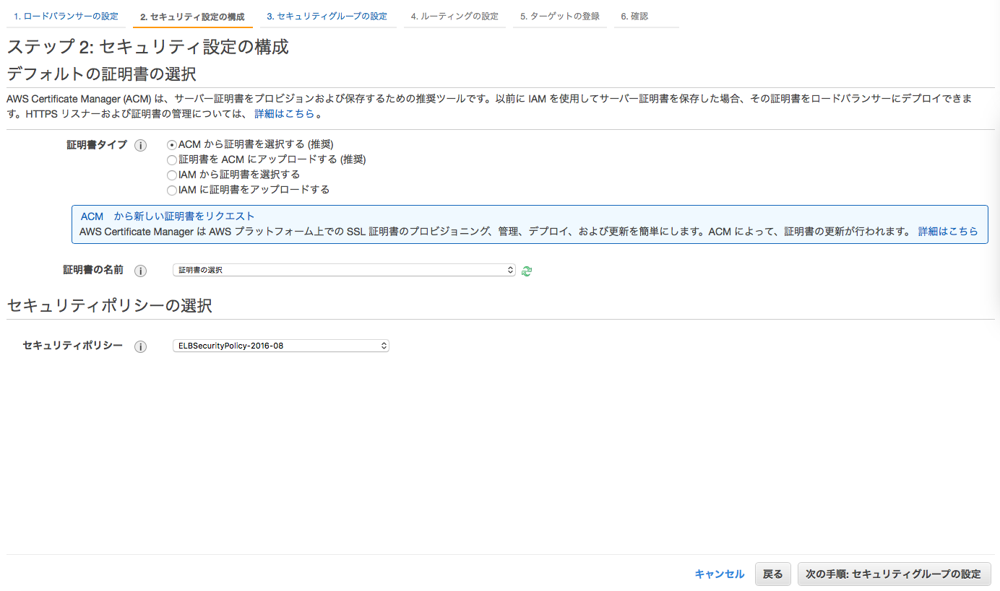
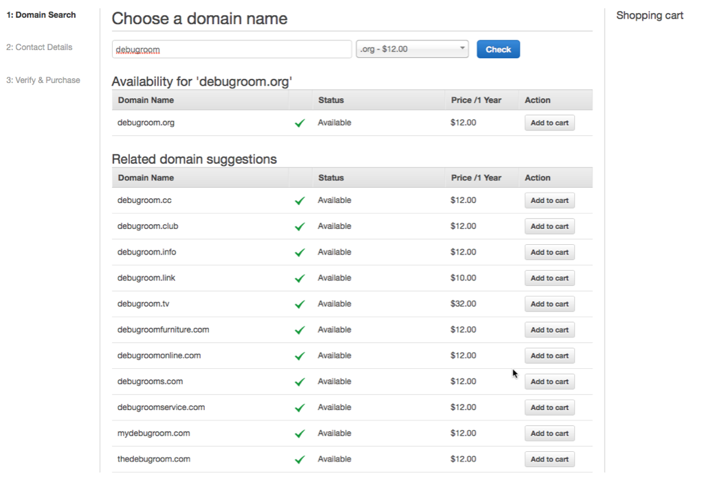
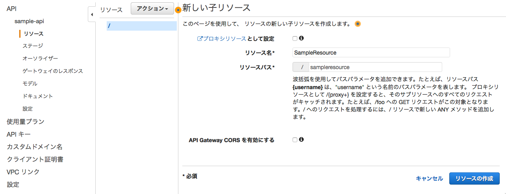

.. include:: ../module.txt

.. _section3-network-label:

Network Category
======================================================

.. _section3-1-vpc-label:

Virtual Private Network(VPC)
------------------------------------------------------

.. _section3-1-1-vpc-overview-label:

Overview
^^^^^^^^^^^^^^^^^^^^^^^^^^^^^^^^^^^^^^^^^^^^^^^^^^^^^^

Aamazon VPCはAWS上に占有可能なプライベートネットワークを構築するためのサービスである。
AWSパブリッククラウド上に利用者独自の仮想プライベートネットワークを構築し、
仮想サーバの「EC2」やデータベース「RDS」といったAWSのリソースを配置する。Amazon VPCはVPNを通じてオンプレミスとの接続も可能である。
VPCはリージョン単位で作成でき、VPC内にはリソースへのアクセス制御を主な目的とする、複数のサブネットを作成できる。VPCを作成する際に、CIDR表記に沿って一連のIPアドレスを指定する。

.. note:: VPCは１リージョン内に構築される。リージョンをまたいで別のVPCと通信したい場合は、インターリージョンVPCを使うと、一部のリージョン同士でVPC間の相互接続が可能である。

.. note:: VPCは複数のアベイラビリティゾーンを跨ぐことはできるが、サブネットは各アベイラビリティゾーン毎に作成する必要がある。

.. warning:: VPC内のアドレスはCIDRが/16か/28の間で使用できる。ただし、以下の通り、各サブネットの最初の４アドレス、最後の1アドレスは使用不可のため注意。

   * XXX.XXX.XXX.0 (ネットワークアドレス用)
   * XXX.XXX.XXX.1 (VPCルータ)
   * XXX.XXX.XXX.2 (Amazon Provided DNS)
   * XXX.XXX.XXX.3 (予備)
   * XXX.XXX.XXX.255 (ブロードキャストはサポートしていないが予約)

   CIDRは一度作成すると変更することができないが、2017年10月よりVPCに割り当てるCIDRが拡張可能となった。

.. note:: EC2、RDS、ELBはVPC内のサービスであるが、S3や DynamoDB、SQS等のサービスはリージョンで提供されるサービスである。そのため、リージョンサービスに接続が必要なEC2は、通常VPC外への接続口を確保する必要があるが、S3とDynamoDBは接続のためのVPCエンドポイントが提供されている。
   VPCエンドポイントには2種類あり、ゲートウェイ型エンドポイント、インターフェース型エンドポイントの２種類ある。`サポートされるサービス <https://docs.aws.amazon.com/ja_jp/vpc/latest/userguide/vpc-endpoints.html>`_ ごとにエンドポイントを選択する。

VPCリソース間の通信はルートテーブルというルールセットでアクセス制御する。VPCを作成すると通常同時にメインルートテーブルが作成されるが、追加でカスタムルートテーブルを作成し、サブネット間のアクセス・通信制御を行う。

.. note:: VPC内の各サブネットはルートテーブルに関連づけられる必要がある。サブネットを特定のルートテーブルに明示的に関連付けていない場合、サブネットは自動的にメインルートテーブルに暗黙的に関連づけられる。１つのサブネットに同時に複数のルートテーブルを関連づけることはできないが、複数のサブネットを１つのルートテーブルに関連づけることはできる。

AmazonVPCは「セキュリティグループ」と「ネットワークACL」の2つのフィルタリング機構によって不要な通信をブロックし、
セキュリティを強化できる。

セキュリティグループは、EC2やRDSなどのAWSリソースに関連付けることで、ファイアウォールとして動作する。
受信と送信の両方をリソースレベルで制御でき、リソースをグループ化し、共通のセキュリティグループを関連付けることもできる。
一般的なファイアウォール同様、ステートフルに動作し、発生した通信に対する応答通信は自動的に許可される。

ネットワークACLはIPサブネットに関連付けられ、受信と送信の両方をIPサブネットレベルで制御する。
関連付けられたIPサブネット全てに適用されるのでセキュリティグループより広範囲な制御設定が可能であるが、
セキュリティグループとは異なりステートレスに動作するため、応答通信にも許可の設定が必要
(戻り宛先のIPとポートが必要：ポートは特定できないので事実上任意設定)となることに注意が必要である。

.. note:: セキュリティグループは許可設定しかできないので、特定のクライアントのアクセスをブロックしたいときはネットワークACLを使う。

VPC内のリソースが外部通信する際は、ネットワークゲートウェイをVPCに設置するが、

* インターネットゲートウェイ
* 仮想プライベートゲートウェイ
* VPCピア接続

の3種類がある。

インターネットゲートウェイは文字通りインターネットとの通信であるが、通信元のAWSリソースがパブリックIPアドレスを持っている必要がある。
パブリックアドレスは動的に割り当てられるものと、固定的に割り当てられるものがある。後者を「Elastic IP Address」と呼ぶ。
インターネットゲートウェイは定義としては1つの機器のように扱われるが、内部的に冗長化されており、
通信が増加した際には自動的にスケーリングされる。またシステムの保守作業で最新のミドルウェアやセキュリティパッチを入手する際も
インターネットゲートウェイの設置が必須になるので、閉塞したネットワークの際は考慮が必要である。

仮想プライベートゲートウェイはVPCとオンプレミス環境をVPN接続するためのネットワークゲートウェイである。
インターネットゲートウェイ同様、冗長化構成をとる。動的ルーティングと静的ルーティング両方をサポートし、
動的ルーティングではBGPピア接続を利用して、オンプレミスと接続する。ユーザ側のリモートエンドポイントで
BGPアドバタイズにより、ルーティングの優先順位、ポリシーなど設定できる。
静的ルーティングにおいて、オンプレミス環境では、VPN通信が行えるルーターと、接続を許可するIPアドレスの設定のために、固定的なパブリックIPアドレスが必要になる。

VPCピア接続はそれぞれ独立した仮想プライベートネットワークである2つのVPCを接続し、
プライベートアドレスで相互に通信する。こちらもインターネットゲートウェイ、仮想プライベートゲートウェイと同様、
冗長化構成をとる。自分が所有しているVPCだけではなく、同じリージョンの別アカウントのVPCとも接続ができる。
ただし、接続できるのはVPCの範囲内に限られ、接続先のVPCとVPN接続されているネットワークには接続できない。

.. note:: VPC Peeringでは、2017年に海外のリージョンに接続可能なInterーRegion Peeringが利用可能である。Inter-Region Peeringでは、Amazon Globl Network経由でリージョン間接続を行う(インターネットを使った通信ではない)。

VPC接続の主な用途としては、複数システムでのデータ共有や監視システムの統合があげられる。

.. note:: VPCピア接続には以下のルールと制限がある。

   * VPCの送信単位(MTU)は1500バイトである。
   * VPCの送信単位はリージョンが異なるVPCピア接続はできない。
   * また、２つの同じVPCで複数のVPC接続もできない。

.. note:: プライベートサブネット内にあるインスタンスがインターネットなど外部通信する必要がある場合は、パブリックサブネットにNAT用のEC2インスタンスを配置するか、VPC NAT ゲートウェイを使うオプションがある。

   .. list-table:: VPC NAT ゲートウェイとNATインスタンスの違い
      :widths: 2, 4, 4

      * - 観点
        - VPC NAT ゲートウェイ
        - NAT インスタンス

      * - 可用性
        - デフォルトで可用性高い
        - 個別スクリプトでフェイルオーバーを管理

      * - 帯域幅
        - 10Gbpsでバースト
        - インスタンスの帯域幅に依存

      * - メンテナンス
        - AWS管理
        - ユーザが管理

      * - セキュリティ
        - ネットワークACL
        - セキュリティグループ、ネットワークACL

      * - ポートフォワーディング
        - サポートなし
        - サポートあり

.. note:: VPC内のトラフィックログを収集する場合は、VPCフローログ機能(コンソール>VPC>フローログタブ)を利用すること。

.. _section3-1-3-create-vpc-label:

VPCの構築
^^^^^^^^^^^^^^^^^^^^^^^^^^^^^^^^^^^^^^^^^^^^^^^^^^^^^^

■AWSコンソールから、「VPC」サービスを選択し、「VPCを作成」ボタンを押下する。

   .. figure:: img/management-console-vpc-create-vpc-1.png

■以下の通り、VPCの設定値を入力して、「create」ボタンを押下する。

* Name Tag：任意の名前
* IPv4 CIDR block：XXX.XXX.XXX.XXX/16-28
* IPv6 CIDR block：No IPv6 CIDR Block
* Tenancy :Default

.. _section3-1-4-create-subnet-label:

サブネットの作成
^^^^^^^^^^^^^^^^^^^^^^^^^^^^^^^^^^^^^^^^^^^^^^^^^^^^^^

■AWSコンソールから、「VPC」サービスを選択し、「サブネット」メニューを選び、「サブネットの作成」ボタンを押下する。

   .. figure:: img/management-console-vpc-create-subnet-public-1.png

■以下の通り、パブリックサブネットの設定値を入力して、「作成」ボタンを押下する。

* 名前タグ：任意の名前
* VPC：サブネットを作成するVPCを選択
* アベイラビリティゾーン：サブネットを設定するアベイラビリティゾーンを設定
* IPv4 CIDRブロック：サブネットに割り当てるIPv4 CIDRブロック

.. _section3-1-5-create-ibgw-label:

インターネットゲートウェイの作成・アタッチ
^^^^^^^^^^^^^^^^^^^^^^^^^^^^^^^^^^^^^^^^^^^^^^^^^^^^^^

パブリックサブネットにアタッチするための、インターネットゲートウェイを作成する。

■AWSコンソールから、「VPC」サービスを選択し、「インターネットゲートウェイ」メニューから、「インターネットゲートウェイの作成」ボタンを押下する。名前タグを入力して、「作成」ボタンを押下する。

   .. figure:: img/management-console-vpc-create-igw-1.png

■作成したインターネットゲートウェイを選択し、「アクション」ボタンから「VPCにアタッチ」を選択し、アタッチするVPCを選択する。

   .. figure:: img/management-console-vpc-attach-igw-1.png

.. _section3-1-6-edit-routetable-label:

ルートテーブルの編集
^^^^^^^^^^^^^^^^^^^^^^^^^^^^^^^^^^^^^^^^^^^^^^^^^^^^^^

アタッチしたインターネットゲートウェイの設定をルートテーブルに追加する。

■AWSコンソールから「VPC」サービスを選択し、「ルートテーブル」メニューを選択する。作成したVPCに関連付けられているルートテーブルを選択し、「Route」タブから「Edit Routes」ボタンを押下する。

   .. figure:: img/management-console-vpc-edit-routetable-1.png

■「Add Route」ボタンを押下し、アウトバウンドトラフィック「0.0.0.0/0」に作成したインターネットゲートウェイを設定する。

   .. figure:: img/management-console-vpc-edit-routetable-2.png

.. _section3-1-7-elastic-ip-address-label:

Elastic IP Address
^^^^^^^^^^^^^^^^^^^^^^^^^^^^^^^^^^^^^^^^^^^^^^^^^^^^^^

前節「 :ref:`section3-1-1-vpc-overview-label` 」でも述べた通り、IPアドレスは動的に割り当てられるものと固定で割り当てられるElastic IP Addressがあり、EC2インスタンスではデフォルトで動的なIPアドレスが割り当てられるが、稼働中のEC2インスタンス１つにつき、１つのElastic IP Addressを割り当てることができる。

.. warning:: Elastic IP Addressは最大５つまで確保でき、別途申請することでそれ以上のIPアドレスを確保することができる。ただし、EC2インスタンスやネットワークインターフェースと１つも紐づけていないIPは課金対象となるので注意すること。

.. note:: Elastic IPアドレスの設定

   Elastic IP Addressを割り当てるにはコンソール画面のElastic IPメニューから、「新しいIPアドレスの割り当て」を選択すると、新しく固定IPアドレスが獲得できる。

   .. figure:: img/management-console-elastic-ip-address-1.png

   .. figure:: img/management-console-elastic-ip-address-2.png

   獲得した固定IPアドレスを稼働中のEC2インスタンスに割り当てる場合は、「アクション」ボタンからアドレスの関連付けを選択し、割り当てるEC2インスタンスIDを指定する。

   .. figure:: img/management-console-elastic-ip-address-3.png

.. _section3-1-8-create-vpc-with-public-private-subnet-label:

パブリックサブネットとプライベートサブネットをもつVPCの構築
^^^^^^^^^^^^^^^^^^^^^^^^^^^^^^^^^^^^^^^^^^^^^^^^^^^^^^^^^^^^^^^^^^^^^^^^^^^^^^^^^^^^^^^^^^^^^^^^^^^^

.. note:: この方法でVPCを作成する場合は、事前にNATゲートウェイに設定するElasticIPアドレスを取得しておくこと。

■AWSコンソールから、「VPC」サービスを選択し、「VPCダッシュボード」メニューから、「VPCを作成」ボタンを押下する。

   .. figure:: img/management-console-vpc-create-vpc-public-private-subnet-1.png

■以下の通り、VPCのCIDRや、パブリック、プライベートサブネットのCIDR、NAT Gatewayに割り当てるElasticIPアドレスを設定する。

   .. figure:: img/management-console-vpc-create-vpc-public-private-subnet-2.png

.. _section3-2-direct-connect-label:

Direct Connect
------------------------------------------------------

Direct ConnectはVPCとオンプレミス環境をプライベートに接続するためのサービスであるが、より高速で安定的な通信が特徴になっている。
同様のサービスとしてはVPC内の仮想プライベートゲートウェイが利用できるが、通常のインターネット回線を用いるため、
帯域幅の制限があり、そうした問題をクリアするためのサービスと捉えてよい。Direct Connectは「Direct Connectロケーション」と呼ばれる
AWSの各リージョンに対する接続ポイントを提供する。オンプレミス環境と接続ポイントを経由したVPCの間は、
IEEEによって標準化されたネットワーク規格である「802.1Q VLANタンキング」を用いて、論理的な接続経路を構築する。
接続ポイントとオンプレミス環境は通信キャリアが提供している閉域網サービスが必要なため、通信キャリアとの契約が必要である。
通信キャリアのサービスには、接続ポイント内の物理接続を占有して提供する「占有プラン」と、物理接続を複数のユーザで共有し、
その物理接続を通る論理接続を払い出して提供する「共有プラン」の2パターンが存在する。

占有プランは高価だが、論理接続を自由に作成できるので、多数のVPCをオンプレミス環境に接続したい場合は有用である。
共有プランは安価だが論理接続ごとに費用が発生する。

.. note:: 2017年10月にDirect Connect Gatewayがリリースされ、1つのprivate VICで複数のVPC接続が可能になる。Direct Connect Gatewayを経由して、Amazon Global Networkを利用して他リージョンのVPCにアクセスすることも可能である。
   例えば東京にあるオンプレのデータセンタからオレゴンリージョンのVPCにアクセスする場合は、オンプレ⇔東京リージョンのDirectConnect⇔DirectConnectGateway⇔Amazon Global network⇔オレゴンリージョンのVPCとなる。(海外のリージョンのDirectConnectまで専用線まで繋げる必要はない)

.. _section3-3-elastic-load-balancing-label:

Elastic Load Balancing(ELB)
------------------------------------------------------

.. _section3-3-1-elb-overview-label:

Overview
^^^^^^^^^^^^^^^^^^^^^^^^^^^^^^^^^^^^^^^^^^^^^^^^^^^^^^

Elastic Load BalancingはAWS内で利用できる仮想ロードバランサーで以下の様な特徴を持つ。

* ELB自体のスケーリング
* ヘルスチェック
* クロスアベイラビリティゾーン負荷分散
* Proxy Protocolヘッダーの利用
* スティッキーセッションサポート
* ConnectionDraningサポート
* 従量課金性
* 運用管理の容易性

ELBはアプリケーショントラフィックの増減にあわせて自動的にスケーリングを行う。定義上ELBは1つの機器のように扱われるが、内部的には複数のリソースで構成されており、負荷に合わせて自動的にELBを構成する。
負荷が増えるとELBリソースを追加してスケールアウトしたり、ELBリソースの性能を向上させてスケールアップするが、逆に負荷が減少するとELBのリソースを削除したり、スケールダウンを行う。
ELBは定期的に分散するEC2へpingを送信し、HTTPステータスコード200が応答されると、インスタンスは正常だと判断する。複数のアベイラビリティゾーンを跨いだ分散が可能だが、各アベイラビリティゾーンに均等にバランスされるため、
バックエンドインスタンスが 各アベイラビリティーゾーンのリクエストロードを処理できるようにするには、各ゾーンにほぼ同じ数のインスタンスが存在することが重要である。

Proxy Protocolヘッダーは、TCP/SSL接続に設定されたロードバランサーを使用する場合、クライアントのIPアドレスを識別するのに役立つ。ロードバランサーはクライアントとバックエンドインスタンス間のトラフィックを傍受するため、
バックエンドインスタンス内のアクセスログには、発信元クライアントのIPアドレスでなく、ロードバランサーのIPアドレスが含まれている。Proxy Protocolを有効化すると、ロードバランサーは、
発信元 IP アドレス、送信先 IP アドレス、およびクライアントのポート番号などの接続情報が含まれる、人間が読んで理解できるヘッダーが追加されるようになる。ヘッダーはその後、リクエストの一部として
バックエンドインスタンスに送信され、リクエストの1行目を解析して、クライアントのIPアドレスとポート番号を取得することができる。

スティッキーセッション機能 (セッションアフィニティとも呼ばれる) を使用することによって、ロードバランサーがユーザーのセッションを特定のアプリケーションインスタンスにバインドするように設定できる。
これにより、セッション中にそのユーザーから来たリクエストをすべて同じアプリケーションインスタンスに送信でき、ブラウザのWebSocket接続機能を利用できる。

ConnectionDraining機能を活用することにより、EC2インスタンスをスケールインする場合、特定のドレインのための時間を設けることで安全なスケールインが可能になる。

ELBは従量課金性で、使用時間と処理データ量の組み合わせで料金が決定する。そのためスケールの状況によって変化しない。また、ファームウェアの更新はAWSにより行われるため、容易に運用管理を行える。
その他、ELBはSSLターミネーションとアクセスログ取得機能を持つ。SSLターミネーションは通信の暗号化処理を行い、サーバ側のパフォーマンス向上に寄与する。
アクセスログはロードバランサーで一括して収集を行うことでEC2インスタンスに分散してログ収集を行わずにすむ。

.. _section3-3-2-clb-and-alb-label:

Classic Load Barancing と Application Load Barancing、Network Load Barancing
^^^^^^^^^^^^^^^^^^^^^^^^^^^^^^^^^^^^^^^^^^^^^^^^^^^^^^^^^^^^^^^^^^^^^^^^^^^^^^^^^^^^^

ELBでは、ロードバランシングサービスの１つとして「Application Load Balancer（ALB）」が提供されている。
代表的な機能としては、パケットの内容に応じたコンテントベースのルーティングで、レイヤー7（L7）スイッチが備える機能を持つ。
従来のロードバランシングサービスELBは「Classic Load Balancer（CLB）」という名称に変更された。
ELBは、新しいALBと従来のCLB、後述するNLBを合わせたロードバランシングサービスの総称として表現される。

ALBでは、その他にも、以下の特徴をもつ。

* パスベースルーティング
* コンテナ化されたアプリケーションのサポート
* HTTP/2サポート
* WebSocketサポート
* StickySessionの強化
* ヘルスチェックの強化
* インスタンスのヘルスチェックは従来通りHTTP/HTTPSでping
* レスポンスコードの指定（200〜299複数）
* CloudWatchのメトリクス強化（ターゲットグループ単位とか）

ALB、ELBはリバースプロキシ型の負荷分散サービスを提供する一方、もっとも最新のNLBはL4 NATロードバランサである。特徴としては、

* 固定IPアドレス
* Pre-warming申請不要
* ゾーナリティ
* Source Address Preservation
* フェイルオーバーに対応

などがある。各ロードバランシングサービスの比較は `Elastic Load Balancing 製品の詳細 <https://aws.amazon.com/jp/elasticloadbalancing/details/#compare>`_ に詳細がまとめられている。

.. note:: ロードバランサーはマルチリージョンで負荷分散を行えるが、実態としては各アベイラブルゾーンに配置され、各々IPが設定される。そのため、ELBエンドポイントというパブリックなDNS名を持ち、各IPは同一のELBエンドポイントに紐付けられる形になる。

.. note:: VPCサブネットではロードバランサ用にプライベートIPを複数確保（余裕を持ってサブネットをきっておく）しておくこと。

.. note:: 従来のロードバランサのDNSに割り振られるグローバルIPは動的に変更されるので、IPアドレスを直接指定してロードバランサに振り分けることは難しかったが、NLBでは固定のIPとなる。

.. _section3-3-3-alb-setting-label:

ALBの設定
^^^^^^^^^^^^^^^^^^^^^^^^^^^^^^^^^^^^^^^^^^^^^^^^^^^^^^

ここでは、ロードバランシングサービス利用の一例として、ALBの設定を行う。

1. EC2コンソールメニューから、ロードバランサを選択し、「ロードバランサの作成」をクリックする。

2. 「アプリケーションロードバランサ」を選択する。

3. ロードバランサの以下の設定項目を入力する。

.. figure:: img/management-console-application-load-balancing-setting-3.png

* 名前：ALBの名称
* スキーム：ロードバランサーのタイプを選択する。外部からのアクセスかAPサーバ等の内部ネットワークからのアクセスか。
* リスナー：プロトコルを指定する。http or HTTPS
* アベイラビリティゾーン：ALBを配置するアベイラビティゾーンを選択。２箇所以上が必須。

4. 証明書・セキュリティポリシーの設定。

* 証明書タイプ：設定する証明書のタイプを指定する。 :ref:`section7-2-2-acm-request-certication-label` にて作成した証明書を使用
* 証明書の名前：証明書をプルダウンから選択
* セキュリティポリシー： `フロントエンド接続に使用するセキュリティポリシー <http://docs.aws.amazon.com/ja_jp/elasticloadbalancing/latest/application/create-https-listener.html>`_ を選択

5. セキュリティグループの設定

.. figure:: img/management-console-application-load-balancing-setting-5.png

6. ルーティングの設定

ロードバランサーからディスパッチするサーバのインスタンスグループを指定する。

.. figure:: img/management-console-application-load-balancing-setting-6.png

* 名前：任意のターゲットグループ名(xxx-app-alb等)
* プロトコル：HTTP/HTTPS(ロードバランサーでSSL Terminationを行う場合はHTTPでよい)
* ヘルスチェックプロトコル：HTTP/HTTPS(ロードバランサーでSSL Terminationを行う場合はHTTPでよい)
* ヘルスチェックパス：ヘルスチェックを行うURLでドメイン名以下のパス
* ヘルスチェックの詳細設定：任意

7. ターゲットの登録

インスタンスグループに登録するターゲットを指定。

.. figure:: img/management-console-application-load-balancing-setting-7.png

確認ボタンを押下し、ALBを作成する。

8. スティッキーセッションの設定

セッションがサーバ固有のものを使用しているアプリケーションやWebSocketアプリケーションなど、
スティッキーセッションを維持する必要があるものは、ターゲットグループからスティッキーセッションの設定を行う。

EC2コンソールから、メニュー「ターゲットグループ」を選び、「属性」オプションを選択する。

.. figure:: img/management-console-application-load-balancing-setting-8.png

「ロードバランサーによって生成されたCookieの維持を有効化」にチェックを入れ、維持期間を設定する。

.. figure:: img/management-console-application-load-balancing-setting-9.png

.. _section3-4-route53-label:

Route53
------------------------------------------------------

.. _section3-4-1-route53-overview-label:

Overview
^^^^^^^^^^^^^^^^^^^^^^^^^^^^^^^^^^^^^^^^^^^^^^^^^^^^^^

Route53はAWSが提供するDNSサービスで、世界37カ国に配置された高い可用性と100%のSLA保証が大きな特徴である。
Route53は以下のルーティングをサポートする。

.. list-table:: Route53のルーティングサポート
   :widths: 3, 7

   * - シンプルルーティング
     - 単一のサーバ向けのルーティング

   * - 加重ラウンドロビン
     - 頻度を指定するために、リソースレコードセットに重みを割り当てる

   * - レイテンシールーティング
     - 世界中で使用されるアプリケーション向けに、AWSエンドポイントのうち、レスポンスが最速のものにルーティングする。

   * - ヘルスチェック及びDNSフェイルオーバー
     - プライマリアクセスサイトがアクセス不能になった場合、バックアップサイトへフェイルオーバーする

   * - 位置情報ルーティング
     - ユーザの地理的場所(DNSクエリの送信元の場所)を大陸別、国別、米国の州別に指定する

また、他のAWS同様、REST APIによるサポートがあり、ドメインやホストの追加・削除、設定内容の変更がプログラムからも実行可能である。
また、マルチリージョンで複数のホストへバランシングする際、レイテンシー（より物理的に距離が近いほうのホスト）ルーティングする機能や、
ホストサイトへヘルスチェックして、応答がない場合、S3等セカンダリサイトへ フェイルオーバーできる機能を持つ。

.. note:: Route53では、AWSマネジメントコンソール及びAPIからドメインの購入・登録ができる。既に登録済みのドメインを登録しても、レジストラ(ドメインの登録業者)から購入してRoute53へ登録しても良いが、Route53経由で登録した場合、ドメインの詳細情報をAWSマネジメントコンソールから一括で確認できる。

.. _section3-4-2-route53-registration-label:

ドメインの登録
^^^^^^^^^^^^^^^^^^^^^^^^^^^^^^^^^^^^^^^^^^^^^^^^^^^^^^

Route53を利用して、ドメインを登録する。トップページのRoute53によるドメイン登録を選択する。

.. figure:: img/management-console-route53-registration-1.png

登録したいドメインが利用可能かチェックを行う。カートに追加すると、どのくらいの期間ドメインを利用するか選択する。

ドメインの管理者の連絡先情報を入力する。入力したメールアドレス宛に認証のためのメールが届くため、メール記載のリンクを押下して認証を行う。

.. figure:: img/management-console-route53-registration-3.png

登録依頼が完了すると、下記の画面が表示される。

.. figure:: img/management-console-route53-registration-4.png

Route53ダッシュボードに移動すると、申請したドメインの登録情報に関するステータスが表示される。

.. figure:: img/management-console-route53-registration-5.png

登録が完了(完了画面では最大3日程度と書かれているが、今回は1時間程度で完了した)すると、管理者宛のメールアドレスに登録完了のメールが送付され、ダッシュボードの表示が切り替わる。

.. figure:: img/management-console-route53-registration-6.png

.. _section3-4-3-route53-domain-setting-label:

登録したドメインとElastic IPアドレスの紐付け設定
^^^^^^^^^^^^^^^^^^^^^^^^^^^^^^^^^^^^^^^^^^^^^^^^^^^^^^^^^^^^^^^^^^^^^^^^^^^^^^^^^^^^^^^^^^^^^^^^^^^^^

前節「 :ref:`section3-4-2-route53-registration-label` 」に続き、登録したドメインを「 :ref:`section3-1-7-elastic-ip-address-label` 」にて設定したElastic IP Addressに紐づける設定を行う。Route53ダッシュボード画面からDNS ManagementにあるHosted zonesを押下する。

.. figure:: img/management-console-route53-registration-6.png

対象のドメインにチェックを入れ、「Go to Record Sets」ボタンを押下する。

.. figure:: img/management-console-route53-setting-domain-1.png

以下の要領で、Create Record SetにドメインとIPアドレスを設定する。

.. figure:: img/management-console-route53-setting-domain-2.png

.. list-table:: Create Record Setの設定値
   :widths: 3, 7, 3

   * - 設定値
     - 説明
     - IPv4設定値サンプル

   * - Name
     - ドメイン名の接頭辞となるホスト名を指定
     - www
   * - Type
     - レコードタイプを指定する。 |br| Aレコード：ドメインとIPアドレスを指定 |br| AAAAレコード：ドメインとIPv6アドレスを設定 |br| PTRレコード：ドメインとIPアドレスの逆引き設定 |br| MXレコード：メールサーバの設定 |br| NSレコード：DNSレコードを設定
     - A IPv4アドレス
   * - Alias
     - 他のレコードの設定を参照する場合Yes
     - No
   * - TTL
     - キャッシュの有効期間を設定
     - 300
   * - Value
     - Aレコードの場合IPアドレス
     - XXX.XXX.XXX.XXX
   * - Routing Policy
     - 複数のIPアドレスを同一のホスト名で指定する場合、 |br| 優先対象を指定
     - Simple

.. note:: 既に登録されている２つのレコードのうち、「NSレコード」はゾーンを担当するDNSサーバー群（Route53サービスで「Name Servers」として表示されているものと同じ）を、 「SOAレコード」はゾーンを設定する管理者やキャッシュのデフォルト有効期限などを設定するものである。

.. note:: TTLの設定はキャッシュの更新時間であるため、間隔が長ければ長いほど、パフォーマンスは良くなるが、変更時の反映時間が長くなることがトレードオフとなる。

.. note:: マルチリージョンで同一のドメイン名で異なるサイト・アプリケーションをホストする場合は、Route53でそれぞれのロードバランサー等登録しておけば、低レイテンシー(より早くアクセス可能)な方を選択し、解決してくれる。

Createボタンを押下すると、設定が反映される。しばらく時間が経過したのち、指定したドメイン名でサーバにアクセス可能か確認を行う。

.. sourcecode:: bash

   ssh -i /Users/username/.ssh/キー名.pem ec2-user@設定したドメイン名

.. _section3-4-3-route53-healthcheck-label:

ヘルスチェックの設定
^^^^^^^^^^^^^^^^^^^^^^^^^^^^^^^^^^^^^^^^^^^^^^^^^^^^^^^^^^

.. todo:: マルチリージョンフェイルオーバーの設定を記述。

.. _section3-5-transit-gateway-label:

Transit Gateway
------------------------------------------------------

|br|

Transit Gatewayは従来VPC間でPeering接続していた代わりにTransitGatewayがハブとなり、VPC間の接続を行うリージョンサービスである。
親アカウントにTransitGatewayを作成しておくと、親アカウントに紐づく複数の子アカウントに作成したVPCのピア接続が可能になる。
DirectConnectGatewayとも連携し、他リージョンにある子アカウントと接続することもできる。

|br|

.. _section3-6-api-gateway-label:

API Gateway
------------------------------------------------------

.. _section3-6-1-api-gateway-overview-label:

Overview
^^^^^^^^^^^^^^^^^^^^^^^^^^^^^^^^^^^^^^^^^^^^^^^^^^^^^^

API GatewayはAPIの作成、公開やリクエストのモニタリング等の管理を行うサービスである。作成可能なAPI種類として以下の３種類がある。

* GET、POST、PUT、PATCH、DELETEなどの標準HTTPメソッドを用いたリソースベースのステートレスな通信を実現するREST API
* より低コストで低レイテンシーなHTTP API
* クライアントとの双方向通信を実現するWebSocket API

REST APIとHTTP APIの違いについては `HTTP API または REST API の選択 <https://docs.aws.amazon.com/ja_jp/apigateway/latest/developerguide/http-api-vs-rest.html>`_ にも記載されているが、
HTTP APIはネイティブなOpenID Connect / OAuth 2.0 のオーソライザのサポートとバックエンドにプライベートなALBをVPCリンクを介して接続できるなどの特徴が目立つ。
反面、2020年6月現在では、AWS LamndaやIAMはオーソライザとしてサポートされていないので、ユースケースに応じて、利用するAPIを使い分けると良い。

|br|

.. _section3-6-2-create-rest-api-label:

REST APIの作成
^^^^^^^^^^^^^^^^^^^^^^^^^^^^^^^^^^^^^^^^^^^^^^^^^^^^^^

|br|

マネジメントコンソール上からAPI Gatewayを選択し、API名を入力した上で「新しいAPIの作成」ボタンをクリックする。

|br|

.. figure:: img/management-console-apigateway-create-1.png

|br|

RESTのリソースとして返却するモデルの名称とリソースパスを定義する。

|br|

|br|

RESTのリソースに対するアクションを定義する。統合タイプとしてLambdaを選択し、実行するLambdaファンクションを入力する。Lambdaの作成方法については :ref:`section7-4-3-lambda-deploy-label` を参考にすること。

|br|

.. figure:: img/management-console-apigateway-create-3.png

|br|

RESTのリソースに対するアクションを定義する。

|br|

|br|

|br|

.. figure:: img/management-console-apigateway-create-6.png

|br|

.. figure:: img/management-console-apigateway-create-7.png

|br|

.. figure:: img/management-console-apigateway-create-resource-1.png

|br|

.. todo:: REST API の作成手順を最新化。

|br|

.. _section3-6-3-create-vpc-link-label:

VPC Linkの作成
^^^^^^^^^^^^^^^^^^^^^^^^^^^^^^^^^^^^^^^^^^^^^^^^^^^^^^

|br|

HTTP APIから特定のVPC内にあるPrivate ALBにアクセスするためのVPC Linkを作成する。このVPC LinkはENI(Elastic Network Interface)であり、ネットワークインターフェースは通常インスタンスなどにアタッチされ、
異なるネットワークへ繋げるための、仮想的なLinuxでいう論理NICに相当する。AWSコンソール上でAPI GatewayサービスからVPCリンクメニューを選択し、作成ボタンを押下する。

|br|

|br|

|br|

.. figure:: img/management-console-apigateway-create-vpclink-3.png

|br|

.. note:: REST APIのVPC LinkはVPCエンドポイントで有料となるので注意。

|br|

.. _section3-6-4-create-http-api-label:

インターナルALBに接続するHTTP APIの作成
^^^^^^^^^^^^^^^^^^^^^^^^^^^^^^^^^^^^^^^^^^^^^^^^^^^^^^

|br|

続いて、HTTP APIの作成を行うが、事前に :ref:`section3-2-2-ecs-create-cluster-label` を参考に、
HTTP APIで呼び出させれるECSクラスタ、タスク、サービスおよびBackend用のインターナルALBを作成しておくこと。

AWSコンソール上でAPI GatewayサービスからAPIメニューを選択し、「構築」ボタンを押下する。

|br|

.. figure:: img/management-console-apigateway-create-httpapi-1.png

|br|

API名を入力し、「次へ」ボタンを押下する。

.. note:: 統合にはプライベートリソースを選択するが作成時には選択できないため、特に設定せずいったん構築する。

|br|

|br|

「次へ」ボタンを押下する。

|br|

.. figure:: img/management-console-apigateway-create-httpapi-3.png

|br|

「次へ」ボタンを押下する。

|br|

.. figure:: img/management-console-apigateway-create-httpapi-4.png

|br|

続いてHTTP APIの接続先を統合する設定を行う。作成したHTTP APIを選択し、「統合」メニューで、「統合を管理」タブを選択し、「Create」ボタンを押下する。

|br|

.. figure:: img/management-console-apigateway-create-integration-1.png

|br|

プライベートリソースを選択し、統合のターゲットとして、インターナルなALBを選択する。

|br|

|br|

VPCリンクでは :ref:`section3-6-3-create-vpc-link-label` で作成したリンクを選択する。

|br|

|br|

APIの受け口となるパスを作成する。ECSコンテナでリクエストを受け付けるパスと同様のルートを設定する。

.. note:: パス変数は{}で指定すること。詳細は `HTTPルートの使用 <https://docs.aws.amazon.com/ja_jp/apigateway/latest/developerguide/http-api-develop-routes.html>`_ を参照のこと。

|br|

|br|

作成したルートに上述で作成した統合をアタッチする。

|br|

.. figure:: img/management-console-apigateway-attach-route-1.png

|br|

作成したHTTP APIを呼び出して、バックエンドのECSコンテナアプリケーションが実行され、レスポンスが返却されるか確認する。

.. sourcecode:: bash

   curl https://4jc6u6rpuk.execute-api.ap-northeast-1.amazonaws.com/backend/user/api/v1/users/0

.. _section3-6-4-create-authorizer-label:

HTTP APIの認証設定
^^^^^^^^^^^^^^^^^^^^^^^^^^^^^^^^^^^^^^^^^^^^^^^^^^^^^^

■続いて、上記で作成したAPIにAmazon Cognitoで作成したユーザに対してのみAPIが実行可能なように、IDトークンを使用した認証設定を行う。
事前に、 :ref:`section7-3-2-cognito-create-userpool-label` を参考にして、ユーザプールおよびユーザ、IDプールを作成しておくこと。

コンソールの「認可」メニューから、「オーソライザー」を管理タブを選択し、「作成」ボタンを押下する。
　

|br|

■以下の通り入力してアタッチする。

* オーソライザ名：任意の名前を入力
* IDソース：「$request.header.Authorization」を設定(この設定によりHTTPリクエストのヘッダにAuthorization属性でIDトークンを指定することにより認証が行われる)
* 発行者URL：https://cognito-idp.<region>.amazonaws.com/<userPoolID>
* 対象者：Coginitoで作成したアプリクライアントIDを指定

.. figure:: img/management-console-apigateway-create-authorizer-2.png

|br|

■アタッチすると、これまで実行できていたAPIが認証エラーになる

.. sourcecode:: bash

   curl https://4jc6u6rpuk.execute-api.ap-northeast-1.amazonaws.com/backend/user/api/v1/users/0
   {"message":"Unauthorized"}

|br|

■HTTPリクエストヘッダに付与するIDトークンの照会を行う。Amazon CLIで以下のコマンドを実行し、Cognitoで作成したユーザのIDトークンを取得する。なお、

* ユーザプールID
* アプリクライアントID
* ユーザ名
* パスワード

を適宜差し替えてコマンド実行すること。

.. note:: CLIを実行するユーザに事前にIAMでCognitoのアクセス権限(PowerUser)を付与しておくこと。

.. sourcecode:: bash

   aws cognito-idp admin-initiate-auth --user-pool-id ap-northeast-1_<UserPoolID> --client-id <AppClientID> --auth-flow ADMIN_USER_PASSWORD_AUTH --auth-parameters "USERNAME=<UserName>,PASSWORD=<Password>"

|br|

■初回アクセスの場合、以下のようなレスポンスが返却されて、パスワードの変更が必要になる。

.. sourcecode:: none

   {
       "ChallengeName": "NEW_PASSWORD_REQUIRED",
       "ChallengeParameters": {
           "USER_ID_FOR_SRP": "711e8fe5-bbc1-40a1-abbf-3c06931a0d04",
           "requiredAttributes": "[\"userAttributes.family_name\",\"userAttributes.given_name\",\"userAttributes.picture\"]",
           "userAttributes": "{\"email_verified\":\"true\",\"given_name\":\"\",\"family_name\":\"\",\"email\":\"<username>\",\"picture\":\"\"}"
       },
       "Session": "ZfKb47kDu1cS8wQKaizrsqGhwJ8OmtMnQoCz-cotKgOz9Ny_nfngacRIJPVGdDSMchIk6ttDO3IfFYeyafve1XYlYufP4lypu8DeGQhjCjlv-9f7Qw_dB8KColr7V7rdHp5aM4qefRIG1hwq4iBwYxzY90o_MQ6_Kbr5sWCBHVnbUPD5u4yBhkTniabO3zXkKX-IShmKqiZJahOrDPVkhOHhqLQIEYXjuCDOECNe8YYbzjAKObl3qCicrD62bkMGzm12bBzzmOmrVVOqb050S8pphYjtMJkLxDby4UOw9r0XdHiOcrldCYBZiNZJ1O0vk5f4L6nwi1FpQPD-pDBn_N5Ac6GA0Fk5to8myC0AS8fkYZp99TKKgu6PQWyQmyvrApHwZHJvGs-xkoUNNnlcjmXAYHvddDC7mVRp_q6ggVRlHl_7b6IZA_tINy8o1sfBPgpe5w_u2RamkNeQxIA6AFiC-fkfuZNbZZHmxLT1lv4EdTS_C8pLVAOSUp1r7PAM-Bv16kxANaPKADUsbB5EHm7QLpXcS4ORYcDLyaG1soJLxGHFMwQaIXQZgabs_7U61OsXHlup_6-A4Y1kHVFY0EH5f9Yi0HzYX6isSei63sMxtdPI9QK1__XiA_nxuo8dLdDmBLtMmGEgjv6pZCHwa2B0bixuZyuVkSRkRGALHPsBsqAUI0MoJsnAByR7L4s1xxIr8b-k2zBZ6p4-TVn8bQuZ2kfqMYIfqiIcBkrEXpa3rFNHYtyvnWYkIE2kb8ymtqmlnrnlVhKqT86y8PXkPDtIdjF3NL3gAIrQT81Z8d0E5uI-Vagf9fHvUKmmX9rPZvPGjl2UuKNekuh8dPPxGX6DH3EW27yHSE--_Tc7Cv4PBEpPH7lJjgVtZOeQ4APMh7BYZJSM_o2rhUinkZcl4IpEjuCNa3wnlyouCrfjbYNMXQZA_yFKNwXIIovIXNqJ4Q-PgX9tl0OZqIrmCJtkIXbm5el4VHZYmCE1L4jt6Vjm1Mh1ekc-8td8v8c73Dr53jI3E0znk_DbydFWQgT8b-iShdtdBI3x5yBPkw"
   }

以下のコマンドを実行し、ユーザ情報のアップデートを行うこと。ただし、

* ユーザプールID
* アプリクライアントID
* ユーザ名
* 新しいパスワード
* ユーザのサインアップ時に必須設定したパラメータ(ここの例では、given_name、family_name、picture)
* 上記のSession

を適宜変更して、コマンド実行すること。

.. warning:: ここでユーザ名は上記のレスポンスのUSER_ID_FOR_SRPの値を設定すること。

.. warning:: 必須設定のパラメータは「userAttributes.xxxxx」の形式で設定すること。

.. sourcecode:: bash

   aws cognito-idp admin-respond-to-auth-challenge --user-pool-id <UserPoolID> --client-id <AppClientID> --challenge-name NEW_PASSWORD_REQUIRED --challenge-responses "USERNAME=<UserName>,NEW_PASSWORD=<NewPassword>,userAttributes.given_name=<custom_name>,userAttributes.family_name=<custom_name>,userAttributes.picture=<custom_param>" --session "<Session>"

|br|

■正常に変更が完了すると、IDトークンやリフレッシュトークン、アクセストークンが得られる。

.. sourcecode:: none

   {
       "AuthenticationResult": {
           "ExpiresIn": 3600,
           "IdToken": "eyJraWQiOiI3RlRaSkVtd0c2aVltSnFQZHVoOXM1U1BMRklXVXA5akJ2K3BnVEdBSURzPSIsImFsZyI6IlJTMjU2In0.eyJzdWIiOiI3MTFlOGZlNS1iYmMxLTQwYTEtYWJiZi0zYzA2OTMxYTBkMDQiLCJlbWFpbF92ZXJpZmllZCI6dHJ1ZSwiaXNzIjoiaHR0cHM6XC9cL2NvZ25pdG8taWRwLmFwLW5vcnRoZWFzdC0xLmFtYXpvbmF3cy5jb21cL2FwLW5vcnRoZWFzdC0xX0ZFeEdwTFlPZCIsImNvZ25pdG86dXNlcm5hbWUiOiI3MTFlOGZlNS1iYmMxLTQwYTEtYWJiZi0zYzA2OTMxYTBkMDQiLCJnaXZlbl9uYW1lIjoia29oZWkiLCJwaWN0dXJlIjoidGVzdC5wbmciLCJhdWQiOiIzdmJzcDVjdDU2YjA2MmdkNjdkdmlkNTJhdiIsImV2ZW50X2lkIjoiMmU2YjljZTItZmYwMy00NDk5LThiMjItYTVlZDYxYmZiZjhmIiwidG9rZW5fdXNlIjoiaWQiLCJhdXRoX3RpbWUiOjE1OTI2Mzg4NzQsImV4cCI6MTU5MjY0MjQ3NCwiaWF0IjoxNTkyNjM4ODc0LCJmYW1pbHlfbmFtZSI6Imthd2FiYXRhIiwiZW1haWwiOiJrb2hlaS5rYXdhYmF0YUBtYWMuY29tIn0.cqLJnA6EhayzG-4r-ps-g8VOB4q-9fDLTRxvRmqfldSw3plZVplLcrdvns2ufIZ0fuG0FwoDqd5hXi0qFr87ETL7-UHsMe8kbuvIQxO1xnZ-OGzd07gvwlHg-p5hlctucftAleEm5IrHLvwr3gSN8Uttl-BvoQ_lauF-alu_P5R4wtAHJCeEU9TKJUBQa0i0F83v8Gm0a-S5ZHaibVxa5qv1J75SrHnaefdXmU6dUp39Lq74jhEuoF8-NoUxYPK9CYWnkIzf9yPRxORvBP9V0Pz5Gxl0b9yqpgh6fegxggvZIJiujoF8zyUwZaqHGGOseNcCJNlrCc_bo4L-eqwOVg",
           "RefreshToken": "eyJjdHkiOiJKV1QiLCJlbmMiOiJBMjU2R0NNIiwiYWxnIjoiUlNBLU9BRVAifQ.JV6kOU4TznCfBKl0rPr4yO0PEw7KK7xjuWzZV4SQT-C8RvQmk2VRGmGhgHAbTcWnGJkQ_itFeKHiE1g5lgD3CUHvbFchQD7YJaZFVYou8D0EJ00x0FT7heT1xffW3kxujIqg11HGl6vIYgEvHw_IY9ZpiVTv5B1P93mtDo5lIZiIWmndqMl71eokTE6STmUdrXz7kYly0AgOP04uIZmKHv_1bckWlM1THmViQcvsUOCyUdSpK3oKKrrVda5oUEFErIf-X0To2LobGZ0SsD6u9__-mJqtZznX8Rd5zsd4XsfV73gypZsscZhi342MNqwxi74a9p7GGL3LmZjkEStUwA.MlmjHNrteAOsiZ2d.r8oKnpf2AT-IPINgeFfOUZCaEQelLzJbZfgsGlnAq0xHDTl62VlurPAr9BfEaIOyfb8uw92yMDdq98kPjQ313e2G9LDzQddc2fMB83jZww6sDQljYCtmLJEkZ0z6LnDunAdB7ZShBZTLJ77EDqVEjzCqUd6kRiPM_T7G_GxGYE4bh2W6A4ut0OW4AL6-zbAPR2hoqSjbvqjs5P44utvVbM0Fp8tzR3F9Yl-jaHp_0nCOaNun0crIjDX7d0y1aihl2-Rm7Uts2t4NyH5dzZnWreg_BwXUVNmXBB8dxTJ8C-USsvlV0WAw15VYHzV4lyZJkG6oe_igin0E5t40tvvVxOsDWMu7o0WVFC7FYrrDT3uXZ7sNm5EJSWODEIi5os212-4saxeRPRuc12MBG3W6z5hynPzNdflDmDWNUByyWKd4CsS4Yg9AjPROQSl0xU20HHM3PMF8O6go_k9CIAhwL8odRqR__hUBga8L4_2pKIUkq8ph2N6pMjgaJlYRihNn8ZFgGAMLyYjDn0MA_gsBQVxVdDjBMavPy2-OJNU4widQ_89Hqt0lAD1z_jK7_VF_LDQYvx2OBYk4S5-5jim8__2eVBlJeHeoY2g0ZaPbTnNpcrQSWRPZDWEYxXpSz1lWKydosKZQwmZmaZoZC-B7i8J9zWTbjUW4n8pBWb65Kj4bqzpEV2GCIKQfNcPD6LJqqhiC-p0-tvM6bEe-rNQfmr0r6lj7lsR2OiQzgRzR5UejvnYmKrqW9bQEFAVde2LEwLCHyB5x5knF-WtnO32u49z2VTSYGQL_Fe-kWXGYDjfMWqlFBwGVisM44hwqdAmSlx7N4pXpdnEDmN2WfU22tScu2Iqf9O7T_6vIKRXcr5MKkY4rFdBEaWllozBU4VPHAuznPVCaOsHOQHk5hsO_-pgaihuor-U-XHsZBO8KnsdwBe6En-Cp_569ICBKNw9U26sT2MEZ1Grxkw9Saf-tyIFL5xmmxe5InY3-5WSWBiDdr89Iuu-RvBfLeiWry_JjvvMO9NfgEaFItIim0s3kta22_nFFVJNDAwi_r9ybDwe09r5OLFTyhE7hfRgmxYldDRVe9m9t9LX84oe0jF7CdjAnTlf23mnPDO3g3wIw1ssPSq9xTRNcnSkytEeYIOiv_vHqiA-joRjNc1BNQXxyNjyJgcouypDYiBAMKgyQSOIUL4mCiloLoFbSzQjXUc_2dQ-8mNXm0Ze4K_o8AWOidCKlpzAGmz9bS9IArhOFl28b1CWYtDlkZaP9LlvqBaypVp_bt1SbTmaapVLejIF4-oIC8KKVYiBzX5h6OJo_ytu_VhGaSHGsh6JjlO988XvP4OoGOGfIF2sDNIvG1Q.8J_ZLL6WmtsBPCdaS_kxDA",
           "TokenType": "Bearer",
           "AccessToken": "eyJraWQiOiJEd3RnVjdlb0dRT3hiblNpRFpsVkFXeVNOXC92VCtVTW1wKzFIZVpJejVoTT0iLCJhbGciOiJSUzI1NiJ9.eyJzdWIiOiI3MTFlOGZlNS1iYmMxLTQwYTEtYWJiZi0zYzA2OTMxYTBkMDQiLCJldmVudF9pZCI6IjJlNmI5Y2UyLWZmMDMtNDQ5OS04YjIyLWE1ZWQ2MWJmYmY4ZiIsInRva2VuX3VzZSI6ImFjY2VzcyIsInNjb3BlIjoiYXdzLmNvZ25pdG8uc2lnbmluLnVzZXIuYWRtaW4iLCJhdXRoX3RpbWUiOjE1OTI2Mzg4NzQsImlzcyI6Imh0dHBzOlwvXC9jb2duaXRvLWlkcC5hcC1ub3J0aGVhc3QtMS5hbWF6b25hd3MuY29tXC9hcC1ub3J0aGVhc3QtMV9GRXhHcExZT2QiLCJleHAiOjE1OTI2NDI0NzQsImlhdCI6MTU5MjYzODg3NCwianRpIjoiODA1MTMxYjMtYWU5Yi00OGE5LThjMTQtZTA1OGIxYTMwNjU5IiwiY2xpZW50X2lkIjoiM3Zic3A1Y3Q1NmIwNjJnZDY3ZHZpZDUyYXYiLCJ1c2VybmFtZSI6IjcxMWU4ZmU1LWJiYzEtNDBhMS1hYmJmLTNjMDY5MzFhMGQwNCJ9.LyGTDXlpvOQKIOaSqls0Twz1yPxSOCEcibXsccD1TzD5iaeuWTWzL1PMzCIyZ25v0hXF5ROYwbuUYZqIfQAMU5g_CBch-puBT-98tc7S-IMk1AK8cZn0W8V8xOtb_4lm5L5NeFiEg-Zg9QVf4PAjl_w8BUg8axyuyq6QCNdi9CvbF7VC1rl2RxvNjVLOPmVS5FFmdMvrfxAMX7o9Q4l6OQFlZOEtqjEvxFEW_gR7GL66SYVjr0cCJHRsc48Ixkj9XtjTZCA-bozpJygQcom89Bve8XvMAX0jJhIIjMusVSN2esQ3KsEhbVuGcqHmcV985WC0f4j075iz1nfctOJSdg"
       },
       "ChallengeParameters": {}
   }

|br|

■IDトークンをHTTPヘッダでAuthorization属性に指定し、リクエストすると正常に結果が得られる。

.. sourcecode:: bash

   curl -H 'Authorization:eyJraWQiOiI3RlRaSkVtd0c2aVltSnFQZHVoOXM1U1BMRklXVXA5akJ2K3BnVEdBSURzPSIsImFsZyI6IlJTMjU2In0.eyJzdWIiOiI3MTFlOGZlNS1iYmMxLTQwYTEtYWJiZi0zYzA2OTMxYTBkMDQiLCJlbWFpbF92ZXJpZmllZCI6dHJ1ZSwiaXNzIjoiaHR0cHM6XC9cL2NvZ25pdG8taWRwLmFwLW5vcnRoZWFzdC0xLmFtYXpvbmF3cy5jb21cL2FwLW5vcnRoZWFzdC0xX0ZFeEdwTFlPZCIsImNvZ25pdG86dXNlcm5hbWUiOiI3MTFlOGZlNS1iYmMxLTQwYTEtYWJiZi0zYzA2OTMxYTBkMDQiLCJnaXZlbl9uYW1lIjoia29oZWkiLCJwaWN0dXJlIjoidGVzdC5wbmciLCJhdWQiOiIzdmJzcDVjdDU2YjA2MmdkNjdkdmlkNTJhdiIsImV2ZW50X2lkIjoiMmU2YjljZTItZmYwMy00NDk5LThiMjItYTVlZDYxYmZiZjhmIiwidG9rZW5fdXNlIjoiaWQiLCJhdXRoX3RpbWUiOjE1OTI2Mzg4NzQsImV4cCI6MTU5MjY0MjQ3NCwiaWF0IjoxNTkyNjM4ODc0LCJmYW1pbHlfbmFtZSI6Imthd2FiYXRhIiwiZW1haWwiOiJrb2hlaS5rYXdhYmF0YUBtYWMuY29tIn0.cqLJnA6EhayzG-4r-ps-g8VOB4q-9fDLTRxvRmqfldSw3plZVplLcrdvns2ufIZ0fuG0FwoDqd5hXi0qFr87ETL7-UHsMe8kbuvIQxO1xnZ-OGzd07gvwlHg-p5hlctucftAleEm5IrHLvwr3gSN8Uttl-BvoQ_lauF-alu_P5R4wtAHJCeEU9TKJUBQa0i0F83v8Gm0a-S5ZHaibVxa5qv1J75SrHnaefdXmU6dUp39Lq74jhEuoF8-NoUxYPK9CYWnkIzf9yPRxORvBP9V0Pz5Gxl0b9yqpgh6fegxggvZIJiujoF8zyUwZaqHGGOseNcCJNlrCc_bo4L-eqwOVg'
   https://4jc6u6rpuk.execute-api.ap-northeast-1.amazonaws.com/backend/user/api/v1/users/0
