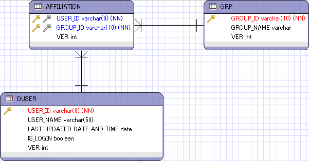

.. include:: ../../../module.txt

.. _section-jpa-usage-many-to-many-insert-label:

多対多の関係テーブルにおけるデータ追加
========================================================================

CriteriaAPIを使ったデータ追加
------------------------------------------------------------------------

ユーザとグループなど、モデル間の関連実体として、「所属」という関係性を挟んで、多対多の関連を持つデータが存在する。
こうしたエンティティは、Javaオブジェクト上ではお互いをリストで保持するような形で相互のオブジェクト参照を保持するが、
リレーショナルデータベース上では、相互の関連を多対1、1対多の構成となるように所属テーブルを作成することが一般的である。

こうしたテーブルに対して、データ追加を実施する場合は、OneToManyのパターンと同じではあるが、実装のアプローチとしても複数のパターンが考えられる。
例えば、上記でユーザをグループに追加したいといった場合には以下のパターンに分別できる。

例) Criteria APIを利用して、所属グループにユーザを追加する場合(2パターン)

test-javaee6-ejb org.debugroom.test.domain.service.impl.ejb.dbaccess.ManyToManyInsertServiceImpl

.. sourcecode:: java
   :linenos:

   package org.debugroom.test.domain.service.impl.ejb.dbaccess;

   import java.util.List;

   import javax.ejb.EJB;
   import javax.ejb.Stateless;

   import org.debugroom.test.domain.model.Affiliation;
   import org.debugroom.test.domain.model.AffiliationPK;
   import org.debugroom.test.domain.model.Group;
   import org.debugroom.test.domain.model.User;
   import org.debugroom.test.domain.repository.UserRepository;
   import org.debugroom.test.domain.repository.GroupRepository;
   import org.debugroom.test.domain.service.dbaccess.ManyToManyInsertService;

   @Stateless
   public class ManyToManyInsertServiceImpl implements ManyToManyInsertService{

       @EJB
       UserRepository userRepository;

       @EJB
       GroupRepository groupRepository;

       // UserオブジェクトへAffiliationを追加するパターン
       public List<User> addUserToGroupUsingCriteriaAPIPattern1(Group group, User user){
           User targetUser = userRepository.findOne(user.getUserId());
           Affiliation affiliation = Affiliation.builder()
                                                  .id(AffiliationPK.builder()
                                                                     .userId(user.getUserId())
                                                                     .groupId(group.getGroupId())
                                                                     .build())
                                                  .ver(new Integer(0))
                                                  .build();
           targetUser.addAffiliation(affiliation);
           List<User> resultList = userRepository.findByGroupId(group.getGroupId());
           resultList.add(targetUser);
           return resultList;
       }

       // GroupオブジェクトへAffiliationを追加するパターン
       public List<User> addUserToGroupUsingCriteriaAPIPattern2(Group group, User user){
           Group targetGroup = groupRepository.findOne(group.getGroupId());
           Affiliation affiliation = Affiliation.builder()
                                                  .id(AffiliationPK.builder()
                                                                    .userId(user.getUserId())
                                                                    .groupId(group.getGroupId())
                                                                    .build())
                                                  .ver(new Integer(0))
                                                  .build();
           targetGroup.addAffiliation(affiliation);
           List<User> resultList = userRepository.findByGroupId(group.getGroupId());
           resultList.add(userRepository.find(user.getUserId()));
           return resultList;
       }
   }

GroupにはUserと同様、OneToMany属性で、cascade属性をcascadeType.PERSISTもしくはcascadeType.ALLにする必要がある。

test-javaee6-domain org.debugroom.test.domain.model.Group

.. sourcecode:: java
   :linenos:

   package org.debugroom.test.domain.model;

   import java.io.Serializable;
   import javax.persistence.*;
   import java.util.List;

   @Entity
   @Table(name="grp")
   @NamedQuery(name="Group.findAll", query="SELECT g FROM Group g")
   public class Group implements Serializable {

       private static final long serialVersionUID = 1L;

       @Id
       @Column(name="group_id")
       private String groupId;

       @Column(name="group_name")
       private String groupName;

       @Version
       private Integer ver;

       //bi-directional many-to-one association to Affiliation
       @OneToMany(mappedBy="grp", cascade = CascadeType.ALL)
       private List<Affiliation> affiliations;

       // omit
   }

このとき、発行するSQLは、基本的にはいずれも同じで以下のようになる。

.. sourcecode:: html
   :linenos:

   /* JPQLとCriteriaAPIで発行されるSQL */
   insert into Affiliation (ver, group_id, user_id) values (?, ?, ?)

TODO : 多対多関連におけるデータ追加のパターン整理が必要。
