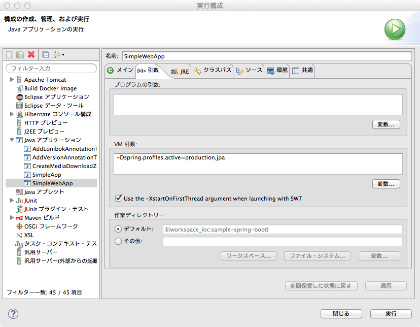

.. include:: ../../../module.txt

.. _section2-springboot-usage-label:

Usage
===================================================

実際に作成したサンプルは `GitHub <https://github.com/debugroom/sample/tree/develop/sample-spring-boot>`_ を参照のこと。

.. _section2-1-springboot-usage-standalone-label:

スタンドアロンアプリケーション
---------------------------------------------------

もっとも基本的な使用方法はコンフィグレーションクラスとして、

* org.springframework.context.annotation.Configuration
* org.springframework.boot.autoconfigure.EnableAutoConfiguration

の２つのアノテーションを付与したクラスを作成する。起動クラスと同一パッケージにあるクラスをスキャンする場合には、更に、org.springframework.context.annotation.ComponentScanアノテーションを付与する。

実行されるmainメソッドで、コンフィグレーションクラス(以下の例では、自クラスにアノテーションを定義しているので、実行と定義両方の役割を兼ねている)を指定して、org.springframework.boot.autoconfigure.SpringBootApplicationを生成する。
SpringApplication#run(args)を実行した後、取得したApplicationContextから、org.springframework.context.annotation.Beanアノテーションで定義したJavaBeanクラスや、コンポーネントスキャンで検出したクラスを取得できる。

.. sourcecode:: java
   :caption: 1 org.debugroom.sample.spring.boot.config.SimpleApp.java

   package org.debugroom.sample.spring.boot.config;

   import org.springframework.boot.autoconfigure.EnableAutoConfiguration;
   import org.springframework.boot.builder.SpringApplicationBuilder;
   import org.springframework.context.annotation.Configuration;
   import org.springframework.context.ConfigurableApplicationContext;
   import org.springframework.context.annotation.Bean;
   import org.springframework.context.annotation.ComponentScan;

   import org.debugroom.sample.spring.boot.bean.SampleBean;

   @ComponentScan
   @Configuration
   @EnableAutoConfiguration
   public class SimpleApp {

       public static void main(String[] args){
           ConfigurableApplicationContext context = new SpringApplicationBuilder(
               SimpleApp.class).web(false).run(args);
           SampleBean sampleBean = context.getBean(SampleBean.class);
           sampleBean.display();
       }
	
       @Bean SampleBean sampleBean(){
           return SampleBean.builder().build();
       }
   }

.. note:: 

   ここでは、SpringBootApplicationインスタンスの生成に、org.springframework.boot.builder.SpringApplicationBuilderクラスを使用している。SpringBootApplicationクラスのスタティックメソッドからインスタンス生成しても良いが、pom.xmlにspring-boot-starter-webを指定していると、デフォルトでは、Servletコンテナを起動するため、ここでは、setWebEnvironment(false)を指定した上で、SpringBootApplicationを生成してからServletコンテナを起動せずに実行している。

なお、実行したJavaBeanは以下の通りである。

.. sourcecode:: java
   :caption: org.debugroom.sample.spring.boot.bean.SampleBean.java

   package org.debugroom.sample.spring.boot.bean;

   import lombok.Data;
   import lombok.extern.slf4j.Slf4j;
   import lombok.Builder;
   import lombok.AllArgsConstructor;

   @AllArgsConstructor
   @Builder
   @Data
   @Slf4j
   public class SampleBean {

       private String text;

       public void display(){
           log.info(this.getClass().getName() + " #display() called.");
       }
   }

.. _section2-2-springboot-usage-database-label:

JPAを用いたデータベースアクセス
---------------------------------------------------

`Spring Bootの公式ドキュメント 29.1.1 Embedded Database Support <http://docs.spring.io/spring-boot/docs/1.4.1.RELEASE/reference/htmlsingle/#boot-features-configure-datasource>`_ では、
JPAをデータベースアクセスを行う場合は、pom.xmlで、スターターにspring-data-jpaのアーティファクトを加える。ここでは、データベースとしてHSQL及びPostgreSQLを使用した例を示す。

.. sourcecode:: xml
   :caption: pom.xml

    <dependency>
      <groupId>org.springframework.boot</groupId>
      <artifactId>spring-boot-starter-data-jpa</artifactId>
    </dependency>
    <dependency>
      <groupId>org.hsqldb</groupId>
      <artifactId>hsqldb</artifactId>
    </dependency>
    <dependency>
      <groupId>org.postgresql</groupId>
      <artifactId>postgresql</artifactId>
    </dependency>

新たに設定用のコンフィグクラスを加える。データベース用のアクセスは開発環境と、商用環境では異なるため、プロファイルによって環境を切り替える形で設定を行う。
開発環境用としてHSQLを使用する場合、H2、HSQL、Derbyでは、設定がオートで行われるため、URLや接続情報を設定する必要はない。また、これらのデータベースに対して、オートシャットダウンオプションは使えなくなるので注意。コンフィグクラスの定義は以下の通りとなる。

.. sourcecode:: java
   :caption: org.debugroom.sample.spring.boot.config.infra.env.DBConfigDev.java

   package org.debugroom.sample.spring.boot.config.infra.env;

   import javax.sql.DataSource;

   import org.springframework.context.annotation.Bean;
   import org.springframework.context.annotation.Configuration;
   import org.springframework.context.annotation.Profile;
   import org.springframework.jdbc.datasource.embedded.EmbeddedDatabaseBuilder;
   import org.springframework.jdbc.datasource.embedded.EmbeddedDatabaseType;

   @Configuration
   @Profile("dev")
   public class DBConfigDev {

       @Bean
       public DataSource dataSource(){
           return (new EmbeddedDatabaseBuilder())
                           .setType(EmbeddedDatabaseType.HSQL)
                           .addScript("classpath:ddl/schema.sql")
                           .addScript("classpath:ddl/data.sql")
                       .build();
       }
   }

EmbeddedDatabaseBuilderを使用して、データベースの初期化スクリプトを実行し、インメモリ上にデータベースを構築する。このデータソース定義が開発環境のみで使用されるように、org.springframework.context.annotation.Profileアノテーションに開発環境を示す任意の文字列を定義しておく(ここでは"dev")。

また、以下のデータベースには以下のようなテーブルを構築し、データを追加する。

.. sourcecode:: sql
   :caption: src/main/resources/ddl/schema.sql
   
   /* Drop Tables */

   DROP TABLE IF EXISTS ADDRESS;
   DROP TABLE IF EXISTS PHONE;
   DROP TABLE IF EXISTS EMAIL;
   DROP TABLE IF EXISTS CREDENTIAL;
   DROP TABLE IF EXISTS USR;
   DROP TABLE IF EXISTS COMPANY;

   /* Create Tables */

   CREATE TABLE ADDRESS
   (
       COMPANY_ID char(10) NOT NULL,
       USER_ID char(8) NOT NULL,
       ADDRESS_NO int NOT NULL,
       POST_CD char(7) NOT NULL,
       ADDRESS varchar(255),
       ADDRESS_DETAIL varchar(255),
       PRIMARY KEY (COMPANY_ID, USER_ID, ADDRESS_NO),
   ) ;

   CREATE TABLE COMPANY
   (
       COMPANY_ID char(10) NOT NULL,
       COMPANY_NAME varchar(255),
       PRIMARY KEY (COMPANY_ID)
   ) ;

   CREATE TABLE CREDENTIAL
   (
       COMPANY_ID char(10) NOT NULL,
       USER_ID char(8) NOT NULL,
       CREDENTIAL_NO int NOT NULL,
       CREDENTIAL_TYPE char(4) NOT NULL,
       CREDENTIAL_KEY varchar(255),
       KEY_EXPIRED_DATE timestamp,
       ACCESS_TOKEN varchar(512),
       TOKEN_EXPIRED_DATE timestamp with time zone,
       PRIMARY KEY (COMPANY_ID, USER_ID, CREDENTIAL_NO),
   ) ;

   CREATE TABLE EMAIL
   (
       COMPANY_ID char(10) NOT NULL,
       USER_ID char(8) NOT NULL,
       EMAIL_NO int NOT NULL,
       EMAIL varchar(255),
       PRIMARY KEY (COMPANY_ID, USER_ID, EMAIL_NO),
   ) ;

   CREATE TABLE PHONE
   (
       COMPANY_ID char(10) NOT NULL,
       USER_ID char(8) NOT NULL,
       PHONE_NO int NOT NULL,
       PHONE_NUMBER char(11),
       RELATED_ADDRESS_NO int,
       PRIMARY KEY (COMPANY_ID, USER_ID, PHONE_NO),
   ) ;

   CREATE TABLE USR
   (
       COMPANY_ID char(10) NOT NULL,
       USER_ID char(8) NOT NULL,
       USER_NAME varchar(255),
       LOGIN_ID varchar(32) NOT NULL UNIQUE,
       BIRTHDAY char(8),
       AUTHORITY_LEVEL int NOT NULL,
       IS_LOGIN boolean NOT NULL,
       PRIMARY KEY (COMPANY_ID, USER_ID),
   ) ;

   /* Create Foreign Keys */

   ALTER TABLE USR
       ADD FOREIGN KEY (COMPANY_ID)
       REFERENCES COMPANY (COMPANY_ID)
       ON UPDATE RESTRICT
       ON DELETE RESTRICT
   ;

   ALTER TABLE ADDRESS
       ADD FOREIGN KEY (COMPANY_ID, USER_ID)
       REFERENCES USR (COMPANY_ID, USER_ID)
       ON UPDATE RESTRICT
       ON DELETE RESTRICT
   ;

   ALTER TABLE PHONE
       ADD FOREIGN KEY (COMPANY_ID, USER_ID)
       REFERENCES USR (COMPANY_ID, USER_ID)
       ON UPDATE RESTRICT
       ON DELETE RESTRICT
   ;

   ALTER TABLE EMAIL
       ADD FOREIGN KEY (COMPANY_ID, USER_ID)
       REFERENCES USR (COMPANY_ID, USER_ID)
       ON UPDATE RESTRICT
       ON DELETE RESTRICT
   ;

   ALTER TABLE CREDENTIAL
       ADD FOREIGN KEY (COMPANY_ID, USER_ID)
       REFERENCES USR (COMPANY_ID, USER_ID)
       ON UPDATE RESTRICT
       ON DELETE RESTRICT
   ;

.. sourcecode:: sql
   :caption: src/main/resources/ddl/data.sql

   DELETE FROM ADDRESS;
   DELETE FROM CREDENTIAL;
   DELETE FROM PHONE;
   DELETE FROM EMAIL;
   DELETE FROM USR;
   DELETE FROM COMPANY;

   INSERT INTO COMPANY VALUES('0000000000', 'NTT DATA');
   INSERT INTO COMPANY VALUES('0000000001', 'NTT DATA.Inc');

   INSERT INTO USR VALUES('0000000000', '00000000', 'デバッグルーム0', 'org.debugroom', '20141104 ', '9', false);
   INSERT INTO USR VALUES('0000000000', '00000001', '(・∀・)', 'org.debugroom2', '20141104 ', '0', false);
   INSERT INTO USR VALUES('0000000001', '00000000', 'でバッグルーム1', 'org.debugroom3', '20141104 ', '1', false);
   INSERT INTO USR VALUES('0000000001', '00000001', 'でバッグルーム2', 'org.debugroom4', '20141104 ', '2', false);

   INSERT INTO EMAIL VALUES('0000000000', '00000000', 1, 'test@test.co.jp');
   INSERT INTO EMAIL VALUES('0000000000', '00000000', 2, 'test@test.com');
   INSERT INTO EMAIL VALUES('0000000000', '00000001', 1, 'test@test.co.jp');
   INSERT INTO EMAIL VALUES('0000000001', '00000000', 1, 'test@test.com');
   INSERT INTO EMAIL VALUES('0000000001', '00000001', 1, 'test@test.org');

   INSERT INTO PHONE VALUES('0000000000', '00000000', 1, '09012345678', 1);
   INSERT INTO PHONE VALUES('0000000000', '00000000', 2, '09087654321', 2);
   INSERT INTO PHONE VALUES('0000000000', '00000001', 1, '09023456789', 1);
   INSERT INTO PHONE VALUES('0000000001', '00000000', 1, '09098765432', 1);
   INSERT INTO PHONE VALUES('0000000001', '00000001', 1, '09034567890', 1);

   INSERT INTO CREDENTIAL VALUES('0000000000', '00000000', 1, '0000', '1234567890qwertyuioasdfghjklzxcvbnm',  '2015-01-01 00:00:00.0',  '1234567890qwertyuioasdfghjklzxcvbnm',   '2015-01-01 00:00:00.0');
   INSERT INTO CREDENTIAL VALUES('0000000000', '00000000', 2, '0000', '1234567890qwertyuioasdfghjklzxcvbnm',  '2015-01-01 00:00:00.0',  '1234567890qwertyuioasdfghjklzxcvbnm',   '2015-01-01 00:00:00.0');
   INSERT INTO CREDENTIAL VALUES('0000000000', '00000001', 1, '0000', '1234567890qwertyuioasdfghjklzxcvbnm',  '2015-01-01 00:00:00.0',  '1234567890qwertyuioasdfghjklzxcvbnm',   '2015-01-01 00:00:00.0');
   INSERT INTO CREDENTIAL VALUES('0000000001', '00000000', 1, '0000', '1234567890qwertyuioasdfghjklzxcvbnm',  '2015-01-01 00:00:00.0',  '1234567890qwertyuioasdfghjklzxcvbnm',   '2015-01-01 00:00:00.0');
   INSERT INTO CREDENTIAL VALUES('0000000001', '00000001', 1, '0000', '1234567890qwertyuioasdfghjklzxcvbnm',  '2015-01-01 00:00:00.0',  '1234567890qwertyuioasdfghjklzxcvbnm',   '2015-01-01 00:00:00.0');

   INSERT INTO ADDRESS VALUES('0000000000', '00000000', 1, '1358671', '東京都江東区豊洲３－３－９', '豊洲センタービルアネックス');
   INSERT INTO ADDRESS VALUES('0000000000', '00000000', 2, '1358671', '東京都江東区豊洲３－３－９', '豊洲センタービルアネックス');
   INSERT INTO ADDRESS VALUES('0000000000', '00000001', 1, '1358671', '東京都江東区豊洲３－３－９', '豊洲センタービルアネックス');
   INSERT INTO ADDRESS VALUES('0000000001', '00000000', 1, '1358671', '東京都江東区豊洲３－３－９', '豊洲センタービルアネックス');
   INSERT INTO ADDRESS VALUES('0000000001', '00000001', 1, '1358671', '東京都江東区豊洲３－３－９', '豊洲センタービルアネックス');

また、データベースアクセスの方法をJPAから変更する場合に備えて、JPAに関する定義を切り出してプロファイル"jpa"で作成しておく。この場合の定義は、

.. sourcecode:: java
   :caption: org.debugroom.sample.spring.boot.config.infra.DBConfigJpa.java

   package org.debugroom.sample.spring.boot.config.infra;

   import java.util.Properties;

   import javax.sql.DataSource;

   import org.springframework.beans.factory.annotation.Autowired;
   import org.springframework.context.annotation.Bean;
   import org.springframework.context.annotation.Configuration;
   import org.springframework.context.annotation.Profile;
   import org.springframework.orm.jpa.JpaTransactionManager;
   import org.springframework.orm.jpa.JpaVendorAdapter;
   import org.springframework.orm.jpa.LocalContainerEntityManagerFactoryBean;
   import org.springframework.orm.jpa.vendor.HibernateJpaVendorAdapter;
   import org.springframework.transaction.PlatformTransactionManager;

   @Configuration
   @Profile("jpa")
   public class DBConfigJpa {

      @Autowired
      DataSource dataSource;
  
      @Bean
      public PlatformTransactionManager transactionManager() throws Exception{
          return new JpaTransactionManager();
      }

      @Bean
      public LocalContainerEntityManagerFactoryBean entityManagerFactory(){
    
          JpaVendorAdapter adapter = new HibernateJpaVendorAdapter();
    
          Properties properties = new Properties();
          properties.setProperty("hibernate.show_sql", "true");
          properties.setProperty("hibernate.format_sql", "true");
    
          LocalContainerEntityManagerFactoryBean emfb = new LocalContainerEntityManagerFactoryBean();
          emfb.setPackagesToScan("org.debugroom.sample.spring.boot.entity");
          emfb.setJpaProperties(properties);
          emfb.setJpaVendorAdapter(adapter);
          emfb.setDataSource(dataSource);
    
          return emfb;
      }
   }

.. note:: LocalContainerEntityManagerFactoryBeanに設定するパッケージはエンティティクラスを指定すること。

以下に上記のテーブルCOMPANYを表現するエンティティクラスCompanyの例を示す。

.. sourcecode:: java
   :caption: org.debugroom.sample.spring.boot.entity.Company.java

   package org.debugroom.sample.spring.boot.entity;

   import java.util.HashSet;
   import java.util.Set;
   import javax.persistence.Column;
   import javax.persistence.Entity;
   import javax.persistence.FetchType;
   import javax.persistence.Id;
   import javax.persistence.OneToMany;
   import javax.persistence.Table;

   import com.fasterxml.jackson.annotation.JsonIgnore;

   @Entity
   @Table(name = "company", schema = "public")
   public class Company implements java.io.Serializable {

       private String companyId;
       private String companyName;
       private Set<Usr> usrs = new HashSet<Usr>(0);

       public Company() {
       }

       public Company(String companyId) {
           this.companyId = companyId;
       }

       public Company(String companyId, String companyName, Set<Usr> usrs) {
           this.companyId = companyId;
           this.companyName = companyName;
           this.usrs = usrs;
       }

       @Id
       @Column(name = "company_id", unique = true, nullable = false, length = 10)
       public String getCompanyId() {
           return this.companyId;
       }

       public void setCompanyId(String companyId) {
           this.companyId = companyId;
       }

       @Column(name = "company_name")
       public String getCompanyName() {
           return this.companyName;
       }

       public void setCompanyName(String companyName) {
           this.companyName = companyName;
       }

       @JsonIgnore
       @OneToMany(fetch = FetchType.LAZY, mappedBy = "company")
       public Set<Usr> getUsrs() {
           return this.usrs;
       }

       public void setUsrs(Set<Usr> usrs) {
           this.usrs = usrs;
       }

   }

.. note:: 上記では、当該エンティティをJsonにシリアライズする際、双方向の関連があると、循環参照してしまうため、OneToManyの関連をもつUsrのコレクションにom.fasterxml.jackson.annotation.JsonIgnoreアノテーションを付与している。
   
生成したエンティティクラスは、META-INF配下のpersistence.xmlに配置しておく。

.. sourcecode:: xml
   :caption: src/main/resources/META-INF/persistence.xml

   <?xml version="1.0" encoding="UTF-8"?>
   <persistence version="2.1" xmlns="http://xmlns.jcp.org/xml/ns/persistence" 
      xmlns:xsi="http://www.w3.org/2001/XMLSchema-instance" 
      xsi:schemaLocation="http://xmlns.jcp.org/xml/ns/persistence 
      http://xmlns.jcp.org/xml/ns/persistence/persistence_2_1.xsd">

       <persistence-unit name="sample-spring-boot">
           <provider>org.hibernate.ejb.HibernatePersistence</provider>
           <class>org.debugroom.sample.spring.boot.entity.Address</class>
           <class>org.debugroom.sample.spring.boot.entity.AddressId</class>
           <class>org.debugroom.sample.spring.boot.entity.Company</class>
           <class>org.debugroom.sample.spring.boot.entity.Credential</class>
           <class>org.debugroom.sample.spring.boot.entity.CredentialId</class>
           <class>org.debugroom.sample.spring.boot.entity.Email</class>
           <class>org.debugroom.sample.spring.boot.entity.EmailId</class>
           <class>org.debugroom.sample.spring.boot.entity.Phone</class>
           <class>org.debugroom.sample.spring.boot.entity.PhoneId</class>
           <class>org.debugroom.sample.spring.boot.entity.Usr</class>
           <class>org.debugroom.sample.spring.boot.entity.UsrId</class>
       </persistence-unit>
    </persistence>

また、Spring Dataを使ってデータベースアクセスする際に利用するRepositoryクラスを読み込み、トランザクション管理を有効にするためのEnableTransactionManagementアノテーションを設定する定義クラスを作成しておく。

.. sourcecode:: java
   :caption: org.debugroom.sample.spring.boot.config.infra.SimpleAppInfra.java

   package org.debugroom.sample.spring.boot.config.infra;

   import org.springframework.context.annotation.Configuration;
   import org.springframework.data.jpa.repository.config.EnableJpaRepositories;
   import org.springframework.transaction.annotation.EnableTransactionManagement;

   @Configuration
   @EnableTransactionManagement
   @EnableJpaRepositories(basePackages="org.debugroom.sample.spring.boot.repository")
   public class SimpleAppInfra {
   }

Repositoryクラスは以下の通り、作成する。

.. sourcecode:: java
   :caption: org.debugroom.sample.spring.boot.repository.CompanyRepository.java

   package org.debugroom.sample.spring.boot.repository;

   import org.springframework.data.jpa.repository.JpaRepository;

   import org.debugroom.sample.spring.boot.entity.Company;

   public interface CompanyRepository extends JpaRepository<Company, String>{
   }

.. note:: Spring Data JPAでは、エンティティクラスを作成しておけば、org.springframework.data.jpa.repository.JpaRepositoryを継承するインターフェースを作成するだけでよい。これはSpring DataがGenericDaoパターンに基づくデータベースアクセスのための実行クラスを提供しているためである。

こうして作成したデータベースアクセスのためのRepositoryクラスは、コンポーネントスキャンされた任意のBeanでDIして使用可能になる。

.. sourcecode:: java
   :caption: org.debugroom.sample.spring.boot.bean.SampleBean.java

   package org.debugroom.sample.spring.boot.bean;

   import org.springframework.beans.factory.annotation.Autowired;

   import org.debugroom.sample.spring.boot.repository.CompanyRepository;

   import lombok.Data;
   import lombok.extern.slf4j.Slf4j;
   import lombok.Builder;
   import lombok.AllArgsConstructor;

   @AllArgsConstructor
   @Builder
   @Data
   @Slf4j
   public class SampleBean {

       private String text;
  
       @Autowired
       CompanyRepository companyRepository;
  
       public void display(){
           log.info(this.getClass().getName() + " #display() called.");
           log.info(this.getClass().getName() + companyRepository.findAll());
       }

   }

アプリケーションを実行する際にデフォルトで有効となるプロファイルを設定ファイルに定義する。

.. sourcecode:: jproperties
   :caption: src/main/resources/application.yml

   spring:
       profiles:
           active: dev,jpa

.. sourcecode:: jproperties
   :caption: src/main/resources/application-production.yml

   spring:
       profiles: production
       datasource:
       url: jdbc:postgresql://localhost:5432/sample-app
       username: app
       password: app
       driverClassName: org.postgresql.Driver

.. note:: src/main/resources配下にapplication.propertiesもしくはapplication.ymlを配置しておくとSpringが自動的にこれらの設定ファイルを読み込む。また追加で、appplication-{profile-name}.propertiesの形式にしておくと、プロファイル名を指定した際に、その定義ファイルが上書きで読み込まれる。

.. note:: ここでは、開発環境用のプロファイル"dev"の他に、商用環境用のプロファイル"production"のための設定ファイルを作成している。商用環境はPostgreSQLを使用するための定義が設定ファイルに記載しており、デフォルトでデータベースの接続定義をしておくだけでSpringが自動的にデータソース定義を作成してくれる。そのため、商用環境用のDBConfigProductionクラスは作成していない。また、逆に開発環境用の設定ファイルapplication-dev.ymlも作成しているが中身は空である。データソース以外に、例えばキャッシュの定義等環境ごとに左右される設定が他にもあれば、それぞれコンフィグレーションクラスや設定ファイルを各々作成するとよい。なお、商用環境では、アプリケーション実行時のVM引数に-Dspring.profiles.active=production,jpaを指定して実行すればよい。引数なしの場合は、application.ymlの定義にある通り、開発環境のプロファイルが有効になる。

最後に、アプリケーションを起動する設定クラスを示す。

.. sourcecode:: java
   :caption: 2- org.debugroom.sample.spring.boot.config.SimpleApp.java 

   package org.debugroom.sample.spring.boot.config;

   import org.springframework.boot.autoconfigure.EnableAutoConfiguration;
   import org.springframework.boot.builder.SpringApplicationBuilder;
   import org.springframework.context.annotation.Bean;
   import org.springframework.context.annotation.ComponentScan;
   import org.springframework.context.annotation.Configuration;
   import org.springframework.context.ConfigurableApplicationContext;

   import org.debugroom.sample.spring.boot.bean.SampleBean;

   @ComponentScan("org.debugroom.sample.spring.boot.config.infra")
   @Configuration
   @EnableAutoConfiguration
   public class SimpleApp {

       public static void main(String[] args){
           ConfigurableApplicationContext context = new SpringApplicationBuilder(
                                               SimpleApp.class).web(false).run(args);
           SampleBean sampleBean = context.getBean(SampleBean.class);
           sampleBean.display();
       }
  
       @Bean SampleBean sampleBean(){
           return SampleBean.builder().build();
       }
   }

.. note:: コンポーネントスキャンのパッケージ指定を変更し、アプリケーション起動クラスのパッケージは読み込まないように変更している。同一パッケージ内にアプリケーション起動クラスが複数ある場合等、実行が失敗する場合があるので、コンフィグレーションクラスも責務ごとにパッケージを切った方がよい。

.. _section2-3-springboot-usage-webapp-label:

Webアプリケーション
---------------------------------------------------

WebアプリケーションをSpringBootで作成する場合には、pom.xmlにspring-boot-maven-pluginを追加し、実行可能なJARファイルとしてパッケージングできるようにしておく。

.. sourcecode:: xml
   :caption: pom.xmlへ定義を追加

   <build>
     <plugins>
       <plugin>
         <groupId>org.springframework.boot</groupId>
         <artifactId>spring-boot-maven-plugin</artifactId>
       </plugin>
     </plugins>
   </build>

Webアプリケーションのコンフィグレーション、起動クラスは以下の通りである。起動方法は、スタンドアロンアプリケーションと実行方法は変わらずSpringApplicationをrunするだけであるが、Spring MVCの設定を行うためのコンフィグレーションクラスMvcConfigを@Importしている。

.. sourcecode:: java 
   :caption: org.debugroom.sample.spring.boot.config.SimpleWebApp.java

   package org.debugroom.sample.spring.boot.config;

   import org.debugroom.sample.spring.boot.service.SampleService;
   import org.debugroom.sample.spring.boot.service.SampleServiceImpl;
   import org.springframework.boot.SpringApplication;
   import org.springframework.boot.autoconfigure.SpringBootApplication;
   import org.springframework.context.ConfigurableApplicationContext;
   import org.springframework.context.annotation.Bean;
   import org.springframework.context.annotation.ComponentScan;
   import org.springframework.context.annotation.Configuration;
   import org.springframework.context.annotation.Import;

   import org.debugroom.sample.spring.boot.config.mvc.MvcConfig;

   @ComponentScan("org.debugroom.sample.spring.boot.config.infra")
   @Configuration
   @Import(MvcConfig.class)
   @SpringBootApplication
   public class SimpleWebApp{

       public static void main(String[] args){
           ConfigurableApplicationContext context = SpringApplication.run(SimpleWebApp.class, args); 
       }
  
       @Bean
       public SampleService sampleService(){
           return new SampleServiceImpl();
       }

   }

Spring MVCの設定を以下の通り行う。Spring MVCに必要なクラスをコンポーネントスキャンして、org.springframework.web.servlet.config.annotation.EnableWebMvcアノテーションでSpring MVCの設定を有効化する。以下の例では、ViewResolverの設定と、静的コンテンツのフォルダ定義を追加している。

.. sourcecode:: java
   :caption: org.debugroom.sample.spring.boot.config.mvc.MvcConfig.java

   package org.debugroom.sample.spring.boot.config.mvc;

   import org.springframework.context.annotation.Bean;
   import org.springframework.context.annotation.ComponentScan;
   import org.springframework.context.annotation.Configuration;
   import org.springframework.web.servlet.ViewResolver;
   import org.springframework.web.servlet.config.annotation.EnableWebMvc;
   import org.springframework.web.servlet.config.annotation.ResourceHandlerRegistry;
   import org.springframework.web.servlet.config.annotation.WebMvcConfigurerAdapter;
   import org.springframework.web.servlet.view.InternalResourceViewResolver;

   @Configuration
   @ComponentScan("org.debugroom.sample.spring.boot.web")
   @EnableWebMvc
   public class MvcConfig extends WebMvcConfigurerAdapter{

       @Bean
       public ViewResolver viewResolver(){
           InternalResourceViewResolver viewResolver = 
                                               new InternalResourceViewResolver(); 
           viewResolver.setPrefix("/WEB-INF/views/");
           viewResolver.setSuffix(".jsp");
           return viewResolver;
       }

       @Override
       public void addResourceHandlers(ResourceHandlerRegistry registry) {
           registry.addResourceHandler("/resources/**")
                   .addResourceLocations("classpath:/static/");
       }

   }

また、Webコンテナ(ServletContext)のコンフィグレーションクラスの作成を行う。

.. sourcecode:: java
   :caption: org.debugroom.sample.spring.boot.config.mvc.ServletInitializer.java
   
   package org.debugroom.sample.spring.boot.config.mvc;

   import org.springframework.boot.builder.SpringApplicationBuilder;
   import org.springframework.boot.web.support.SpringBootServletInitializer;
   import org.springframework.context.annotation.Configuration;

   @Configuration
   public class ServletInitializer extends SpringBootServletInitializer{

       @Override
       protected SpringApplicationBuilder configure(SpringApplicationBuilder builder) {
           return builder.sources(ServletInitializer.class);
       }

   }

MvcConfigクラスからコンポーネントスキャンしているパッケージにControllerクラスを作成する。以下では、前節で作成したデータベースアクセスクラスを使って、データベースから取得したエンティティをJSON形式で返却するControllerクラスを作成した。

.. sourcecode:: java
   :caption: org.debugroom.sample.spring.boot.web.SampleController

   package org.debugroom.sample.spring.boot.web;

   import java.util.List;

   import org.springframework.beans.factory.annotation.Autowired;
   import org.springframework.http.HttpStatus;
   import org.springframework.http.ResponseEntity;
   import org.springframework.web.bind.annotation.RequestMapping;
   import org.springframework.web.bind.annotation.RequestMethod;
   import org.springframework.web.bind.annotation.RestController;

   import org.debugroom.sample.spring.boot.entity.Company;
   import org.debugroom.sample.spring.boot.service.SampleService;

   @RestController
   public class SampleController {

      @Autowired
      SampleService sampleService;
  
      @RequestMapping(value="/sample", method=RequestMethod.GET)
      public ResponseEntity<List<Company>> sample(){
        return ResponseEntity.status(HttpStatus.OK).body(
                                    sampleService.getCompanies());
      }
   }

上記を作成した後、Eclipse上から商用環境を想定して、プロファイルを"production,jpa"に切り替えて実行する。

サーバが起動したら、http://localhost:8080/sampleへアクセスすると以下の実行結果が得られる。

.. sourcecode:: json
   
   [{"companyId":"0000000000","companyName":"NTT DATA"},{"companyId":"0000000001","companyName":"NTT DATA.Inc"}]

