.. include:: ../module.txt

.. _section4-computing-label:

Computing Category
======================================================

.. _section3-1-ec2-label:

Elastic Compute Cloud(EC2)
------------------------------------------------------

.. _section3-1-1-ec2-overview-label:

Overview
^^^^^^^^^^^^^^^^^^^^^^^^^^^^^^^^^^^^^^^^^^^^^^^^^^^^^^

Elastic Compute Cloud(EC2)は仮想サーバサービスである。それぞれの仮想サーバを「インスタンス」と呼び、OS、CPUやメモリーといった性能、ストレージ、購入オプションを選択して、サービスを利用する。選択可能な可能なOSはAWSの `マーケットプレイス <https://aws.amazon.com/marketplace/b/2649367011>`_ から確認できる。

CPUやメモリ、ストレージといったリソースキャパシティを定義したものをインスタンスタイプと呼ぶ。インスタンスタイプはAmazonのインスタンス選択の `ガイドライン <https://aws.amazon.com/jp/ec2/instance-types/>`_ に沿って、選択するとよい。インスタンスタイプにはカテゴリがあり、それぞれ以下のようなアプリケーション特性に従い、インスタンスタイプを選択する。

.. list-table:: インスタンスタイプ
   :widths: 2, 3, 5 

   * - インスタンスタイプ
     - 種別
     - 用途

   * - T2
     - 汎用
     - 最も低コスト。開発環境や小規模なデータベース
   * - M3
     - 汎用
     - バランス型。小規模及び中規模データベース、 |br| キャッシュ、SAP、MicrosoftSharePoint、 |br| その他企業アプリケーション
   * - M4
     - 汎用
     - M3と同様のバランス型だが、最新世代の |br| 汎用インスタンスを利用
   * - C3
     - コンピューティング最適化
     - 高速なプロセッサを使用。高パフォーマンスの |br| フロントエンド群、バッチ処理、分散分析、 |br| 高パフォーマンスな科学・工学への応用 |br| 濃くサービス、MMOゲーム、ビデオエンコーディング
   * - C4
     - コンピューティング最適化
     - C3と同様のハイパフォーマンス型だが、 |br| 最新世代インスタンスを利用。
   * - X1
     - メモリ最適化
     - RAM1GiBの料金が最も低コスト。インメモリ |br| データベース、ビッグデータ処理エンジン、 |br| ハイパフォーマンスコンピューティング(HPC)
   * - R3
     - メモリ最適化
     - RAM1GiBの料金が安価。ハイパフォーマンス |br| データベース。分散型メモリキャッシュ、 |br| インメモリ分析、その他エンタープライズ |br| アプリケーション
   * - G2
     - GPU最適化
     - グラフィック向け。3Dアプリケーション |br| ストリーミング、 機械学習、|br| 動画エンコーディング
   * - I2
     - ストレージ最適化
     - 高速ランダムIOパフォーマンス最適化。 |br| NoSQLデータベース、トランザクションデータベース |br| データウェアハウス、Hadoop |br| クラスターファイルシステム
   * - D2
     - ストレージ最適化
     - 最も低コストでディスクを提供。超並列処理 |br| (MPP)、データウェアハウス、 |br| MapReduceとHadoop分散処理、 |br| 分散ファイルシステム

ストレージはEC2にアタッチされるElastic Block Store(EBS)というブロックレベルのストレージボリュームで、以下の通り3種類を選択できる。

.. list-table:: EBSの種類
   :widths: 3, 2, 2, 3 

   * - 種類
     - 費用
     - IOPS
     - 用途

   * - マグネティックボリューム
     - 安い
     - 低
     - アクセス頻度が低いシステム
   * - 汎用ボリューム
     - 普通
     - 中
     - 汎用
   * - プロビジョンドIOPSボリューム
     - 高い
     - 高
     - アクセス頻度が高いシステム

購入オプションは、

* オンデマンドインスタンス
* リザーブドインスタンス
* スポットインスタンス

の3種類を選択できる。オンデマンドインスタンスは時間単位の固定単価で料金が計算され、使った時間分だけ料金が発生する。AWS管理コンソールからEC2インスタンスを起動した場合は、オンデマンドインスタンスになる。リザーブドインスタンスは予約期間1年か3年かの長期オプションを選択できる代わりに、最大75%のディスカウントが得られる。スポットインスタンスは入札の様な仕組みで提供されるインスタンスで、時間単位の料金が発生するという点においては、オンデマンドインスタンスと同じだが、固定単価でなく、利用者が最大時間料金を入札形式で指定し、最大額で落札できた場合利用可能である。

.. _section3-1-2-ec2-settings-label:

EC2インスタンスの設定
^^^^^^^^^^^^^^^^^^^^^^^^^^^^^^^^^^^^^^^^^^^^^^^^^^^^^^

.. _section3-1-2-X-ec2-settings-reserved-instance-label:

リザーブドインスタンスの購入
^^^^^^^^^^^^^^^^^^^^^^^^^^^^^^^^^^^^^^^^^^^^^^^^^^^^^^

■東京リージョンにて、リザーブドインスタンスを購入する。Mangement ConsoleからEC2を選択し、グローバルメニュー"リザーブドインスタンス"を選択すると、リザーブドインスタンス購入ボタンが表示される。

.. figure:: img/management-console-ec2-buy-reserved-instance-1.png
   :scale: 100%

■リザーブドインスタンスの以下の通り、購入オプションを選択し、検索ボタンを押下する。

* プラットフォーム：Linux/UNIX
* テナンシー：デフォルト
* 提供クラス：すべて
* インスタンスタイプ：m3.medium
* 期間：1ヶ月 - 12ヶ月
* お支払い方法：全前払い

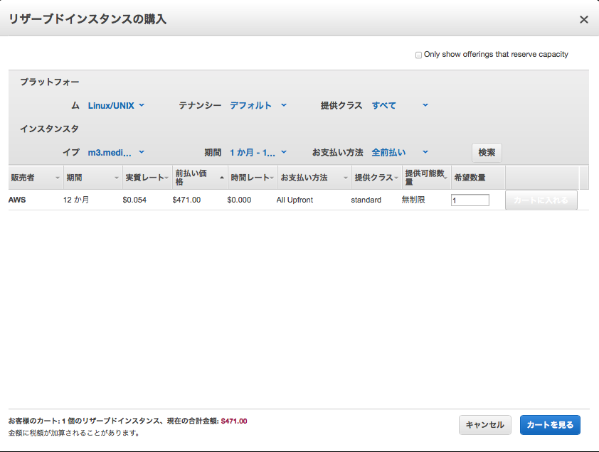

■購入数量を記入し、"カートに入れる"ボタンを押下する。

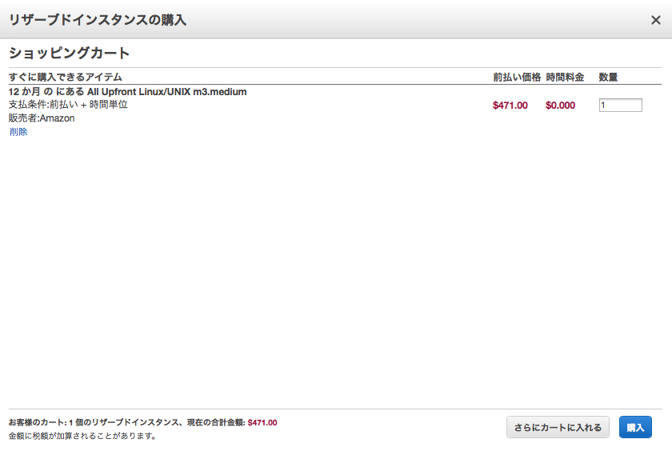
     
■ショッピングカートで購入するを押下すると、購入したインスタンスのステータスが一覧化して表示される。

.. figure:: img/management-console-ec2-buy-reserved-instance-4.png
   :scale: 100%
     
.. _section3-1-2-X-ec2-create-instance-label:

インスタンスの作成
^^^^^^^^^^^^^^^^^^^^^^^^^^^^^^^^^^^^^^^^^^^^^^^^^^^^^^

■東京リージョンに、インスタンスを作成する。Management ConsoleからEC2を選択し、グローバルメニュー"インスタンス"を選択すると、"インスタンスの作成"ボタンが表示される。

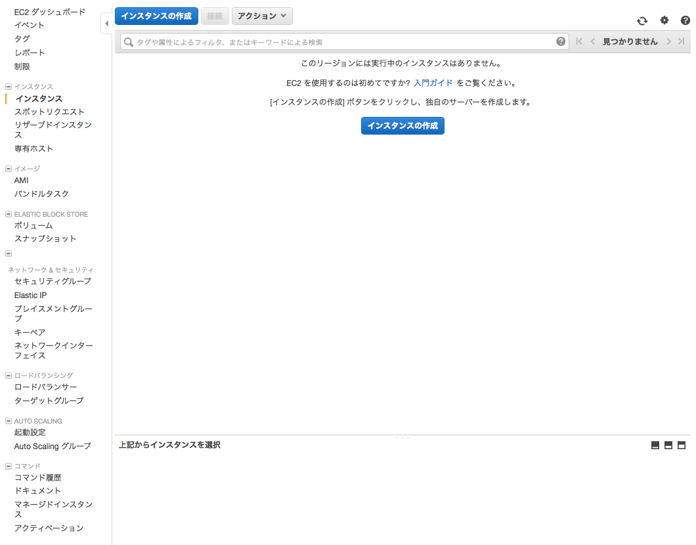
     

■マシンイメージを選択する。リザーブドインスタンスで購入しているのであれば、無料のAMIが表示される。

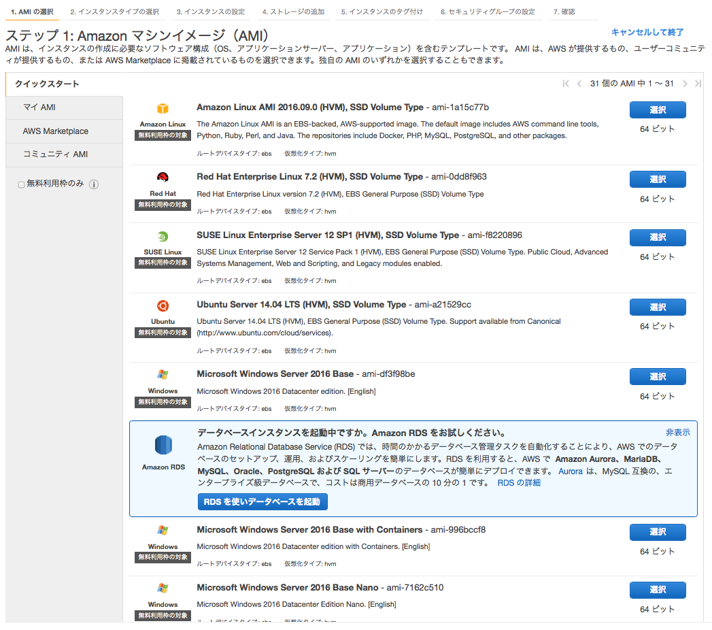
     
■インスタンスタイプを選択する。リザーブドインスタンスで購入しているのであれば、無料枠のインスタンスタイプが表示される。

.. figure:: img/management-console-ec2-create-instance-3.png
   :scale: 100%
     
■インスタンスの起動オプションを設定する。ここではデフォルトで設定。

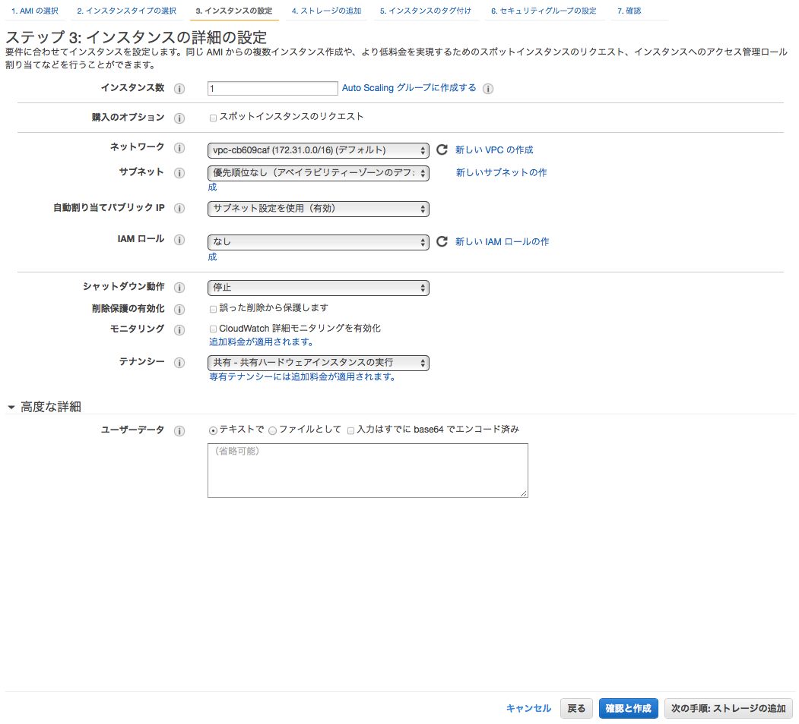
     
■インスタンスにアタッチするストレージのオプションを選択する。

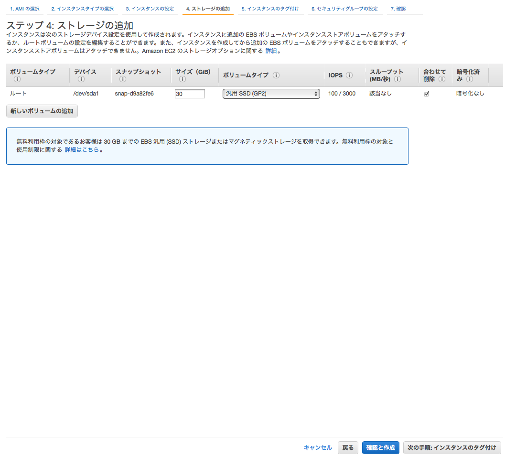

■インスタンスのタグを設定する。

.. figure:: img/management-console-ec2-create-instance-6.png
   :scale: 100%

■セキュリティグループの設定を行う。ここでは新規にセキュリティグループを作成する。
     
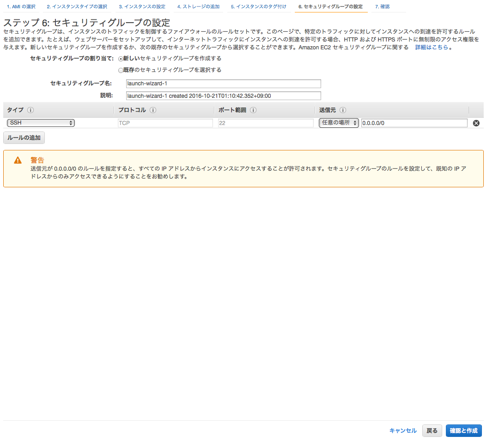

.. note:: 後述するSSH接続のために、セキュリティグループのインバウンドルールにSSH（送信元：0.0.0.0/0）が設定しておくこと。

■設定したインスタンスオプションの内容を確認し、"作成"ボタンを押下する。
     
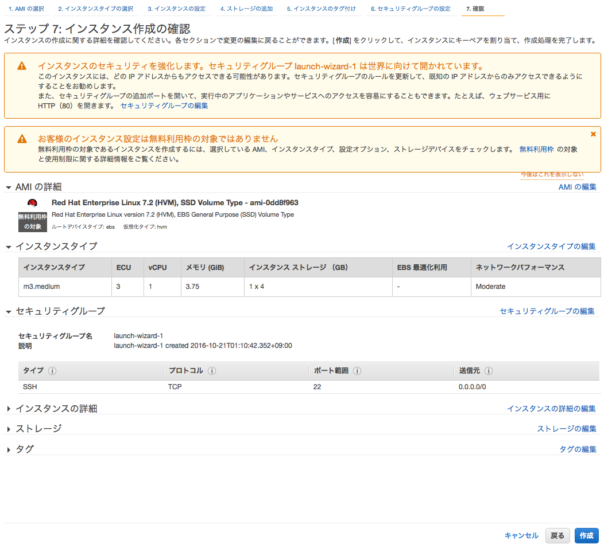

■新規でキーペアを作成する場合、サーバへ接続するためのキーペアとなるpemファイルをダウンロードしておく。
     
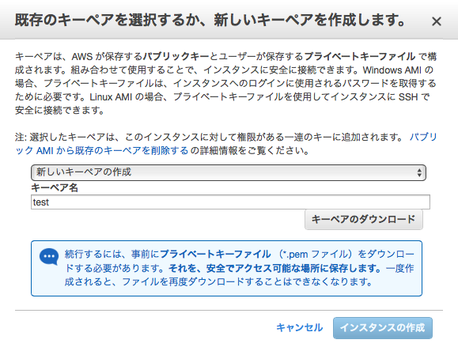
     
■作成ボタンを押下すると、インスタンスが作成される。実行中のステータスになるまで少々待つ。

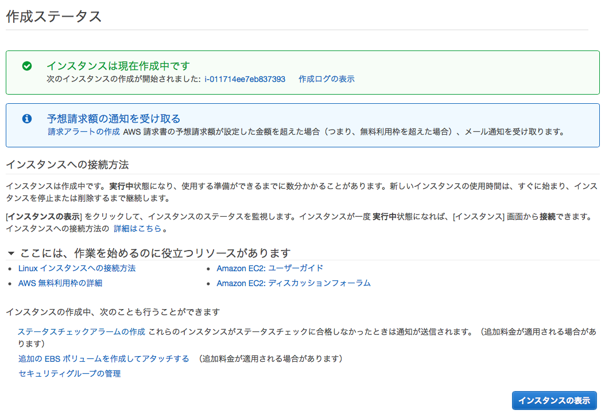
     
◇インスタンスが実行中になると、以下の通り、起動中のインスタンスの情報が一覧化できる。

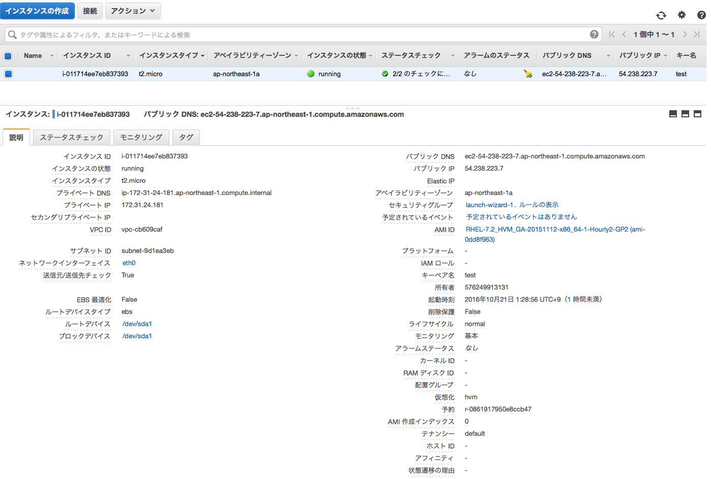
     

.. _section3-1-2-X-ec2-ssh-connect-instance-label:

EC2インスタンスへのSSH接続
^^^^^^^^^^^^^^^^^^^^^^^^^^^^^^^^^^^^^^^^^^^^^^^^^^^^^^

■ターミナルを開き、キーペアとなるpemファイルを~/.ssh以下に配置し、アクセス権限をUserReadOnlyに変更する。

.. sourcecode:: bash

   chmod 400 ~/.ssh/*

.. note:: 秘密鍵ファイルに744など不必要に権限を与えるとエラーとなるため注意。

■SSH接続を行う。

.. sourcecode:: bash

   ssh -i /Users/username/.ssh/キー名.pem ec2-user@ec2-XX-XXX-XXX-XX.compute-1.amazonaws.com

.. note:: 
   
   * DNSはインスタンス情報の「パブリックDNS」を参照
   * Amazon Linuxインスタンスにおけるユーザ名はデフォルトでec2-user
   * 鍵の指定を絶対パスですること。相対パスや「~/.ssh/」などで指定するとErrorになる
