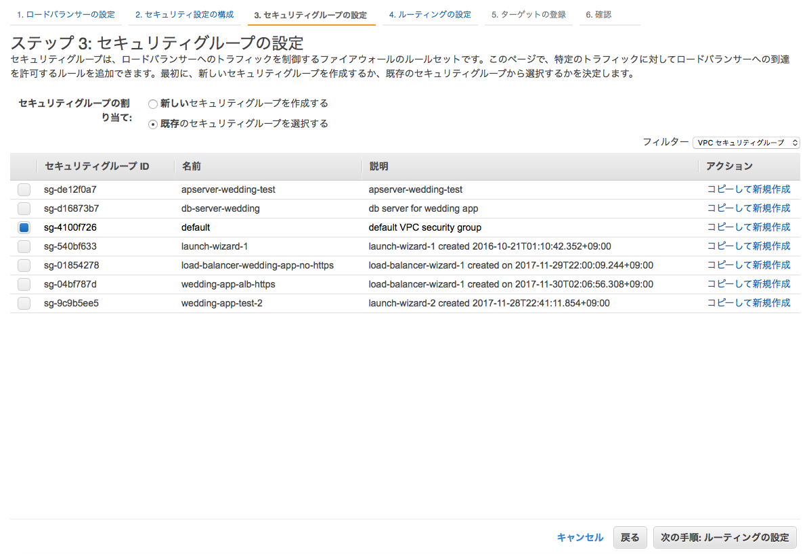
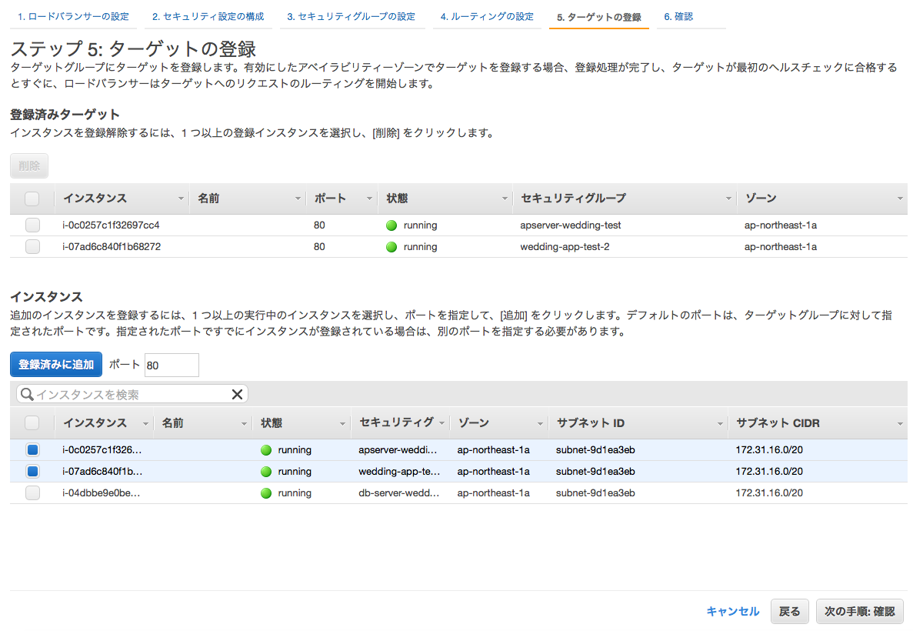
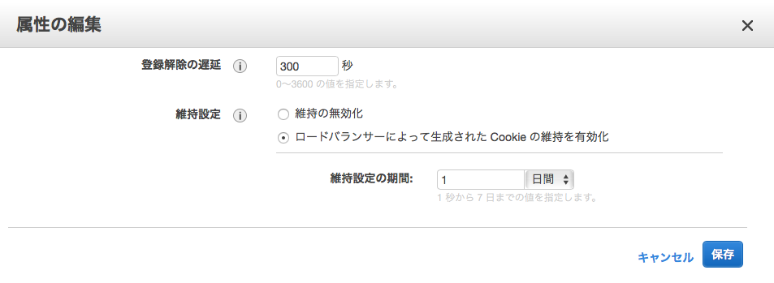

.. include:: ../module.txt

.. _section3-network-label:

Network Category
======================================================

.. _section3-1-vpc-label:

Virtual Private Network(VPC)
------------------------------------------------------

.. _section3-1-1-vpc-overview-label:

Overview
^^^^^^^^^^^^^^^^^^^^^^^^^^^^^^^^^^^^^^^^^^^^^^^^^^^^^^

Aamazon VPCはAWS上に占有可能なプライベートネットワークを構築するためのサービスである。AWSパブリッククラウド上に利用者独自の仮想プライベートネットワークを構築し、仮想サーバの「EC2」やデータベース「RDS」といったAWSのリソースを配置する。Amazon VPCはVPNを通じてオンプレミスとの接続も可能である。
外部通信する際は、ネットワークゲートウェイをVPCに設置するが、

* インターネットゲートウェイ
* 仮想プライベートゲートウェイ
* VPCピア接続

の3種類がある。

インターネットゲートウェイは文字通りインターネットとの通信であるが、通信元のAWSリソースがパブリックIPアドレスを持っている必要がある。パブリックアドレスは動的に割り当てられるものと、固定的に割り当てられるものがある。後者を「Elastic IP Address」と呼ぶ。インターネットゲートウェイは定義としては1つの機器のように扱われるが、内部的に冗長化されており、通信が増加した際には自動的にスケーリングされる。またシステムの保守作業で最新のミドルウェアやセキュリティパッチを入手する際もインターネットゲートウェイの設置が必須になるので、閉塞したネットワークの際は考慮が必要である。

仮想プライベートゲートウェイはVPCとオンプレミス環境をVPN接続するためのネットワークゲートウェイである。オンプレミス環境では、VPN通信が行えるルーターと、接続を許可するIPアドレスの設定のために、固定的なパブリックIPアドレスが必要になる。インターネットゲートウェイ同様、冗長化構成をとる。

VPCピア接続はそれぞれ独立した仮想プライベートネットワークである2つのVPCを接続し、プライベートアドレスで相互に通信する。こちらもインターネットゲートウェイ、仮想プライベートゲートウェイと同様、冗長化構成をとる。自分が所有しているVPCだけではなく、同じリージョンの別アカウントのVPCとも接続ができる。ただし、接続できるのはVPCの範囲内に限られ、接続先のVPCとVPN接続されているネットワークには接続できない。VPC接続の主な用途としては、複数システムでのデータ共有や監視システムの統合があげられる。

AmazonVPCは「セキュリティグループ」と「ネットワークACL」の2つのフィルタリング機構によって不要な通信をブロックし、セキュリティを強化できる。

セキュリティグループは、EC2やRDSなどのAWSリソースに関連付けることで、ファイアウォールとして動作する。受信と送信の両方をリソースレベルで制御でき、リソースをグループ化し、共通のセキュリティグループを関連付けることもできる。一般的なファイアウォール同様、ステートフルに動作し、発生した通信に対する応答通信は自動的に許可される。

ネットワークACLはIPサブネットに関連付けられ、受信と送信の両方をIPサブネットレベルで制御する。関連付けられたIPサブネット全てに適用されるのでセキュリティグループより広範囲な制御設定が可能であるが、セキュリティグループとは異なりステートレスに動作するため、応答通信にも許可の設定が必要となることに注意が必要である。

.. _section3-1-2-elastic-ip-address-label:

Elastic IP Address
^^^^^^^^^^^^^^^^^^^^^^^^^^^^^^^^^^^^^^^^^^^^^^^^^^^^^^

前節「 :ref:`section3-1-1-vpc-overview-label` 」でも述べた通り、IPアドレスは動的に割り当てられるものと固定で割り当てられるElastic IP Addressがあり、EC2インスタンスではデフォルトで動的なIPアドレスが割り当てられるが、稼働中のEC2インスタンス１つにつき、１つのElastic IP Addressを割り当てることができる。

.. warning:: Elastic IP Addressは最大５つまで確保でき、別途申請することでそれ以上のIPアドレスを確保することができる。ただし、EC2インスタンスやネットワークインターフェースと１つも紐づけていないIPは課金対象となるので注意すること。

.. note:: Elastic IPアドレスの設定

   Elastic IP Addressを割り当てるにはコンソール画面のElastic IPメニューから、「新しいIPアドレスの割り当て」を選択すると、新しく固定IPアドレスが獲得できる。

   .. figure:: img/management-console-elastic-ip-address-1.png
      :scale: 100%

   .. figure:: img/management-console-elastic-ip-address-2.png
      :scale: 100%

   獲得した固定IPアドレスを稼働中のEC2インスタンスに割り当てる場合は、「アクション」ボタンからアドレスの関連付けを選択し、割り当てるEC2インスタンスIDを指定する。

   .. figure:: img/management-console-elastic-ip-address-3.png
      :scale: 100%

.. _section3-2-direct-connect-label:

Direct Connect
------------------------------------------------------

Direct ConnectはVPCとオンプレミス環境をプライベートに接続するためのサービスであるが、より高速で安定的な通信が特徴になっている。同様のサービスとしてはVPC内の仮想プライベートゲートウェイが利用できるが、通常のインターネット回線を用いるため、帯域幅の制限があるため、そうした問題をクリアするためのサービスと捉えてよい。Data Connetは「Direct Connectロケーション」と呼ばれるAWSの各リージョンに対する接続ポイントを提供する。オンプレミス環境と接続ポイントを経由したVPCの間は、IEEEによって標準化されたネットワーク規格である「802.1Q VLANタンキング」を用いて、論理的な接続経路を構築する。接続ポイントとオンプレミス環境は通信キャリアが提供している閉域網サービスが必要なため、通信キャリアとの契約が必要である。通信キャリアのサービスには、接続ポイント内の物理接続を占有して提供する「占有プラン」と、物理接続を複数のユーザで共有し、その物理接続を通る論理接続を払い出して提供する「共有プラン」の2パターンが存在する。占有プランは高価だが、論理接続を自由に作成できるので、多数のVPCをオンプレミス環境に接続したい場合は有用である。共有プランは安価だが論理接続ごとに費用が発生する。

.. _section3-3-elastic-load-balancing-label:

Elastic Load Balancing(ELB)
------------------------------------------------------

.. _section3-3-1-elb-overview-label:

Overview
^^^^^^^^^^^^^^^^^^^^^^^^^^^^^^^^^^^^^^^^^^^^^^^^^^^^^^

Elastic Load BalancingはAWS内で利用できる仮想ロードバランサーで以下の様な特徴を持つ。

* ELB自体のスケーリング
* 従量課金性
* 運用管理の容易性

ELBはアプリケーショントラフィックの増減にあわせて自動的にスケーリングを行う。定義上ELBは1つの機器のように扱われるが、内部的には複数のリソースで構成されており、負荷に合わせて自動的にELBを構成する。負荷が増えるとELBリソースを追加してスケールアウトしたり、ELBリソースの性能を向上させてスケールアップするが、逆に負荷が減少するとELBのリソースを削除したり、スケールダウンを行う。ELBは従量課金性で、使用時間と処理データ量の組み合わせで料金が決定する。そのためスケールの状況によって変化しない。また、ファームウェアの更新はAWSにより行われるため、容易に運用管理を行える。その他、ELBはSSLターミネーションとアクセスログ取得機能を持つ。SSLターミネーションは通信の暗号化処理を行い、サーバ側のパフォーマンス向上に寄与する。アクセスログはロードバランサーで一括して収集を行うことでEC2インスタンスに分散してログ収集を行わずにすむ。

.. _section3-3-2-clb-and-alb-label:

Classic Load Barancing と Application Load Barancing、Network Load Barancing
^^^^^^^^^^^^^^^^^^^^^^^^^^^^^^^^^^^^^^^^^^^^^^^^^^^^^^^^^^^^^^^^^^^^^^^^^^^^^^^^^^^^^

ELBでは、ロードバランシングサービスの１つとして「Application Load Balancer（ALB）」が提供されている。
代表的な機能としては、パケットの内容に応じたコンテントベースのルーティングで、レイヤー7（L7）スイッチが備える機能を持つ。
従来のロードバランシングサービスELBは「Classic Load Balancer（CLB）」という名称に変更された。
ELBは、新しいALBと従来のCLB、後述するNLBを合わせたロードバランシングサービスの総称として表現される。

ALBでは、その他にも、以下の特徴をもつ。

* パスベースルーティング
* コンテナ化されたアプリケーションのサポート
* HTTP/2サポート
* WebSocketサポート
* StickySessionの強化
* ヘルスチェックの強化
* インスタンスのヘルスチェックは従来通りHTTP/HTTPSでping
* レスポンスコードの指定（200〜299複数）
* CloudWatchのメトリクス強化（ターゲットグループ単位とか）

ALB、ELBはリバースプロキシ型の負荷分散サービスを提供する一方、もっとも最新のNLBはL4 NATロードバランサである。特徴としては、

* 固定IPアドレス
* Pre-warming申請不要
* ゾーナリティ
* Source Address Preservation
* フェイルオーバーに対応

などがある。各ロードバランシングサービスの比較は `Elastic Load Balancing 製品の詳細 <https://aws.amazon.com/jp/elasticloadbalancing/details/#compare>`_ に詳細がまとめられている。

.. _section3-3-3-alb-setting-label:

ALBの設定
^^^^^^^^^^^^^^^^^^^^^^^^^^^^^^^^^^^^^^^^^^^^^^^^^^^^^^

ここでは、ロードバランシングサービス利用の一例として、ALBの設定を行う。

1. EC2コンソールメニューから、ロードバランサを選択し、「ロードバランサの作成」をクリックする。

.. figure:: img/management-console-application-load-balancing-setting-1.png
   :scale: 100%

2. 「アプリケーションロードバランサ」を選択する。

.. figure:: img/management-console-application-load-balancing-setting-2.png
   :scale: 100%

3. ロードバランサの以下の設定項目を入力する。

.. figure:: img/management-console-application-load-balancing-setting-3.png
   :scale: 100%

* 名前：ALBの名称
* スキーム：ロードバランサーのタイプを選択する。外部からのアクセスかAPサーバ等の内部ネットワークからのアクセスか。
* リスナー：プロトコルを指定する。http or HTTPS
* アベイラビリティゾーン：ALBを配置するアベイラビティゾーンを選択。２箇所以上が必須。

4. 証明書・セキュリティポリシーの設定。

.. figure:: img/management-console-application-load-balancing-setting-4.png
   :scale: 100%

* 証明書タイプ：設定する証明書のタイプを指定する。 :ref:`section7-2-2-acm-request-certication-label` にて作成した証明書を使用
* 証明書の名前：証明書をプルダウンから選択
* セキュリティポリシー： `フロントエンド接続に使用するセキュリティポリシー <http://docs.aws.amazon.com/ja_jp/elasticloadbalancing/latest/application/create-https-listener.html>`_ を選択

5. セキュリティグループの設定

6. ルーティングの設定

ロードバランサーからディスパッチするサーバのインスタンスグループを指定する。

* 名前：任意のターゲットグループ名(xxx-app-alb等)
* プロトコル：HTTP/HTTPS(ロードバランサーでSSL Terminationを行う場合はHTTPでよい)
* ヘルスチェックプロトコル：HTTP/HTTPS(ロードバランサーでSSL Terminationを行う場合はHTTPでよい)
* ヘルスチェックパス：ヘルスチェックを行うURLでドメイン名以下のパス
* ヘルスチェックの詳細設定：任意

7. ターゲットの登録

インスタンスグループに登録するターゲットを指定。

確認ボタンを押下し、ALBを作成する。

8. スティッキーセッションの設定

セッションがサーバ固有のものを使用しているアプリケーションやWebSocketアプリケーションなど、
スティッキーセッションを維持する必要があるものは、ターゲットグループからスティッキーセッションの設定を行う。

EC2コンソールから、メニュー「ターゲットグループ」を選び、「属性」オプションを選択する。

.. figure:: img/management-console-application-load-balancing-setting-8.png
   :scale: 100%

「ロードバランサーによって生成されたCookieの維持を有効化」にチェックを入れ、維持期間を設定する。

.. _section3-4-route53-label:

Route53
------------------------------------------------------

.. _section3-4-1-route53-overview-label:

Overview
^^^^^^^^^^^^^^^^^^^^^^^^^^^^^^^^^^^^^^^^^^^^^^^^^^^^^^

Route53はAWSが提供するDNSサービスで、世界37カ国に配置された高い可用性と100%のSLA保証が大きな特徴である。また、他のAWS同様、REST APIによるサポートがあり、ドメインやホストの追加・削除、設定内容の変更がプログラムからも実行可能である。

.. note:: Route53では、AWSマネジメントコンソール及びAPIからドメインの購入・登録ができる。既に登録済みのドメインを登録しても、レジストラ(ドメインの登録業者)から購入してRoute53へ登録しても良いが、Route53経由で登録した場合、ドメインの詳細情報をAWSマネジメントコンソールから一括で確認できる。

.. _section3-4-2-route53-registration-label:

ドメインの登録
^^^^^^^^^^^^^^^^^^^^^^^^^^^^^^^^^^^^^^^^^^^^^^^^^^^^^^

Route53を利用して、ドメインを登録する。トップページのRoute53によるドメイン登録を選択する。

登録したいドメインが利用可能かチェックを行う。カートに追加すると、どのくらいの期間ドメインを利用するか選択する。

ドメインの管理者の連絡先情報を入力する。入力したメールアドレス宛に認証のためのメールが届くため、メール記載のリンクを押下して認証を行う。

登録依頼が完了すると、下記の画面が表示される。

Route53ダッシュボードに移動すると、申請したドメインの登録情報に関するステータスが表示される。

登録が完了(完了画面では最大3日程度と書かれているが、今回は1時間程度で完了した)すると、管理者宛のメールアドレスに登録完了のメールが送付され、ダッシュボードの表示が切り替わる。

.. _section3-4-3-route53-domain-setting-label:

登録したドメインとElastic IPアドレスの紐付け設定
^^^^^^^^^^^^^^^^^^^^^^^^^^^^^^^^^^^^^^^^^^^^^^^^^^^^^^^^^^^^^^^^^^^^^^^^^^^^^^^^^^^^^^^^^^^^^^^^^^^^^

前節「 :ref:`section3-4-2-route53-registration-label` 」に続き、登録したドメインを「 :ref:`section3-1-2-elastic-ip-address-label` 」にて設定したElastic IP Addressに紐づける設定を行う。Route53ダッシュボード画面からDNS ManagementにあるHosted zonesを押下する。

対象のドメインにチェックを入れ、「Go to Record Sets」ボタンを押下する。

以下の要領で、Create Record SetにドメインとIPアドレスを設定する。

.. list-table:: Create Record Setの設定値
   :widths: 3, 7, 3

   * - 設定値
     - 説明
     - IPv4設定値サンプル

   * - Name
     - ドメイン名の接頭辞となるホスト名を指定
     - www
   * - Type
     - レコードタイプを指定する。 |br| Aレコード：ドメインとIPアドレスを指定 |br| AAAAレコード：ドメインとIPv6アドレスを設定 |br| PTRレコード：ドメインとIPアドレスの逆引き設定 |br| MXレコード：メールサーバの設定 |br| NSレコード：DNSレコードを設定
     - A IPv4アドレス
   * - Alias
     - 他のレコードの設定を参照する場合Yes
     - No
   * - TTL
     - キャッシュの有効期間を設定
     - 300
   * - Value
     - Aレコードの場合IPアドレス
     - XXX.XXX.XXX.XXX
   * - Routing Policy
     - 複数のIPアドレスを同一のホスト名で指定する場合、 |br| 優先対象を指定
     - Simple

.. note:: 既に登録されている２つのレコードのうち、「NSレコード」はゾーンを担当するDNSサーバー群（Route53サービスで「Name Servers」として表示されているものと同じ）を、 「SOAレコード」はゾーンを設定する管理者やキャッシュのデフォルト有効期限などを設定するものである。

.. note:: TTLの設定はキャッシュの更新時間であるため、間隔が長ければ長いほど、パフォーマンスは良くなるが、変更時の反映時間が長くなることがトレードオフとなる。

Createボタンを押下すると、設定が反映される。しばらく時間が経過したのち、指定したドメイン名でサーバにアクセス可能か確認を行う。

.. sourcecode:: bash

   ssh -i /Users/username/.ssh/キー名.pem ec2-user@設定したドメイン名

.. _section3-5-amazon-cloudfront-label:

Amazon CloudFront
------------------------------------------------------
