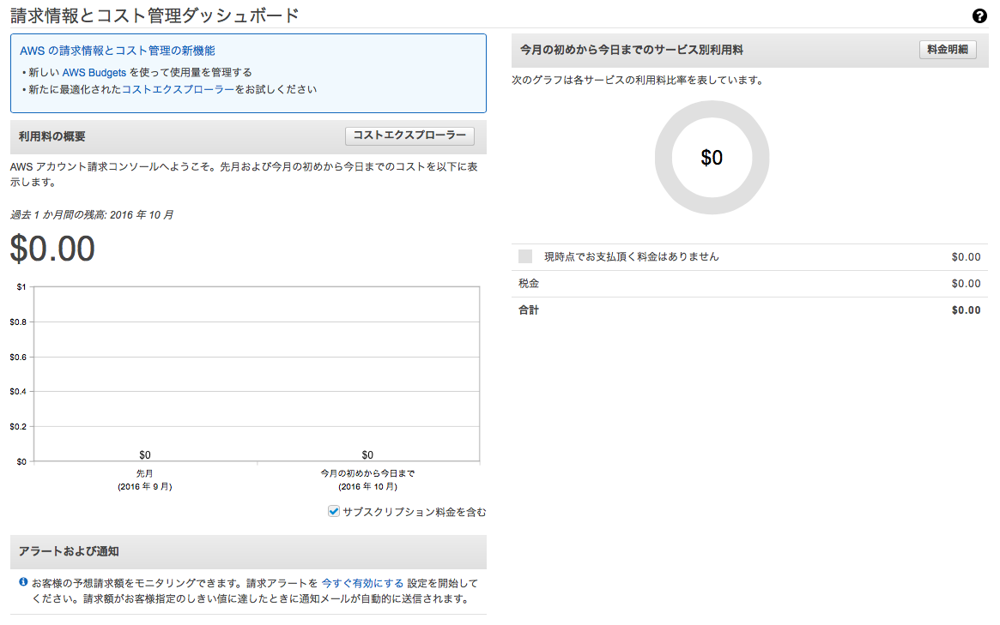

.. include:: ../module.txt

.. _section1-overview-label:

Overview
======================================================

.. _section1-1-overview-region-availablezone-label:

Region and available zone
------------------------------------------------------

Amazon Web Services（以下AWS）は、Amazon.comにより提供されているクラウドコンピューティングサービスである。2016年現在、全世界13の地域（リージョン）で展開されており、複数のAvailable Zoneから構成される(今後3リージョン追加予定)。各エリアのデータセンターとコード名は以下の通りである。

.. list-table:: AWSのリージョン
   :widths: 3, 3, 4

   * - 地域
     - 設置都市
     - リージョンコード

   * - 米国東部
     - バージニア州
     - ``us-east-1``
   * - 米国東部
     - モントリオール(今後予定)
     - ``-``
   * - 米国東部
     - オハイオ(今後予定)
     - ``-``
   * - 米国西部
     - カリフォルニア州
     - ``us-west-1``
   * - 米国西部
     - オレゴン州
     - ``us-west-2``
   * - 米国西部
     - GOVCloud
     - ``-``
   * - 南米東部
     - サンパウロ
     - ``sa-east-1``
   * - 欧州中央
     - フランクフルト
     - ``eu-central-1``
   * - 欧州
     - 英国(今後予定)
     - ``-``
   * - 欧州西部
     - アイルランド
     - ``eu-west-1``
   * - アジア北東
     - 東京
     - ``ap-northeast-1``
   * - アジア北東
     - ソウル
     - ``ap-northeast-2``
   * - アジア北東
     - 北京
     - ``-``
   * - アジア北東
     - 寧夏(今後予定)
     - ``-``
   * - アジア南
     - ムンバイ
     - ``ap-south-1``
   * - 東南アジア
     - シンガポール
     - ``ap-southeast-1``
   * - オセアニア
     - シドニー
     - ``ap-southeast-2``

.. _section1-2-overview-service-label:

Service
------------------------------------------------------

AWSでサービスを提供されているサービスは以下の通りである。

.. list-table:: AWSの提供するサービス
   :widths: 20, 30, 50　
   :header-rows: 1

   * - カテゴリ
     - サービス名
     - 概要

   * - コンピューティング
     - Elastic Compute Cloud |br| (EC2)
     - 仮想インスタンス
   * - コンピューティング
     - EC2　Container Service |br| (ECS)
     - コンテナ管理
   * - コンピューティング
     - EC2　Container Registry |br| (ECR)
     - 完全マネージドDockerコンテナイメージ管理
   * - コンピューティング
     - Lambda
     - 予め定義したコードのイベントを契機とした実行
   * - コンピューティング
     - Elastic Beanstalk
     - アプリケーションオートデプロイサービス
   * - ストレージ
     - Simple Storage Service |br| (S3)
     - オンラインストレージ。ログ保存・バックアップ
   * - ストレージ
     - Cloud Front
     - コンテンツ配信ネットワーク。 |br| エッヂロケーションからのコンテンツ配信
   * - ストレージ
     - Elastic Block Store |br| (EBS)
     - EC2マウント用ストレージ
   * - ストレージ
     - Elastic File System |br| (EFS)
     - マルチアベイラブルゾーン利用型 |br| マルチEC2マウント用ストレージ
   * - ストレージ
     - Glacler
     - 低コストオンラインストレージ |br| s3アーカイブ向け
   * - ストレージ
     - Import/Export Snowball
     - オンプレミスからクラウドへデータ移行する |br| マイグレーションサポートサービス
   * - ストレージ
     - Storage Gateway
     - オンプレミス向けストレージ
   * - データストア
     - Relational Database Service |br| (RDS)
     - リレーショナルデータベース
   * - データストア
     - Database Migration Service
     - オンプレミス向けデータベース移行
   * - データストア
     - DynamoDB
     - NoSQLデータベース
   * - データストア
     - SimpleDB
     - データ保存制限つきNoSQLデータベース
   * - データストア
     - ElastiCache
     - インメモリキャッシュ |br| MemcachedとRedisをサポート
   * - データストア
     - Redshift
     - ビッグデータ解析用データウェアハウス(DWH)
   * - ネットワーク
     - Virtual Private Cloud(VPC)
     - VPNの構築
   * - ネットワーク
     - Direct Connect
     - AWSとオンプレミスの専用接続
   * - ネットワーク
     - Elastic Load Balancing
     - ロードバランシング
   * - ネットワーク
     - Route53
     - DNSサービス
   * - アナリティクス
     - Elastic MapReduce(EMR)
     - Apache Hadoopを使用した |br| MapReduceデータ分析
   * - アナリティクス
     - Data Pipeline
     - AWS内のサービスやオンプレミス |br| データ連携処理
   * - アナリティクス
     - Elasticsearch Service
     - 検索エンジンプラットフォーム
   * - アナリティクス
     - Kinesis
     - ストリーミングデータリアルタイム処理
   * - アナリティクス
     - Machine Learning
     - 機械学習用プラットフォーム
   * - アナリティクス
     - QuickSight
     - セルフサービスBIと高速分析データベースエンジン
   * - エンタープライズ
     - WorkSpaces
     - クラウド上仮想デスクトップサービス　
   * - エンタープライズ
     - WorkDocs
     - ファイル管理サービス
   * - エンタープライズ
     - WorkMail
     - Webメールサービス
   * - IoT
     - AWS IoT
     - IoTデバイスとの接続プラットフォーム、開発ツール |br| ルールエンジン
   * - モバイル
     - Mobile Hub
     - モバイルアプリケーション構築、テスト、モニタリング
   * - モバイル
     - Cognito
     - マルチデバイス間におけるユーザ認証・データ同期
   * - モバイル
     - Device Farm
     - 実際のモバイルデバイスをシミュレーションして |br| モバイルアプリをクラウドでテストするためのサービス
   * - モバイル
     - Mobile Analytics
     - モバイルアプリケーションの使用状況 |br| データ収集と可視化
   * - モバイル
     - Mobile SDK
     - モバイルアプリケーション開発ツール
   * - モバイル
     - Simple Notification Service |br| (SNS)
     - プッシュ配信型メッセージ送信。
   * - 開発者用ツール
     - CodeCommit
     - Gitベースのバージョン管理レポジトリ
   * - 開発者用ツール
     - CodeDeploy
     - EC2インスタンスへのコードデプロイを自動化
   * - 開発者用ツール
     - CodePipeline
     - コードのビルド、テスト、ビルド、デプロイまでの |br| ワークフローを定義できるCIサービス
   * - 開発者用ツール
     - Command Line Tool |br| (CLI)
     - ターミナルからAWSサービスを実行するための |br| コマンド群
   * - 管理ツール
     - CloudWath
     - AWSの各リソースのモニタリング、閾値、 |br| アラーム設定サービス
   * - 管理ツール
     - CloudFormation
     - テンプレートに従った、AWSリソースの構築
   * - 管理ツール
     - CloudTrail
     - APIの呼出記録とログファイル送信サービス
   * - 管理ツール
     - Config
     - AWS構成変更履歴の管理
   * - 管理ツール
     - Management Console
     - Webアプリケーションベースでの管理コンソール
   * - 管理ツール
     - OpsWorks
     - DevOpsアプリケーションの管理・自動化
   * - 管理ツール
     - Service Catalog
     - リソースカタログの作成・管理
   * - 管理ツール
     - Trasted Advisor
     - AWS環境を自動精査し、パフォーマンス、 |br| セキュリティリスク、コストなど |br| 推奨設定を通知するサービス
   * - セキュリティ
     - Itentity and Access |br| Management(iAM)
     - AWSの各サービスやリソースに対するアクセス管理
   * - セキュリティ
     - Certificate Manager
     - SSL、TLS証明書のプロビジョニング、管理、 |br| デプロイを行うサービス
   * - セキュリティ
     - CloudHSM
     - 秘密鍵を安全に管理するためのサービス
   * - セキュリティ
     - Directory Service
     - クラウド上の管理ディレクトリ
   * - セキュリティ
     - Inspector
     - セキュリティ監査状況を診断するサービス
   * - セキュリティ
     - Key Management Service
     - 暗号化キーの作成、管理サービス
   * - セキュリティ
     - Web Application Firewall |br| (WAF)
     - アプリケーション用ファイアウォール
   * - アプリケーション
     - API Gateway
     - APIの作成、管理ソリューション　
   * - アプリケーション
     - AppStream(SES)
     - クラウド上のレンダリング結果の様々な |br| デバイスに対するストリーミング
   * - アプリケーション
     - Simple Workflow Service |br| (SWF)
     - ワークフロー実行基盤
   * - アプリケーション
     - Cloud Search
     - 全文検索
   * - アプリケーション
     - Elastic Transcoder
     - メディア変換。動画をエンコードし |br| 別形式ファイルで出力
   * - アプリケーション
     - Simple Email Service(SES)
     - メール配信
   * - アプリケーション
     - Flexible Payment Service(FPS)
     - 2者間の送金やクレジット・銀行口座の |br| 電子送金
   * - アプリケーション
     - Simple Queue Service(SQS)
     - メッセージキューサービス

AWSのサービス全ては、HTTP/HTTPSを通じWebAPIによって操作できる。サービスはそれぞれにSLAが定められており、その範囲内でのサービスレベルが保障される。また、地域が分散したリージョンによる災害対策、電源や空調、物理セキュリティ、ネットワークが分離されたアベイラブルゾーンによる概念により、サービスレベルのコントロールを図ることが可能になっている。

.. _section1-3-overview-management-console-label:

Management console
------------------------------------------------------

Management consoleは、Amazon web serviceを管理するためのWebアプリケーションである。インスタンスの起動や、S3への接続といった、多くのAWSサービスの処理、操作をGUIを通じて行える。また、使用料金の情報も得る事が出来る。

.. _section1-4-overview-arn-label:

Amazon Resource Name(ARN)
------------------------------------------------------

Amazon Resource Name(ARN)は、AWSのリソースを一意に識別するために使用するキーである。フォーマットは、

arn:partition:service:region:account-id:resource

で表される。

.. list-table:: ARN
   :widths: 20, 80
   :header-rows: 1

   * - 識別子
     - 概要

   * - partition
     - リソースが存在するパーティション。標準的なAWSリージョンのパーティションは"aws"となり、他のパーティションにリソースがある場合のパーティションは"aws-partitionname"である。
   * - service
     - AWSの製品を識別するサービスの名前空間
   * - region
     - リソースが存在するリージョン
   * - account-id
     - リソースを保有しているAWSアカウントのハイフンなしのID
   * - resource
     - リソースのキー
