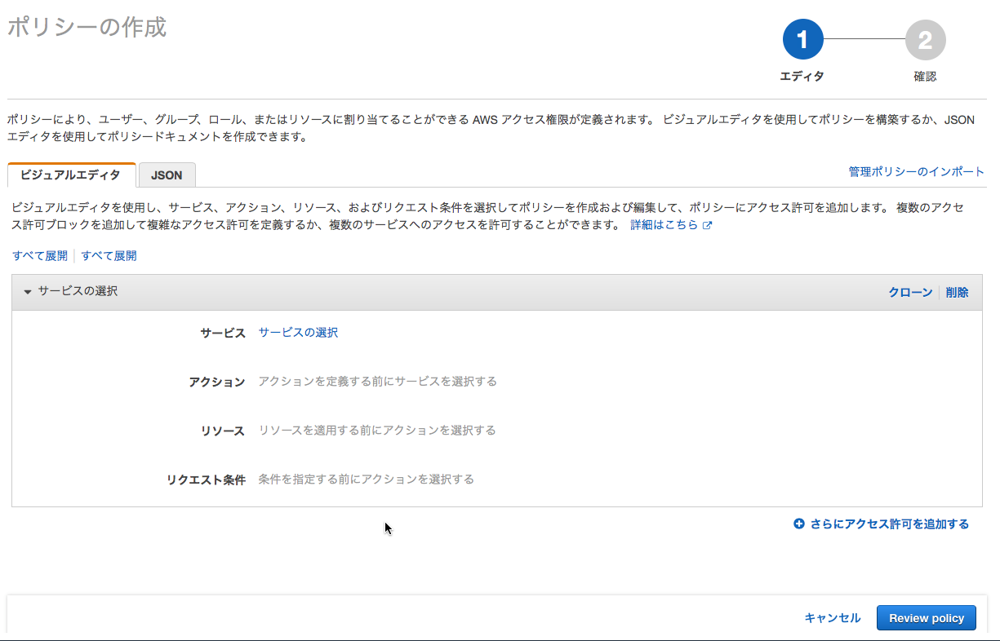

.. include:: ../module.txt

.. _section7-security-label:

Security Category
======================================================

.. _section7-1-iam-label:

IAM(Indentity Access Management)
------------------------------------------------------

.. _section7-1-1-iam-overview-label:

Overview
^^^^^^^^^^^^^^^^^^^^^^^^^^^^^^^^^^^^^^^^^^^^^^^^^^^^^^

AWSには、AWSアカウント(ルートアカウント)とIAMアカウントの２種類がある。
ルートアカウントはAWSの全てのサービスに対し、ネットワーク上のどこからでも
操作できる強力な権限を持っている。そのため、複数の利用者でAWSを利用したい場合や、
アプリケーション上からAPIを通じて、AWSリソースにアクセスする場合など、
必要に応じて、各AWSサービスごとに操作の制御が可能なIAMアカウントを作成し、運用するのが一般的である。

IAMアカウントには、以下の3種類が定義できる。

* IAMユーザ
* IAMグループ
* IAMロール

.. list-table:: IAMアカウント
   :widths: 2, 5

   * - 種類
     - 説明

   * - IAMユーザ
     - ユーザは各利用者にAWSを利用するための認証情報。ユーザには、人に限らず |br| CLI(Commnad Line Interface)やAPIを呼び出すアプリケーションも含まれる。 |br| 認証はそれぞれ、ID・パスワードを使用する方法と、アクセスキーと |br| シークレットアクセスキーを使用する方法で行う。

   * - IAMグループ
     - グループは同じ権限をもつユーザの集まりである。認証はユーザで行い、 |br| 認可はIAMグループに対して適切な権限を設定する方法がよい。

   * - IAMロール
     - ロールは永続的な権限(アクセスキー、シークレットアクセスキー)を保持する |br| ユーザと異なり、一時的にAWSリソースへアクセス権限を付与する場合に使用する。

認可は、「Action(どのサービスの)」、「Resource(どういう機能や範囲を)」、「Effect(許可or拒否)」という形でアクセスポリシーとして定義する。
AWSが最初から設定しているポリシーをAWS管理ポリシーといい、ユーザが独自に作成したポリシーをカスタマー管理ポリシーと呼ぶ。
これらのポリシーを上述のIAMユーザ、グループ、ロール各々に適用できる。また、これらの設定を様々なグループ、ユーザで横断的に適用できるよう、
オブジェクトとして管理できるIAM管理ポリシーと、従来の通り、ユーザ・グループ、ロール個別に設定していくインラインポリシーの2種類がある。

.. _section7-1-2-iam-create-user-label:

IAMユーザ・グループの作成
^^^^^^^^^^^^^^^^^^^^^^^^^^^^^^^^^^^^^^^^^^^^^^^^^^^^^^

アプリケーションからアクセスするためのユーザ、及びグループを作成し、AWS管理ポリシーを割り当てる。

■管理コンソールのIAMから、ユーザを選び「ユーザの作成」を選択する。

■ユーザ名を入力し、アクセスの種類(ここでは、プログラムによるアクセス)を設定する。

■新規グループの作成を選択し、S3へアクセスするAWS管理ポリシーを割り当てる。

.. figure:: img/management-console-iam-create-group-1.png
      :scale: 100%

.. _section7-1-3-iam-create-role-label:

IAMロールの作成
^^^^^^^^^^^^^^^^^^^^^^^^^^^^^^^^^^^^^^^^^^^^^^^^^^^^^^

IAMロールは、アプリケーションでS3へのダイレクトアップロードを行う場合など、一時的にAWSリソースへアクセス権限を付与する場合に使用する。
ここでは、S3へファイルの書き込みに対して、STS(Security Token Service)を利用することを想定した、IAMロールの設定を行う。

■管理コンソールのIAMからロールを選び、「ロールの作成」ボタンを押下する。

.. figure:: img/management-console-iam-create-role-1.png
      :scale: 100%

■アプリケーション用のユーザ(のみ)が、STSに対して、AssumreRoleリクエストが発行できるように、「別のAWSアカウント」を選択し、アプリケーション用のユーザを作成したアカウントIDを入力する。

.. warning:: AWSサービス(EC2等)に対してロールを割り当ててしまうと、アプリケーションの実装を知っていれば、第３者でもアクセスできてしまうため、アプリケーションのユーザのみがAssumeRoleリクエストを発行できるように設定する。

.. note:: アプリケーションユーザの割り当ては後ほど行うため、ここでは、アプリケーション用のIAMユーザを作成したアカウントだけ設定する。

■S3への書き込みが行えるポリシーを作成する。新規ポリシーの作成を選択し、以下の通り、S3のバケットオブジェクトへPutObject権限を割り当てる。

* サービス：S3
* アクション：PutObjectを設定
* リソース：書き込み用のバケット名とオブジェクト名(フォルダ名+ワイルドカード)を指定。
* リクエスト条件：ここでは特に設定しない

.. figure:: img/management-console-iam-create-policy-2.png
   :scale: 100%

■「ReviewPolicy」を押下し、ポリシー名を入力して、「CreatePolicy」でポリシーを作成する。

.. figure:: img/management-console-iam-create-policy-3.png
   :scale: 100%

■作成したポリシーをロールに対して割り当て、ロール名を入力し、ロールを作成する。

.. figure:: img/management-console-iam-create-role-3.png
   :scale: 100%

■ロールを作成したのち、信頼関係タブで、「信頼関係の編集」を押下する。

■PrincipalのAWS属性を以下の通り書き換える。

"arn:aws:iam::<アカウント>:user:<アプリケーション用のIAMユーザ>"

.. note:: アプリケーションからSTSを利用する場合、アカウントIDを含むロールARNを取得する必要があるが、アプリケーションのセキュリティ対策上の問題で、アプリケーション内で定義したロール名からARNを取得したい場合(アカウントIDなどをプロパティに定義したくない場合)、AssumeRequestするユーザがロール情報を取得できるよう、以下のようなポリシーをユーザにアタッチしておく必要がある。

   .. sourcecode:: javascript

      {
        "Version": "2012-10-17",
        "Statement": [{
          "Effect": "Allow",
          "Action": [
            "iam:GetRole",
            "iam:PassRole"
          ],
          "Resource": "arn:aws:iam::<account-id>:role/XX-*"
        }]
      }

.. _section7-2-acm-label:

AWS Certificate Manager
------------------------------------------------------

.. _section7-2-1-acm-overview-label:

Overview
^^^^^^^^^^^^^^^^^^^^^^^^^^^^^^^^^^^^^^^^^^^^^^^^^^^^^^

AWS Certification Managerは、AWSの各種サービスで使用する
Secure Sockets Layer/Transport Layer Security (SSL/TLS)
証明書のプロビジョニング、管理、およびデプロイを、簡単に行えるサービスである。具体的には、

* SSL/TLS 証明書をリクエスト、プロビジョンして、Elastic Load Balancing、Amazon CloudFront、Amazon API Gateway などのサービスへ組み込み、ウェブサイトやアプリケーションに証明書をデプロイできる。
* リクエストしたドメインの所有権を証明して、証明書が発行されると、AWSマネジメントコンソールのドロップダウンリストで SSL/TLS 証明書を選択し、デプロイできる。
* AWSコマンドラインインターフェイス(CLI)コマンドまたは API 呼び出しを使用して、ACM によって提供される証明書を AWS リソースにデプロイすることもできる。ACM では、証明書の更新とデプロイが自動的に管理される。

SSL証明書には、

* ドメイン認証証明書（Domain Validation）
* 組織認証証明書（Organization Validation）
* EV証明書（Extended Validation）

があるが、ACMはドメイン認証型のSSL証明書であり、コンソール内での認証や、ドメインの管理者に確認のメールが届いて、
メールに記載されているURLをクリックするだけで、証明書の取得が可能である。

.. _section7-2-2-acm-request-certication-label:

証明書のリクエスト
^^^^^^^^^^^^^^^^^^^^^^^^^^^^^^^^^^^^^^^^^^^^^^^^^^^^^^

1. 証明書を取得したいドメインを入力し、「次へ」を押下する。ここでは、¥*.debugroom.orgを入力。

.. figure:: img/management-console-acm-request-certification-1.png
      :scale: 100%

2. DNSの検証ラジオボタンにチェックをいれたまま、「次へ」を押下する。この方法では、Route53を使って認証を行うパターンである。

.. figure:: img/management-console-acm-request-certification-2.png
      :scale: 100%

3. 「確定とリクエスト」を押下する。

4. ドメインのDNS設定でCNAMEレコードの追加を行うことで認証する。ここではRoute53を使用してレコードの追加を行う。「Route53でのレコードの作成」を押下する。

.. figure:: img/management-console-acm-request-certification-4.png
      :scale: 100%

5. 「作成」を押下し、レコードを追加する。

.. figure:: img/management-console-acm-request-certification-5.png
      :scale: 100%

6. DNSレコードが書き込まれ、検証フェーズに更新される。

7. ACMコンソールでは、証明書の検証のステータスが表示される。検証が完了するまで少々時間がかかる。

.. figure:: img/management-console-acm-request-certification-7.png
      :scale: 100%
