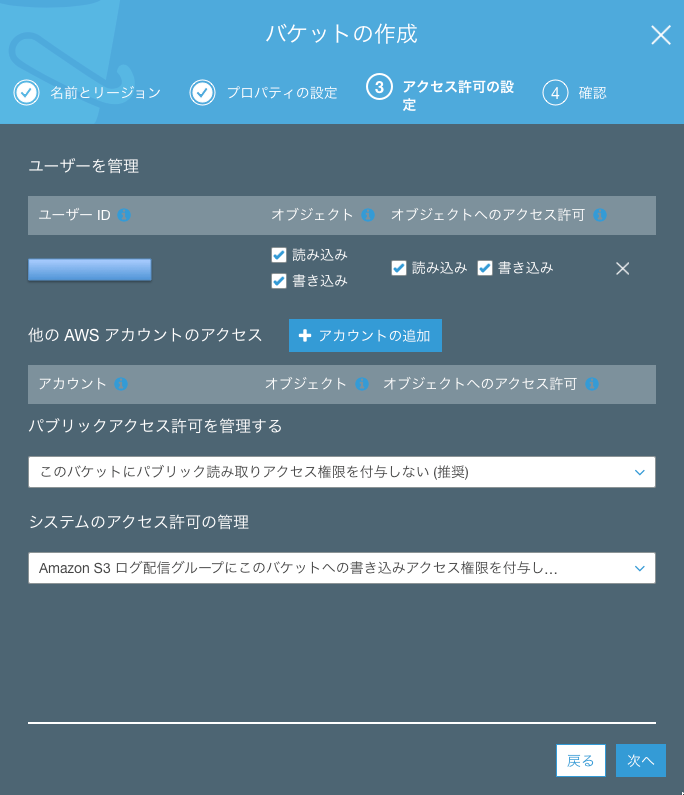
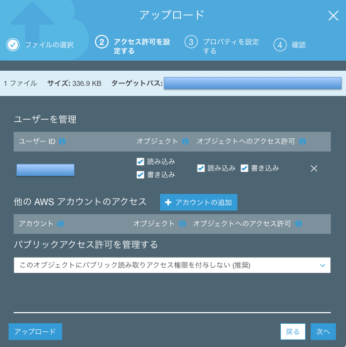

.. include:: ../module.txt

.. _section5-storage-label:

Storage Category
======================================================

.. _section5-1-s3-label:

Simple Storage Service(S3)
------------------------------------------------------

.. _section5-1-1-s3-overview-label:

Overview
^^^^^^^^^^^^^^^^^^^^^^^^^^^^^^^^^^^^^^^^^^^^^^^^^^^^^^

S3はWebベースのデータストレージサービスであり、ユーザはどこからもデータの保存や取出しができ、使用量に応じた従量課金性である。保存できるファイル数に限界はないが1ファイルあたり最大5TBに制限される。加えて、

* 信頼性
* セキュリティ
* Webサーバ

としての動作が主な特徴として挙げられる。データセンター内の複数のデバイスに必ず3箇所以上に複製されることにより、
きわめて高い信頼性を確保する(イレブン9のオーダー)とともにバージョン管理によるユーザの誤操作からの復元が可能である。
データは「バケット」と呼ばれる保存場所に「オブジェクト」として、アップロードする。
全ての通信はSSLによって暗号化され、バケットごとにポリシーを設定でき、アクセスを詳細に制御できる。
アップロードデータの自動暗号化機能もあり、情報漏えい時に参照はできない。また、S3はWebサーバとしても動作するため、
アップロードされたデータをそのままコンテンツとして保存できる。
ただしスクリプト言語やデータベースの導入はできないため、動的なコンテンツは利用できないがHTMLや画像ファイルで構成される
静的なコンテンツならば、信頼性が高いWebサイトをそのまま構築することが可能である。

オブジェクトを保存するときは、オプションでスタンダード、低冗長化、標準IA、Glacierが選択できる。
信頼性とアクセス頻度に応じて料金はそれぞれ以下の目安となる。

.. list-table::
   :widths: 30, 30, 40
   :header-rows: 1

   * - オプション
     - 信頼性
     - 料金

   * - スタンダード
     - 99.999999999%
     - 1GBあたり３円程度
   * - 低冗長化
     - 99.99%
     - スタンダードの2/3
   * - 標準IA
     - 99.999999999%
     - スタンダードの2/3 |br| ただし、アクセス料金が高い
   * - Glacier
     - 99.999999999%
     - スタンダードの1/3 |br| データの取り出しに数時間必要。

.. note:: S3のデータは同一リージョンの専用のデータ領域に保存される。

.. _section5-1-2-s3-create-bucket-label:

バケットの作成
^^^^^^^^^^^^^^^^^^^^^^^^^^^^^^^^^^^^^^^^^^^^^^^^^^^^^^

Amazon S3にデータを保存するには、最初にルートフォルダに相当する「バケット」を作成する必要がある。バケットを作成すると次のURLでアクセスできるようになる。

* http://バケット名.s3.amazonaws.com/

■S3コンソールでバケットの作成を選択する。

■バケットを作成するリージョンとバケット名を入力し、次へを押下する。

.. figure:: img/management-console-s3-create-bucket-1.png
   :scale: 100%

■プロパティやアクセス権限はそのままの設定で次へを押下していき、バケットを作成する。

.. figure:: img/management-console-s3-create-bucket-2.png
   :scale: 100%

.. figure:: img/management-console-s3-create-bucket-4.png
   :scale: 100%

なお、バケットの作成は無料で行えるが、バケット内にオブジェクトを保存・転送した場合に費用が発生する。料金は `こちら <https://aws.amazon.com/jp/s3/pricing/>`_ を参照のこと。

.. _section5-1-2-s3-create-folder-and-object-label:

フォルダの作成・オブジェクトのアップロード
^^^^^^^^^^^^^^^^^^^^^^^^^^^^^^^^^^^^^^^^^^^^^^^^^^^^^^

■S3コンソールでバケットを選択し、フォルダの作成ボタンを押下し、フォルダ名を入力してフォルダを作成する。

.. figure:: img/management-console-s3-create-folder-1.png
   :scale: 100%

■S3コンソールでバケットを選択し、アップロードボタンを押下する。

■アップロード対象のファイルを選択したのち、ファイルの閲覧権限を設定してアップロードする。

.. figure:: img/management-console-s3-upload-4.png
   :scale: 100%

.. note:: Amazon S3 では、オブジェクトのキー名に基づきバケットが仕切られるため、タイムスタンプやアルファベット順など、順次的なプレフィックスを使用すると、Amazon S3 では大量のキーが保存される特定のパーティションが使用される確率が高くなる。S3のリクエストのワークロードが1秒につき、100を超えるPUT、LIST、DELETE、あるいは300を超えるGETが見込まれるとき、`ガイドライン <https://docs.aws.amazon.com/AmazonS3/latest/dev/request-rate-perf-considerations.html>`_ に従い、パフォーマンスの向上のためにバケット名の先頭に異なる英数字の使用を検討すること。

.. _section5-1-3-s3-setting-cors-label:

CORS(Cross-Origin Resource Sharing)の設定
^^^^^^^^^^^^^^^^^^^^^^^^^^^^^^^^^^^^^^^^^^^^^^^^^^^^^^^^^^^^^^^^^

EC2上に構築したアプリケーションがS3上に配置した、画像やCSSといった静的リソースにアクセスしたい場合等は、S3のバケットに対しCORS設定を行う。
CORS(Cross-Origin Resource Sharing) は、XMLHttpRequest等のSame-Origin Policy制約に対し、追加の HTTP ヘッダを使用して、ブラウザが現在のサイトとは別のオリジン（ドメイン）のサーバーから
選択されたリソースにアクセスする権限を得られるようにする仕組みである。
簡単に言えば、S3上のバケットにクロスドメインを許可するアプリケーションのスキーム(http or https)、ホスト(www.xxxx.com等)、ポートを設定する。

■コンソールのS3から、対象のバケットを選択し、「アクセス制限」タブの「CORS設定」を選択し、アクセス設定を加える。開発環境(localhost)でダイレクトファイルアップロード(POST)を行う場合は、以下のような設定である。

.. sourcecode:: xml

   <CORSRule>
       <AllowedOrigin>http://localhost:8081</AllowedOrigin>
       <AllowedMethod>POST</AllowedMethod>
       <AllowedHeader>*</AllowedHeader>
   </CORSRule>

.. figure:: img/management-console-s3-setting-cors-1.png
   :scale: 100%

.. warning:: S3ではオブジェクトにアクセスするURLを２種類サポートしている。

   .. list-table:: S3のサポートするURLの形式
      :widths: 20, 80
      :header-rows: 1

      * - サポートする形式
        - 構造

      * - パス形式
        - http://<リージョン固有のエンドポイント>/<バケット名>/<オブジェクト名>
      * - 仮想ホスト形式のURL
        - http://<バケット名>.s3.amazonawscom/<オブジェクトキー>

   Webページ内にCORSした、バケット内に保存した静的リソース(HTMLやJavaScript)で、更にバケット内のリソースを取得しようとすると、パス形式のURLが使われることにより、クロスドメイン制約に引っかかりエラーとなる場合があるので注意。

.. _section5-1-4-s3-operation-label:

S3オブジェクトに対する操作
^^^^^^^^^^^^^^^^^^^^^^^^^^^^^^^^^^^^^^^^^^^^^^^^^^^^^^^^^^^^^^^^^

S3オブジェクトは、以下のような操作がサポートされている。

.. list-table:: S3のサポートする操作
   :widths: 20, 80
   :header-rows: 1

   * - 操作
     - 詳細

   * - GET
     - オブジェクト全体もしくはオブジェクトの一部を取得する。バイトレンジの指定が可能。
   * - List Key
     - プレフィックスと区切り記号でオブジェクトキーを一覧表示する。
   * - PUT
     - オブジェクトのアップロード及び更新を行う。
   * - DELETE
     - オブジェクトの削除を行う。

.. warning:: オブジェクトキーの一覧は、内部的には最大１０００件の取得となるので大量データの取得には注意すること。

.. _section5-2-glacier-label:

Glacier
------------------------------------------------------

Glacierはアクセス頻度は少ないが、必要なときに確実にアクセスしたいデータを低価格で長期保存することに向いた
データストレージサービスである。システムのバックアップや一定期間保存しなければならないデータの保存に向いている。
オンプレミスで言えば、DAT(Digital Audio Tape)やLTO(Linear Tape Open)などの外部媒体に相当する。
GlacierもS3同様、高い堅牢性をもち、保存できるデータ容量に上限はない。通信は全てSSL/TLSによって暗号化され、
自動暗号化機能によりデータは必ず暗号化されるが、料金はS3の1/3程度である。ただし、S3のようにリアルタイムなデータアクセスはできず、
データの取り出しに時間がかかる。主な用途としてはS3のバックアップで、アップロードから指定した期間が経過したデータを
Glacierに自動的に移動させる機能を持っている。

.. note:: データ取り出しでは緊急、標準、一括の３つのオプションが用意されている。それぞれ、緊急：１～５分程度、標準：３～５時間、一括：５～１２時間である。

.. _section5-3-storage-gateway-label:

Storage Gateway
------------------------------------------------------

Storage Gatewayはオンプレミス環境やEC2からS3やGlacierを直接使用するためのサービスである。当初はオンプレミス環境と連携するサービスとしてリリースされ、オンプレミス環境のバックアップサーバとして利用されてきたが、EC2から利用可能になったことでAWSの大容量オンラインストレージ環境として利用されている。前述の通り、S3はWebベースのデータストレージサービスであるが、SSLによって暗号化されたWeb通信のみファイルのアップロード・ダウンロードができる。そのため、直接サーバから接続できないが、安価で堅牢性が高いS3をサーバから直接操作できれば、より簡単にデータの共有やバックアップが可能になる。これを実現するのがStorage Gatewayである。
オンプレミス環境にStorage Gatewayを導入する場合、利用している仮想サーバのハイパーバイザにあわせた仮想サーバイメージをダウンロードしてインストールすれば利用できる。AWS上では「EC2 Storage Gateway」というAMI(Amazon Machine Image)が提供されるので、そのAMIをEC2上から起動する。Storage Gatewayは主に以下の3種類のタイプがある。

* ゲートウェイ保管型ボリューム
* ゲートウェイキャッシュ型ボリューム
* ゲートウェイVTL(Virtual Tape Library:仮想テープライブラリ)

ゲートウェイ保管型ボリュームは、オンプレミス環境のバックアップをAWSに移すために利用するタイプである。データをオンプレミス環境のローカルストレージに保存し、そのローカルストレージのスナップショットをS3に保管する。スナップショットはAmazon EBS形式で作成されるので、そのままAWS上のEBSボリュームとしてリストアしたり、Storage Gatewayを経由してオンプレミスのローカルストレージにリストアできる。主な利用方法は災害復旧対策としてのオンプレミス環境のデータバックアップである。

ゲートウェイキャッシュ型ボリュームは、S3をサーバから直接利用する際に、Storage Gatewayでキャッシュを持つことでS3をオンラインストレージとして使用するための利用タイプである。データ自体はS3に保管するが、頻繁にアクセスするデータをStorage Gatewayにキャッシュすることで、高速なデータアクセスを実現する。オンプレミスのサーバもしくはEC2からiSCSIプロトコルによって、Storage Gatewayをファイルシステムとして接続する。S3を仮想的なデータボリュームストレージとして扱うので、データボリュームストレージごとにAmazon EBS形式のスナップショットとして取得し、バックアップをとることができる。主な用途としては大容量のファイルサーバである。仮想データボリュームストレージは最大32TBまで指定でき、1つのStorage Gatewayで最大20個、最大合計150TBのストレージ容量を持てる。

ゲートウェイVTLは物理テープライブラリの代替として、Storage Gatewayを仮想テープライブラリ装置として利用するタイプである。一般的なバックアップソフトウェアから物理テープにデータを書き込むようにS3にデータをバックアップできる。ゲートウェイVTLの大きなメリットは、物理テープで発生するコストの削減である。仮想テープが作成されるS3及びGlacierは冗長化構成によって信頼性を確保し、またAWSのデータセンター上に保管されるため災害対策の目的として有効である。

ただし、いずれのサービスもオンプレミスとの大量のデータ通信が発生する可能性があるため、必要に応じて「AWS Direct Connect」との併用を検討したほうがよい。

.. _section5-5-cloud-front-label:

Amazon Cloud Front
------------------------------------------------------

Amazon Cloud FrontはAmazonが提供するコンテンツ配信ネットワーク(Contents Distribution Network:CDN)サービスである。
CDNでは、世界各地に分散して配置したサーバのうち、ユーザに近いロケーション(エッジロケーション)にコンテンツを配置し、
ユーザに高速にデータ配信する仕組みである。Cloud Frontは静的コンテンツおよび、エンドユーザごとに変化する動的なコンテンツ両方に対応する。

エッジロケーションにコンテンツのキャッシュを配置することで高速化を図るわけであるが、Cloud Frontでは以下のような機能をもつ。

* キャッシュ動作をどのパスパターンに適用するか
* Cloud Frontでどのオリジンにリクエストを転送するか
* クエリ文字列をオリジンに転送するかどうか
* 指定したファイルへのアクセスに署名つきURLを必要とするかどうか
* HTTPSの使用有無
* キャッシュを保持する最小時間

.. note:: CloudFrontはデフォルトでは、https://dxxxx.cloudfront.net/xxxxのようなディストリビューションドメインで行われるが、独自SSL証明書サポート機能により、独自のドメイン名とSSL証明書を使用できる。
