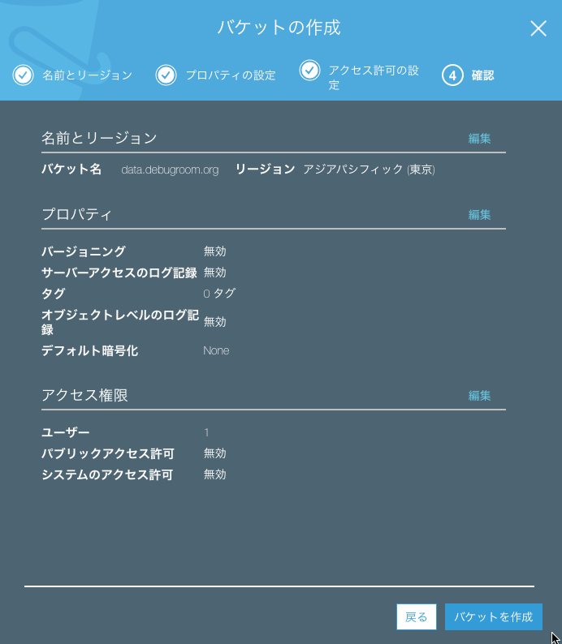

.. include:: ../module.txt

.. _section5-storage-label:

Storage Category
======================================================

.. _section5-1-s3-label:

Simple Storage Service(S3)
------------------------------------------------------

.. _section5-1-1-s3-overview-label:

Overview
^^^^^^^^^^^^^^^^^^^^^^^^^^^^^^^^^^^^^^^^^^^^^^^^^^^^^^

S3はWebベースのデータストレージサービスであり、ユーザはどこからもデータの保存や取出しができ、使用量に応じた従量課金性である。保存できるファイル数に限界はないが1ファイルあたり最大5TBに制限される。加えて、

* 信頼性
* セキュリティ
* Webサーバ

としての動作が主な特徴として挙げられる。データセンター内の複数のデバイスに必ず3箇所以上に複製されることにより、きわめて高い信頼性を確保するとともにバージョン管理によるユーザの誤操作からの復元が可能である。
データは「バケット」と呼ばれる保存場所にアップロードする。全ての通信はSSLによって暗号化され、バケットごとにポリシーを設定でき、アクセスを詳細に制御できる。
アップロードデータの自動暗号化機能もあり、情報漏えい時に参照はできない。また、S3はWebサーバとしても動作するため、アップロードされたデータをそのままコンテンツとして保存できる。
ただしスクリプト言語やデータベースの導入はできないため、動的なコンテンツは利用できないがHTMLや画像ファイルで構成される静的なコンテンツならば、信頼性が高いWebサイトをそのまま構築することが可能である。

.. _section5-1-2-s3-create-bucket-label:

バケットの作成
^^^^^^^^^^^^^^^^^^^^^^^^^^^^^^^^^^^^^^^^^^^^^^^^^^^^^^

Amazon S3にデータを保存するには、最初にルートフォルダに相当する「バケット」を作成する必要がある。バケットを作成すると次のURLでアクセスできるようになる。

* http://バケット名.s3.amazonaws.com/

■S3コンソールでバケットの作成を選択する。

.. figure:: img/management-console-s3-portal-1.png
   :scale: 100%

■バケットを作成するリージョンとバケット名を入力し、次へを押下する。

■プロパティやアクセス権限はそのままの設定で次へを押下していき、バケットを作成する。

.. figure:: img/management-console-s3-create-bucket-2.png
   :scale: 100%

.. figure:: img/management-console-s3-create-bucket-3.png
   :scale: 100%

なお、バケットの作成は無料で行えるが、バケット内にオブジェクトを保存・転送した場合に費用が発生する。料金は `こちら <https://aws.amazon.com/jp/s3/pricing/>`_ を参照のこと。

.. _section5-1-2-s3-create-folder-and-object-label:

フォルダの作成・オブジェクトのアップロード
^^^^^^^^^^^^^^^^^^^^^^^^^^^^^^^^^^^^^^^^^^^^^^^^^^^^^^

■S3コンソールでバケットを選択し、フォルダの作成ボタンを押下し、フォルダ名を入力してフォルダを作成する。

.. figure:: img/management-console-s3-create-folder-1.png
   :scale: 100%

.. figure:: img/management-console-s3-create-folder-2.png
   :scale: 100%

■S3コンソールでバケットを選択し、アップロードボタンを押下する。

.. figure:: img/management-console-s3-upload-1.png
   :scale: 100%

■アップロード対象のファイルを選択したのち、ファイルの閲覧権限を設定してアップロードする。

.. figure:: img/management-console-s3-upload-2.png
   :scale: 100%

.. figure:: img/management-console-s3-upload-3.png
   :scale: 100%

.. _section5-1-3-s3-setting-cors-label:

CORS(Cross-Origin Resource Sharing)の設定
^^^^^^^^^^^^^^^^^^^^^^^^^^^^^^^^^^^^^^^^^^^^^^^^^^^^^^^^^^^^^^^^^

EC2上に構築したアプリケーションがS3上に配置した、画像やCSSといった静的リソースにアクセスしたい場合等は、S3のバケットに対しCORS設定を行う。
CORS(Cross-Origin Resource Sharing) は、XMLHttpRequest等のSame-Origin Policy制約に対し、追加の HTTP ヘッダを使用して、ブラウザが現在のサイトとは別のオリジン（ドメイン）のサーバーから
選択されたリソースにアクセスする権限を得られるようにする仕組みである。
簡単に言えば、S3上のバケットにクロスドメインを許可するアプリケーションのスキーム(http or https)、ホスト(www.xxxx.com等)、ポートを設定する。

■コンソールのS3から、対象のバケットを選択し、「アクセス制限」タブの「CORS設定」を選択し、アクセス設定を加える。開発環境(localhost)でダイレクトファイルアップロード(POST)を行う場合は、以下のような設定である。

.. sourcecode:: xml

   <CORSRule>
       <AllowedOrigin>http://localhost:8081</AllowedOrigin>
       <AllowedMethod>POST</AllowedMethod>
       <AllowedHeader>*</AllowedHeader>
   </CORSRule>

.. figure:: img/management-console-s3-setting-cors-1.png
   :scale: 100%

.. _section5-2-glacier-label:

Glacier
------------------------------------------------------

Glacierはアクセス頻度は少ないが、必要なときに確実にアクセスしたいデータを低価格で長期保存することに向いたデータストレージサービスである。システムのバックアップや一定期間保存しなければならないデータの保存に向いている。オンプレミスで言えば、DAT(Digital Audio Tape)やLTO(Linear Tape Open)などの外部媒体に相当する。GlacierもS3同様、高い堅牢性をもち、保存できるデータ容量に上限はない。通信は全てSSLによって暗号化され、自動暗号化機能もあるが、料金はS3の1/3程度である。ただし、S3のようにリアルタイムなデータアクセスはできず、データの取り出しに3～5時間かかる。主な用途としてはS3のバックアップでアップロードから指定した期間が経過したデータをGlacierに自動的に移動させる機能を持っている。

.. _section5-3-storage-gateway-label:

Storage Gateway
------------------------------------------------------

Storage Gatewayはオンプレミス環境やEC2からS3やGlacierを直接使用するためのサービスである。当初はオンプレミス環境と連携するサービスとしてリリースされ、オンプレミス環境のバックアップサーバとして利用されてきたが、EC2から利用可能になったことでAWSの大容量オンラインストレージ環境として利用されている。前述の通り、S3はWebベースのデータストレージサービスであるが、SSLによって暗号化されたWeb通信のみファイルのアップロード・ダウンロードができる。そのため、直接サーバから接続できないが、安価で堅牢性が高いS3をサーバから直接操作できれば、より簡単にデータの共有やバックアップが可能になる。これを実現するのがStorage Gatewayである。
オンプレミス環境にStorage Gatewayを導入する場合、利用している仮想サーバのハイパーバイザにあわせた仮想サーバイメージをダウンロードしてインストールすれば利用できる。AWS上では「EC2 Storage Gateway」というAMI(Amazon Machine Image)が提供されるので、そのAMIをEC2上から起動する。Storage Gatewayは主に以下の3種類のタイプがある。

* ゲートウェイ保管型ボリューム
* ゲートウェイキャッシュ型ボリューム
* ゲートウェイVTL(Virtual Tape Library:仮想テープライブラリ)

ゲートウェイ保管型ボリュームは、オンプレミス環境のバックアップをAWSに移すために利用するタイプである。データをオンプレミス環境のローカルストレージに保存し、そのローカルストレージのスナップショットをS3に保管する。スナップショットはAmazon EBS形式で作成されるので、そのままAWS上のEBSボリュームとしてリストアしたり、Storage Gatewayを経由してオンプレミスのローカルストレージにリストアできる。主な利用方法は災害復旧対策としてのオンプレミス環境のデータバックアップである。

ゲートウェイキャッシュ型ボリュームは、S3をサーバから直接利用する際に、Storage Gatewayでキャッシュを持つことでS3をオンラインストレージとして使用するための利用タイプである。データ自体はS3に保管するが、頻繁にアクセスするデータをStorage Gatewayにキャッシュすることで、高速なデータアクセスを実現する。オンプレミスのサーバもしくはEC2からiSCSIプロトコルによって、Storage Gatewayをファイルシステムとして接続する。S3を仮想的なデータボリュームストレージとして扱うので、データボリュームストレージごとにAmazon EBS形式のスナップショットとして取得し、バックアップをとることができる。主な用途としては大容量のファイルサーバである。仮想データボリュームストレージは最大32TBまで指定でき、1つのStorage Gatewayで最大20個、最大合計150TBのストレージ容量を持てる。

ゲートウェイVTLは物理テープライブラリの代替として、Storage Gatewayを仮想テープライブラリ装置として利用するタイプである。一般的なバックアップソフトウェアから物理テープにデータを書き込むようにS3にデータをバックアップできる。ゲートウェイVTLの大きなメリットは、物理テープで発生するコストの削減である。仮想テープが作成されるS3及びGlacierは冗長化構成によって信頼性を確保し、またAWSのデータセンター上に保管されるため災害対策の目的として有効である。

ただし、いずれのサービスもオンプレミスとの大量のデータ通信が発生する可能性があるため、必要に応じて「AWS Direct Connect」との併用を検討したほうがよい。

.. _section5-4-efs-label:

Elastic File System
------------------------------------------------------

Elastic File Systemは共有ファイルストレージサービスである。複数のEC2インスタンスから、ファイル共有プロトコル「NFSv4」を介して同時にアクセスできる。ファイルの追加や削除に伴い容量を自動的に拡張または縮小する。ペタバイト規模まで拡張できるよう設計されており、S3やGlacierと同様、複数のデータセンター間でデータをレプリケーションすることで可用性を確保する。主な用途としては、データやコンテンツの共有等が挙げられる。
