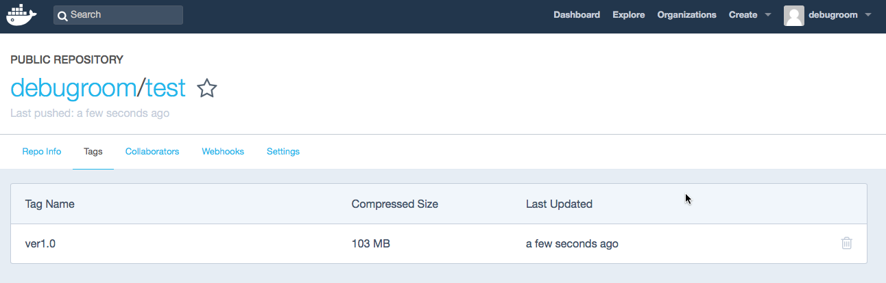

.. include:: ../module.txt

.. _section3-docker-usage-label:

Usage
======================================================

.. _section3-1-docker-command-label:

Dockerコマンド
------------------------------------------------------

.. _section3-1-1-docker-search-label:

Docker search
^^^^^^^^^^^^^^^^^^^^^^^^^^^^^^^^^^^^^^^^^^^^^^^^^^^^^^

Docker searchはDockerレジストリ(DockerHub)のコンテナイメージを検索するコマンドである。

docker search [OPTIONS] TERM

.. sourcecode:: bash

   Options:

       -f, --filter value   Filter output based on conditions provided (default [])
           --help           Print usage
           --limit int      Max number of search results (default 25)
           --no-index       Don't truncate output
           --no-trunc       Don't truncate output   

   [centos@ip-XXX-XXX-XXX-XXX ~]$ docker search centos
	INDEX       NAME                                             DESCRIPTION                                     STARS     OFFICIAL   AUTOMATED
	docker.io   docker.io/centos                                 The official build of CentOS.                   3353      [OK]       
	docker.io   docker.io/jdeathe/centos-ssh                     CentOS-6 6.9 x86_64 / CentOS-7 7.3.1611 x8...   69                   [OK]
	docker.io   docker.io/consol/centos-xfce-vnc                 Centos container with "headless" VNC sessi...   26                   [OK]
	docker.io   docker.io/nimmis/java-centos                     This is docker images of CentOS 7 with dif...   26                   [OK]
	docker.io   docker.io/gluster/gluster-centos                 Official GlusterFS Image [ CentOS-7 +  Glu...   19                   [OK]
	docker.io   docker.io/million12/centos-supervisor            Base CentOS-7 with supervisord launcher, h...   16                   [OK]
	docker.io   docker.io/kinogmt/centos-ssh                     CentOS with SSH                                 13                   [OK]
	docker.io   docker.io/egyptianbman/docker-centos-nginx-php   A simple and highly configurable docker co...   9                    [OK]
	docker.io   docker.io/torusware/speedus-centos               Always updated official CentOS docker imag...   8                    [OK]
	docker.io   docker.io/centos/mariadb55-centos7                                                               5                    [OK]
	docker.io   docker.io/nathonfowlie/centos-jre                Latest CentOS image with the JRE pre-insta...   5                    [OK]
	docker.io   docker.io/darksheer/centos                       Base Centos Image -- Updated hourly             2                    [OK]
	docker.io   docker.io/harisekhon/centos-java                 Java on CentOS (OpenJDK, tags jre/jdk7-8)       2                    [OK]
	docker.io   docker.io/harisekhon/centos-scala                Scala + CentOS (OpenJDK tags 2.10-jre7 - 2...   2                    [OK]
	docker.io   docker.io/blacklabelops/centos                   CentOS Base Image! Built and Updates Daily!     1                    [OK]
	docker.io   docker.io/freenas/centos                         Simple CentOS Linux interactive container       1                    [OK]
	docker.io   docker.io/sgfinans/docker-centos                 CentOS with a running sshd and Docker           1                    [OK]
	docker.io   docker.io/timhughes/centos                       Centos with systemd installed and running       1                    [OK]
	docker.io   docker.io/vorakl/centos                          CentOS7, EPEL, tools. Updated/Tested daily!     1                    [OK]
	docker.io   docker.io/grossws/centos                         CentOS 6 and 7 base images with gosu and l...   0                    [OK]
	docker.io   docker.io/januswel/centos                        yum update-ed CentOS image                      0                    [OK]
	docker.io   docker.io/kz8s/centos                            Official CentOS plus epel-release               0                    [OK]
	docker.io   docker.io/repositoryjp/centos                    Docker Image for CentOS.                        0                    [OK]
	docker.io   docker.io/vcatechnology/centos                   A CentOS Image which is updated daily           0                    [OK]
	docker.io   docker.io/wenjianzhou/centos                     centos                                          0                    [OK]

.. _section3-1-2-docker-pull-label:

Docker pull
^^^^^^^^^^^^^^^^^^^^^^^^^^^^^^^^^^^^^^^^^^^^^^^^^^^^^^

Docker pullはDocker Hubからコンテナイメージ、およびレポジトリを取得するコマンドである。

docker pull [OPTIONS] NAME[:TAG|@DIGEST]

.. sourcecode:: bash

   Options:

       -a, --all-tags                Download all tagged images in the repository
           --disable-content-trust   Skip image verification (default true)
           --help                    Print usage

   [centos@ip-XXX-XXX-XXX-XXX ~]$ docker pull centos
   Using default tag: latest
   Trying to pull repository docker.io/library/centos ... 
   latest: Pulling from docker.io/library/centos
   343b09361036: Pull complete 
   Digest: sha256:bba1de7c9d900a898e3cadbae040dfe8a633c06bc104a0df76ae24483e03c077

.. _section3-1-3-docker-run-label:

Docker run
^^^^^^^^^^^^^^^^^^^^^^^^^^^^^^^^^^^^^^^^^^^^^^^^^^^^^^

Docker runはコンテナを起動するコマンドである。

docker run [OPTIONS] IMAGE [COMMAND] [ARG...]

.. sourcecode:: bash

	Options:
	      --add-host value              Add a custom host-to-IP mapping (host:ip) (default [])
	  -a, --attach value                Attach to STDIN, STDOUT or STDERR (default [])
	      --blkio-weight value          Block IO (relative weight), between 10 and 1000
	      --blkio-weight-device value   Block IO weight (relative device weight) (default [])
	      --cap-add value               Add Linux capabilities (default [])
	      --cap-drop value              Drop Linux capabilities (default [])
	      --cgroup-parent string        Optional parent cgroup for the container
	      --cidfile string              Write the container ID to the file
	      --cpu-percent int             CPU percent (Windows only)
	      --cpu-period int              Limit CPU CFS (Completely Fair Scheduler) period
	      --cpu-quota int               Limit CPU CFS (Completely Fair Scheduler) quota
	  -c, --cpu-shares int              CPU shares (relative weight)
	      --cpuset-cpus string          CPUs in which to allow execution (0-3, 0,1)
	      --cpuset-mems string          MEMs in which to allow execution (0-3, 0,1)
	  -d, --detach                      Run container in background and print container ID
	      --detach-keys string          Override the key sequence for detaching a container
	      --device value                Add a host device to the container (default [])
	      --device-read-bps value       Limit read rate (bytes per second) from a device (default [])
	      --device-read-iops value      Limit read rate (IO per second) from a device (default [])
	      --device-write-bps value      Limit write rate (bytes per second) to a device (default [])
	      --device-write-iops value     Limit write rate (IO per second) to a device (default [])
	      --disable-content-trust       Skip image verification (default true)
	      --dns value                   Set custom DNS servers (default [])
	      --dns-opt value               Set DNS options (default [])
	      --dns-search value            Set custom DNS search domains (default [])
	      --entrypoint string           Overwrite the default ENTRYPOINT of the image
	  -e, --env value                   Set environment variables (default [])
	      --env-file value              Read in a file of environment variables (default [])
	      --expose value                Expose a port or a range of ports (default [])
	      --group-add value             Add additional groups to join (default [])
	      --health-cmd string           Command to run to check health
	      --health-interval duration    Time between running the check (default 0s)
	      --health-retries int          Consecutive failures needed to report unhealthy
	      --health-timeout duration     Maximum time to allow one check to run (default 0s)
	      --help                        Print usage
	  -h, --hostname string             Container host name
	  -i, --interactive                 Keep STDIN open even if not attached
	      --io-maxbandwidth string      Maximum IO bandwidth limit for the system drive (Windows only)
	      --io-maxiops uint             Maximum IOps limit for the system drive (Windows only)
	      --ip string                   Container IPv4 address (e.g. 172.30.100.104)
	      --ip6 string                  Container IPv6 address (e.g. 2001:db8::33)
	      --ipc string                  IPC namespace to use
	      --isolation string            Container isolation technology
	      --kernel-memory string        Kernel memory limit
	  -l, --label value                 Set meta data on a container (default [])
	      --label-file value            Read in a line delimited file of labels (default [])
	      --link value                  Add link to another container (default [])
	      --link-local-ip value         Container IPv4/IPv6 link-local addresses (default [])
	      --log-driver string           Logging driver for the container
	      --log-opt value               Log driver options (default [])
	      --mac-address string          Container MAC address (e.g. 92:d0:c6:0a:29:33)
	  -m, --memory string               Memory limit
	      --memory-reservation string   Memory soft limit
	      --memory-swap string          Swap limit equal to memory plus swap: '-1' to enable unlimited swap
	      --memory-swappiness int       Tune container memory swappiness (0 to 100) (default -1)
	      --name string                 Assign a name to the container
	      --network string              Connect a container to a network (default "default")
	      --network-alias value         Add network-scoped alias for the container (default [])
	      --no-healthcheck              Disable any container-specified HEALTHCHECK
	      --oom-kill-disable            Disable OOM Killer
	      --oom-score-adj int           Tune host's OOM preferences (-1000 to 1000)
	      --pid string                  PID namespace to use
	      --pids-limit int              Tune container pids limit (set -1 for unlimited)
	      --privileged                  Give extended privileges to this container
	  -p, --publish value               Publish a container's port(s) to the host (default [])
	  -P, --publish-all                 Publish all exposed ports to random ports
	      --read-only                   Mount the container's root filesystem as read only
	      --restart string              Restart policy to apply when a container exits (default "no")
	      --rm                          Automatically remove the container when it exits
	      --runtime string              Runtime to use for this container
	      --security-opt value          Security Options (default [])
	      --shm-size string             Size of /dev/shm, default value is 64MB
	      --sig-proxy                   Proxy received signals to the process (default true)
	      --stop-signal string          Signal to stop a container, SIGTERM by default (default "SIGTERM")
	      --storage-opt value           Storage driver options for the container (default [])
	      --sysctl value                Sysctl options (default map[])
	      --tmpfs value                 Mount a tmpfs directory (default [])
	  -t, --tty                         Allocate a pseudo-TTY
	      --ulimit value                Ulimit options (default [])
	  -u, --user string                 Username or UID (format: <name|uid>[:<group|gid>])
	      --userns string               User namespace to use
	      --uts string                  UTS namespace to use
	  -v, --volume value                Bind mount a volume (default [])
	      --volume-driver string        Optional volume driver for the container
	      --volumes-from value          Mount volumes from the specified container(s) (default [])
	  -w, --workdir string              Working directory inside the container

   [centos@ip-XXX-XXX-XXX-XXX ~]$ docker run -it --name centos7 centos:latest /bin/bash
   [root@be8d9c7eff66 /]# 

   [centos@ip-XXX-XXX-XXX-XXX ~]$ docker run -it -p 8000:80 --name webserver1 test:ver1.0

.. note:: docker runでコンテナを起動した際、以下の通りのデバイスファイルでマウントされる。

   .. sourcecode:: bash

      [root@be8d9c7eff66 /]# cat /etc/centos-release
      CentOS Linux release 7.3.1611 (Core) 
      [root@be8d9c7eff66 /]# df -h /
      Filesystem                                                                                      Size  Used Avail Use% Mounted on
      /dev/mapper/docker-202:1-1598-d6f0a6a08d7e1d2946a1d23e9dea4d240ee41c134e5179fee5d683f365cde53c   10G  238M  9.8G   3% /

   また、ネットワーク関連の設定は以下の通りである。

   .. sourcecode:: bash

      [root@be8d9c7eff66 /]# ip a
		1: lo: <LOOPBACK,UP,LOWER_UP> mtu 65536 qdisc noqueue state UNKNOWN qlen 1
		    link/loopback 00:00:00:00:00:00 brd 00:00:00:00:00:00
		    inet 127.0.0.1/8 scope host lo
		       valid_lft forever preferred_lft forever
		    inet6 ::1/128 scope host 
		       valid_lft forever preferred_lft forever
		4: eth0@if5: <BROADCAST,MULTICAST,UP,LOWER_UP> mtu 1500 qdisc noqueue state UP 
		    link/ether 02:42:ac:11:00:02 brd ff:ff:ff:ff:ff:ff link-netnsid 0
		    inet 172.17.0.2/16 scope global eth0
		       valid_lft forever preferred_lft forever
		    inet6 fe80::42:acff:fe11:2/64 scope link 
		       valid_lft forever preferred_lft forever

   実行プロセスは以下の通りである。

   .. sourcecode:: bash

      [root@be8d9c7eff66 /]# ps -ef
		UID        PID  PPID  C STIME TTY          TIME CMD
		root         1     0  0 May25 ?        00:00:00 /bin/bash
		root        71     1  0 03:29 ?        00:00:00 ps -ef

.. note:: CentOS7からはifconfigなどのネットワーク関連コマンドが非推奨となり、代わりにiproute系のコマンドが推奨されることになった。標準のdockerイメージでは、デフォルトではインストールされていなかったため、必要に応じて、導入すること。

   .. sourcecode:: bash

      [root@be8d9c7eff66 /]# yum install iproute
		Loaded plugins: fastestmirror, ovl
		base                                                                                                                         | 3.6 kB  00:00:00     
		extras                                                                                                                       | 3.4 kB  00:00:00     
		updates                                                                                                                      | 3.4 kB  00:00:00     
		(1/4): extras/7/x86_64/primary_db                                                                                            | 151 kB  00:00:00     
		(2/4): base/7/x86_64/group_gz                                                                                                | 155 kB  00:00:00     
		(3/4): updates/7/x86_64/primary_db                                                                                           | 4.8 MB  00:00:00     
		(4/4): base/7/x86_64/primary_db                                                                                              | 5.6 MB  00:00:00     
		Determining fastest mirrors
		 * base: ftp.iij.ad.jp
		 * extras: ftp.iij.ad.jp
		 * updates: ftp.iij.ad.jp
		Resolving Dependencies
		--> Running transaction check
		---> Package iproute.x86_64 0:3.10.0-74.el7 will be installed
		--> Processing Dependency: libmnl.so.0(LIBMNL_1.0)(64bit) for package: iproute-3.10.0-74.el7.x86_64
		--> Processing Dependency: libxtables.so.10()(64bit) for package: iproute-3.10.0-74.el7.x86_64
		--> Processing Dependency: libmnl.so.0()(64bit) for package: iproute-3.10.0-74.el7.x86_64
		--> Running transaction check
		---> Package iptables.x86_64 0:1.4.21-17.el7 will be installed
		--> Processing Dependency: libnfnetlink.so.0()(64bit) for package: iptables-1.4.21-17.el7.x86_64
		--> Processing Dependency: libnetfilter_conntrack.so.3()(64bit) for package: iptables-1.4.21-17.el7.x86_64
		---> Package libmnl.x86_64 0:1.0.3-7.el7 will be installed
		--> Running transaction check
		---> Package libnetfilter_conntrack.x86_64 0:1.0.4-2.el7 will be installed
		---> Package libnfnetlink.x86_64 0:1.0.1-4.el7 will be installed
		--> Finished Dependency Resolution

		Dependencies Resolved

		====================================================================================================================================================
		 Package                                       Arch                          Version                              Repository                   Size
		====================================================================================================================================================
		Installing:
		 iproute                                       x86_64                        3.10.0-74.el7                        base                        618 k
		Installing for dependencies:
		 iptables                                      x86_64                        1.4.21-17.el7                        base                        426 k
		 libmnl                                        x86_64                        1.0.3-7.el7                          base                         23 k
		 libnetfilter_conntrack                        x86_64                        1.0.4-2.el7                          base                         53 k
		 libnfnetlink                                  x86_64                        1.0.1-4.el7                          base                         26 k

		Transaction Summary
		====================================================================================================================================================
		Install  1 Package (+4 Dependent packages)

		Total download size: 1.1 M
		Installed size: 3.1 M
		Is this ok [y/d/N]: y
		Downloading packages:
		warning: /var/cache/yum/x86_64/7/base/packages/libnetfilter_conntrack-1.0.4-2.el7.x86_64.rpm: Header V3 RSA/SHA256 Signature, key ID f4a80eb5: NOKEY
		Public key for libnetfilter_conntrack-1.0.4-2.el7.x86_64.rpm is not installed
		(1/5): libnetfilter_conntrack-1.0.4-2.el7.x86_64.rpm                                                                         |  53 kB  00:00:00     
		(2/5): iptables-1.4.21-17.el7.x86_64.rpm                                                                                     | 426 kB  00:00:00     
		(3/5): libmnl-1.0.3-7.el7.x86_64.rpm                                                                                         |  23 kB  00:00:00     
		(4/5): libnfnetlink-1.0.1-4.el7.x86_64.rpm                                                                                   |  26 kB  00:00:00     
		(5/5): iproute-3.10.0-74.el7.x86_64.rpm                                                                                      | 618 kB  00:00:00     
		----------------------------------------------------------------------------------------------------------------------------------------------------
		Total                                                                                                               3.5 MB/s | 1.1 MB  00:00:00     
		Retrieving key from file:///etc/pki/rpm-gpg/RPM-GPG-KEY-CentOS-7
		Importing GPG key 0xF4A80EB5:
		 Userid     : "CentOS-7 Key (CentOS 7 Official Signing Key) <security@centos.org>"
		 Fingerprint: 6341 ab27 53d7 8a78 a7c2 7bb1 24c6 a8a7 f4a8 0eb5
		 Package    : centos-release-7-3.1611.el7.centos.x86_64 (@CentOS)
		 From       : /etc/pki/rpm-gpg/RPM-GPG-KEY-CentOS-7
		Is this ok [y/N]: y
		Running transaction check
		Running transaction test
		Transaction test succeeded
		Running transaction
		  Installing : libmnl-1.0.3-7.el7.x86_64                                                                                                        1/5 
		  Installing : libnfnetlink-1.0.1-4.el7.x86_64                                                                                                  2/5 
		  Installing : libnetfilter_conntrack-1.0.4-2.el7.x86_64                                                                                        3/5 
		  Installing : iptables-1.4.21-17.el7.x86_64                                                                                                    4/5 
		  Installing : iproute-3.10.0-74.el7.x86_64                                                                                                     5/5 
		  Verifying  : libnetfilter_conntrack-1.0.4-2.el7.x86_64                                                                                        1/5 
		  Verifying  : libnfnetlink-1.0.1-4.el7.x86_64                                                                                                  2/5 
		  Verifying  : iptables-1.4.21-17.el7.x86_64                                                                                                    3/5 
		  Verifying  : libmnl-1.0.3-7.el7.x86_64                                                                                                        4/5 
		  Verifying  : iproute-3.10.0-74.el7.x86_64                                                                                                     5/5 

		Installed:
		  iproute.x86_64 0:3.10.0-74.el7                                                                                                                    

		Dependency Installed:
		  iptables.x86_64 0:1.4.21-17.el7   libmnl.x86_64 0:1.0.3-7.el7   libnetfilter_conntrack.x86_64 0:1.0.4-2.el7   libnfnetlink.x86_64 0:1.0.1-4.el7  

		Complete!

.. note:: 実行中のコンテナのシェルから抜けるときは、ctl+p+qで、実行元のbashに復帰する。exitで抜けてしまうとコンテナがストップするので注意。

.. _section3-1-4-docker-ps-label:

Docker ps
^^^^^^^^^^^^^^^^^^^^^^^^^^^^^^^^^^^^^^^^^^^^^^^^^^^^^^

Docker psは実行中のコンテナを表示するコマンドである。

docker ps [OPTIONS]

.. sourcecode:: bash

	Options:
	  -a, --all             Show all containers (default shows just running)
	  -f, --filter value    Filter output based on conditions provided (default [])
	      --format string   Pretty-print containers using a Go template
	      --help            Print usage
	  -n, --last int        Show n last created containers (includes all states) (default -1)
	  -l, --latest          Show the latest created container (includes all states)
	      --no-trunc        Don't truncate output
	  -q, --quiet           Only display numeric IDs
	  -s, --size            Display total file sizes

	[centos@ip-XXX-XXX-XXX-XXX ~]$ docker ps
	CONTAINER ID        IMAGE               COMMAND             CREATED             STATUS              PORTS               NAMES
	be8d9c7eff66        centos:latest       "/bin/bash"         19 hours ago        Up 19 hours                             centos7

.. _section3-1-5-docker-attach-label:

Docker attach
^^^^^^^^^^^^^^^^^^^^^^^^^^^^^^^^^^^^^^^^^^^^^^^^^^^^^^

Docker attachは実行中のコンテナに再接続するコマンドである。

docker attach [OPTIONS] CONTAINER

.. sourcecode:: bash

   Options:
      --detach-keys string   Override the key sequence for detaching a container
      --help                 Print usage
      --no-stdin             Do not attach STDIN
      --sig-proxy            Proxy all received signals to the process (default true)

   [centos@ip-XXX-XXX-XXX-XXX ~]$ docker attach centos7
   [root@be8d9c7eff66 /]# 

.. _section3-1-6-docker-stop-label:

Docker stop
^^^^^^^^^^^^^^^^^^^^^^^^^^^^^^^^^^^^^^^^^^^^^^^^^^^^^^

Docker stopは実行中の1つ、もしくはそれ以上のコンテナに停止するコマンドである。

docker stop [OPTIONS] CONTAINER [CONTAINER...]

.. sourcecode:: bash

   Options:
          --help       Print usage
      -t, --time int   Seconds to wait for stop before killing it (default 10)

   [centos@ip-XXX-XXX-XXX-XXX ~]$ docker ps
   CONTAINER ID        IMAGE               COMMAND             CREATED             STATUS              PORTS               NAMES
   be8d9c7eff66        centos:latest       "/bin/bash"         3 days ago          Up 4 minutes                            centos7
   [centos@ip-XXX-XXX-XXX-XXX ~]$ docker stop centos7
   centos7
   [centos@ip-XXX-XXX-XXX-XXX ~]$ docker ps
   CONTAINER ID        IMAGE               COMMAND             CREATED             STATUS              PORTS               NAMES

.. _section3-1-7-docker-start-label:

Docker start
^^^^^^^^^^^^^^^^^^^^^^^^^^^^^^^^^^^^^^^^^^^^^^^^^^^^^^

Docker stopは停止している1つ、もしくはそれ以上のコンテナに起動するコマンドである。

docker start [OPTIONS] CONTAINER [CONTAINER...]

.. sourcecode:: bash

	Options:
	  -a, --attach               Attach STDOUT/STDERR and forward signals
	      --detach-keys string   Override the key sequence for detaching a container
	      --help                 Print usage
	  -i, --interactive          Attach container's STDIN

	[centos@ip-XXX-XXX-XXX-XXX ~]$ docker ps -a
	CONTAINER ID        IMAGE               COMMAND             CREATED             STATUS                       PORTS               NAMES
	be8d9c7eff66        centos:latest       "/bin/bash"         3 days ago          Exited (137) 4 minutes ago                       centos7
	[centos@ip-XXX-XXX-XXX-XXX ~]$ docker start centos7
	centos7
	[centos@ip-XXX-XXX-XXX-XXX ~]$ docker ps -a
    CONTAINER ID        IMAGE               COMMAND             CREATED             STATUS              PORTS               NAMES
    be8d9c7eff66        centos:latest       "/bin/bash"         3 days ago          Up 12 seconds                           centos7

.. _section3-1-8-docker-commit-label:

Docker commit
^^^^^^^^^^^^^^^^^^^^^^^^^^^^^^^^^^^^^^^^^^^^^^^^^^^^^^

Docker commitは既存のコンテナイメージから新たなイメージを作成するコマンドである。

docker commit [OPTIONS] CONTAINER [REPOSITORY[:TAG]]

.. sourcecode:: bash

	Options:
	  -a, --author string    Author (e.g., "John Hannibal Smith <hannibal@a-team.com>")
	  -c, --change value     Apply Dockerfile instruction to the created image (default [])
	      --help             Print usage
	  -m, --message string   Commit message
	  -p, --pause            Pause container during commit (default true)

   [centos@ip-XXX-XXX-XXX-XXX ~]$ docker commit centos7 test:ver1.0
   sha256:9ddcf0f1c82dfc725113c59cb76c022622fc6026bb4a99d917f7f2f3360051cc
   [centos@ip-XXX-XXX-XXX-XXX ~]$ docker images
   REPOSITORY          TAG                 IMAGE ID            CREATED             SIZE
   test                ver1.0              9ddcf0f1c82d        11 seconds ago      283.2 MB
   docker.io/centos    latest              8140d0c64310        2 weeks ago         192.5 MB

.. _section3-1-9-docker-rm-label:

Docker rm
^^^^^^^^^^^^^^^^^^^^^^^^^^^^^^^^^^^^^^^^^^^^^^^^^^^^^^

Docker rmは１つ、もしくはそれ以上のコンテナを削除するコマンドである。

docker rm [OPTIONS] CONTAINER [CONTAINER...]

.. sourcecode:: bash

	Options:
	  -f, --force     Force the removal of a running container (uses SIGKILL)
	      --help      Print usage
	  -l, --link      Remove the specified link
	  -v, --volumes   Remove the volumes associated with the container

   [centos@ip-XXX-XXX-XXX-XXX ~]$ docker rm webserver1
   webserver1

.. _section3-1-10-docker-diff-label:

Docker diff
^^^^^^^^^^^^^^^^^^^^^^^^^^^^^^^^^^^^^^^^^^^^^^^^^^^^^^

Docker diffはコンテナのファイルシステムに加えられた変更差分を表示するコマンドである。

docker diff CONTAINER

.. sourcecode:: bash

   Options:
      --help   Print usage

   [centos@ip-XXX-XXX-XXX-XXX ~]$ docker diff webserver1
    C /usr
	C /usr/lib64
	A /usr/lib64/libapr-1.so.0.4.8
	A /usr/lib64/apr-util-1
	A /usr/lib64/httpd
	A /usr/lib64/httpd/modules
	# omit

.. _section3-1-11-docker-cp-label:

Docker cp
^^^^^^^^^^^^^^^^^^^^^^^^^^^^^^^^^^^^^^^^^^^^^^^^^^^^^^

Docker cpはコンテナのファイルシステム上のファイルやディレクトリをローカルのファイルシステム間でコピーするコマンドである。

docker cp [OPTIONS] CONTAINER:SRC_PATH DEST_PATH|-
docker cp [OPTIONS] SRC_PATH|- CONTAINER:DEST_PATH

.. sourcecode:: bash

	Options:
	  -L, --follow-link   Always follow symbol link in SRC_PATH
	      --help          Print usage

   [centos@ip-XXX-XXX-XXX-XXX ~]$ docker cp webserver1:/var/log/httpd /tmp/

.. _section3-1-12-docker-login-label:

Docker login 
^^^^^^^^^^^^^^^^^^^^^^^^^^^^^^^^^^^^^^^^^^^^^^^^^^^^^^

Docker login はDockerレジストリにログインするためのコマンドである。

docker login [OPTIONS] [SERVER]

.. sourcecode:: bash

	Options:
	      --help              Print usage
	  -p, --password string   Password
	  -u, --username string   Username

   [centos@ip-XXX-XXX-XXX-XXX ~]$ docker login
   Login with your Docker ID to push and pull images from Docker Hub. If you dont have a Docker ID, head over to https://hub.docker.com to create one.
   Username: xxxxxxx
   Password: 
   Login Succeeded

.. _section3-1-13-docker-push-label:

Docker push 
^^^^^^^^^^^^^^^^^^^^^^^^^^^^^^^^^^^^^^^^^^^^^^^^^^^^^^

Docker pushはコンテナイメージやレポジトリを、レジストリにプッシュするコマンドである。

docker push [OPTIONS] NAME[:TAG]

.. sourcecode:: bash

	Options:
	      --disable-content-trust   Skip image verification (default true)
	      --help                    Print usage

	[centos@ip-XXX-XXX-XXX-XXX ~]$ docker push debugroom/test
	The push refers to a repository [docker.io/debugroom/test]
	05064569aaee: Pushed 
	b51149973e6a: Mounted from library/centos 
	ver1.0: digest: sha256:c462439235fc131b4caacab2f8b71094bc096473762da6fd2841ec4d008ed4e9 size: 741

.. _section3-1-14-docker-build-label:

Docker build 
^^^^^^^^^^^^^^^^^^^^^^^^^^^^^^^^^^^^^^^^^^^^^^^^^^^^^^

Docker buildはDockerfileからイメージを作成するコマンドである。

docker build [OPTIONS] PATH | URL | -

.. sourcecode:: bash

	Options:
	      --build-arg value         Set build-time variables (default [])
	      --cgroup-parent string    Optional parent cgroup for the container
	      --cpu-period int          Limit the CPU CFS (Completely Fair Scheduler) period
	      --cpu-quota int           Limit the CPU CFS (Completely Fair Scheduler) quota
	  -c, --cpu-shares int          CPU shares (relative weight)
	      --cpuset-cpus string      CPUs in which to allow execution (0-3, 0,1)
	      --cpuset-mems string      MEMs in which to allow execution (0-3, 0,1)
	      --disable-content-trust   Skip image verification (default true)
	  -f, --file string             Name of the Dockerfile (Default is 'PATH/Dockerfile')
	      --force-rm                Always remove intermediate containers
	      --help                    Print usage
	      --isolation string        Container isolation technology
	      --label value             Set metadata for an image (default [])
	  -m, --memory string           Memory limit
	      --memory-swap string      Swap limit equal to memory plus swap: '-1' to enable unlimited swap
	      --no-cache                Do not use cache when building the image
	      --pull                    Always attempt to pull a newer version of the image
	  -q, --quiet                   Suppress the build output and print image ID on success
	      --rm                      Remove intermediate containers after a successful build (default true)
	      --shm-size string         Size of /dev/shm, default value is 64MB
	  -t, --tag value               Name and optionally a tag in the 'name:tag' format (default [])
	      --ulimit value            Ulimit options (default [])
	  -v, --volume value            Set build-time bind mounts (default [])

   [centos@ip-XXX-XXX-XXX-XXX ~]$ docker build -t debugroom/test:ver1.1 ~/build_test

.. _section3-1-15-docker-rmi-label:

Docker rmi 
^^^^^^^^^^^^^^^^^^^^^^^^^^^^^^^^^^^^^^^^^^^^^^^^^^^^^^

Docker rmiは1つ、またはそれ以上のイメージを削除するコマンドである。

docker rmi [OPTIONS] IMAGE [IMAGE...]

.. sourcecode:: bash

	Options:
	  -f, --force      Force removal of the image
	      --help       Print usage
	      --no-prune   Do not delete untagged parents

	[centos@ip-XXX-XXX-XXX-XXX ~]$ docker rmi  f89bd8b7b355
	Deleted: sha256:f89bd8b7b35513aa6386d41673b3e91b0ca342f0dcedb0460a5f06abfbccdc16
	Deleted: sha256:a40107948975217080bff86dba927314ea4ae6ebe4b967b06ad2d1269f74c277

.. note:: イメージを削除する場合、コンテナが実行(登録)されていると削除できないため、docker ps -aで該当のコンテナを探し、docker rmで削除しておく。

.. _section3-1-16-docker-top-label:

Docker top 
^^^^^^^^^^^^^^^^^^^^^^^^^^^^^^^^^^^^^^^^^^^^^^^^^^^^^^

Docker topはコンテナ内の実行プロセスを表示するコマンドである。

docker top CONTAINER [ps OPTIONS]

.. sourcecode:: bash

	Options:
	      --help   Print usage

	[centos@ip-XXX-XXX-XXX-XXX ~]$ docker top webserver2
	UID                 PID                 PPID                C                   STIME               TTY                 TIME                CMD
	root                17251               17237               0                   15:17               ?                   00:00:00            /usr/sbin/init
	root                17282               17251               0                   15:17               ?                   00:00:00            /usr/lib/systemd/systemd-journald
	root                17297               17251               0                   15:17               ?                   00:00:00            /usr/lib/systemd/systemd-udevd
	root                17340               17251               0                   15:17               ?                   00:00:00            /usr/sbin/httpd -DFOREGROUND
	root                17342               17251               0                   15:17               ?                   00:00:00            /usr/lib/systemd/systemd-logind
	dbus                17343               17251               0                   15:17               ?                   00:00:00            /bin/dbus-daemon --system --address=systemd: --nofork --nopidfile --systemd-activation
	48                  17375               17340               0                   15:17               ?                   00:00:00            /usr/sbin/httpd -DFOREGROUND
	48                  17376               17340               0                   15:17               ?                   00:00:00            /usr/sbin/httpd -DFOREGROUND
	48                  17377               17340               0                   15:17               ?                   00:00:00            /usr/sbin/httpd -DFOREGROUND
	48                  17378               17340               0                   15:17               ?                   00:00:00            /usr/sbin/httpd -DFOREGROUND
	48                  17379               17340               0                   15:17               ?                   00:00:00            /usr/sbin/httpd -DFOREGROUND
	root                17423               17251               0                   15:17               ?                   00:00:00            (agetty)

.. _section3-1-17-docker-logs-label:

Docker logs
^^^^^^^^^^^^^^^^^^^^^^^^^^^^^^^^^^^^^^^^^^^^^^^^^^^^^^

Docker logsは指定したコンテナの標準出力を表示させるコマンドである。

docker logs [OPTIONS] CONTAINER

.. sourcecode:: bash

	Fetch the logs of a container

	Options:
	      --details        Show extra details provided to logs
	  -f, --follow         Follow log output
	      --help           Print usage
	      --since string   Show logs since timestamp
	      --tail string    Number of lines to show from the end of the logs (default "all")
	  -t, --timestamps     Show timestamps

   [centos@ip-XXX-XXX-XXX-XXX ~]$ docker logs apserver

.. _section3-2-docker-app-environment-label:

アプリケーション実行環境の構築
------------------------------------------------------

.. _section3-2-1-docker-web-server-label:

Webサーバの構築
^^^^^^^^^^^^^^^^^^^^^^^^^^^^^^^^^^^^^^^^^^^^^^^^^^^^^^

DockerコンテナでWebサーバの構築を行う。centosイメージで新たにWebサーバ用のコンテナイメージを作成する。

.. sourcecode:: bash

   # docker commitにて、新しくイメージを作成
   [centos@ip-XXX-XXX-XXX-XXX ~]$ docker commit centos7 test:ver1.0
   sha256:9ddcf0f1c82dfc725113c59cb76c022622fc6026bb4a99d917f7f2f3360051cc
   [centos@ip-XXX-XXX-XXX-XXX ~]$ docker images
   REPOSITORY          TAG                 IMAGE ID            CREATED             SIZE
   test                ver1.0              9ddcf0f1c82d        11 seconds ago      283.2 MB
   docker.io/centos    latest              8140d0c64310        2 weeks ago         192.5 MB
   
   # docker runにて、webserver1 という名前で、8000ポートを指定すると、コンテナの80ポートへリダイレクトするよう、コンテナイメージを実行。
   [centos@ip-XXX-XXX-XXX-XXX ~]$ docker run -d --privileged -p 8000:80 --name webserver1 test:ver1.0 /sbin/init
   a54c0b51062298797283194edd7ad7753fd92c507a0735488ae750f95b488316
   [centos@ip-XXX-XXX-XXX-XXX ~]$ docker exec -it webserver1 /bin/bash
   [root@a54c0b510622 /]# 
   
   # Webサーバのインストール
   [root@a54c0b510622 /]# yum install httpd -y
	Loaded plugins: fastestmirror, ovl
	base                                                                                                      | 3.6 kB  00:00:00     
	extras                                                                                                    | 3.4 kB  00:00:00     
	updates                                                                                                   | 3.4 kB  00:00:00     
	(1/2): extras/7/x86_64/primary_db                                                                         | 167 kB  00:00:00     
	(2/2): updates/7/x86_64/primary_db                                                                        | 5.6 MB  00:00:00     
	Loading mirror speeds from cached hostfile
	 * base: ftp.iij.ad.jp
	 * extras: ftp.iij.ad.jp
	 * updates: ftp.iij.ad.jp
	Resolving Dependencies
	--> Running transaction check
	---> Package httpd.x86_64 0:2.4.6-45.el7.centos.4 will be installed
	--> Processing Dependency: httpd-tools = 2.4.6-45.el7.centos.4 for package: httpd-2.4.6-45.el7.centos.4.x86_64
	--> Processing Dependency: system-logos >= 7.92.1-1 for package: httpd-2.4.6-45.el7.centos.4.x86_64
	--> Processing Dependency: /etc/mime.types for package: httpd-2.4.6-45.el7.centos.4.x86_64
	--> Processing Dependency: libaprutil-1.so.0()(64bit) for package: httpd-2.4.6-45.el7.centos.4.x86_64
	--> Processing Dependency: libapr-1.so.0()(64bit) for package: httpd-2.4.6-45.el7.centos.4.x86_64
	--> Running transaction check
	---> Package apr.x86_64 0:1.4.8-3.el7 will be installed
	---> Package apr-util.x86_64 0:1.5.2-6.el7 will be installed
	---> Package centos-logos.noarch 0:70.0.6-3.el7.centos will be installed
	---> Package httpd-tools.x86_64 0:2.4.6-45.el7.centos.4 will be installed
	---> Package mailcap.noarch 0:2.1.41-2.el7 will be installed
	--> Finished Dependency Resolution

	Dependencies Resolved

	=================================================================================================================================
	 Package                        Arch                     Version                                 Repository                 Size
	=================================================================================================================================
	Installing:
	 httpd                          x86_64                   2.4.6-45.el7.centos.4                   updates                   2.7 M
	Installing for dependencies:
	 apr                            x86_64                   1.4.8-3.el7                             base                      103 k
	 apr-util                       x86_64                   1.5.2-6.el7                             base                       92 k
	 centos-logos                   noarch                   70.0.6-3.el7.centos                     base                       21 M
	 httpd-tools                    x86_64                   2.4.6-45.el7.centos.4                   updates                    84 k
	 mailcap                        noarch                   2.1.41-2.el7                            base                       31 k

	Transaction Summary
	=================================================================================================================================
	Install  1 Package (+5 Dependent packages)

	Total download size: 24 M
	Installed size: 32 M
	Downloading packages:
	(1/6): apr-util-1.5.2-6.el7.x86_64.rpm                                                                    |  92 kB  00:00:00     
	(2/6): httpd-tools-2.4.6-45.el7.centos.4.x86_64.rpm                                                       |  84 kB  00:00:00     
	(3/6): apr-1.4.8-3.el7.x86_64.rpm                                                                         | 103 kB  00:00:00     
	(4/6): mailcap-2.1.41-2.el7.noarch.rpm                                                                    |  31 kB  00:00:00     
	(5/6): httpd-2.4.6-45.el7.centos.4.x86_64.rpm                                                             | 2.7 MB  00:00:00     
	(6/6): centos-logos-70.0.6-3.el7.centos.noarch.rpm                                                        |  21 MB  00:00:00     
	---------------------------------------------------------------------------------------------------------------------------------
	Total                                                                                             28 MB/s |  24 MB  00:00:00     
	Running transaction check
	Running transaction test
	Transaction test succeeded
	Running transaction
	  Installing : apr-1.4.8-3.el7.x86_64                                                                                        1/6 
	  Installing : apr-util-1.5.2-6.el7.x86_64                                                                                   2/6 
	  Installing : httpd-tools-2.4.6-45.el7.centos.4.x86_64                                                                      3/6 
	  Installing : centos-logos-70.0.6-3.el7.centos.noarch                                                                       4/6 
	  Installing : mailcap-2.1.41-2.el7.noarch                                                                                   5/6 
	  Installing : httpd-2.4.6-45.el7.centos.4.x86_64                                                                            6/6 
	  Verifying  : apr-1.4.8-3.el7.x86_64                                                                                        1/6 
	  Verifying  : mailcap-2.1.41-2.el7.noarch                                                                                   2/6 
	  Verifying  : apr-util-1.5.2-6.el7.x86_64                                                                                   3/6 
	  Verifying  : httpd-tools-2.4.6-45.el7.centos.4.x86_64                                                                      4/6 
	  Verifying  : httpd-2.4.6-45.el7.centos.4.x86_64                                                                            5/6 
	  Verifying  : centos-logos-70.0.6-3.el7.centos.noarch                                                                       6/6 

	Installed:
	  httpd.x86_64 0:2.4.6-45.el7.centos.4                                                                                           

	Dependency Installed:
	  apr.x86_64 0:1.4.8-3.el7                       apr-util.x86_64 0:1.5.2-6.el7     centos-logos.noarch 0:70.0.6-3.el7.centos    
	  httpd-tools.x86_64 0:2.4.6-45.el7.centos.4     mailcap.noarch 0:2.1.41-2.el7    

	Complete!
   [root@a54c0b510622 /]# 

   # HTMLページを作成する。
   [root@a54c0b510622 /]# echo '<h1>Hello, Docker!</h1>' > /var/www/html/index.html

   # Webサーバを起動
   [root@a54c0b510622 /]# systemctl enable httpd.service
    Created symlink from /etc/systemd/system/multi-user.target.wants/httpd.service to /usr/lib/systemd/system/httpd.service.
   [root@a54c0b510622 /]# systemctl start httpd.service
   [root@a54c0b510622 /]# 

   # コンテナの外から8000ポートを指定してアクセス。
   [centos@ip-XXX-XXX-XXX-XXX ~]$ curl http://localhost:8000
   <h1>Hello, Docker!</h1>

.. _section3-3-docker-hub-label:

Docker Hubの利用
------------------------------------------------------

.. _section3-3-1-docker-hub-create-repository-label:

レポジトリの作成
^^^^^^^^^^^^^^^^^^^^^^^^^^^^^^^^^^^^^^^^^^^^^^^^^^^^^^

Docker Hubでレポジトリを作成する。Create Repositoryボタンを押下し、名前と可視性を指定する。ここでは、testレポジトリをパブリックレポジトリとして作成する。

.. figure:: img/docker-hub.png
   :scale: 100%

.. figure:: img/docker-hub-create-repository.png
   :scale: 100%
   
.. figure:: img/docker-hub-repository.png
   :scale: 100%

.. _section3-3-2-docker-hub-push-repository-label:

レポジトリにプッシュ
^^^^^^^^^^^^^^^^^^^^^^^^^^^^^^^^^^^^^^^^^^^^^^^^^^^^^^

前節で作成したレポジトリにコンテナイメージをプッシュする。

* Dockerレジストリ(Docker Hub)にログイン
* debugroom/testレポジトリを新規に作成し、イメージをプッシュ

.. sourcecode:: bash

	[centos@ip-XXX-XXX-XXX-XXX ~]$ docker login
	Login with your Docker ID to push and pull images from Docker Hub. If you don't have a Docker ID, head over to https://hub.docker.com to create one.
	Username: debugroom
	Password: 
	Login Succeeded
	[centos@ip-XXX-XXX-XXX-XXX ~]$ docker commit centos7 debugroom/test:ver1.0
	sha256:fbacaee322f6ff1e4f6c2d2795aef57c90e4873c8181516676a89a2e50cca5bc
	[centos@ip-XXX-XXX-XXX-XXX ~]$ docker images
	REPOSITORY          TAG                 IMAGE ID            CREATED             SIZE
	debugroom/test      ver1.0              fbacaee322f6        5 seconds ago       283.2 MB
	test                ver1.0              9ddcf0f1c82d        26 hours ago        283.2 MB
	docker.io/centos    latest              8140d0c64310        3 weeks ago         192.5 MB
	[centos@ip-XXX-XXX-XXX-XXX ~]$ docker push debugroom/test
	The push refers to a repository [docker.io/debugroom/test]
	05064569aaee: Pushed 
	b51149973e6a: Mounted from library/centos 
	ver1.0: digest: sha256:c462439235fc131b4caacab2f8b71094bc096473762da6fd2841ec4d008ed4e9 size: 741

* Docker Hub上にTagが新たに追加される。

.. _section3-5-docker-file-label:

Dockerfileの記述
------------------------------------------------------

.. _section3-5-1-docker-file-web-server-label:

Dockerfileを使ったWebサーバの構築
^^^^^^^^^^^^^^^^^^^^^^^^^^^^^^^^^^^^^^^^^^^^^^^^^^^^^^

前節「Webサーバの構築」で実施したコンテナ内でのHTTP Serverの実行をDockerファイルを用いて行う。

.. sourcecode:: bash

   # Dockerfiel for Apache HTTP Server

   FROM docker.io/centos:latest
   MAINTAINER debugroom

   RUN yum -y install httpd; yum clean all; systemctl enable httpd.service
   Add index.html /var/www/html/index.html

   EXPOSE 80

   CMD ["/usr/sbin/init"]

.. _section3-5-3-docker-file-db-server-label:

DBサーバの構築
^^^^^^^^^^^^^^^^^^^^^^^^^^^^^^^^^^^^^^^^^^^^^^^^^^^^^^

同様に、DBサーバとして、PostgreSQLをインストールし、データベース・テーブル環境の構築をDockerファイルに記述して行う。構築には `リンク先のサイト <http://ossfan.net/setup/docker-05.html>`_ を参考にした。

.. sourcecode:: bash
   :caption: ~/build_postgres/Dockerfile

	FROM            centos:latest
	MAINTAINER      debugroom
	ENV             container docker
	RUN             yum update -y && yum clean all
	RUN             yum install -y postgresql postgresql-server && yum clean all
	RUN             su - postgres -c "initdb --encoding=UTF8 --no-locale --pgdata=/var/lib/pgsql/data --auth=ident"
	RUN             systemctl enable postgresql
	RUN             cp -piv /var/lib/pgsql/data/postgresql.conf /var/lib/pgsql/data/postgresql.conf.bk
	RUN             sed -e "s/#listen_addresses = 'localhost'/listen_addresses = '*'/g" /var/lib/pgsql/data/postgresql.conf > /var/lib/pgsql/data/postgresql.tmp
	RUN             sed -e "s/log_filename = 'postgresql-%a.log'/log_filename = 'postgresql-%Y%m%d.log'/g" /var/lib/pgsql/data/postgresql.tmp > /var/lib/pgsql/data/postgresql.conf
	RUN             sed -e "s/log_truncate_on_rotation = on/log_truncate_on_rotation = off/g" /var/lib/pgsql/data/postgresql.conf > /var/lib/pgsql/data/postgresql.tmp
	RUN             sed -e "s/log_rotation_age = 1d/log_rotation_age = 7d/g" /var/lib/pgsql/data/postgresql.tmp > /var/lib/pgsql/data/postgresql.conf
	RUN             sed -e "s/#log_line_prefix = ''/log_line_prefix = '%t [%p] '/g" /var/lib/pgsql/data/postgresql.conf > /var/lib/pgsql/data/postgresql.tmp
	RUN             mv /var/lib/pgsql/data/postgresql.tmp /var/lib/pgsql/data/postgresql.conf
	RUN             su - postgres -c "pg_ctl start -w;psql -c \"alter role postgres with password 'postgres';\";pg_ctl stop -m fast"
	RUN             cp -piv /var/lib/pgsql/data/pg_hba.conf /var/lib/pgsql/data/pg_hba.conf.bk
	RUN             sed -e "s/^host/#host/g" /var/lib/pgsql/data/pg_hba.conf > /var/lib/pgsql/data/pg_hba.tmp
	RUN             sed -e "s/^local/#local/g" /var/lib/pgsql/data/pg_hba.tmp > /var/lib/pgsql/data/pg_hba.conf
	RUN             echo "local    all             postgres                                peer" >> /var/lib/pgsql/data/pg_hba.conf
	RUN             echo "local    all             all                                     md5" >> /var/lib/pgsql/data/pg_hba.conf
	RUN             echo "host     all             all             0.0.0.0/0               md5" >> /var/lib/pgsql/data/pg_hba.conf
	RUN             rm -f /var/lib/pgsql/data/pg_hba.tmp
	EXPOSE          5432
	ADD             scripts /var/local/postgresql/scripts
	RUN             chmod 755 /var/local/postgresql/scripts/init_db.sh
	RUN             /var/local/postgresql/scripts/init_db.sh

PosgreSQLのインストール後は、自作したシェルスクリプトの中から、データベースやロール、テーブルを作成し、各テーブルに権限を付与している。
   
.. sourcecode:: bash
   :caption: ~/build_postgres/scripts/init_db.sh

	#!/bin/bash

	set PASSWORD=postgres

	su - postgres -c "pg_ctl start -w;psql -f /var/local/postgresql/scripts/create_role.sql;pg_ctl stop -m fast"
	su - postgres -c "pg_ctl start -w;psql -f /var/local/postgresql/scripts/create_db.sql;pg_ctl stop -m fast"
	su - postgres -c "pg_ctl start -w;psql -f /var/local/postgresql/scripts/create_table.sql -d sample_app;pg_ctl stop -m fast"
	su - postgres -c "pg_ctl start -w;psql -f /var/local/postgresql/scripts/grant_role.sql -d sample_app;pg_ctl stop -m fast"

.. note:: コンテナ起動前にpsqlを実行する場合は、pg_ctlを起動してから実行しなければ以下のようなエラーになる。
   psql: could not connect to server: No such file or directory
   Is the server running locally and accepting
   connections on Unix domain socket "/var/run/postgresql/.s.PGSQL.5432"?

.. sourcecode:: sql
   :caption: ~/build_postgres/scripts/create_role.sql

    create role app with LOGIN password 'app';

.. sourcecode:: sql
   :caption: ~/build_postgres/scripts/create_db.sql

    create database sample_app encoding 'utf8';

.. sourcecode:: sql
   :caption: ~/build_postgres/scripts/create_table.sql
	   
	/* Drop Tables */

	DROP TABLE IF EXISTS ADDRESS;
	DROP TABLE IF EXISTS PHONE;
	DROP TABLE IF EXISTS EMAIL;
	DROP TABLE IF EXISTS CREDENTIAL;
	DROP TABLE IF EXISTS USR;
	DROP TABLE IF EXISTS COMPANY;

	/* Create Tables */

	CREATE TABLE ADDRESS
	(
		COMPANY_ID char(10) NOT NULL,
		USER_ID char(8) NOT NULL,
		ADDRESS_NO int NOT NULL,
		POST_CD char(7) NOT NULL,
		ADDRESS varchar(255),
		ADDRESS_DETAIL varchar(255),
		PRIMARY KEY (COMPANY_ID, USER_ID, ADDRESS_NO),
		UNIQUE (COMPANY_ID, USER_ID, ADDRESS_NO)
	) WITHOUT OIDS;

	CREATE TABLE COMPANY
	(
		COMPANY_ID char(10) NOT NULL,
		COMPANY_NAME varchar(255),
		PRIMARY KEY (COMPANY_ID)
	) WITHOUT OIDS;

	CREATE TABLE CREDENTIAL
	(
		COMPANY_ID char(10) NOT NULL,
		USER_ID char(8) NOT NULL,
		CREDENTIAL_NO int NOT NULL,
		CREDENTIAL_TYPE char(4) NOT NULL,
		CREDENTIAL_KEY varchar(255),
		KEY_EXPIRED_DATE timestamp,
		ACCESS_TOKEN varchar(512),
		TOKEN_EXPIRED_DATE timestamp with time zone,
		PRIMARY KEY (COMPANY_ID, USER_ID, CREDENTIAL_NO),
		UNIQUE (COMPANY_ID, USER_ID, CREDENTIAL_NO)
	) WITHOUT OIDS;

	CREATE TABLE EMAIL
	(
		COMPANY_ID char(10) NOT NULL,
		USER_ID char(8) NOT NULL,
		EMAIL_NO int NOT NULL,
		EMAIL varchar(255),
		PRIMARY KEY (COMPANY_ID, USER_ID, EMAIL_NO),
		UNIQUE (COMPANY_ID, USER_ID, EMAIL_NO)
	) WITHOUT OIDS;

	CREATE TABLE PHONE
	(
		COMPANY_ID char(10) NOT NULL,
		USER_ID char(8) NOT NULL,
		PHONE_NO int NOT NULL,
		PHONE_NUMBER char(11),
		RELATED_ADDRESS_NO int,
		PRIMARY KEY (COMPANY_ID, USER_ID, PHONE_NO),
		UNIQUE (COMPANY_ID, USER_ID, PHONE_NO)
	) WITHOUT OIDS;

	CREATE TABLE USR
	(
		COMPANY_ID char(10) NOT NULL,
		USER_ID char(8) NOT NULL,
		USER_NAME varchar(255),
		LOGIN_ID varchar(32) NOT NULL UNIQUE,
		BIRTHDAY char(8),
		AUTHORITY_LEVEL int NOT NULL,
		IS_LOGIN boolean NOT NULL,
		PRIMARY KEY (COMPANY_ID, USER_ID),
		UNIQUE (COMPANY_ID, USER_ID)
	) WITHOUT OIDS;

	/* Create Foreign Keys */

	ALTER TABLE USR
		ADD FOREIGN KEY (COMPANY_ID)
		REFERENCES COMPANY (COMPANY_ID)
		ON UPDATE RESTRICT
		ON DELETE RESTRICT
	;

	ALTER TABLE ADDRESS
		ADD FOREIGN KEY (COMPANY_ID, USER_ID)
		REFERENCES USR (COMPANY_ID, USER_ID)
		ON UPDATE RESTRICT
		ON DELETE RESTRICT
	;

	ALTER TABLE PHONE
		ADD FOREIGN KEY (COMPANY_ID, USER_ID)
		REFERENCES USR (COMPANY_ID, USER_ID)
		ON UPDATE RESTRICT
		ON DELETE RESTRICT
	;

	ALTER TABLE EMAIL
		ADD FOREIGN KEY (COMPANY_ID, USER_ID)
		REFERENCES USR (COMPANY_ID, USER_ID)
		ON UPDATE RESTRICT
		ON DELETE RESTRICT
	;

	ALTER TABLE CREDENTIAL
		ADD FOREIGN KEY (COMPANY_ID, USER_ID)
		REFERENCES USR (COMPANY_ID, USER_ID)
		ON UPDATE RESTRICT
		ON DELETE RESTRICT
	;

.. sourcecode:: sql
   :caption: ~/build_postgres/scripts/grant_role.sql

	GRANT USAGE ON SCHEMA public TO app;
	GRANT SELECT, UPDATE, INSERT, DELETE ON COMPANY TO app;
	GRANT SELECT, UPDATE, INSERT, DELETE ON USR TO app;
	GRANT SELECT, UPDATE, INSERT, DELETE ON ADDRESS TO app;
	GRANT SELECT, UPDATE, INSERT, DELETE ON CREDENTIAL TO app;
	GRANT SELECT, UPDATE, INSERT, DELETE ON EMAIL TO app;
	GRANT SELECT, UPDATE, INSERT, DELETE ON PHONE TO app;

.. _section3-5-4-docker-file-ap-server-using-springboot-label:

APサーバの構築
^^^^^^^^^^^^^^^^^^^^^^^^^^^^^^^^^^^^^^^^^^^^^^^^^^^^^^

前節で構築したDBサーバに接続するアプリケーションをDockerfileを使って、構築する。アプリケーションサーバはTomcatを使用するが、Spring Bootで組み込みTomcatの形式でAPサーバを構築する。なお、Spring Bootの基本的な使い方については、`Spring Bootのサンプル <http://debugroom.github.io/doc/java/spring/springboot/index.html>`_ を参照すること。

まず、構築するアプリケーションは、以下の通り、Embedded Tomcatを使用した構成とするために、pom.xmlを以下の通り、作成する。

.. sourcecode:: xml
   
	<project xmlns="http://maven.apache.org/POM/4.0.0" xmlns:xsi="http://www.w3.org/2001/XMLSchema-instance" xsi:schemaLocation="http://maven.apache.org/POM/4.0.0 http://maven.apache.org/xsd/maven-4.0.0.xsd">
	  <modelVersion>4.0.0</modelVersion>
	  <parent>
	    <groupId>org.springframework.boot</groupId>
	    <artifactId>spring-boot-starter-parent</artifactId>
	    <version>1.4.0.RELEASE</version>
	  </parent>
	  <groupId>org.debugroom</groupId>
	  <artifactId>spring-boot-app</artifactId>
	  <packaging>jar</packaging>
	  <name>spring-boot-app</name>
	  <version>1.0-SNAPSHOT</version>

	  <properties>
	    <java.version>1.8</java.version>
	  </properties>

	  <dependencies>
	    <dependency>
	      <groupId>org.springframework.boot</groupId>
	      <artifactId>spring-boot-starter-web</artifactId>
	    </dependency>
	    <dependency>
	      <groupId>org.springframework.boot</groupId>
	      <artifactId>spring-boot-starter-data-jpa</artifactId>
	    </dependency>
	    <dependency>
	      <groupId>org.hsqldb</groupId>
	      <artifactId>hsqldb</artifactId>
	    </dependency>
	    <dependency>
	      <groupId>org.postgresql</groupId>
	      <artifactId>postgresql</artifactId>
	    </dependency>
	    <dependency>
	      <groupId>org.projectlombok</groupId>
	      <artifactId>lombok</artifactId>
	      <scope>provided</scope>
	    </dependency>
	    <dependency>
	      <groupId>org.springframework.boot</groupId>
	      <artifactId>spring-boot-devtools</artifactId>
	      <scope>provided</scope>
	    </dependency>
	    <dependency>
	      <groupId>org.springframework.boot</groupId>
	      <artifactId>spring-boot-starter-test</artifactId>
	      <scope>test</scope>
	    </dependency>
	  </dependencies>

	  <build>
	    <plugins>
	      <plugin>
	        <groupId>org.apache.maven.plugins</groupId>
	        <artifactId>maven-compiler-plugin</artifactId>
	        <configuration>
	          <source>${java.version}</source>
	          <target>${java.version}</target>
	          <compilerArgument>-parameters</compilerArgument>
	        </configuration>
	      </plugin>
	      <plugin>
	        <groupId>org.springframework.boot</groupId>
	        <artifactId>spring-boot-maven-plugin</artifactId>
	        <configuration>
	          <mainClass>org.debugroom.sample.docker.boot.config.WebApp</mainClass>
	        </configuration>
	      </plugin>
	    </plugins>
	  </build>
	    
	</project>

データベースへのアクセスはJPAを使用する。JPAを使ったデータベースアクセスについては、`JPAサンプル <http://debugroom.github.io/doc/java/spring/springdatajpa/index.html>`_ も合わせて参照すること。USRテーブルにアクセスする、エンティティクラスは以下の通り。

.. sourcecode:: java

	package org.debugroom.sample.docker.boot.domain.entity;

	import java.io.Serializable;
	import javax.persistence.*;
	import java.util.Set;

	import com.fasterxml.jackson.annotation.JsonIgnore;

	/**
	 * The persistent class for the usr database table.
	 * 
	 */
	@Entity
	@Table(name="usr")
	@NamedQuery(name="User.findAll", query="SELECT u FROM User u")
	public class User implements Serializable {
		private static final long serialVersionUID = 1L;

		@EmbeddedId
		private UserPK id;

		@Column(name="authority_level")
		private Integer authorityLevel;

		private String birthday;

		@Column(name="is_login")
		private Boolean isLogin;

		@Column(name="login_id")
		private String loginId;

		@Column(name="user_name")
		private String userName;

		//bi-directional many-to-one association to Address
		@OneToMany(mappedBy="usr")
		private Set<Address> addresses;

		//bi-directional many-to-one association to Credential
		@OneToMany(mappedBy="usr")
		private Set<Credential> credentials;

		//bi-directional many-to-one association to Email
		@OneToMany(mappedBy="usr")
		private Set<Email> emails;

		//bi-directional many-to-one association to Phone
		@OneToMany(mappedBy="usr")
		private Set<Phone> phones;

		//bi-directional many-to-one association to Company
		@ManyToOne
		@JoinColumn(name="company_id", insertable=false, updatable=false)
		@JsonIgnore
		private Company company;

		public User() {
		}

        // omit getter, setter

	}

.. note:: 後にJSON形式へコンバートするため、循環参照となるのを防止するために、@ManyToOneアノテーションを付与するプロパティには@JsonIgnoreアノテーションを付与しておく。

レポジトリクラスはJpaRepositoryインターフェースを使用して作成する。

.. sourcecode:: java

	package org.debugroom.sample.docker.boot.domain.repository;

	import org.springframework.data.jpa.repository.JpaRepository;

	import org.debugroom.sample.docker.boot.domain.entity.User;

	public interface UserRepository extends JpaRepository<User, String>{
	}

データベースへのアクセスを、JSON形式で返却するよう、サービス、コントローラを実装する。

.. sourcecode:: java

	package org.debugroom.sample.docker.boot.domain.service;

	import java.util.List;

	import org.springframework.beans.factory.annotation.Autowired;

	import org.debugroom.sample.docker.boot.domain.entity.User;
	import org.debugroom.sample.docker.boot.domain.repository.UserRepository;

	public class SampleServiceImpl implements SampleService {

		@Autowired
		UserRepository userRepository;
		
		@Override
		public List<User> getUsers() {
			return userRepository.findAll();
		}

	}

.. sourcecode:: java

	package org.debugroom.sample.docker.boot.app.web;

	import java.util.List;

	import org.springframework.beans.factory.annotation.Autowired;
	import org.springframework.http.HttpStatus;
	import org.springframework.web.bind.annotation.RequestMapping;
	import org.springframework.web.bind.annotation.RequestMethod;
	import org.springframework.web.bind.annotation.ResponseStatus;
	import org.springframework.web.bind.annotation.RestController;

	import org.debugroom.sample.docker.boot.domain.service.SampleService;

	@RequestMapping("/api/v1")
	@RestController
	public class SampleRestController {

		@Autowired
		SampleService sampleService;
		
		@RequestMapping(value="users", method=RequestMethod.GET)
		@ResponseStatus(HttpStatus.OK)
		public List<?> getUsers(){
			return sampleService.getUsers();
		}
		
	}

Dockerで構築したDBサーバへアクセスするために、DB接続環境の設定ファイルを環境変数参照とするようにしておく。

.. sourcecode:: bash
   :caption: src/main/resoures/application-production.yml

   spring:
     profiles: production
     datasource:
       url: jdbc:postgresql://${dbserver.port.5432.tcp.addr}:${dbserver.port.5432.tcp.port}/sample-app
       username: ${dbserver.app.username}
       password: ${dbserver.app.password}
       driverClassName: org.postgresql.Driver

.. note:: DBサーバへの接続IPアドレスとポートは、linkオプションを使って、Dockerコンテナから環境変数<エイリアス名>_PORT_<ポート番号>_TCP_ADDRおよび、<エイリアス名>_PORT_<ポート番号>_TCP_PORTから参照可能である。エイリアス名はAPサーバのコンテナ起動時に、ポートはDBサーバのコンテナ起動時に指定するが、ここでは、エイリアス名をDBSERVER、ポートを5432とすることを前提に、DBSERVER_PORT_5432_TCP_ADDRおよび、DBSERVER_PORT_5432_TCP_PORTが環境変数として設定されるものとして定義しておく。なお、接続のデータベースユーザ名と、パスワードはDockerfileで環境変数を別途定義する。

こうして作成したSpring BootアプリケーションをDockerコンテナ上でMavenでビルドを行い、LaunchするためのDockerfileを作成する。ベースはCentOS7でOpenJDK1.8をインストールした後、Mavenをインストールし、アプリケーションをビルドしてポート8080でサーバ起動する。

.. sourcecode:: bash
   :caption: ~/build_postgres/Dockerfile

	# Dockerfile for Spring boot app using embedded tomcat server

	FROM docker.io/centos:latest
	MAINTAINER debugroom

	RUN yum install -y \
	       java-1.8.0-openjdk \
	       java-1.8.0-openjdk-devel \
	       wget tar

	RUN wget http://repos.fedorapeople.org/repos/dchen/apache-maven/epel-apache-maven.repo -O /etc/yum.repos.d/epel-apache-maven.repo
	RUN sed -i s/\$releasever/6/g /etc/yum.repos.d/epel-apache-maven.repo
	RUN yum install -y apache-maven
	ENV JAVA_HOME /etc/alternatives/jre
	ADD spring-boot-app /var/local/springbootapp
	RUN mvn install -f /var/local/springbootapp/pom.xml 
	ENV DBSERVER_APP_USERNAME=app
	ENV DBSERVER_APP_PASSWORD=app

	EXPOSE 8080

	CMD java -jar -Dspring.profiles.active=production,jpa /var/local/springbootapp/target/spring-boot-app-1.0-SNAPSHOT.jar

.. note:: アプリケーション起動時にはapplication-production.ymlが有効するよう、プロファイルにproductionを指定しておく。

コンテナイメージをtomcat-springbootというイメージ名でビルドしておく。

.. sourcecode:: bash

   [centos@ip-XXX-XXX-XXX-XXX ~]$ docker build -t debugroom/test:tomcat-springboot <Dockerファイルのパス>

DBサーバのコンテナイメージを起動する。

.. sourcecode:: bash

   [centos@ip-XXX-XXX-XXX-XXX ~]$ docker run -d --privileged --name dbserver1 -p 5432:5432 debugroom/test:postgres /sbin/init

DBサーバのコンテナのIPとポートを環境変数から取得できるよう、LINKオプションを指定して、APサーバのコンテナを起動する。ここではエイリアス名がdbserverとなるよう、上記で起動したdbserver1に対しdbserverというリンクを設定するもの(=エイリアス名)とする。また、8000ポートを指定すると。起動したコンテナの8080を経由するようポートして起動する。

.. sourcecode:: bash

   docker run -itd --name apserver -p 8000:8080 --link dbserver1:dbserver debugroom/test:tomcat-springboot

.. note:: LINKオプションからIPアドレスとポートが参照可能なのは、２つのコンテナが同一のホスト上で実行されている場合である。異なるサーバの場合、コンテナ起動時に-eオプションを使って、直接IPアドレスとポートを指定する方法もあるが、Docker Ver1.9以降はマルチホストでIPアドレスとポートを共有する機能が追加されている。

.. .. todo:: マルチホストでIPアドレスとポートを共有する方法を検証する。

起動後、しばらく時間が経過してから。curlコマンドを実行し動作確認する。

.. sourcecode:: bash

   [centos@ip-XXX-XXX-XXX-XXX ~]$ curl http://localhost:8000/api/v1/users
   [{"id":{"companyId":"0000000000","userId":"00000000"},"authorityLevel":0,"birthday":"20170101","isLogin":false,"loginId":"test.com","userName":"test","addresses":[],"credentials":[],"emails":[],"phones":[]}][centos@ip-172-31-31-80 ~]
