.. include:: ../module.txt

SonarQubeの環境構築
================================================================================

SonarQube ServerのCentOS7へのインストール
--------------------------------------------------------------------------------

1. sonarqubeユーザを追加する。

.. sourcecode:: bash
   :linenos:

   [centos@ip-XXX-XXX-XXX-XXX ~]$ sudo useradd sonarqube

2. JDKや、zip、unzipコマンドのインストール

.. sourcecode:: bash
   :linenos:

   [centos@ip-XXX-XXX-XXX-XXX ~]$ sudo yum install -y java-1.8.0-openjdk zip unzip
   // omit

3. sonarqubeをダウンロードし、インストール

.. sourcecode:: bash
   :linenos:

   [centos@ip-XXX-XXX-XXX-XXX ~]$ wget https://binaries.sonarsource.com/Distribution/sonarqube/sonarqube-7.7.zip
   [centos@ip-XXX-XXX-XXX-XXX ~]$ unzip sonarqube-7.7.zip
   [centos@ip-XXX-XXX-XXX-XXX ~]$ sudo mv sonarqube-7.7 /usr/local/
   [centos@ip-XXX-XXX-XXX-XXX ~]$ sudo chown -R sonarqube:sonarqube /usr/local/

4. sonarqubeデータベースの接続情報(ユーザ、パスワード、接続先)を設定。ここでは、RDSにsonarデータベースおよびユーザを事前に作成しておくものとする。

.. sourcecode:: bash
   :linenos:

   [centos@ip-XXX-XXX-XXX-XXX ~]$ vi /usr/local/sonarqube-7.7/conf/sonar.properties

   # User credentials.
   # Permissions to create tables, indices and triggers must be granted to JDBC user.
   # The schema must be created first.
   sonar.jdbc.username=sonar
   sonar.jdbc.password=sonar

   #----- PostgreSQL 9.3 or greater
   # By default the schema named "public" is used. It can be overridden with the parameter "currentSchema".
   sonar.jdbc.url=jdbc:postgresql://sample-sonar-database.xxxxxx.ap-northeast-1.rds.amazonaws.com/sonar

5. sonarqubeサーバを起動する。

.. sourcecode:: bash
   :linenos:

   [centos@ip-XXX-XXX-XXX-XXX ~]$ sudo su sonarqube -c "/usr/local/sonarqube-7.7/bin/linux-x86-64/sonar.sh start"

サンプルプロジェクトの作成
--------------------------------------------------------------------------------

SONARQUBEにログイン後、右上の＋ボタンを押下し、「Create New Project」を押下し、
ProjectKeyおよび、DisplayNameを入力する。

|br|

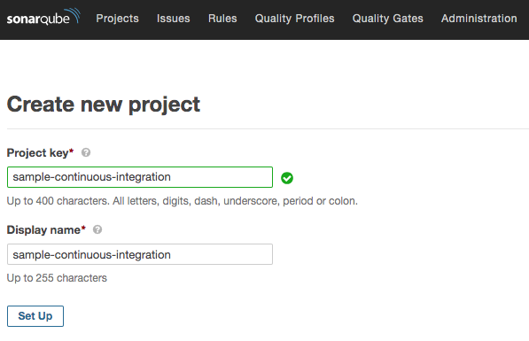

|br|

プロジェクトのトークンを発行する。

.. note:: トークンはログイン情報として使用するので記録しておくこと。

|br|

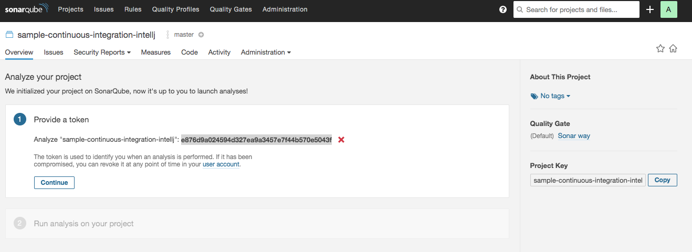

|br|

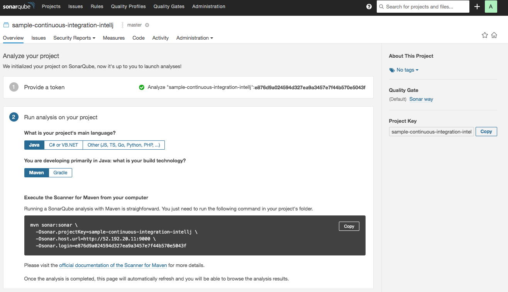

|br|

プラグインの追加
--------------------------------------------------------------------------------

|br|

Javaのチェックルールとして、FindBugsのルールを追加する。「Administration」メニューを選択し、
「Marketplace」タブをにある、Plugin検索フォームから「FindBugs」を入力して、
ヒットしたプラグインをインストールする。

|br|

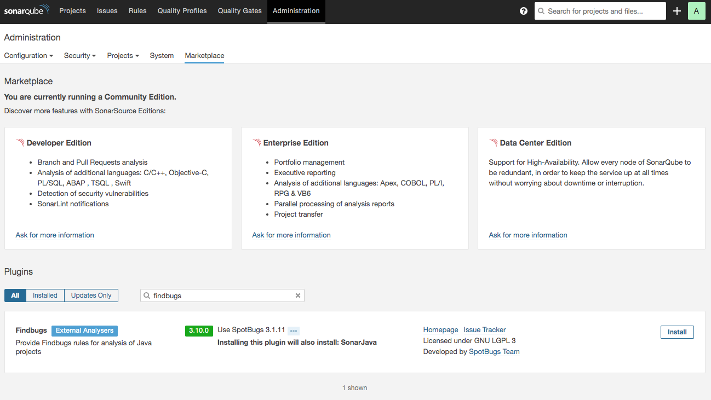

|br|

プロファイルの追加
--------------------------------------------------------------------------------

|br|

追加した「FindBugs」のチェックルールと合わせ、適用する新たなプロファイルを作成する。
「Quality Profile」メニューを選択し、Javaの「Sonar way」プロファイルのコンフィグメニューで
「コピー」を選択する。

|br|

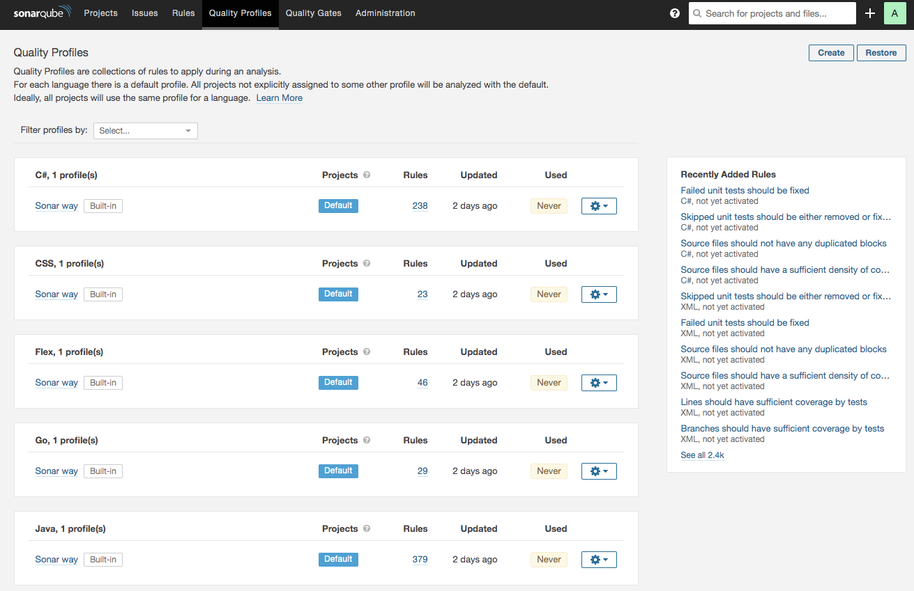

|br|

新たなプロファイル名を入力する。

|br|

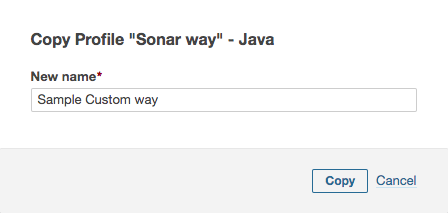

|br|

追加したプロファイルに追加のチェックルールを設定する場合は、「Activate More」ボタンから追加を行う。

|br|

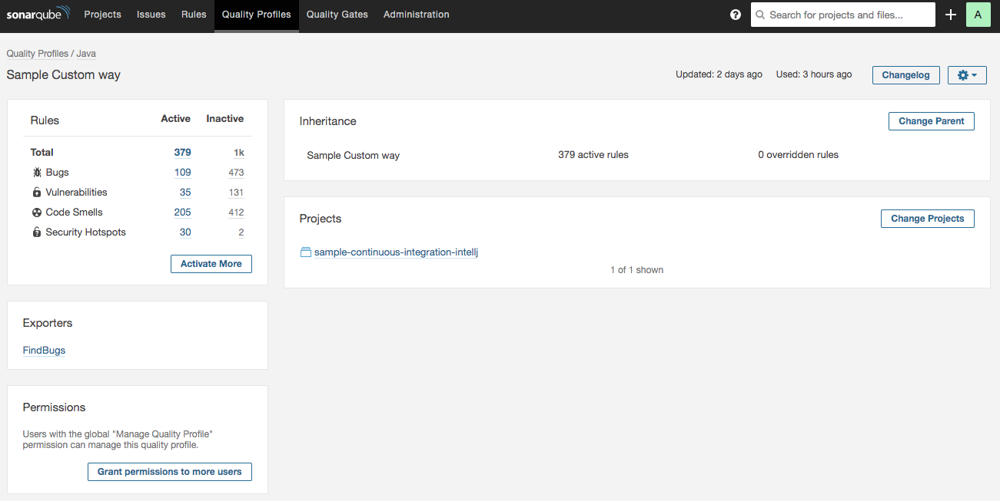

|br|

SonarLintの使用
================================================================================

IntellJ IDEAへのSONAR Lintインストール
--------------------------------------------------------------

|br|

SONARQUBEで作成したチェックルールをローカル端末のIntelliJ IDEAに適用するために、
SonarLintのインストールを行う。IntelliJのPreferenceから、「Plugin」メニューを選択し、
「Browse repositories」ボタンを押下する。

|br|

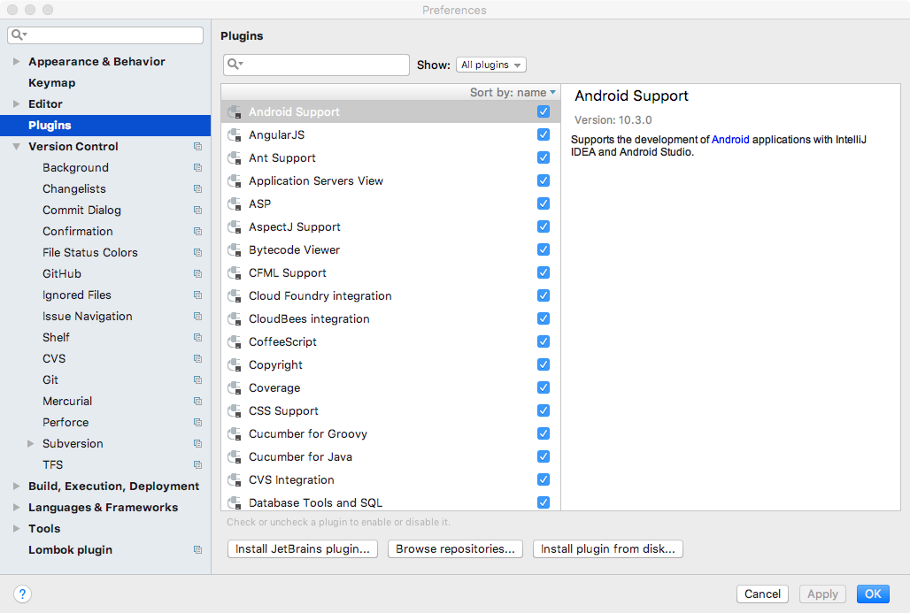

|br|

SonarLintを検索し、インストールを実行する。インストール後、再起動を行うこと。

|br|

.. figure:: img/intellj_install_sonar_lint_2.png
   :scale: 100%

|br|

SONARQUBEに設定したプロジェクトのプロファイルのチェックルールを適用するよう、SonarLintからSonarQubeへの接続を行う。
「Preference」から「Other Settings」 > 「SonarLint General Settings」を選択し、「＋」ボタンを押下する。

|br|

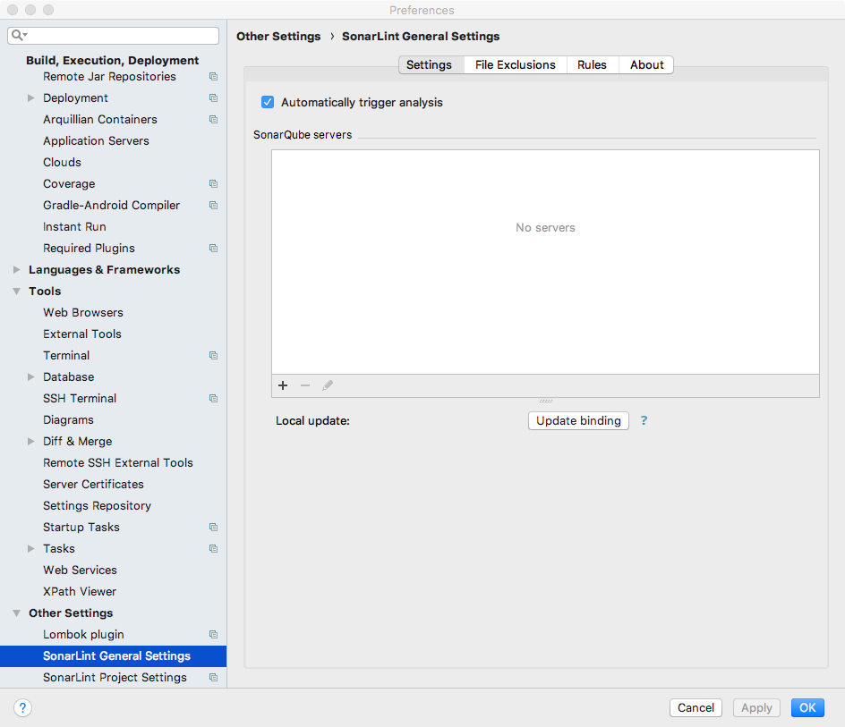

|br|

Configuration Nameを入力し、ConnectionTypeはSONARQUBEを選択する。

|br|

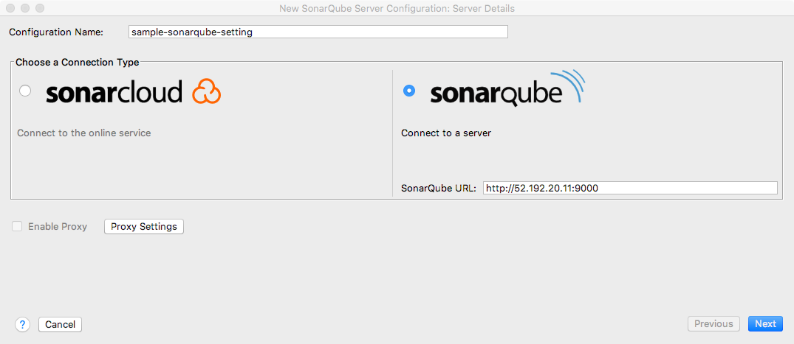

|br|

SONARQUBEの新規プロジェクト作成時に取得したトークンを入力する。

|br|

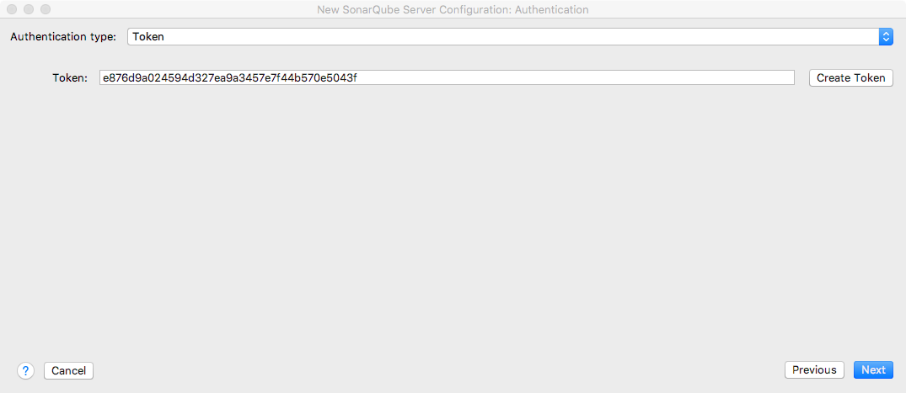

|br|

接続が繋がったことを確認して、「Finish」ボタンを押下する。

|br|

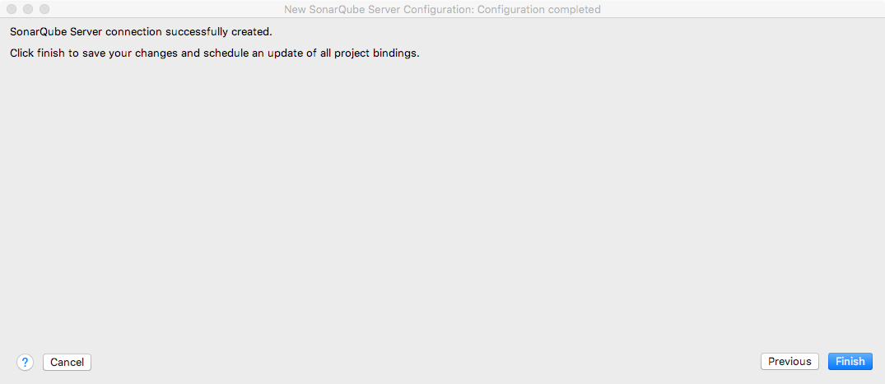

|br|

接続完了後、SONARQUBEに設定したプロジェクトの設定を行う。これで、静的チェックを行う際に、SONARQUBEでプロジェクトに設定したプロファイルのルールが適用されることになる。

|br|

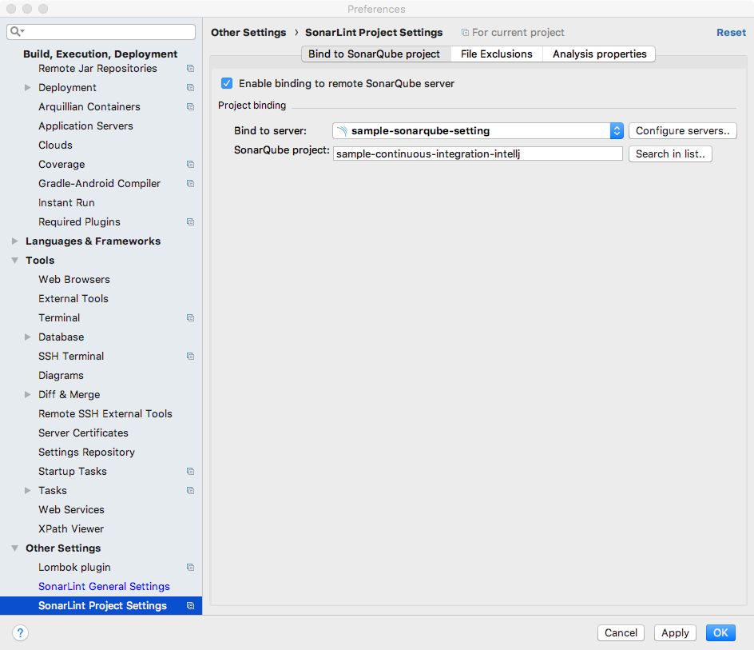

|br|

SonarScannerの使用
================================================================================

SonarScannerのCentOS7へのインストール
--------------------------------------------------------------

1. sonar-scanner-cli、unzipコマンド、JDKのダウンロード、インストール

.. sourcecode:: bash
   :linenos:

   [centos@ip-XXX-XXX-XXX-XXX ~]$ https://binaries.sonarsource.com/Distribution/sonar-scanner-cli/sonar-scanner-cli-3.3.0.1492-linux.zip
   [centos@ip-XXX-XXX-XXX-XXX ~]$ sudo yum -y install unzip java-1.8.0-openjdk java-1.8.0-openjdk-devel
   [centos@ip-XXX-XXX-XXX-XXX ~]$ sudo unzip sonar-scanner-cli-3.3.0.1492-linux.zip -d /usr/local/sonar-scanner
   [centos@ip-XXX-XXX-XXX-XXX ~]$ export PATH=$PATH:/usr/local/sonar-scanner/sonar-scanner-3.3.0.1492-linux/bin

2. 解析対象のソースプロジェクトのダウンロードと、sonar.propertiesから参照する環境変数の設定

.. sourcecode:: bash
   :linenos:

   [centos@ip-XXX-XXX-XXX-XXX ~]$ sudo git clone https://github.com/debugroom/sample-continuous-integration.git
   [centos@ip-XXX-XXX-XXX-XXX ~]$ sudo chown -R centos:centos sample-continuous-integration/
   [centos@ip-XXX-XXX-XXX-XXX ~]$ export SONARQUBE_ENDPOINT=http://XXX.XXX.XXX.XXX:9000
   [centos@ip-XXX-XXX-XXX-XXX ~]$ export SONARQUBE_TOKEN=YYYYYYYYYYYYYYYYYYYYYYYYYY

3. ソース解析の実行(targetフォルダを作成するために事前にmvn testしておく)

.. sourcecode:: bash
   :linenos:

   [centos@ip-XXX-XXX-XXX-XXX ~]$ cd sample-continuous-integration/
   [centos@ip-XXX-XXX-XXX-XXX ~]$ ./mvnw test
   // omit
   [centos@ip-XXX-XXX-XXX-XXX ~]$ sonar-scanner
   // omit
